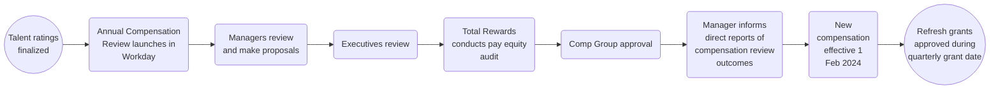

## Introduction

On this page, we explain how we carry out the Annual Compensation Review (ACR) cycle. For more information on the process and input review for the Compensation Review Process, please see the following [handbook page]().

If you have any feedback or questions about the compensation review cycle, please contact [People Connect](/handbook/people-group/#how-to-reach-the-right-member-of-the-people-group). For feedback to help inform iterations for future cycles, please utilize the [feedback issue (internal only)](https://gitlab.com/gitlab-com/people-group/total-rewards/-/issues/1827).

## Annual Compensation Review

The purpose of the Annual Compensation Review is to provide managers with the opportunity to reflect on team members’ accomplishments, measure achievements against goals, and reward for demonstrated performance and growth potential.

Compensation decisions are based on:

1. Individual factors such as talent assessments outlining performance and growth potential in the role.
1. Internal assessment of our roles and compensation within teams and departments
1. Assessing external market changes in the [compensation calculator]() inputs
1. Other factors includes company performance and available budget, local pay practices and regulations, and eligibility as outlined below

### Process overview

### Eligibility

Eligible team members for Annual Compensation Review have a hire date on or before:

- October 31st for a cash compensation increase
- September 5th for an equity refresh

Team members are eligible for a refresh grant if they have been at the company for six months ahead of the grant date cutoff. The grant date is slated to be around mid-March and the cutoff is March 5th.

Team members on leave will be eligible to receive an annual compensation and/or promotion increase during the GitLab-paid portion of their leave. If a team member is not receiving pay from GitLab, then they'll be eligible to receive the increase when they return to work.

Team members hired after October 31st will be reviewed to ensure their cash compensation does not fall below the minimum of the updated compensation range. Team members may be below the compensation range due to updates to the range for the upcoming year that would include changes to benchmark, location factor, and/or exchange rate, if applicable. If this does occur, the team member will be adjusted to the minimum of the range during the Annual Compensation Review cycle.

Eligibility for review does not guarantee an increase will be awarded. Awards are recommended in alignment with team members’ contributions to the organization (as assessed during Talent Assessment) as is aligned to our pay-for-performance philosophy.

### Budget

Our annual cash compensation review budget for FY25 is funded at 4% of overall payroll with an additional budget for promotion and market adjustment increases that carries through the fiscal year. This budget is in line with the FY24 cycle.

#### Merit

Merit budget will be allocated for all planning managers, which will consist of budget for performance increases as well as market adjustments, if applicable. Each division leader is responsible for making sure their group stays within budget.

If you are a manager with other managers reporting to you, you will see your overall budget including any budget that rolls up into you in the Organization Summary screen. The overall budget will also reflect when reviewing the planning grids for managers that report to you. When you edit your own planning grid, it will show you the budget for just your direct reports.

#### Promotion

Promotion budget will be included in the managers’ budget slate, but should only be utilized for FY25Q1 promotions. Managers will be responsible for entering the promotion and new role in the promotion tab, and should recommend a compensation increase aligned with our [promotion compensation guidelines](/handbook/people-group/promotions-transfers/#promotion-compensation-guidelines). The [promotion document](/handbook/people-group/promotions-transfers/#promotion-document) path should be included in the “Promotion Notes” section on the Promotion tab.

#### Equity

Equity refresh budget will be held at the Dir+ level. Managers below the Director level will not have an equity budget nor will they be able to plan for equity on the Stock tab in Workday. Managers should discuss recommendations for equity awards with their Directors to help inform recommendations as appropriate.

### Annual Compensation Review Timeline

**2024-01-09 - 2024-02-05:** Managers complete merit, promotion and equity recommendations. We recommend these general timelines for completion based on your level to enable department heads to review and finalize recommendations by the deadline.
- Managers, Senior Managers, Director: Complete planning by 2024-01-17
- Senior Directors, VPs: Complete planning by 2024-01-26

**2024-02-05:** E-Group submits ACR pay recommendations for their respective departments

**2024-02-06 - 2024-02-09:** Total Reward conducts pay equity review

**2024-02-12:** E-Group to review and action on pay equity review

**2024-02-12 - 2024-02-16:** Total Rewards prepares for Comp Group (CEO/CFO/CPO) approval of all recommendations

**2024-02-21 - 2024-02-29:** Managers notify team members being promoted of promotion approval and new job titles. Only promotion should be communicated at this time, not compensation information. *Note: This additional comms step ahead of the 2024-03-04 compensation comms exists due to systems integrations. Once new job titles for promotions are entered in Workday, new titles will flow downstream and appear in other tools. We want to make sure team members are aware of their promotions before inadvertently seeing it in another tool. Simultaneously, we need Workday to be updated with new job titles in order to generate compensation statements. For this reason, the first touchpoint is communicating promotion without compensation adjustments.*

**2024-03-04 - 2024-03-08:** Managers communicate both promotion compensation and Annual Compensation Review decisions to all impacted team members

**2024-03-13:** Workday visibility date (promotions and new comp visible to team members)

*Please note Summit is 2024-03-11 to 2024-03-15*

## Important Materials for Review

The following materials are recommended for managers to review ahead of planning:

- [Workday Job Aid (internal only)](https://docs.google.com/document/d/1zjWqzYKblfzH4fo2OfMzUU3fwWXfdX4ILwwzJqmMrww/edit): Please utilize the job aid for instructions on how to access and use the planning tool in Workday.
- [Information Guide for Managers (internal only)](https://docs.google.com/document/d/1ZSC0lVo3di9JFJy4kwy9QSGChrI8F3jdO34iG0yO3Sg/edit): The information guide provides additional detail to what has been provided in the handbook.

## Annual Compensation Review Guidelines

Managers should consider both cash and equity when determining a competitive total compensation package for their team members. The below guidelines are recommendations on how to allocate cash and equity to team members based on their [Talent Assessment ratings](/handbook/people-group/talent-assessment/#the-performancegrowth-matrix).

### Merit

Recommendations for cash compensation increases are based on performance factors in order to reinforce our pay-for-performance philosophy. The following recommendations are guidelines, not guardrails:

- Developing: 0% increase
- Performing: 2% to 5% increase
- Exceeding: 4% to 8% increase
- Too New To Rate: 0% to 4%

**Actual cash compensation increases may vary up or down from these percentages.** These guidelines are meant to help ensure company-wide consistency.

Actual increases may vary based on:

- [Market adjustments](/handbook/total-rewards/compensation/compensation-review-cycle/#market-adjustments) to ensure a team member is in range based on the refreshed FY25 compensation ranges
- Where a team member falls in their compensation range and whether they are already [competitively placed]() in their range for their role, level, and location
- Previous increases
- Internal equity
- Budget

When determining an increase, managers should holistically review the following factors:

- Promotions in the last fiscal year
- Transfers in the last fiscal year
- Recent hire who is already aligned to market/performance rates
- Compensation changes due to relocations
- How team members fall within their band after the proposed increase compared to their peers

Additional justification is required in the following situations:

- Increases above guidelines (excluding market adjustments) should have a few sentences on why to assist higher level planners.
- If a manager would like to allocate an increase to a team member who is paid over the maximum of their range or whose increase will bring them above the maximum of the range, they will need to include a few sentences of justification on why.

Team members who aren’t receiving an increase or their increase is being delayed due to not performing at their current level should have that clearly communicated.

### Market Adjustments

The increase based on performance factor should be added to the team member’s market adjustment, if applicable, when recommending the final increase. The market adjustment is required to be allocated to all eligible team members without performance concerns.

Managers of team members receiving a market adjustment have received additional budget to fund their team’s market adjustment.

If there are any reasons as to why a team member should not receive the proposed increase to be aligned with market rates in our calculator, please work with your [People Business Partner](https://handbook.gitlab.com/handbook/people-group/#people-business-partner-alignment-to-division) on appropriate next steps.

### Promotions

Please review the handbook page on [promotions](/handbook/people-group/promotions-transfers) to understand the guidelines and philosophy when allocating an increase. Team members may still receive a performance increase if eligible for a promotion. Managers should review the final increase and salary based on the team member’s performance rating and new role when making the final recommendation.

[Promotional RSU grants](/handbook/stock-options/#promotions) will be automatically calculated within the planning grid. Managers *are not* responsible for entering promotion RSU grants as part of entering promotions into Workday, they should only enter cash compensation increases. Grants are subject to approval at the next grant approval date.

### Equity

The Growth Potential factor is used as the primary calibration tool for equity refresh grants. A meaningful grant can reinforce the long-term growth potential of a team member, as well as the value of shared ownership in the Company.

Planning for equity grants will be done at the Director level and above.

In calibrating the equity refresh, we recommend managers to take the following into account:

- [Growth Potential factor](/handbook/people-group/talent-assessment/#what-is-growth)
- Performance rating
- Key Talent
- Unvested Equity Holdings
- Value Vesting the next fiscal year

When determining which team members to allocate an equity refresh grant, managers should avoid the “peanut-butter approach” and differentiate grant size based on team members’ performance and growth potential, zeroing in on team members with a high impact on the team and company’s results. Managers should ensure Key Talent is well positioned against their refresh range and target an overall participation rate of 70 - 75%.

The following equity refresh grant *guidelines* are recommended for those receiving a grant based on the team member’s growth potential rating:

- Developing is not funded
- Growing is targeted between the minimum and midpoint of the range
- Exceeding is targeted between the midpoint and maximum of the range
- Too New to Rate is targeted between the minimum and midpoint of the range
- Key Talent is targeted at or above the maximum of the range

## Communicating Annual Compensation Review

All planning for Annual Compensation Review will be finalized by March 4th in Workday. Visibility in Workday will be limited until March 13th in order to allow managers sufficient time to communicate. Managers will have access to the Total Compensation statement on the team member's record once generated.

Managers should communicate increases to all team members by March 8th, 2024.

Further guidelines on communications can be found on the [Compensation Review Conversations handbook page]().

### Total Compensation Statement

Each team member who receives a total compensation increase due to performance, market adjustment, promotion, or equity refresh grant during the Annual Compensation Review cycle will receive a Total Compensation Statement detailing their updates to total compensation. This statement will be available for managers to review in Workday no later than March 4th, and team members can access their total compensation statement beginning March 13th.

Specific information on the Total Compensation Statement will be added closer to the conclusion of Annual Compensation Review.
