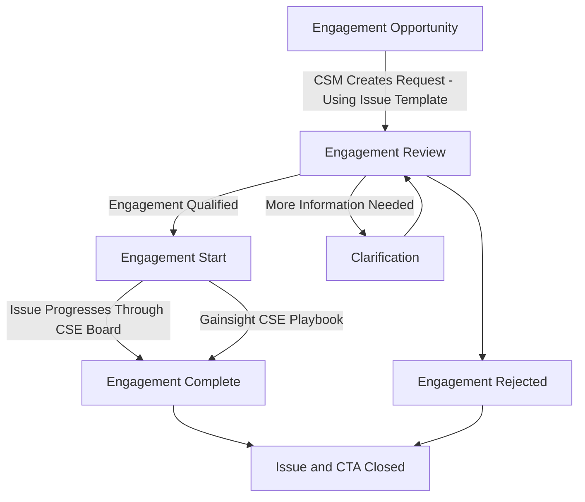

# Customer Success Engineering (CSE)

## On this page
{:.no_toc .hidden-md .hidden-lg}

- TOC
{:toc .hidden-md .hidden-lg}

View the [CSM Handbook homepage](/handbook/customer-success/csm/) for additional CSM-related handbook pages.

---

## CSE Mission
The Customer Success Engineer (CSE) provides deep subject matter expertise on GitLab technical and product solutions and best practices in order to drive measurable value for GitLab customers.  CSEs work alongside CSMs to provide customers with technical guidance, go in-depth on use case implementation, and demonstrate the value of GitLab product capabilities, leading to product adoption, expansion, and greater value realized by our customers.

## Team

| *Name*                                           | *Region*  |
| ------------------------------------------------ | --------- |
| [Martin Brümmer](https://gitlab.com/mbruemmer)   | EMEA      | 
| [Philippe Charriere](https://gitlab.com/k33g)    | EMEA      |  

## FY23 Direction
1. Establish the core team
2. Define and document role and responsibilities
3. Establish initial engagements

## Role & Responsibilities
Engage with customers in a technical consultancy and advisor role during their GitLab Journey while providing technical and solution guidance. This is achieved by driving towards measurable value (business outcomes), leading to product adoption, renewal, and expansion opportunities. The team is focused on solution-based programs that are customized to fit an individual customer's needs. 

## Developer Advocate
The Customer Success Engineer is also involved in the area of "Developer Success" for GitLab Customers, a component of the Developer Relations area. 

They are a Developer Advocate whose activities primarily involve the internal user communities of GitLab customers. Their role is to ensure the satisfaction and loyalty of customers who use GitLab. They work with clients to initiate, support, and advise them and drive further GitLab Use Case adoption.

They will intervene as a Developer Advocate with existing customers at the request of the Customer Success Manager (CSM) or the sales team, after qualification of the need and according to their capacity.
The CSE responsibilities:
- Create technical content (articles, tutorials, demos, webinars, etc.) for existing customers to enhance GitLab
- Contribute to customer events (conferences, meetups, hackathons, etc.) to strengthen GitLab's visibility and credibility with these clients' developer communities.

## GitLab Use Cases supported by CSEs

- Technical Discovery in-line with a customer's desired business outcomes
- Infrastructure Discovery (initial exploration on direction, complexity)
- Hands-on workshops to drive adoption
- Customer enablement on specific technical questions with direct engagements
- Team member enablement on best practices in CSM Office Hours

## Deliverables & Scope per Use Case
- CSE is working on a fixed (time), scoped (deliverables) engagement with a dedicated area/business unit/team (aligned) within an existing customer.
- CSE engagement is supporting adoption and growth within a GitLab Use Case.
- Deliverables are defined upfront and mutually agreed between Customer, CSM, CSE, SA.
- Deliverables are templated, success metrics can vary based on customer situation.
- Results and adoption patterns are documented in the handbook or Docs.

## Engagement Model

Customer Success Engineer engagements can be divided into complex and spot engagements.

[Complex engagements](#complex-engagements) are those that present a significant opportunity or significant risk for our customer relationships. They require a a long-term engagement of the Customer Success Engineer over multiple weeks or months in order to support the regular account team. Examples are Ultimate expand opportunities, Ultimate onboarding engagements with multiple workshops or regular account team support for major customers as a dedicated technical resource. This kind of engagement requires an [Engagement Request](#engagement-request) and Opportunity Review.

In [Spot engagements](#spot-engagements), Customer Success Engineers will provide support for specific customer questions and problems that are clearly limited in scope and can be handled in a one-time call with the customer. Examples include difficulty implementing individual CI pipelines or applying certain features, need for best-practice advise in one use case or an individual demo or presentation for a customer. This kind of engagement does not require an engagement request but is offered by Customer Success Engineering on a best-effort basis.

### Complex engagements

Complex Customer Success Engineer engagement follows a process for validation and delivery.

#### Engagement Request

**DRI: CSM**

When involving a CSE in a customer's adoption journey or other technical implementation effort, some initial details are needed to scope the engagement:

1. **Objective in the success plan:** link directly to the objective within the customer's [success plan](/handbook/customer-success/csm/success-plans/) (this link is available under the "three-dot" menu on the objective within Gainsight)
   1. **Expected effort:** Captured within the objective in Gainsight; Will the CSE be engaged for a one-off event, or for a longer period of time (e.g. one to multiple weeks)? If longer, what is the expected duration? _Examples of different engagements & accompanying scope include:_ 
      1. Hands-on demo: if this is the entirety of the engagement this would be a one-off; if this is a piece of a larger engagement plan then the scope would be longer
      1. Use case adoption enablement campaign: the CSE will engage with the customer in several ways to enable user groups on the usage of a given GitLab use case. This would be a longer term engagement.
   1. **Target start date:** what is the expected start date for the CSE engagement? _Please be as specific as possible, but if there isn't an exact date provide a general time frame (e.g. first week of May)_
   1. **Outcome & success criteria:** what will we, and the customer, need to achieve in order for the engagement to be successful? What metrics & deliverables have we agreed on?
   1. **Stakeholders & contacts:** who from the customer is involved, and what is their role? _Please provide each person's name and role/title, as well as a brief summary of their responsibilities during the engagement._
1. **Create CSE engagement request issue:** [Issue template](https://gitlab.com/gitlab-com/customer-success/customer-success-engineering/-/issues/new?issuable_template=cse-engagement-request)

#### Request Review and Approval

**DRI: CSE Manager**

Once a CSE engagement request is submitted, the CSE manager will review the request. They will respond with any clarifying questions, and determine CSE availability (Capacity planning).

### Spot Engagements 

**DRI: CSM**

During regular CSM engagements with customers, specific technical requests or adoption impediments my come up that exceed the technical knowledge of the CSM and that require a more hands-on consulting approach than async Q&A can provide. When customers have difficulty solving specific business problems using GitLab, a technical deep dive with a CSE can unblock those customers and provide more "depth" to account teams.

Examples include specific CI implementation and configuration issues; automation, API and custom integration support as well as individual best practice sessions on Secure and Compliance implementation. As a guideline, if the whole engagement can be covered by an internal sync call and a follow-up customer call, it can be treated as Spot Engagement.

Those deep dives can be informally scheduled in CSE office hours. The CSM will present the question and provide context to the CSE. Based on the complexity of the question, the CSE will decide if a Spot Engagement with the customer is needed or a simple async answer will be appropriate. The CSE will then schedule an internal 1:1 sync to discuss the issue and approach in more detail. Following that, the CSE may set up a demo project or appropriate slides. The CSM will set up a meeting with the customer and the CSE to discuss the issue and provide the prepared solution.

Afterwards, the CSM will track the meeting as timeline entry in Gainsight. The meeting name should have a "CSE: " prefix and the CSE should be part of the participants.

## Metrics & Key Performance Indicators
1. Green Success Plans (% complete) with technical milestones & objectives in place, in collaboration with the CSM
1. % Achievement of deliverable within defined timeline
1. NPS/CSAT Post-CSE Engagement Survey
1. Updated Docs and Guidelines (1 per customer engagement)

## Hiring Process

## CSE Hiring Plan

The CSE hiring plan follows [much of the same process as the CSM](https://handbook.gitlab.com/job-families/sales/customer-success-management/#hiring-process), with [the exception of a technical panel](https://sa-demo-group.gitlab.io/sa-candidate-experience/panel_instructions) that evaluates the candidate's technical aptitude along with presentation style, clarity of the GitLab value proposition and audience engagement.

The hiring plan is as follows:
1. Recruiter call (external candidates only)
1. Hiring manager call
1. Peer call 
1. Panel 
1. Senior CS leadership call

## Resources & References
- [CSE Kanban Board](https://gitlab.com/gitlab-com/customer-success/customer-success-engineering/-/boards/4877121)
- [CSE Project](https://gitlab.com/gitlab-com/customer-success/customer-success-engineering)
- [CSE Google Drive](https://drive.google.com/drive/folders/1AKVpZRXDC4cHlr794gH-RUZCdiNb114I?usp=sharing) (GitLab internal only)
