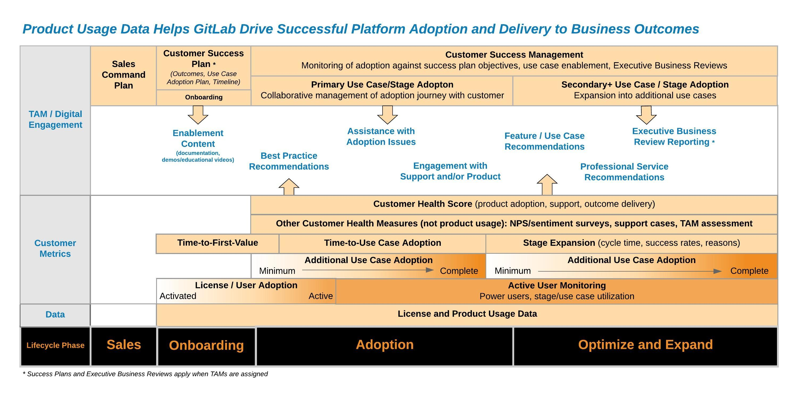

<iframe tabindex="-1" role="presentation" aria-hidden="true" title="Blank" src="https://consentcdn.cookiebot.com/sdk/bc-v3.min.html" style="box-sizing: border-box; display: block; margin-left: auto; margin-right: auto; max-width: 100%; color: rgb(51, 51, 51); font-family: &quot;Source Sans Pro&quot;, sans-serif; font-size: 18px; font-style: normal; font-variant-ligatures: normal; font-variant-caps: normal; font-weight: 400; letter-spacing: normal; orphans: 2; text-align: start; text-indent: 0px; text-transform: none; white-space: normal; widows: 2; word-spacing: 0px; -webkit-text-stroke-width: 0px; text-decoration-thickness: initial; text-decoration-style: initial; text-decoration-color: initial; position: absolute; width: 1px; height: 1px; top: -9999px;"></iframe>

# Product Usage Vision Page

#### Maintained by:

## Vision

Leverage product usage data (e.g., license, active users, use cases, features) from the product to:

1. Accelerate ability for customers to realize value from the GitLab platform and see delivery against desired business outcomes through a world-class customer experience
2. Improve value, quality, and usability through data related to how customers use our product 
3. Improve net dollar retention by efficiently retaining customers and assisting in account expansion 

## Benefits

### Customer

Understanding a customer's use of the GitLab platform enables GitLab to:

- Ensure expected value is delivered through the adoption of the GitLab platform
- Monitor the customer's usage to ensure they are adopting licenses, use cases, and features to support their business objectives and goals
- Provide data to support delivery to a customer's return-on-investment (ROI) proposal and/or justify additional investments 
- Continuously improve product value, quality, and usability by monitoring and understanding customer usage (for example, high and low usage of stages or features, user experience measurements, etc.)
- Recommend best practices and enablement content that would help customers adoption and/or operationalize the platform capabilities 
- Identify and recommend additional features or use cases that would add additional value to the customer
- Identify adoption issues, delays, or barriers to trigger assistance by GitLab team members or digital content

### GitLab

The benefit to GitLab is based on the premise that customers will renew and expand if they realize continuous value with a positive experience and are able to achieve their business outcomes and goals with the platform. Additionally, the data can be used to:

- Provide adoption insights to monitor and manage customer health and experiences
- Measure quality of processes and methods like onboarding, enablement content, and adoption playbooks
- Leverage customer health to manage account plans and assist planning and forecasting
- Provide efficiency through automation in both TAM-led and digitally-led engagement throughout the customer journey
- Identify customers who are at risk of attrition or churn, as well as identify potential expansion opportunities (i.e., license and/or subscription tier)

*Note: The use cases, approaches, and metrics below include current and planned use cases.* 

## Use Cases

### Lifecycle Management

#### Success Planning and Outcome Delivery

- When a TAM is engaged, the usage data will be a key measure for the [customer success plan](https://about.gitlab.com/handbook/customer-success/tam/success-plans/) to ensure the customer is successfully adopting the use cases and features to deliver to their goals and objectives. Data and metrics will be leveraged and shared throughout the engagement and in customer [Executive Business Reviews](https://about.gitlab.com/handbook/customer-success/tam/ebr/).
- In a digital-only engagement, the usage data will serve as a measure to ensure the customer adopts the [desired customer use cases](https://about.gitlab.com/handbook/customer-success/tam/success-plans/). The digital journey will be developed to serve key content to help customers adopt these use cases and progress through their customer journey. 

#### Onboarding

- A measure of successful onboarding includes the activation and active use of licenses and potentially use case adoption.

#### Adoption and Expansion

- In alignment with a customer's goals, the adoption of the customer's desired use cases will be monitored and used to drive engagement activities based on product usage data. Depending on the adoption progress, resulting actions could be:
  - TAM may provide enablement content (product documentation, educational videos, etc.), guidance on best practices and approaches, key capabilities to adopt, and/or services to ensure successful adoption.
  - TAM engages with customer to understand if there are any issues or blockers with the customer (for example, training or enablement gaps, change management delays, technical issues, configuration problems, etc.). Depending on the issue, support and/or product may be engaged to assist the customer.
  - In a digital-only engagement, relevant content could be delivered to the customer (for example, best practices, configuration guides, education/enablement videos) based on the customer's usage data.
  - When mature adoption of desired use case(s) is complete, we may recommend additional use cases or capabilities that would provide added value to the customer. 
- The customer's product usage may indicate there are capabilities in a higher subscription tier that may provide additional value to the customer. This would be proposed by the TAM, sales representative, or digitally. 

#### Process and Playbooks

- The quality of key engagement processes and playbooks like onboarding, adoption, and expansion will be measured by usage data to determine if changes drive desired improvements with customer adoption. Some objects may include: 
  - Accelerating time-to-value and time to mature adoption of use cases
  - Improving speed or sequence of adopting features and capabilties
  - Improving customer experience and satisfaction
  - Improving the success rates at expanding into new use cases

#### Product

- **ADD DETAILS ON HOW THE XMAU DATA IS USED OR LINK TO APPROPRIATE PAGES**
- Identify customers who are using certain GitLab stages or use cases for feedback (through surveys, interviews, etc.)

### Metrics

- [Time-to-First Value](https://about.gitlab.com/handbook/customer-success/vision/#time-to-value-kpis) uses license data and potentially use case data in the future
- [License Utilization](https://about.gitlab.com/handbook/customer-success/tam/gainsight/license-usage/): Assist the customer in determining how well utilized licenses are, how they could be used, and assess their future needs
- [xMAU](https://about.gitlab.com/handbook/product/performance-indicators/#three-versions-of-xmau) leverages usage data and is a key performance indicator (KPI) for the Product Team
- Use case expansion playbook success will be measured by customer use case adoption
- Use case health score will leverage use case adoption (scored as minimum to advanced). This is used to understand which use cases have been adopted and what is the progress on adopting those use cases.
- Customer health scores (planned) will leverage use case health scores. This is used to analyze and understand the customer's overall health through engagement and depth of deployment. This will also leverage other inputs like support cases and NPS/customer sentiment surveys.

## Data Privacy

The collection and usage of a customer's product usage data will be governed and managed according to our [Data Privacy Agreement](https://about.gitlab.com/privacy/) and regional data laws and regulations. 

## Relevant Links

- [GitLab customer use cases](https://about.gitlab.com/handbook/customer-success/tam/success-plans/)
- [Product Usage Data in Gainsight](https://about.gitlab.com/handbook/customer-success/product-usage-data/using-product-usage-data-in-gainsight/) : Gainsight is a customer lifecycle management platform used for TAM and digital engagement.
- [Customer Use Cases and Stage Mapping](https://docs.google.com/presentation/d/1bC_TdQO917hLbj4jfdkhtP0l7w8p1SKEK9vVjga5Wec/edit#slide=id.g7fe53431a5_0_33) (internal document)
- [Metrics Dictionary](https://docs.gitlab.com/ee/development/usage_ping/dictionary.html)
- [Adoption Explorer - GitLab Documentation](https://docs.google.com/document/d/1TvSCT_yj73AS0PuLxPonuF5QHWyM3dqG_i8H1U1cwf0/edit)
- [SaaS-Activity Dashboard](https://app.periscopedata.com/app/gitlab/684495/WIP---SaaS-Activity)
- [Customer Success Vision Page](/handbook/customer-success/vision/)
- [High-Level Visual of GitLab Adoption Journey](/handbook/customer-success/vision/#high-level-visual-of-gitlab-adoption-journey)
- [Product Intelligence Overview](https://about.gitlab.com/handbook/product/product-intelligence-guide/) (details on product usage data)
