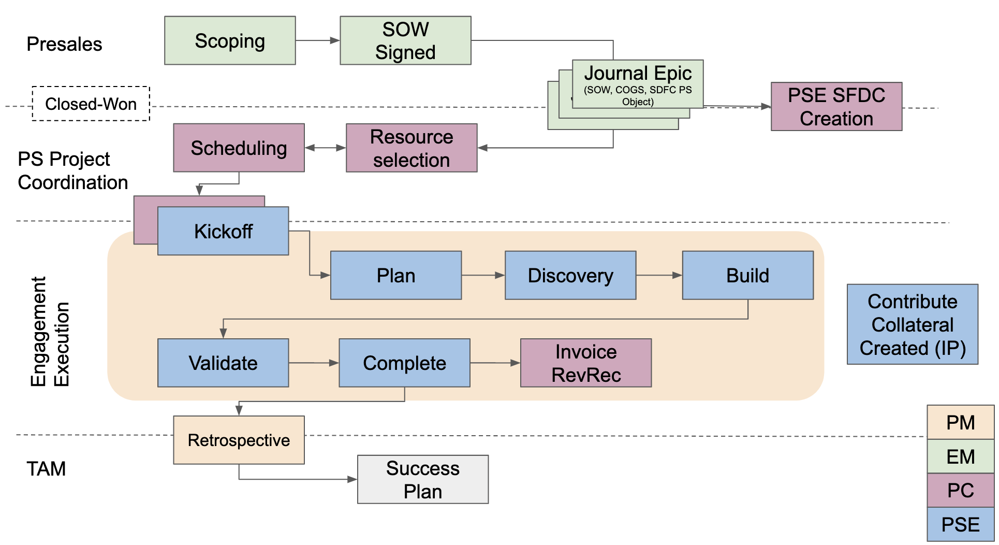

## On this page
{:.no_toc .hidden-md .hidden-lg}

- TOC
{:toc .hidden-md .hidden-lg}

### Overview

The purpose of this page is to describe the workflow governing delivery of professional service projects. We will start by outlining the general workflow that is common across all service delivery categories. Then we will describe the differences for engagements that do not fit the general workflow shown below. 



[Source](https://docs.google.com/presentation/d/1TOI2aoseBoyWYQC6-xpJVMknEncCNreSFfMvOHO7EBA/edit?usp=sharing),  internal only

<!---Update this below
GitLab professional services employs three different workflows that control projects for the following categories:  standard professional services, education, and dedicated engineers.  Each of these categories have unique attributes that warrant a different approach.--->

### Planning and Delivering Standard Services

#### Scheduling

The Professional Services (PS) team scheduling is processed through the Sr. PS Project Coordinator (PC).  Until we roll out our PSA tool (Mavenlink), we have a spreadsheet that is our single source of record.  This spreadsheet will track all schedules of the PS team, which will include customer projects and internal work as well. 

Follow these steps to schedule a customer engagement.

To request an assignment, comment to the Sr. Professional Services PC on the project/ issue with the following details:

* Requested resource
* Dates to be worked
* Hours requested

The Sr. Professional Services PC will review the spreadsheet for availability and confirm when scheduled to the calendar.  If there is a schedule conflict the Sr. Professional Services PC will provide another set of project dates.

Scheduling updates and changes will also follow this same process with a comment on the project/ issue to the Sr. PS PC.

If a customer project has not booked, but planning/ scheduling discussions need to take place, reach out to the Sr. PS PC to review.
 
#### How to schedule internal time

Each PSE is required to add their own internal time to the spreadsheet, including the following details:

* Task name
* Hours planned

#### Weekly schedule review meetings

A weekly touch base call is held with the team to review schedules.  This type of cadence and review of the schedule will help with utilization, planning and forecasting purposes.

#### Kicking off an engagement

See the details in the Project workflow section of the [PS Project Management](/handbook/customer-success/professional-services-engineering/project-mgmt/) page.

### Holding discovery sessions
During discovery or fact finding sessions with the customer, PSEs will often have a predefined list of questions that need to be answered to to ensure we're designing and building the appropriate solution given customer constraints and requirements. It is good practice to send these question to the customer prior to the discovery call so they can be prepared for the discussion.

During the call, take notes to ensure that things that have validated or invalidated your initial assumptions have been captured. At the end of the meeting, review the things you've learned to memorialize what will be designed and built. Reiterating back your understanding of the details of the agreement instills confidence in the customer representative that we understand their requirements and can deliver what was reviewed.

After the meeting, based on meeting notes, create issues in the gitlab.com customer collaboration project outlining the work. Include Consider using a simple template with `Overview`, `Open Questions`, `Tasks`, and `Acceptance Criteria`. These can be helpful in further memorializing the scope of work with the csutomer and getting asynchronous feedback to open questions. Make sure the `overview` is as detailed as possible, and the `tasks` section has build-to level tasks (e.g. update congregate list() function to include data from CI sources). 

### Planning and Delivering Education Services

PSEs who deliver GitLab Education Services instructor-led courses can use the following workflow to ensure smooth interactions with customers. In addition, PSEs should complete these [GitLab Certified Trainer](/handbook/customer-success/professional-services-engineering/gitlab-certified-trainer-process/) steps for each course they are scheduled to deliver.

#### Preparation steps

1. The Project Coordinator will contact the customer with a "Welcome to PS Email".  The email will include proposed training dates and training session planning meeting details, which will include the PSE trainer in the meeting. Trainer participation in this meeting is critical -- please let the PC (Project Coordinator) know if you need the meeting to be rescheduled to ensure your attendance.

1. Use these [email communication templates](https://docs.google.com/document/d/1rJ9q9gEzsumRxDhoWEe45u70efmKA0eWNg69WONuCYs/edit?usp=sharing) to ensure communication of the key details with the customer and training participants.

1. During the training planning meeting, be sure to discuss and document all of the event logistics listed in the [Training Event Plan Template](https://docs.google.com/document/d/1huNauyfhFPvLCuo-9T7Ol3FtBDYowYxiP_T5ItP2FN4/edit?usp=sharing)
1. Add the confirmed date(s) and start/stop time(s) for each training session to the issue and @ mention the Education Practice Manager.

1. The Education Practice Manager or Project Coordinator will set up a Zoom Webinar session for each session using [these set up instructions](/handbook/customer-success/professional-services-engineering/remote-training-session-setup/) and add the registration link(s) to the issue. You will receive an email message with your unique link to join the Zoom Webinar session.

1. At least 2 weeks prior to the training session, email the session registration link(s) to the customer, asking them to send the link(s) to each of the employees whom they want to attend the session(s). When each person registers they will receive an automated confirmation email with a Zoom Webinar join link unique to each person, along with a link to add the session to their calendar.

1. Contact the PS Instructional Designer to confirm you have the latest versions of course slides and other materials.

1. Review the train-the-trainer (T3) video for the course you are delivering

1. Review, practice, and use these [PS Remote Training Tips and Tricks](/handbook/customer-success/professional-services-engineering/remote-training-tips/).

1. Complete the GitLab Training Lab set up steps below.

1. When it's time to join the Zoom Webinar session as a presenter, use the Panelist link to join the session. The Education Practice Manager will also join your session to serve as the webinar host and moderate your session for you.

##### Training lab pre-course instructor workflow

PS uses the [GitLab Demo Cloud](http://gitlabdemo.com/) as the standard environment for hands-on course lab activities and hands-on certification assessments. Follow these steps to set up your course attendees for lab access.

1. **Register your account**

    * Self-register at [gitlabdemo.com](http://gitlabdemo.com/) to create your credentials on the GitLab instance during the automated provisioning process. This will provide you with your own user account and organization group for your own projects. This step is not specific course session, but is a required step as a GitLab team member.

    * Credentials for your course attendees will be generated  when they redeem an invitation code that you’d provide to them. In essence, we create a unique invitation code for each course session that attendees redeem on [gitlabdemo.com](http://gitlabdemo.com/) on Day 1 of the course session, and their GitLab instance credentials are generated after they enter their code.

1. Generate invitation codes
  1. Visit gitlabdemo.com
  1. Sign in with Okta
  1. Click `Invitation Codes` in the top navigation.
  1. Click the `Create Invitation Code` button in the top right corner.
  1. Fill out the form. Your invitation code is generated and GitLab group is created when you click the green button.
  1. You can see a list of previously created invitation codes and links to relevant details.
  1. For any edits/extensions/etc or any custom redemption rules (different durations than our standards) make a request in the #demo-systems Slack channel   

3. **Share the invitation code and access instructions below with attendees**: You can do this via an email to attendees as well as including it within their course materials, letting them know they expiration date (which is 14 days from the date you generated the code). 


**Demo Cloud Access Instructions:**
1. Visit gitlabdemo.com
1. Click the blue button for redeeming the code above. An anonymous user account and password will be created.
1. Click on the red button to download your credentials (very important, don’t forget to do this since you will not be able to access this page again).
1. Click the blue button to access your group and create your first project.
```
#### Post-course instructor workflow

1. Download the session recordings and place them in a location where the customer can access them.

1. Create a PDF version of the slides and place it in the same location as the recording.

1. Obtain the Zoom attendee report and using the emails in the report, send a Next Steps email to all of the attendees using email template #3 located in the [email communication templates](https://docs.google.com/document/d/1rJ9q9gEzsumRxDhoWEe45u70efmKA0eWNg69WONuCYs/edit?usp=sharing).

1. <strong>For GitLab with Git Basics course instructors</strong>: When an attendee submits their certification assessment, review their work in the demo lab cloud within 7 days of the attendee's submission and manually release their results using the attendee's completed Google Form. [Here are the detailed instructions](https://gitlab.com/gitlab-com/customer-success/professional-services-group/education-services/-/wikis/GitLab-Certification-Instructions) for certifying customers.

### Planning and Delivering Dedicated Engineering Services

Work in progress


### Project Completion

At the conclusion of the Statement of Work the PSE will prepare a cost vs actual analysis. This analysis will be filed in SFDC. When filed in SFDC the Professional Services Engineer will "@ mention" the Controller and Finance Business Partner, Sales in SFDC Chatter. For details see the Project workflow section of the [PS Project Management page](/handbook/customer-success/professional-services-engineering/project-mgmt/).

### Employing Subcontractors

If the project requirements exceed the current capacity of the available resources then the professional services team may employ a subcontractor to help deliver the project.  The following provides a checklist of items to process before and during the use of a subcontracted resource:

1. Confirm that the terms and conditions agreed to with the customer enable the use of a subcontractor.  In some cases, GitLab must first obtain written approval from the customer in order to employ a subcontractor.

1. Generate a list of potential subcontractors.  GitLab has established relationships and signed Master Service Agreements with a collection of professional services firms.  Review the list of firms and select ones that have pools of resources with the correct set of skills and certifications.

1. Contact the GitLab Channel Account Manager (CAM) who owns the relationship for the selected firms.  Provide the  CAM with a description of the services GitLab intends to subcontract along with the project start/end date and an estimate on the quantity of time GitLab intends to procure.

1. Contact the selected firms through an introduction by the CAM.  GitLab should then submit the requirements to the partner firm and request resumes and rates for any resources the partner deems available and suitable for the project.
Interview proposed resources. GitLab will meet with the proposed resources to determine if the person is a fit technically as well as from the perspective of fitting in with the project team that includes both GitLab and customer personnel.

1. Develop a Statement of Work between GitLab and the selected firm.  The Statement of Work should employ best practices that we use when developing SOW’s for GitLab customers.  The SOW should also align with terms and conditions that GitLab is obligated to follow.

1. Sign Statement of Work.

1. Onboard the resource.  This includes procuring a GitLab email address for the selected partner personnel.  It may also include procuring access to customer systems.

1. Track time.  As described in additional sections on this page, GitLab must account for all time logged against a project.  For subcontracted resources, GitLab will employ the following procedures:
    * Subcontractor submits a weekly status report outlining billable hours delivered along with a description of the services performed during the submitted hours.
    * GitLab staff load the time detail into the GitLab time tracking system.


1. Offboard the resource.  At the conclusion of the project, remove access and determine how to handle incoming email for the provisioned email address. 


### Time Tracking

Accurate time tracking records of hours is essential to ensure revenue can be recognized based upon percentage completion of a project scope as outlined in a Statement of Work ("SOW"), and this data is used in the calculation of gross margin.  Key points for time tracking include:

- All Time should be recorded in an issues that roll up to the major epics.
- Best practice is to record time at the time you are working on a task.  This provides the most accurate account of hours worked and when it was worked.  
- Each PSE is required and responsible for tracking their own hours, and submitted weekly by Monday morning for the previouis week worked.  A minimum of 40, or whatever the hours worked per week is in your country.
- Issues will need to be attached to one of the Major Epic topics.

Billable hours represent work hours that a staff member reports as being aligned to a specific SOW. The format for daily time tracking for each team member is shown below, and should be reviewed by the PS leadership for approval and sign-off. Rounding to the nearest hour is acceptable, and please ensure data is recorded in numeric format without the use of text strings such as "hrs".

#### Time tracking entry and approval workflow

* All Issues are attached to Epics 
* [PSE Hours Report Generator](https://gitlab-com.gitlab.io/customer-success/professional-services-group/issue-mover/) pulls all time spent from issues that the user is either an author of, or an assignee, and creates the time tracking spreadsheet at the end of the designated fiscal quarter.
* A PS Delivery Manager will APPROVE the hours, create an issue and attach it to the Time Tracking Epic with the `ManagerCertifiedTimesheet` label
* The approving manager will submit to the Head of PS, [Sr. Director of Professional Services](https://about.gitlab.com/job-families/sales/director-of-professional-services/) for next level approval.  The Head of PS with apply judgement on productive utilization.
* Head of Professional Services will submit to the Professional Services Finance Partner for final approval.


#### Issue board

The [PS Issue Board](https://gitlab.com/gitlab-com/customer-success/professional-services-group/ps-plan/-/boards) contains everything that the group is working on, from strategic initiatives to SOW writing.

Issues are created for all work by PS.

#### Epic categories

* [PS TimeTracking - Billable](https://gitlab.com/groups/gitlab-com/customer-success/professional-services-group/-/epics/536) 
  * ALL project hours
  * Internal/ Sales Handoff Calls
  * Internal/ External status meeting
  * Support ticket submission while the project is in progress
  * Weekly/ Final customer reports and documentation
  * Status/ Close out customer calls
  * Customer Travel
  * [SKO](https://gitlab.com/gitlab-com/customer-success/professional-services-group/ps-plan/-/issues/1251)
  * [Contribute](https://gitlab.com/gitlab-com/customer-success/professional-services-group/ps-plan/-/issues/1252)
  * [Commit](https://gitlab.com/gitlab-com/customer-success/professional-services-group/ps-plan/-/issues/1376)
  * [Sales Assistance](https://gitlab.com/gitlab-com/customer-success/professional-services-group/ps-plan/-/issues/1247)
    * All Pre-Sales activities
    * SOW Creation
  *  [Support Assistance](https://gitlab.com/gitlab-com/customer-success/professional-services-group/ps-plan/-/issues/1248)
     * Support Cases, (if pulled into customer questions after the project is closed)
     * Engineering Support
  *  [Practice Development](https://gitlab.com/gitlab-com/customer-success/professional-services-group/ps-plan/-/issues/1249)
     * Creating process/documents
     * Templates
     * Articles/ Tools
  * [Product Development](https://gitlab.com/gitlab-com/customer-success/professional-services-group/ps-plan/-/issues/1339)
  * [Mentoring](https://gitlab.com/gitlab-com/customer-success/professional-services-group/ps-plan/-/issues/1250)
* [PS TimeTracking - Non Creditable](https://gitlab.com/groups/gitlab-com/customer-success/professional-services-group/-/epics/535) 
  * [Knowledge Sharing](https://gitlab.com/gitlab-com/customer-success/professional-services-group/ps-plan/-/issues/1253) 
    * Slack
    * Internal Q&A
  * [General Administrative](https://gitlab.com/gitlab-com/customer-success/professional-services-group/ps-plan/-/issues/1254)
    * Time Sheets
    * Expense Reports
    * Reviews
    * HR Items
    * General Emails
  * [Meetings/ Staff Time](https://gitlab.com/gitlab-com/customer-success/professional-services-group/ps-plan/-/issues/1255)
    * Internal Meeting
    * 1:1s
    * Weekly Webinars
    * All Hands
    * Team Calls
  * [Travel Time](https://gitlab.com/gitlab-com/customer-success/professional-services-group/ps-plan/-/issues/1258) 
    * Excluding Customer Travel
  * [Personal Enablement](https://gitlab.com/gitlab-com/customer-success/professional-services-group/ps-plan/-/issues/1257)
    * Development
    * Ramp Up
    * HR Training
    * Customer project shadow
* [PS TimeTracking - PTO/ Holidays](https://gitlab.com/groups/gitlab-com/customer-success/professional-services-group/-/epics/533)
  * [PS Team Holidays](https://gitlab.com/gitlab-com/customer-success/professional-services-group/ps-plan/-/issues/1246)
  * [PS Team PTO/ Sick Days](https://gitlab.com/gitlab-com/customer-success/professional-services-group/ps-plan/-/issues/1245)

#### Labels

There are three types of project tracking labels

`Packaged` - Complete or incomplete

`Custom or standard SOW` (more than 4 working weeks) - Tracks completed percentage (25%, 50%, 75% or 100%), unless other milestones are specified in the SOW

`Embedded Engineer` (time and materials project) - Bill time and materials direct to customer

 


