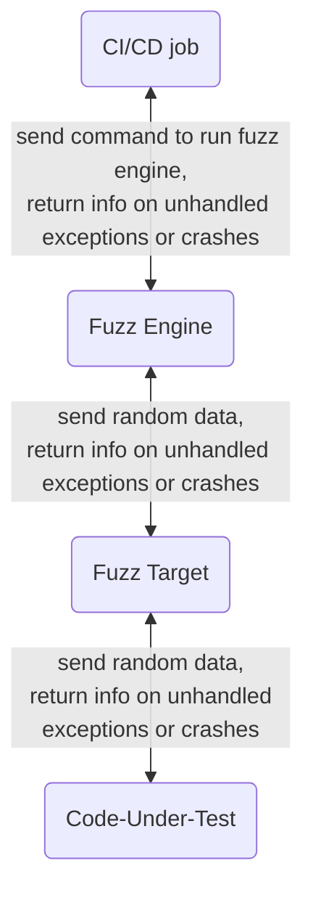

{:.no_toc}


## LAB 5: Enable, configure, and run Coverage-Guided Fuzz Testing

This lab demonstrates coverage-guided fuzz testing, which looks for bugs in a single function in your code. Web API fuzz testing works similarly, but is not covered here.


### A. Fuzz-testing overview

Coverage-guided fuzz testing sends random inputs to an instrumented version of an application in an effort to cause unexpected behaviors that might reveal bugs. GitLab allows the addition of coverage-guided fuzz testing to CI/CD pipelines. This helps uncover bugs and potential security issues other QA processes may miss.

You must define a separate CI/CD pipeline job for each function you want to fuzz test. That said, if the function in your code-under-test calls other functions, the fuzz test will catch problems that occur anywhere in the call stack. In this lab you'll fuzz test just 1 function.

Fuzz testing works like this:
1. A CI/CD job runs the fuzz engine. The fuzz engine generates random data and sends it to the fuzz target. The fuzz target sends that random data to the code-under-test.
1. If the code-under-test processes that random data successfully, without throwing unexpected errors or crashing, the fuzz engine generates more random data and repeats the cycle.
1. If the random data causes an unexpected error or crash in the code-under-test, that problem is sent back to the fuzz target, which passes it to the fuzz engine, which reports it to the CI/CD pipeline as a potential bug in the code-under-test.

The general fuzz testing workflow looks like this:




### B. Setup

1. Return to the **Security Labs** project you used in the other labs.
1. **OPTIONAL:** Follow the instructions at the start of [Lab 2](secessentialshandson2.html) for speeding up your pipeline by disabling scanners that you enabled in previous labs.


### C. Write the code-under-test

1. This is the code that the fuzz tester will scan for bugs. Paste this Python function into a new file called `IsThirdIntegerZero.py` in the root of your project.

    ```python
   def isThirdIntegerZero(my_ints):
       """Return True if and only if the third integer passed in is 0."""
       return my_ints[2] == 0  # start counting from 0, so "2" refers to the 3rd integer passed in
    ```

   This code-under-test defines a function that expects to be passed a list of integers. If the third integer in that list is 0, the code returns the value `True`.

   **There's a bug in this code-under-test:** it doesn't check to make sure you passed in at least 3 integers. If you pass it fewer than 3 integers, an error will occur when the code looks for, but can't find, the third integer. Different languages will do different things in this situation, but Python will throw an unexpected `IndexError`. That error could cause problems in whatever code calls this function, so this behavior is considered to be a bug. Fuzz testing is a great tool to find this bug.
1. Commit the new file with an appropriate commit message.


### D. Write the fuzz target

Fuzz testing is the only type of GitLab scanning that requires you to write code: the fuzz target. The fuzz target you see below only works with the specific code-under-test for this lab. Fuzz targets for different code-under-test would look slightly different.

1. Define a new stage called `fuzz` by pasting this line at the end of the existing `stages:` section of `.gitlab-ci.yml`. Be sure to indent it correctly.

    ```yml
       - fuzz
    ```

1. Paste this Python fuzz target code into a new file called `FuzzTarget.py` in the root of your project. The comments explain each line of the fuzz target code.

    ```python
   from isThirdIntegerZero import isThirdIntegerZero  # import the code-under-test
   from pythonfuzz.main import PythonFuzz             # import fuzz test infrastructure
 
   # The fuzz engine calls a function called `fuzz` in the fuzz target and
   # passes it random data, so we need to define a function with that name,
   # and that function must accept 1 parameter.

   @PythonFuzz                          # Python decorator required by fuzz test infrastructure
   def fuzz(random_data):               # Accept random data...
       isThirdIntegerZero(random_data)  # ...and pass it on to the code-under-test.
    
   if __name__ == '__main__':           # required by fuzz test infrastructure
       fuzz()
    ```

   This fuzz target is typical for Python-based fuzz testing. See the [GitLab documentation](https://docs.gitlab.com/ee/user/application_security/coverage_fuzzing/#supported-fuzzing-engines-and-languages) for instructions on writing fuzz targets for other languages.

1. Commit the new `FuzzTarget.py` with an appropriate commit message.


### E. Enable and configure coverage-guided fuzz testing

1. Enable fuzz testing by pasting this template into the existing `include:` section of `.gitlab-ci.yml`. Be sure to indent it correctly.

    ```yml
       - template: Coverage-Fuzzing.gitlab-ci.yml
    ```

1. Configure fuzz testing by defining a new job in `.gitlab-ci.yml`.

    ```yml
   fuzz-test-isThirdIntegerZero:
       extends: .fuzz_base  # This anchor is defined in the template included above.
       image: python:3.6    # This image must be able to run the code-under-test.
       script:
           # Install the fuzz engine from a GitLab-hosted PyPi repo.
           - pip install --extra-index-url https://gitlab.com/api/v4/projects/19904939/packages/pypi/simple pythonfuzz==1.0.8
   
           # Run a language-agnostic binary, specifying the type of fuzz engine, 
           # the root of the project, and the fuzz target.
           - ./gitlab-cov-fuzz run --engine pythonfuzz --project-path ./ -- FuzzTarget.py
    ```

   Fuzz test job definitions, like fuzz targets, look a little different depending on what language they're testing. See the [GitLab documentation](https://docs.gitlab.com/ee/user/application_security/coverage_fuzzing/#configuration) for instructions on writing fuzz test job definitions for other languages.

1. Commit the edits to `.gitlab-ci.yml` with an appropriate commit message.


### F. Review the results

1. Watch the pipeline run after you've committed changes to `.gitlab-ci.yml`. It might take up to 3 minutes to finish.
   > Fuzz testing jobs might look a little different from other GitLab scanners. If a fuzz testing job finds bugs, that job will have **failed** status, but the pipeline will continue running. Other scanners have **passed** status as long as they complete, regardless of whether they find any problems.
1. When the pipeline completes, look at the `Security` tab on the pipeline details page to see if fuzz testing found the index-out-of-bounds bug in the code-under-test.
1. Click on the entry under the **Vulnerability** column to learn more about the bug and see where it happened in the call stack.
1. In the left navigation pane, click **Security & Compliance > Vulnerability Report** to see another view of the fuzz test results. It might help to set the **Tool** filter to **Coverage Fuzzing**.


## Suggestions?

If you'd like to suggest changes to the *GitLab Security Essentials Hands-On Guide*, please submit them via merge request.
