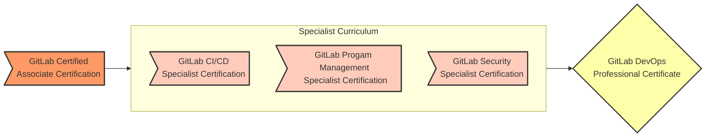

## On this page
{:.no_toc .hidden-md .hidden-lg}

- TOC
{:toc .hidden-md .hidden-lg}

## GitLab Technical Certifications

GitLab offers technical certifications to help the GitLab community and team members validate their ability to apply GitLab in their daily DevOps work. To earn certification, candidates must first pass a written assessment, followed by a hands-on lab assessment graded by GitLab Professional Services engineers.

### Getting Started

For the latest list of certifications available to the wider community, see **[Public GitLab Certifications](/learn/certifications/public)**.

To get started, consider the instructor-led [GitLab Certified Associate](https://about.gitlab.com/services/education/gitlab-certified-associate/) or the [GitLab Certified Associate Self-Service](https://about.gitlab.com/services/education/gitlab-certified-associate-self-service/) option. Once you've completed the GitLab Certified Associate, you can move on to Specialist certifications. 

### Overview

GitLab is planning and developing several technical certifications to help the GitLab community and team members validate their ability to apply GitLab in their daily DevOps work. To earn certification, candidates must first pass a written assessment, followed by a hands-on lab assessment graded by GitLab Professional Services engineers.

#### Certification Journey Structure and Flow

##### Structure

There are three levels of GitLab Technical Certification.

1. Associate
    * GitLab Certified Associate
2. Specialist
    * GitLab Certified Specialist: CI/CD
    * GitLab Certified Specialist: Project Management
    * GitLab Certified Specialist: Security
3. Professional
    * GitLab Certified DevOps Professional certification

The Associate level is a prerequisite for the Specialist level, and the Specialist level is a prerequisite for the Professional level.

##### Flow

The following diagram shows the journey from Associate through Professional for the GitLab Certified DevOps Professional certificate.

### Learn more

Learn more about certifications available to the entire GitLab community on [Public GitLab Certifications](/learn/certifications/public).
