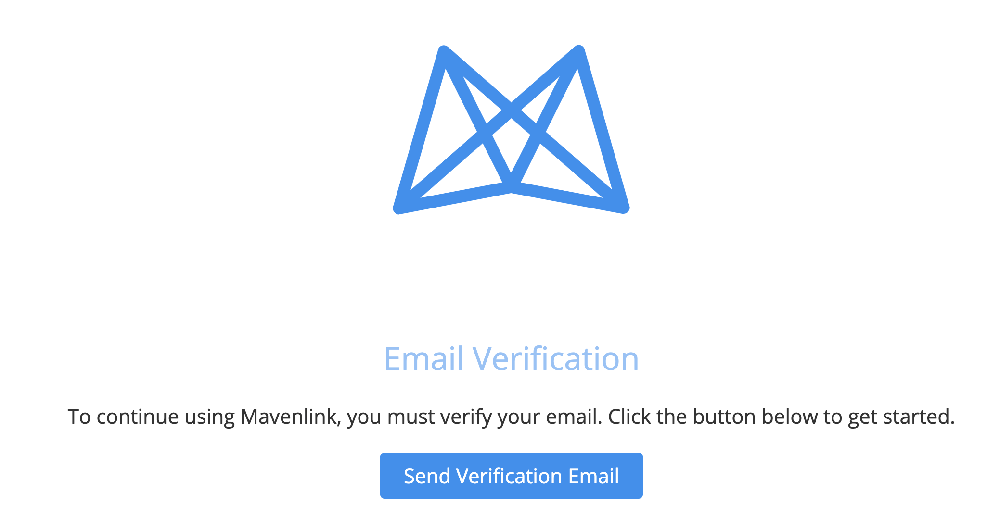
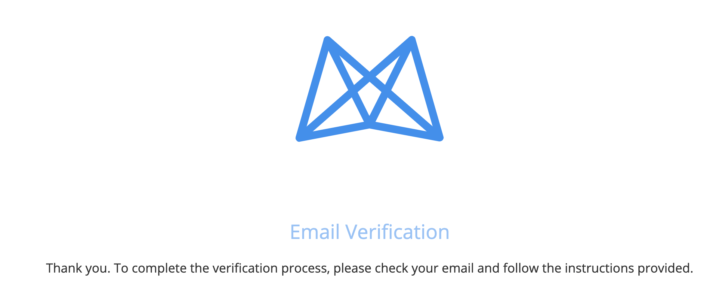
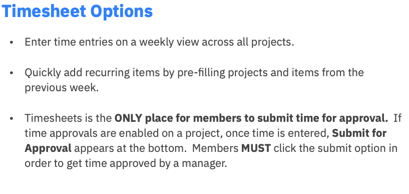
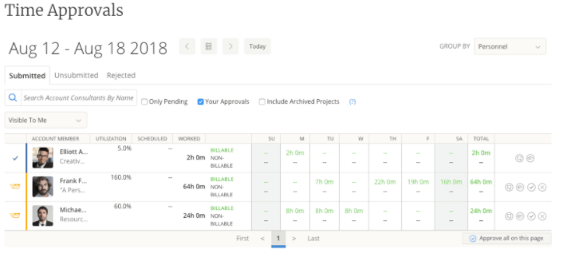
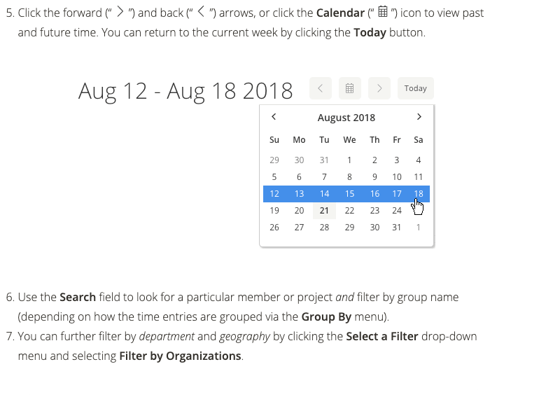
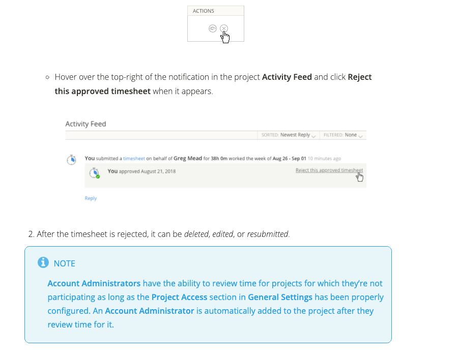

## On this page
{:.no_toc .hidden-md .hidden-lg}

- TOC
{:toc .hidden-md .hidden-lg}

## Mavenlink Processes  

Mavenlink is our current PSA, follow the link below to view process steps and guidelines.

All other processed that relates to professional services operations [can be found on the this page](/handbook/customer-success/professional-services-engineering/professional-services-operations/)

#### Mavenlink Log In

To log into Mavenlik, you will need to access the GitLab's Okta account

* Confirm access is given to Mavenlink and Okta 

* Click on Mavenlink inside Okta

* Verify email
* Enter password
* click on Sign On with Okta

You should not be in Mavenlink, Enjoy!

#### Mavenlink Project Read/ Guest Access

With Guest Access, members can view information about a project without joining.
Mavenlink members would have the same access as their permission set without being a project participant.
However, they cannot comment, make changes, or interact with a project in any way. This is useful for managers or administrators who want to view project information and check progress without being seen.
Although similar, here are some differences between members with View Only project access and those with Guest Access:
- Members with View Only access appear as allocatable project resources. With Guest Access, members can view project information without appearing as an option to be scheduled or allocated on a project.
- Since they are not official project participants, guest viewers won't appear on the project as either the Provider or Client.
- Guests are not tied to Account-level permissions; therefore, if a member has Collaborator account permissions and is assigned Guest Access at the Project Financials level, this member will have have Project Financials view-only access.
- Instead of using the API or manually assigning View Only access to one team member at a time, Access Groups allows you to assign Guest Access in bulk.
Note: Members cannot be invited to a project as a guest viewer, they must be assigned Guest Access using Access Groups.
- A yellow notification banner at the top-right of the project indicates you are Viewing as Guest.

To view projects as Read only/ Guest:
- Members can find projects for which they have Guest Access by going to the Project List tab in Projects and selecting Guest Projects from the Show drop-down menu. Note that team members cannot have Guest Access on projects for which they're participating.

#### Mavenlink Update User Profile

* From the Dashboard, click on Edit Profile

* Update the profile information along with a phote and hit save

#### Mavenlink Collaborator (PSE) Onboarding Checklist

Account Configuration
- When you first enter Mavenlink, these are the items to review and update
- [ ] Update your profile
- [ ] Configure your email settings and notification preference
- [ ] Set your preferred default login screen

Daily Activities
- On a daily basis, you will do the following: 
- [ ] Review Project Task Tracker
- [ ] Post messages, updates and files for project communication
- [ ] Track time
- [ ] Create,Log and submit expenses (Expensify)

Weekly
- To ensure everything is up to date, review and/or update these items on a weekly basis.
- [ ] Review and submit your timesheet 

Project Close
- These are the items to complete prior to close out your Project
- [ ] Ensure all your tasks are marked complete
- [ ] Confirm all time has been tracked in your timesheet 
- [ ] Confirm all expenses have been logged and submitted

#### Mavenlink Project Lead, Project Manager Onboarding Checklist

****Account Configuration****

* When you first enter Mavenlink, these are the items to review and update
* [ ] Update your profile
* [ ] Configure your email settings and notification preference
* [ ] Configure your default Project List view
* [ ] Configure your default Global Task Tracker view
* [ ] Set your preferred default login screen

****Project Assignment****
* When project is assigned, review the SOW along with the project details in Mavenlink to be sure there is an understanding of the project technical and financial details
* [ ] SOW
* [ ] Task Tracker
* [ ] Budget
* [ ] Custom Fields
* [ ] Billing & Revenue Rules
* [ ] Master Planning- Project Schedule
* [ ] Project Status
* Work through project set up:
  * [ ] Project Definition
  * [ ] Project Kick Off Deck
  * [ ] Project Folder
  * [ ] Project Internal Agenda
  * [ ] Slack Channels

****Weekly- completed by EOD each Thursday****

* To ensure everything is up to date, review and/or update these items on a weekly basis.
* [ ] Review and approve time sheets each Monday morning, approvals should be done by noon each Monday
* [ ] Review project status and be sure up to date
  * Prospect- PC is setting up Mavenlink project/ Project is at a Stage 5- start reviewing staffing plan
  * In Set Up- PC is setting up Mavenlink project/ Reviewing Staffing/ Welcome to PS Email
  * Okay to Start- Project setup complete/ PM Planning the project
  * Active- PM/ PSE Actively working the project
  * Closed- Project work is complete, waiting for billing and revenue to be complete
  * Completed- Billing and Revenue is complete
  * On Hold- Project is delayed
  * Backlog- No work is planned
  * Cancelled- Project Created but will not be worked for various reasons
* [ ] Project Schedules- Master Planning, submitting updates
* [ ] Project Health Status
* [ ] Reviewing Forecast
* [ ] Project touch base call (if applies)
  * Could be internal call and/or customer call depending on project
* [ ] Project Definition/ Issue Tracking/Customer Updates

****Project Close****

* These are the items to complete prior to close out your Project
* [ ] Ensure all your tasks are marked complete
* [ ] Confirm all time has been tracked in your timesheet
* [ ] Confirm all expenses have been logged and submitted

#### Mavenlink Time Off Scheduling, Holidays, Friends & Family Days

****Regional Holidays and Friends and Family Days****

Regional holidays and Friends and Family days are included in Mavenlink on each members calendar, followed by the  [time off process](https://about.gitlab.com/handbook/paid-time-off/#a-gitlab-team-members-guide-to-time-off).  Since the days are included in the calendar there is no need to submit the time in the Mavenlink PTO feature or the users time sheet.  When logging into the time sheet, the required work week is shown on the time sheet entry.

GitLab company policy to submit time off is through PTO by Roots, and followed by this [handbook process](https://about.gitlab.com/handbook/paid-time-off/).
In the Professional Services group, we also require time off to be submitted to Mavenlink:

Benefits of having time off in Mavenlink
- Time is includes on our Master Planning scheduling calendar
- This allows the PC and project managers to plan customer project around time off
- Ensures there is no conflicting customer project schedules

Process:

- When time-off is submitted to PTO by Roots, time-off is required to be submitted in Mavenlink as well.
- Review the Master Planning to be sure a project is not already scheduled during the desired time off
- If project time is scheduled, review with the Project Coordinator if the project time could be moved or come to a mutual agreement for the requested time off  

Time off would be submitted from the Dashboard, by clicking on the profile picture:
- GO to "Your Dashboard"
- Click on "Your Profile Picture"
- Right hand profile will pop up, there is a section for Upcoming Time Off
- Click on the plus sign to add time off

Time off cancellation
- GO to "Your Dashboard"
- Click on "Your Profile Picture"
- Right hand profile will pop up, there is a section for Upcoming Time Off
- Click on the plus sign select the date and update the hours to "0"

#### Mavenlink Time Tracking- Time Sheets

#### Mavenlink Time Approval Process

Overview

With Mavenlink’s time approval functionality, members with Project Lead account permissions (or higher) can access the Time Approvals page where they can view and manage time for all projects in which they have Financials permissions (or higher).

The Time Approvals page allows you to view Submitted, Unsubmitted, and Rejected time entries from tabs with the corresponding names. Depending on the state of the submission, you can view the timesheet, private message a user who submitted time, and either approve or reject the time entry. You can also directly message those who still needs to submit time, reminding them to do so.

If you have Report Viewer account permissions (or higher)—or have been designated as a Time Approver for an individual member or project—you’ll see the Your Approvals check box. You can select this checkbox to only see the time that you’re responsible for approving; otherwise, deselect it to review and take action on all submissions.

Members that do not have account permission of Report Viewer (or higher) will only be able to approve time in the project's Activity Feed.

***Time Sheet Approvers***

| Project Type | Time Sheet Approver |
| ------ | ------ |
| Consulting Customer Project/ Hours| Lead/ Project Manager |
| Internal Projects| PS Project Coordinator |
| Training Project/ Hours| PS Training Coordinator |

****Project Notes****
- Project notes are required for all Credit and Non Credit time entries
- If the notes section is blank, reject the time sheet asking for project notes

 There are 3 ways to approve timesheets via Mavenlink:
- Mavenlink email
- Mavenlink Time Sheet Approvals 
- Mavenlink project activity feed 

Method 1- Mavenlink email

- Automated Mavenlink time sheet approval email received when time sheet is submitted

- Click on the **view the timesheet** link to review the timesheet.
- Click the Approve button to approve the timesheet or the Reject button to reject the timesheet. Enter notes if you are rejecting the timesheet.

Method 2- Mavenlink Time Sheet Approvals

Method 3- Mavenlink project activity feed

#### Mavenlink Project Creation

Setting up a project within Mavenlink:

Responsible Role: PC

Once the PS Opportunity is closed/ won a notification is sent from SFDC.

1. Review project opportunity and documentation
   - PS Project- SOW
   - Training Project- Order Form or SOW if custom training purchased
2. Review the contact section of the PS Opportunity and confirm with sales
3. Send the Welcome to PS Email to customer
   - [Training Template](https://docs.google.com/document/d/1rJ9q9gEzsumRxDhoWEe45u70efmKA0eWNg69WONuCYs/edit#heading=h.vylh0p2padiu)
   - [Consulting Project Template](https://docs.google.com/document/d/1je9dqVJpFFMv7aw9WhPeQ8aufx6Sj3OZveqaHHd212w/edit)
4. Create the project in Mavenlink
  - Go to Projects => All Projects and then click on the +Add Project button. 
  - You will want to select the correct template that you want to start your project from

5. Create a New Project:
- Project Name- Account Name/ Opportunity Name/ Budget Amount
- Provider - Keep defaulted as **I am the Provider** and Provider Name is **GitLab Professional Services**.
- Include Start Date and Due Date for the time period that is expected to work the project
- Project Colors
  - Blue- Training Only
  - Yellow- PS Only
  - Orange- Training & PS 
  - Yellow- Internal 
- Include Start date for template if date if tentative date is known
- Privacy -
  - Who Can Participate = Open to Organization Members
  - Who Can See Communications = Posts are Public by Default
- Remove or include Resources that will be added to the project template
- Add the project lead if not known at creation, if not be sure to update lead when staffing
- Add project budget (total amount of opportunity)
- Add project Target Margin of 40%
- Review project billing rate, to be sure correct Rate Card is assigned
  - Currently use Account Rate Card for billable projects
- Select Task Billing Mode
  - Fixed Fee
  - Time & Materials
- Task Default- should be Billable 
- Select the Group (Account Name)
  - If the group name is not available, create the Group Name and assign the project to the group

- Then click Create Project
- When the project creates, verify the project settings:
  - Project Name
  - Project Color
  - Budget
  - Target Margin (40%)
  - Rate Card
  - Task Billing Mode
  - Task Default
  - Group
- Projects => Project List
  - Make sure that the project is assigned to the **GitLab-All (Global)** organization

6.  Once the project is created then work through updating the following:

- Within the project side panel, go to the Custom Fields section.
  - Verify Account, Opportunity, Technical Account Manager, Primary Solutions Architect, Opportunity Owner, and SDR Assigned fields are populated from the SFDC opportunity and account.
  - Enter Engagement Manager if necessary.
  - Add GitLab Project Link (URL), Project Components, Security Requirements (if applicable), Passive Acceptance Language, Billing Type, Billing Terms, and Revenue Release.  

- Project Gear sections:
  - Verify Rates and Roles.
  - Verify Project Permissions and change the Team Lead assignment, if necessary.
- Project Status
  - Change project status to In Setup
- Project Activity
  - Add a post to include the quote and PO
- Project Task Tracker
  - Modify the milestones and tasks as applicable for your project.
  - Within each milestone or task, assign the appropriate assignments with the Custom Fields section:  Passive Acceptance Used for Sign Off, PS Category, PS Type, PS Services
  - Make sure that the budget and billable time estimates are correct.
  - Make sure that no dates are assigned to the milestones or tasks initially.  You will update the assignees and start and due dates as the project is being scheduled and worked.
- Project Time & Expenses
  - Go to the Budget section (right-hand side) and verify that the budget matches for your tasks.
- Master Planner (add soft allocations)
  - Go to Planning => Master Planning => Projects
  - Search for your project
  - Add an unnamed resource (if there isn't already one) to the project
  - Add soft allocation for the unnamed resource
  - You will change the resource to a team member and update to a hard allocation as you work on the project.

#### Mavenlink Project Health Report

Project Health Reports are found on the Mavenlink project on the right hand fly out panel

Click On new Health Report to create a new report

Fill out each section and save

Only one Health Report can be added each day

#### Mavenlink Project Status/ Colors

| Mavenlink Status |  |
| ------ | ------ |
| Estimate- Gray | Projects that are tracking Internal time for GitLab PS & GitLab Partners |
| Prospect- Gray | PC is setting up Mavenlink project/ Project is at a Stage 5- start reviewing staffing plan |
| In Set Up- Gray | PC is setting up Mavenlink project/ Reviewing Staffing/ Welcome to PS Email |
| Okay to Start- Light Green | Project setup complete/ PM Planning the project |
| Active- Dark Green | PM/ PSE Actively working the project |
| Closed- Blue | Project work is complete, waiting for billing and revenue to be complete |
| Completed- Blue | Billing and Revenue is complete |
| On Hold- Gray| Project is delayed |
| Backlog- Gray | No work is planned |
| Cancelled- Blue | Project Created but will not be worked for various reasons |

| Mavenlink Project Colors |  |
| ------ | ------ |
| Blue | Training Only Project |
| Yellow | Consulting Only Project |
| Orange | Consulting & Training Project |
| Lime | Internal Project |
  
