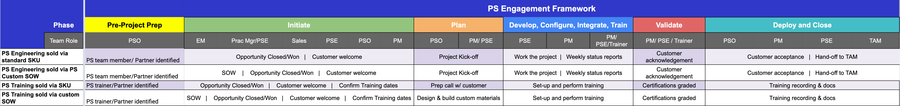

## On this page
{:.no_toc .hidden-md .hidden-lg}

- TOC
{:toc .hidden-md .hidden-lg}

GitLab takes our customer's success very seriously. In Professional Services (PS) we strive to provide a first class experience for all engagements.

- [Process Flow - trim (above)](https://docs.google.com/spreadsheets/d/1uRoB73lZtvNhkk-Z9eQS3_Ys4yX8vVUXXqQUO7Nm1ss/edit?usp=sharing)
- [Process Flow - full](https://docs.google.com/spreadsheets/d/1Y8wWj5g8T6HuPGEnHaWUfdtI7LPmathGaMwfiA2b_Ks/edit?usp=sharing)
 
### Project plan
 
Each PS Engagement will include a Project Plan based on the activities outlined in the Statement of Work (SOW). The Project Plan starts in Mavenlink but may be supplemented by a more detailed Gantt chart, tasks list, or another form of documented plan. This plan will follow the process listed above.
 
### Project workflow

#### Pre-Project Prep

1. PS Operations: Once a project has moved into SFDC Phase 5 – “Negotiating”, SOW is reviewed and a PSE(s) team member is identified for the project, working with Sr. PSE and/or Technical Architect. Choice is based on several aspects:
   - PSE technical skillset/experience
   - PSE personality match with the customer
   - PSE technical growth path opportunity
   - PSE time zone
   - PSE availability
2. PS Operations: Reviews team member availability and adds a soft-allocation to the Mavenlink project schedule.
3. PS Operations: Research an appropriate Partner if it is determined that a GitLab team member is not available to work the project.
   - TODO: Link to Partner process

#### Initiate

4. PS Operations: Once a project has moved to Closed/Won in Salesforce, a project is updated to “in set-up” status in Mavenlink.
   - A Project Lead is assigned: this can be a Project Manager, or Professional Services staff member
5. PS Operations: Send [initiation email](https://docs.google.com/document/d/1je9dqVJpFFMv7aw9WhPeQ8aufx6Sj3OZveqaHHd212w/edit?usp=sharing) and [existing customer initiation email](https://docs.google.com/document/d/1eNPXLmstMLoatpOBIhxrJgnPFgqYByPaJoFQRd2kz9U/edit?usp=sharing)
6. Project Lead: Begins planning the project 
   - Internal PS project alignment meeting (includes Engagement Mgr, Project Coordinator, PSE)
   - [Project Preparation call](https://docs.google.com/document/d/1fOmBxXf9MqYHQ8LZD5nIepu5WcFeTiwss59RJbd3BWE/edit?usp=sharing) (PM, PSE and/or Technical Architect and customer Project Lead counterpart)
   - Sales to PS hand-off meeting (PM to complete the hand-off issue in the customer Epic)

#### Plan

7. Project Lead:
    - External [Customer Project Kickoff](https://docs.google.com/presentation/d/1HtVIE64N94Rcc774ujllClGmYZ5y1_ApE4-O3pazR6k/edit?usp=sharing): Actions and meeting minutes are added directly to the Project Definition Template (attendees include the entire project teams on both sides)
    - Submit resource request via Mavenlink to match the customer-confirmed project schedule
    - Weekly project check-in meeting: Notes documented in the [Project Definition](https://docs.google.com/spreadsheets/d/18pxG8-rxzwu51x3oywOENuN7ScsivlC3iM8jYV_mGug/edit?usp=sharing)
    - Provide Weekly Status Report: Using the template in the [Project Definition](https://docs.google.com/spreadsheets/d/18pxG8-rxzwu51x3oywOENuN7ScsivlC3iM8jYV_mGug/edit?usp=sharing)
  
#### Develop, Configure, Integrate

8. PS Engineer: Complete work per the SOW
9. Project Lead:
    - Keep Mavenlink up to date: project schedule, project health/pulse report, milestone acceptance, update project tasks via task-tracker, timesheet approvals
    - Provide Weekly Status Report to customer using the template in the [Project Definition](https://docs.google.com/spreadsheets/d/18pxG8-rxzwu51x3oywOENuN7ScsivlC3iM8jYV_mGug/edit?usp=sharing) using the template in the Project Definition
       - Mavenlink schedule snapshot of the schedule (or other alternative view)
       - Mavenlink hours burn-down report (for T&M only)
       - Open Action Items [Project Definition](https://docs.google.com/spreadsheets/d/18pxG8-rxzwu51x3oywOENuN7ScsivlC3iM8jYV_mGug/edit?usp=sharing)
       - Issues & Escalations [Project Definition](https://docs.google.com/spreadsheets/d/18pxG8-rxzwu51x3oywOENuN7ScsivlC3iM8jYV_mGug/edit?usp=sharing)
       - Planned Out of Office [Project Definition](https://docs.google.com/spreadsheets/d/18pxG8-rxzwu51x3oywOENuN7ScsivlC3iM8jYV_mGug/edit?usp=sharing)

#### Validate

10. Project Lead:
   - Send [activity-based acceptance requests](https://docs.google.com/document/d/1RiS5TY5484nQuDTW8YMiB-CibVfoni7NJ8IUG2osUD0/edit?usp=sharing) to the customer for approval upon complete of each milestone
11. Customer:
   - Approves completion for each activity, deliverable, or milestone via email

#### Deploy & Close**

12. Project Owner:
    - Complete this [sign off workflow](https://about.gitlab.com/handbook/customer-success/professional-services-engineering/workflows/project_execution/sign-off.html)
    - Schedule [Project closure meeting](https://docs.google.com/document/d/1Cw5eLe8VKFtHG9xGqUiCua8Pbu52reMzHujcPWq3ofQ/edit?usp=sharing)
    - Schedule [Project Retrospective](https://docs.google.com/document/d/1CXfnCzjF_hwapy0R-89txiFUmSmvX7jvlEqWn48zN8A/edit?usp=sharing)  

### Project Management Process Templates

### Work Exception

If a project is going to go over the alloted time/budget, open a work exception to get approvals from PS leadership by [creating a Work Exception type issue in PS Plan](https://gitlab.com/gitlab-com/customer-success/professional-services-group/ww-consulting/ps-plan/-/issues/new?issue%5Bmilestone_id%5D=&issuable_template=work-exception)

### Change Order

Change orders are common elements of Professional Services engagements.  Apply the following steps to create a change order issue, which describes the change order process.
* Note the engagement Epic number
* [Create a Change Order type issue in PS Plan](https://gitlab.com/gitlab-com/customer-success/professional-services-group/ww-consulting/ps-plan/-/issues/new?issue%5Bmilestone_id%5D=&issuable_template=change-order&issue%5Btitle%5D=Change%20Order)
* Replace `<!-- ADD CUSTOMER EPIC NUMBER HERE, e.g. &65-->` at the bottom of the description with the epic number e.g. `&65` 

### Work At Risk

When work at risk is sought, apply the following steps to create a work at risk issue, which describes the work at risk process.
* Note the engagement Epic number
* [Create a Work at Risk type issue in PS Plan](https://gitlab.com/gitlab-com/customer-success/professional-services-group/ww-consulting/ps-plan/-/issues/new?issue%5Bmilestone_id%5D=&issuable_template=work-at-risk&issue%5Btitle%5D=Work%20at%20Risk)
* Replace `<!-- ADD CUSTOMER EPIC NUMBER HERE, e.g. &65-->` at the bottom of the description with the epic number e.g. `&65` 
