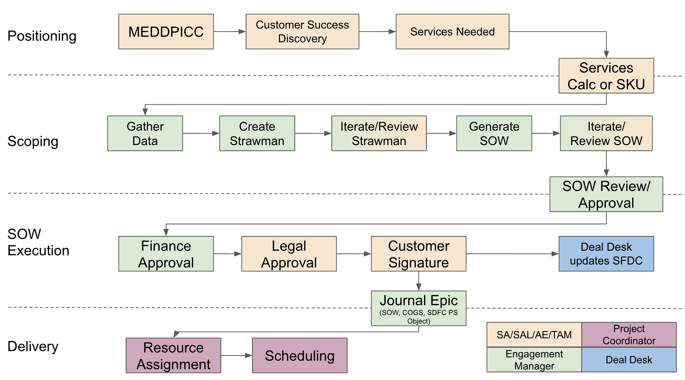

# Scoping Custom Professional Services
{:.no_toc}

## On this page
{:.no_toc .hidden-md .hidden-lg}

- TOC
{:toc .hidden-md .hidden-lg}

## Overview
The pupose of this page is to document the sales-assisted selling motion used by Professional Services Engagement Managers and Regional Delivery Managers. If you're on a GitLab sales account team looking for information, try these pages on [positioning professional services](/handbook/customer-success/professional-services-engineering/positioning) or [selling professional services](/handbook/customer-success/professional-services-engineering/selling/#custom-scoped-services). 

This page will help outline the when and how to get involved with positioning and scoping services, how to estimate, how to use SOW generation software, and the processes to gain approval. 

> *Note: Services engagements can take [two forms](/handbook/customer-success/professional-services-engineering/selling). This will focus on the **custom SOW scoping** process, not the Standard SKU process.*

For custom SOWs, the [workflow for SOW creation](/handbook/customer-success/professional-services-engineering/selling/#custom-scoped-services) involves a partnership between the SA/TAM and the Professional Services team.


[Source](https://docs.google.com/presentation/d/1TOI2aoseBoyWYQC6-xpJVMknEncCNreSFfMvOHO7EBA/edit#slide=id.gbfb62d0c00_0_58) (GitLab Team Members Only)

## When to get involved with positioning/scoping services
### Land
The answer to this question depends on the customer size. For the larger, more strategic customers Engagement Managers tend to get involved earlier in the selling process to help with discovery and provide lessons learned on rollout from past engagements. For the medium sized customers, Engagement managers tend to get involved with account teams when the SFDC stage 4 (Proposal) is achieved. As of publication of this page (Feb 2022), its the responsibility of the account team (SA, SAL) to get in touch with the Engagement manager in the [#professional-services](https://gitlab.slack.com/archives/CFRLYG77X) slack channel.

### Expand
If an account team is trying to help a customer expand to use a new stage in the software or increase tier to get access to features they didnt have before or even when a company has a new influx of users onboard to GitLab, it could merit positioning of services. As of publication of this page (Feb 2022), its the responsibility of the account team (TAM, SAL) to get in touch with the Engagement manager in the [#professional-services](https://gitlab.slack.com/archives/CFRLYG77X) slack channel.

## How to get involved with positioning/scoping services
The Engagement Manager can respond to questions direclty in slack or can request to meet with the account team to discuss the request in more detail. When a request is qualified (i.e. we agree that proposing PS engagement makes sense), the SA/TAM is responsible for creating a scoping issue via the [services calculator](https://services-calculator.gitlab.io/). The services calculator will generate a number of issues to help facilitate the scoping and SOW signature process ([example](https://gitlab.com/groups/gitlab-com/customer-success/professional-services-group/-/epics/826), GitLab team members only). 

After the services calculator is run by the SA, scoping issues are automatically created and land in the [PS Plan](https://gitlab.com/gitlab-com/customer-success/professional-services-group/ps-plan/-/issues) Project. Using this customer scoping issue, there is usually asyncronous data gathering that happens directly on the issue. Questions about the potential engagement can sometimes be answered by the SA from the discovery that was done already. We want to make sure we avoid asking duplicative questions to the customer. Once the initial data is gathered, the Engagement Manager meets with the account team and customer to discuss how PS could help ensure the Customer's goals are achieved with their investment in GitLab. This can and should be iterative. 

## Discovery questions
TODO

## Scoping & Estimation
The Engagement Manager uses the [straw-man spreadsheet](https://docs.google.com/spreadsheets/d/1wkmKhhGyLoxqWCXFtiI99tNgVaEJ-hTQJRwTOsU0j_Y/edit#gid=1815139260) to define the services in scope and estimate the amount of time for each activity. Once the Engagement Manager can get buy in from the account team and/or customer on the size and activities included in the services engagement, the [SOW generation automation](https://gitlab.com/services-calculator/services-calculator.gitlab.io) can be run using the straw-man as an input. To use this automation, follow the instructions on the readme in the :point_up: project. 

## Review & Approval
Once the SOw is generated, it is ready for review by the account team. After one or more rounds of iteration on feedback from the account team, the SOW will be ready for Review and Approval by Sr. Director of Professional Services. These review processes happen in the [#professional-services](https://gitlab.slack.com/archives/CFRLYG77X) and **at-mention** the specific people from whom the engagemenet manger is seeking approval. 

Once the SOW has been approved by PS leadership, the account team is owns the process of acquiring signature from the customer representative. They will also be responsible for updating the salesforce PS Only object. 

## Pre-sales to Delivery Handoff
Check out the [PS Delivery](/handbook/customer-success/professional-services-engineering/delivery/) services methodology to see how the pre-sales handoff is facilitated via GitLab issues, Salesforce Objects and handoff meetings. Typically, once the engagement goes `closed-won` in salesforce, the project coordinator schedules a handoff meeting to discuss resource assignment, schedule, and technical details of discussions that occured before the sale closed. 

<!--This page provides scoping questions designed to collect details and uncover the customer's required capabilities. This ensures alignment of the SOW and PS delivery with the positive business outcomes the customer is looking for.  While not an exhaustive list, these questions and suggestions will help spark the discovery conversations.

## Migration scoping questions
Migrations are one of the most complex types of services in any technical field.  Systems store data in a variety of ways that evolves.  Also, customers and users often use the same data model and system to represent completely different logical units to their teams.  To ensure a transition that meets the customer's needs, we want to make sure we understand their usage of their current systems.

### GitLab to GitLab scoping questions
The following questions are about bringing multiple GitLab instances together into a single "parent" instance:

1. How many instances need to be migrated together?
1. Breakdown of repositories per instance (and total git storage space)
1. Breakdown of users per instance
1. Breakdown of groups per instance
1. Breakdown of disk space per instance
1. Do any of the users use SSO (LDAP, SAML, etc.) to log in users?
1. What is the version of every GitLab instance involved?
1. What integrations are used on each instance?
1. For each instance, how is artifact, upload, container registry and Git LFS storage handled?
 
### SVN to Git scoping questions

SVN to Git Questions:

1. What is the structure of the SVN repos and subprojects? Do they follow the "standard" of:
    ```
        Repository
            Project 1
                branches/trunks/tags
            Project 2
                branches/trunks/tags
    ```
    1. Any other variations? Example:
        ```
            Trunk
                Project 1
                Project 2
            Tags
                tag name
                    Project 1
                    Project 2
            Branches
                Branch name
                    Project 1
                    Project 2
        ```
1. How many SVN repositories are there? How are they broken up?
1. What is the overall size of the SVN repos?
1. How much history (e.g. tags, branches, etc.) should be migrated?
1. Are any binary files stored in SVN?
1. How are you currently using SVN externals? Do you have some example use cases?
1. Which migration/conversion environment (local, VM, cloud) and OS (Windows, Linux, macOS) is preferred?

### GitLab self-managed to GitLab.com scoping questions

Self-Manged to GitLab.com questions:

1. How many repositories are there?
1. What is the average size of the repositories? What is the size of the largest repositories?
1. How many groups are there?
1. How many users?
1. Do we want the same structure of groups/projects/user access? Do we want it to be restructured?
1. Do you use other tools with GitLab. If so, which ones?
1. How are the runners currently set up?
  1. Where are they hosted?
  1. How many specific runners do you have and what are the details of these runners?
  1. Are you looking to make any changes to the runner strategy at your organization or will it stay the same?
1. GitLab.com uses SAML for authorization. What SAML tool would your organization be using?

## Implementation scoping questions
For scoping infrastructure implementation, we have several questions that can help us understand the scope. To get started, make a copy of the spreadsheet below and fill in the answers. If there are questions you want to add, ping the `@ps-team` in Slack channel #[professional-services](https://gitlab.slack.com/archives/CFRLYG77X). Then you can attach this document to the issue created by the [GitLab Services (SoW) Calculator](https://services-calculator.gitlab.io/).

[Implementation Infrastructure Scoping Questions](https://docs.google.com/spreadsheets/d/1TsCUNLuWdpX1V_dTn5MMXIUqnAYKm9Megu5MO9S8eGM/edit?usp=sharing)

**Note:** This document contains tabs for various public and private cloud providers - AWS, GCP, Azure, OpenShift and other on-prem deployments - you should only have to fill out the tab(s) relative to your customer. -->

