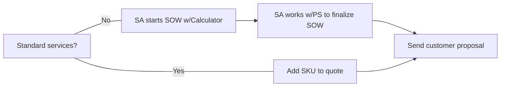

## On this page
{:.no_toc .hidden-md .hidden-lg}

- TOC
{:toc .hidden-md .hidden-lg}

### How to Contact Professional Services

At GitLab, Professional Services (PS) is part of the [Customer Success department](/handbook/customer-success). As such, you can engage with PS by following the guidelines for engaging with any [Solutions Architect (SA)](/handbook/customer-success/solutions-architects#when-and-how-to-engage-a-solutions-architect). This process ensures that the Customer Success department as a whole can understand the inbound needs of the account executive and our customers.

You can also reach the group via the [#professional-services](https://gitlab.slack.com/archives/CFRLYG77X) Slack Channel.

#### Requesting training for GitLab team members

**For team leads**

Internal GitLab team leads can request training sessions delivered by Professional Services for their teams. Here are the steps for making a request. 

1. [Create a new issue](https://gitlab.com/gitlab-com/customer-success/professional-services-group/education-services/-/issues/new?issue%5Bassignee_id%5D=&issue%5Bmilestone_id%5D=#) in the Education Services namespace using the internal_trainer_request issue template. or internal-team-member-training-request
1. Complete the Requestor Tasks in the issue description.
1. The PS Project Coordinator will reach out to plan and schedule the training session(s).

**For individual team members**

Individual GitLab team members can request to audit a customer-facing training sessions delivered by Professional Services. Here are the steps for making a request to attend. 

1. [Create a new issue](https://gitlab.com/gitlab-com/customer-success/professional-services-group/education-services/-/issues/new?issue%5Bassignee_id%5D=&issue%5Bmilestone_id%5D=#) in the Education Services namespace using the internal-team-member-training-request template.
1. Complete the Requestor Tasks in the issue description.
1. The PS Project Coordinator will confirm the date(s) with you and provide you with a registration link.

### For Sales Reps and SAs: How to order Professional Services

1. To order Professional Services, the SAL or ISR [creates an Opportunity in SFDC](/handbook/sales/field-operations/gtm-resources/#how-to-create-an-opportunity) using the record type "Professional Services Only."

1. The next steps depend on whether the services needed are standard or custom.

* **Standard Services (non-customized)**: Sold using Professional Services SKUs with pre-defined statement of work (SOW) documents. These offerings do not require custom scoping and are ordered directly from Zuora in SFDC. Checkout our [full catalog](https://about.gitlab.com/services/catalog/) for a list of standard services currently offered.

* **Custom Services**: Sold if standard services do not meet the needs of the customer, via a custom SOW using the [Services Calculator](http://services-calculator.gitlab.io/).

**Process for Sales Reps and SAs**

For more details on selling professional services, see [Selling Professional Services](/handbook/customer-success/professional-services-engineering/selling).

For information on how to position Professional Services to your customer, see [Positioning Professional Services](/handbook/customer-success/professional-services-engineering/positioning).

#### Lead time for starting a Professional Services Engagement

Often we are asked "what is your lead time for getting started with a project" or a customer may have a specific timeframe in which they want a project delivered.
As there may be many projects and proposals in flight at any time, there are a few rules we use when prioritizing and scheduling engagements:

* No engagement schedule can be committed to until a signed SOW is received and the Sr. PS Project Coordinator has scheduled the project on the PS Calendar. While we can make a good faith effort to try and match a schedule ahead of that time, to be fair to customers who have committed to a services engagement we must prioritize those first.
* Our typical lead time for starting an engagement is 4 weeks or less, but this can vary greatly as we scale the team and engagements.
* Please, check with the Sr. PS Project Coordinator by tagging the group `@ps-scheduling` for the latest lead time details in the [#professional-services](https://gitlab.slack.com/archives/CFRLYG77X) Slack channel if you need a more accurate estimate.  
* Depending on the lead time and if the opportunity is working to close the Sr. PS Project Coordinator will track the opportunity and start planning tentative project dates in anticipitation of the executed sow and opportunity updated to "Close/Won". 
 

#### Custom services SOW creation and approval

When scoping custom SOWs, the PS team partners with the SA to create a custom engagement that will help meet the customer's needs. Custom offerings must be reviewed and approved by the Director of Professional Services.

##### SOW creation
* The creation of new SOWs for customer proposals is owned by the SA.
* To create a custom services SOW, start with the [Services Calculator](http://services-calculator.gitlab.io/) which will open a new SOW issue on the SOW Proposal Approval board. Follow the specific SOW process for a complete explanation. 
* We prefer customers to mark up our agreement and SOW document if they request changes. If they require the use of their own services terms or SOW, please contact the PS team.

##### SOW Proposal Approval Board

The [SOW Proposal Approval Board](https://gitlab.com/groups/gitlab-com/customer-success/professional-services-group/-/boards/1353982?label_name[]=Services%20Calculator) is used to approve all SOWs before sending them to a customer. 

**SOW approval workflow labels**

The labels are (from left to right):

* `Open`: This issue has been created by the Services Calculator and waiting for the SA to confirm
* `proposal::Scoping`: Gathering information from the account team and customer required to scope the engagement
* `proposal::Writing`: The PS team is finalizing the terms of the SOW
* `proposal::Cost Estimate`: The Manager, Professional Services is preparing a [cost estimate](/handbook/customer-success/vision/#professional-services-standard-cost) using the [SOW Cost Estimate Calculator](https://docs.google.com/spreadsheets/d/16KFNRFe4E_oaqU7_ZGivoO7eU3-65dkMgVvK5Jvb7ZQ/edit#gid=158441360) for margin calculation purposes
* `proposal::Ready For Approval`: The PS team has completed the SOW, and it is ready to be approved by the Director of Professional Services.
* `proposal::Approved`: The SOW is ready to be sent  to the customer by the account team.  Once sent, this issue can be closed

**NOTE:** Issues that have not been updated by an SA in the last 30 days will be automatically closed.

### Scheduling Professional Services

For scheduling specific customer engagements, we currently are slotting implementations while our group grows to support the demand for services. If you have a concern about scheduling the engagement, this should be discussed at the Discovery phase. If you want to check availability, ask the Sr. PS Project Coordinator by tagging the group `@ps-scheduling` in the [#professional-services](https://gitlab.slack.com/archives/CFRLYG77X) Slack Channel. In no case should you commit to dates before receipt of Signed SOW, agreements, P.O., etc.
