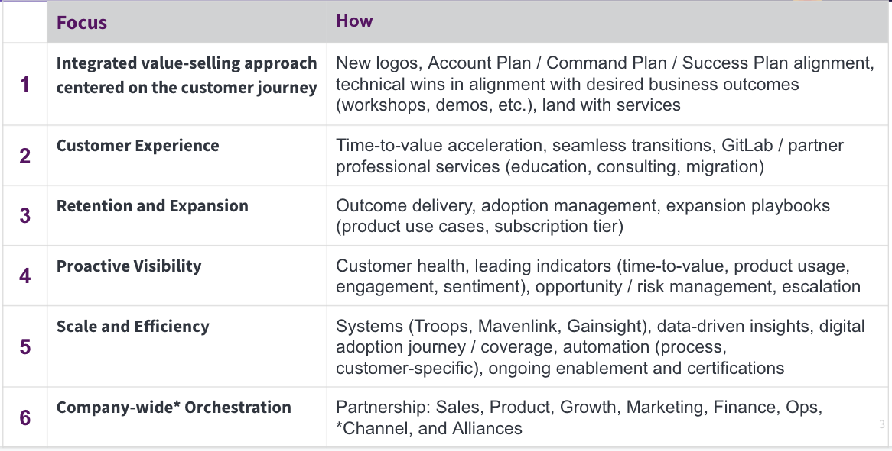

## On this page
{:.no_toc .hidden-md .hidden-lg}

- TOC
{:toc .hidden-md .hidden-lg}

## Strategy and Priorities

### FY22 Strategy and Priorities

**Orchestrate achievement of customer outcomes with appropriate experience driving growth for GitLab**

1. Support delivery to our net ARR goals (new and growth)
2. Develop customer journey-based selling and adoption 
   - Seamless customer experience and journey
   - Segment-specific engagement approaches 
   - Repeatable sales, adoption and expansion playbooks
   - Systems, tools, data insights and metrics for continuous improvement  and efficiency
   - Strategic programs: product usage data and product prioritization 
3. Accelerate time-to-value and adoption success through GitLab and partner services, focusing on selling ease, quality delivery, and expanded offers.
4. Develop world-class team
   - Personal and career development
   - Technical, domain (DevOps), product and soft skills growth
   - Live our values

### FY22 Focus Areas
The GitLab Customer Success strategy is aligned to driving Net Revenue Retention (NRR) or Net ARR that aligns better to our measures.

### Q3 and Q4 FY22

#### **CS Team Goals** 

1. Maintain pace of high quality team member candidates with zero candidates “reducing 3. “Behind Plan 30+” to zero by the end of the quarter
2. Quarterly enablement or event that is centered on Diversity and Inclusion
3. Deliver to initiatives created based on team feedback from “Team Engagement Survey” and communicate updates quarterly (at minimum)

#### **Professional Services**

1. Drive booking growth by improving predictability and linearity while increasing ARR attach rate by 6% in Large AMER, PUBSEC and EMEA and transaction attach rate by 4% and rep coverage measurement on who sold services
   - Measured by forecast accuracy at the beginning of quarter
   - Monthly bookings percent of total
   - Establish regular sales enablement cadence
   - Transition PS paper process from Sales to EMs (including opportunities management)
2. Expand service offering(s) (i.e., direct and partner) to cover key GitLab use cases with operational consulting to accelerate digital transformation and/or DevOps change management objectives. 
3. Expand portfolio of success stories and referenceable customers based on customer outcome delivered in a high-quality and predictable way
   - Centralized KB of CSAT, customer quotes, lessons learned 
   - Message calendar to celebrate wins and announce successes 
4. Increase the number of customers with training certifications and/or trained users by 25% by end of year
   - Adoption of eLearning in self-paced 

#### **Solution Architects**

1. Building a high performance culture (up-leveling the team)
   - Demo2Win Sustainability through 100% team participation and deliberate practice.
   - High-demand industry certifications
   - Demonstrable improvement with discovery (proven adoption of discovery training concepts by 100% of SAs)
2. Driving Results (new logos win rate, selling Ultimate) through thoughtful and measurable execution (repeatable processes and operations) 
   - SA Process Mapping
     - Improved Discovery, POV processes
   - Higher Value Activities services
     - VSA
   - Activity data analysis and operationalization
3. Executing Efficiently at Scale (Reuse, Collaboration, Specialization)
   - Building out the Strategic Field Org.
   - Enterprise search
   - Communities of Practices
   - Other initiatives

#### Technical Account Managers

1. Accelerate time-to-value including time to first value as well as initial and expanded use case measured by: 
   - Time-to-first value
   - Expansion plays focused on win rate, cycle time, and win/loss learnings
     - [Q3 OKR: Implement Onboarding Opportunities to Improve Onboarding Experience & Increase Early Reach in Customer Accounts](https://gitlab.com/gitlab-com/customer-success/okrs/-/issues/168)
2. Operationalize use of operational data through development and rollout of:  (issue)
   - Protection and expansion playbooks
   - Content or offerings (e.g., events, webinars) to enable ongoing value realization
   - Best practice advisory for use of GitLab and supporting DevOps operations 
   - Templates and enablement guides for interpreting data
3. Deploy, enable, and operationalize customer health score based on PROVE framework
   - Baseline enablement to sales and CS teams 
   - Integration into customer health assessment (i.e., key sale, risk assessment, expansion opportunity, etc.) 
   - Develop Use Case adoption definitions and metrics for company-wide reporting
   - EPIC: https://gitlab.com/groups/gitlab-com/sales-team/field-operations/-/epics/25
4. Increase management and visibility to customers health and propensity to buy through operational data, diagnosis and management of expansion and churn/attrition activities
   - Identify and define key triggers for propensity to expand, churn, contract
   - Operationalize processes for CS team to act on data to improve customer experience and outcomes
5. Project Compass
   - Increase product usage data coverage for SaaS customers to 100%
   - Increase product usage data coverage for self-managed customers to 80%
   - Exceed 80% of TAM owned accounts with product usage data
   - Attain greater than 85% of all accounts with data-driven health scores
6. Expand Customer Programs
   - Digital Automation: Improve onboarding and enablement email campaigns
   - Surveys: Expand Onboarding, NPS, Professional Services, and other surveys with actionable feedback loops
   - Digital Orchestration: Collaborate cross-functionally to align customer journey with team handoffs and feedback loops for a unified experience

#### **Customer Success Operations**

1. Improve visibility across CS team so each team (TAM, SA, PS) has visibility into YTD and QTD performance
2. Collaborate with Product to instrument new product usage metrics to enhance visibility into customers achieving their desired outcomes and improved time to value metrics - epic
3. Launch Renewal Operations
   - Segment customers by appropriate strategy
   - Increase renewal visibility and predictability
   - Deploy efficient customer engagement strategies

#### **Public Sector**

1. Guide our customers through Cybersecurity Executive Order (EO) conformance
   - Develop and maintain strategic, documented customer guidance in response to published guidelines related to the Executive Order
   - Drive FIPS and FedRamp progress with product and secure teams for customer compliance with government requirements
   - Create an playbook for SA’s to guide customers through EO best practices
2. Gain deeper insights into sales activity and effectiveness
   - Obtain new views into SA activity types, frequency, and ultimately impact via Sisense in order to optimize team performance and consistency 
   - Enable teams on strategic account planning in Gainsight
   - Obtain new reports and insights from Gainsight usage 
3. Celebrate wins better as a team

#### FY22 OKRs

- [Q3FY22 Customer Success Leadership OKRs tracking](https://docs.google.com/spreadsheets/d/1QQ_5vbSgQu1a4hq3de6FlwqcuG-BhhFuua8O-iEUdv0/edit#gid=0) *(internal GitLab only)
