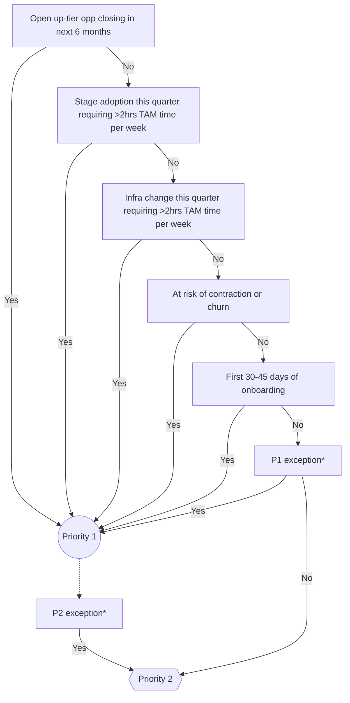

## On this page
{:.no_toc .hidden-md .hidden-lg}

- TOC
{:toc .hidden-md .hidden-lg}

View the [TAM Handbook homepage](/handbook/customer-success/tam/) for additional TAM-related handbook pages.

---

There are three models currently offered for Technical Account Manager engagement. These are broken into tiers that currently use Annual Recurring Revenue as a metric for determining a manageable volume for a single Technical Account Manager and the depth of involvement during the engagement.

## Managing the Customer Engagement

Technical Account Managers will typically manage customer engagements via a GitLab project in the [`account-management` group](https://gitlab.com/gitlab-com/account-management/). This project will be based off the [Enterprise](https://gitlab.com/gitlab-com/account-management/customer-collaboration-project-template) or the [Commercial](https://gitlab.com/gitlab-com/account-management/commercial/templates/new-customer-project/) Customer Success Plan Template and customized to match the customer's needs as outlined above. The project is pre-loaded with milestones, issues, labels, and a README template to help kick off the project and outline a proof of concept, implementation, and customer onboarding. The following is a short [introduction video](https://youtu.be/b8D67EJjL9w) on GitLab's first iteration of the Customer Success Plan.

### Start a new customer engagement

1. Somewhere between step 3 and step 7 of the customer journey sequence, a Solutions Architect should create a project for the customer in GitLab and include a Professional Services Engineer and Technical Account Manager who are best aligned with the customer account. This typically only applies to Enterprise accounts.
2. After the Technical Account Manager has been aligned with the account, they will assign themselves to the “Technical Account Manager” field within Salesforce.
3. The Technical Account Manager confirms that a new customer project has been created based on the [Enterprise](https://gitlab.com/gitlab-com/account-management/customer-collaboration-project-template) or the [Commercial](https://gitlab.com/gitlab-com/account-management/commercial/templates/new-customer-project/) Customer Success Plan Template. If it hasn't, they need to create it and work with the Strategic Account Leader/Account Executive and/or Solutions Architect to complete it. This _should_ have been done prior to Technical Account Management involvement for all Enterprise accounts. For Commercial accounts, the TAM will create the project once they receive the account and determine it is beneficial to have a customer project.
4. Follow the steps in the PLEASE-READ-THESE-INSTRUCTIONS.md file.

### Start a customer upgrade engagement

1. After the Technical Account Manager has been aligned with the account, they will assign themselves to the “Technical Account Manager” field within Salesforce.
1. Provided that the customer is part of the [TAM-Assigned segment](https://about.gitlab.com/handbook/customer-success/tam/customer-segments-and-metrics/#tam-assigned-segment), confirm that the customer project has been created previously during the customer journey sequence, and if not available create a project for the customer in GitLab and include a Technical Account Manager who is best aligned with the customer account transition. For Commercial accounts, the TAM will determine if it is beneficial to have a customer project.
1. Verify that the project complies with the [Enterprise](https://gitlab.com/gitlab-com/account-management/customer-collaboration-project-template) or the [Commercial](https://gitlab.com/gitlab-com/account-management/commercial/templates/new-customer-project/) Customer Success Plan Template.
1. Follow the steps in the PLEASE-READ-THESE-INSTRUCTIONS.md file.

### Where does a Technical Account Manager fit in?

During the pre-sales process for Enterprise accounts, a Solutions Architect owns the project with assistance from the Strategic Account Leader and should include the Professional Services Engineer if there is one assigned. A Technical Account Manager is involved but only for visibility. Until the account becomes a paying customer the project remains in pre-sales. Once the customer has paid, the Strategic Account Leader will set up the "Welcome to GitLab" call along with the key GitLab employees (SAL, SA, PSE and Technical Account Manager) and the customer. There is a preloaded issue for this in the project template.

For Commercial accounts, the Account Executive owns the pre-sales process and [engages a Solutions Architect](/handbook/customer-success/solutions-architects/#commercial-engagement-model) as needed. Once the account becomes a paying customer, the Technical Account Manager will create a customer project if it will be useful to their relationship with the customer, and the Account Executive will schedule a "Welcome to GitLab" call with the customer and the Technical Account Manager.

The "Welcome to GitLab" call will introduce the customer to the Technical Account Manager and begin the handover process. The Technical Account Manager will then lead the rest of the call and own the customer project. If the project was created in the pre-sales project under the [`pre-sales account-management` group](https://gitlab.com/gitlab-com/account-management/pre-sales), then it is moved to a post-sales project under [`account-management` group](https://gitlab.com/gitlab-com/account-management).

### Customer Engagement Tips
1. Make use of the [account management projects](https://gitlab.com/gitlab-com/account-management)  ([Template](https://gitlab.com/gitlab-com/account-management/templates/customer-collaboration-project-template))
1. Whenever a customer asks a question via email/Slack, kindly prompt them to open a Support ticket or an issue in the collaboration project
  * Examples of a Support issue: Reporting GitLab downtime, errors or accessibility problems
  * Examples of a Collaboration Project Issue: General questions about product usage, best practices or recommendations, adoption or integration questions
1. Show customers the power of GitLab by using GitLab with them (ex: related issues, tracking milestones, threaded conversations, ability to interact directly with GitLab’s product/engineering teams)
1. Make sure you are responding in a timely manner to customer's open issues. When you are prompt to respond, the customer is more likely to continue using the account management projects
1. Have discussions in the public issues as much as possible. If there is a question/discussion point that requires interaction with the GitLab Engineering and Product teams, post it in the public issue, as it most likely benefits everyone reading the public issue.
1. When adding a SFDC link to a public issue, remember to [provide feedback](/handbook/product/how-to-engage/#a-customer-expressed-interest-in-a-feature) to the product managers using the [feedback template](/handbook/product/how-to-engage/#feedback-template)

### Disengaging with a customer

There are situations when a TAM needs to disengage with a customer. Examples include:

- A customer downgrades or churns and is [below the TAM alignment threshold](/handbook/customer-success/tam/services/#tam-alignment)
- A TAM has been engaged with a customer [below the TAM alignment threshold](/handbook/customer-success/tam/services/#tam-alignment) for a strategic purpose such as a tier upgrade that was unsuccessful

When this happens, it is important to manage the disengagement so that the customer understands the reason, and is clear on who they should communicate with going forward. Here are some recommendations for how to have this conversation:

- Do it in person (or face-to-face via Zoom), and include the SAL/AE since they will retain the relationship.
- Be honest about the reason. Each situation will be different, and it's a good idea to talk it over with your manager.
- Go over their options for assistance going forward (below).
- Send a follow-up that summarizes what was discussed, including their assistance options.

Recommended options to review with the customer include:

- Troubleshooting, errors, outages, and basic "howto" technical questions should go to Support.
- Complex "howto" and workflow advice should be sent _in writing_ to the SAL/AE. Doing it in writing lets them work with the whole of Customer Success asynchronously to get the best solution.
- If disengagement is due to the customer downgrading/churning, identify the features they will lose access to with the [feature comparison](https://about.gitlab.com/pricing/self-managed/feature-comparison/) page. 
- Online resources such as the GitLab documentation, blog, YouTube channels, [community forum](https://forum.gitlab.com/) and other relevant materials that they can for self-serve guidance.

## Customer Prioritization

GitLab uses a customer prioritization model and [associated metrics](https://about.gitlab.com/handbook/customer-success/tam/customer-segments-and-metrics) to focus the TAM's efforts where they will have maximum value and impact. Different regions utilize different models for determining customer prioritization, as described below. The customer prioritization can change during the lifecycle and is reviewed by each region quarterly.

On the Gainsight Attributes section, the TAM can set the priority level per customer with levels 1 or 2, with 1 being the highest. A new TAM-assigned customer coming on to GitLab will default to Pr1 until their onboarding enablement is complete. Pr3 is solely for unmanaged child accounts, and Pr4 is only for our digital customers and not for the TAM-assigned segment, with the exception of the Public Sector that is trialing a TAM-assigned digital customer. 

Priority Definitions include:

1. Pr1: TAM-led onboarding, monthly cadence call (as minimum), full TAM-led customer lifecycle
1. Pr2: 60 day call cadence, EBR, renewal touch point
1. Pr3: Non-managed child accounts only
1. Pr4: Digital-enablement only customers

 

Why do we use a prioritization system?

- To enable focus on customers that have an imminent opportunity for growth or that require near-term risk mitigation
- To ensure that their book of business does not overburden the TAMs
- To give TAM Managers more visibility into the potential workload of their team via more context on the makeup of the overall portfolio
- Used to further segment customers, beyond the [Sales Segmentation](https://about.gitlab.com/handbook/sales/field-operations/gtm-resources/#segmentation)

The `TAM Portfolio` Dashboard is used to help highlight and review each client, including their priority level.

### US Enterprise

TAM-assigned customers are segmented into two priority tiers: `Priority 1 (P1)` and `Priority 2 (P2)`. We use a series of "yes/no" parameters to evaluate a customer's prioritization, based on the key aspects of a TAM's responsibilities and value to the customer.

Each TAM should aim to have roughly one third (1/3) of their book of business listed as `Priority 1`, and the rest as `Priority 2`.

#### Determining priority

##### Parameters

The following parameters are considered when determining customer prioritization:

| Parameter                                                                     | Yes                                                                                                 | No                                                                                                               |
|-------------------------------------------------------------------------------|-----------------------------------------------------------------------------------------------------|------------------------------------------------------------------------------------------------------------------|
| [**LAM**](/handbook/sales/sales-term-glossary/#landed-addressable-market-lam) | High degree of confidence, or explicit evidence, of greater than 10%                                | Uncertain about LAM, or know for sure it is less than 10%                                                        |
| **Growth in the next 6 months**                                               | Open growth opportunity in Salesforce, and/or explicitly stated intent from the customer for growth | Uncertain about growth in the given timeframe, or the customer has clearly said they have no growth in that time |
| **Open tier upgrade**                                                         | Upgrade opportunity is open in Salesforce and actively being discussed with the customer            | No open opportunity in Salesforce, and/or no active upgrade discussion with the customer                         |
| **Current/upcoming stage adoption**                                           | Actively working with the customer on planning or implementation                                    | Nothing actively being worked on, or only discussed as a future initiative                                       |
| **Current/upcoming infrastructure change**                                    | Actively working with the customer on planning or implementation                                    | Nothing actively being worked on, or only discussed as a future initiative                                       |

##### Prioritization model

Using the defined parameters and guidance on how to know whether they are applicable, we can use the following flowchart to evaluate priority:

<!-->
Online Mermaid editor: https://mermaid-js.github.io/mermaid-live-editor
<-->

_* Please see [priority exceptions](#priority-exceptions) for details._

##### New customer onboarding

When a [new customer is in onboarding](/handbook/customer-success/tam/onboarding/), they are automatically `Priority 1`. This is a key lifecycle event for a customer, which warrants high engagement from the TAM. Once onboarding is complete, the customer's prioritization should be reassessed.

#### Keeping prioritization updated

Since the parameters used to evaluate customer prioritization will change over time, each account's priority should be reviewed and updated **quarterly**, coinciding with [QBRs](/handbook/sales/qbrs/).

#### Priority exceptions

There are occasions that warrant a customer to be prioritized differently than the model indicates. In cases where the TAM and/or SAL believes this is true, an exception may be made.

Examples of when an exception may be appropriate include:

- A large, strategic customer with no [LAM](/handbook/sales/sales-term-glossary/#landed-addressable-market-lam)
- A customer with large [LAM](/handbook/sales/sales-term-glossary/#landed-addressable-market-lam) but no clear & active growth path
- A customer with [risk](/handbook/customer-success/tam/health-score-triage/) (which is not factored into the prioritization model) which requires higher engagement to address and mitigate the risk

In order to make an exception, the TAM or SAL should discuss the details with the members of the [account team](/handbook/customer-success/account-team/#enterprise) and their respective managers. If there is agreement that an exception is warranted, the customer can be prioritized accordingly.

### EMEA Enterprise

TAM-assigned customers are segmented into two priority tiers: Priority 1 (P1) and Priority 2 (P2). Priority 3 (P3) is used for handling Unmanaged Child Accounts. The prioritization helps TAMs to focus on aligning, enabling and expanding on the customers journey with GitLab.

#### Guidance

Each TAM should aim to have roughly 5 to 8 customers as Priority 1, and the rest as Priority 2. A smaller number of Priority 1 customers will allow an increased focus, higher effectiveness and better results. A TAM should roughly spend 60% of their time with Priority 1 customers.

#### Parameters influencing the customer prioritization

Following parameters and metrics define the prioritization:

| Parameter                                                                     | Sample                                                                                              |
|-------------------------------------------------------------------------------|-----------------------------------------------------------------------------------------------------|
| Organizational change within the customer                                     | GitLab ownership is moving to another department within the customer organization                   |
| Customer lifecycle stage (Gainsight)                                          | Customer is still onboarding majority of the user base                                              |
| Current/upcoming infrastructure change                                        | Actively working with the customer on changing the or implementing GitLab including migrations      |
| Customer engagement level                                                     | Customer expressed the wish to collaborate on a weekly base                                         |
| [LAM](/handbook/sales/sales-term-glossary/#landed-addressable-market-lam) | Increasing seats to close gap between licenced users and LAM                                        |
| Expansion plays                                                               | Stage adoption or expansion plays as part of success planning                                       |
| GitLab organizational changes                                                 | TAM account handover                                                                                |

#### Prioritization process and exceptions
1. TAM to propose a priority based on the available parameters
2. Review during weekly 1:1s with the TAM Manager
3. Alignment with the Sales team and ASMs as part of the account planning activities in Gainsight)

Exceptions will be addressed to the regional Sales Management team and documented in Gainsight.

### Commercial (NORAM, LATAM, EMEA)

#### Determining priority
All new Commercial customers default to `Priority 1` to start their engagement. This ensures sufficient time for discovering customer needs and orienting them to working with GitLab (Support plan, success planning, available services and training, etc).

While engaging with a customer, the TAM then determines the appropriate engagement model below needed to ensure long-term success with GitLab. Based on the criteria below, the TAM essentially qualifies the account for a lower level of engagement, moving from highest to lowest engagement.

#### Qualification Criteria

**<u>Priority 1</u>**
- **ARR:**  (Top 30 account by ARR)([gainsight](https://gitlab.gainsightcloud.com/v1/ui/gsdashboard#/913fcf6c-759b-43e4-a4c0-d4ecff6d46ee)),  OR  
- **Success Planning:**  Unclear, or includes a critical project
- **Stages adopted:**  Not already using 2-3 stages
- Account at-risk or in triage ([handbook](https://about.gitlab.com/handbook/customer-success/tam/health-score-triage/#gitlab-account-triage-project))

**<u>Priority 2</u>**
- **ARR:**  <$75k ARR, OR
- **Success Planning:** Objectives only, due date (tasks, highlights, strategy all optional)
- **Stages adopted:**  3 or more

For each priority level, we follow the ARR rule OR some combination of the other rules.  So an account could have clear objectives and be using 5 stages, but if are a top 30 ARR account they remain priority 1. For smaller accounts with low upside, or low stage adoption, we will mark them `Priority 1` only until we have captured Objectives, so that Sales can have more specific conversations when a TAM isn't fully engaged.

In the future we may consider the following:
- Metrics:  SaaS or usage ping enabled
- Professional Services or Channel partner engaged

A TAM may choose to qualify an account up to a higher level of engagement based on the following considerations:
- Uptier opportunity identified w/ timeline (prefer 9 months or less)
- At-risk triage meeting determines the customer needs more attention (including negative NPS)
- Key logo or case study agreement
- Possible channel engagement or initiatives affecting multiple end customers

#### Engagement Guidelines

For each level of engagement above, the TAM is expected to provide the following services:

**<u>Priority 1</u>**
- **Onboarding ([handbook](https://about.gitlab.com/handbook/customer-success/tam/onboarding/#time-to-onboard)):**  Kick-off call + meet every 2-4 weeks
- **Frequency:**  Monthly status/consulting calls
- **Success Planning:**  Fully “green” success plan ([handbook](https://about.gitlab.com/handbook/customer-success/tam/success-plans/#create-a-success-plan-in-gainsight)) with at least 3 objectives
- **Executive Business Reviews** ([handbook](https://about.gitlab.com/handbook/customer-success/tam/ebr/)):  1-2 per year
- **Q&A:**  Live calls and email

**<u>Priority 2</u>**
- **Onboarding:**  Kick-off call + digital, check-in calls every 2-4 weeks
- **Frequency:**  Quarterly or semi-annual meetings
- **Success Planning:**  Objectives only, no tasks. Strategy and Highlights optional (refer to Command Plan)
- **Executive Business Reviews:**  TAM discretion
- **Q&A:**  Inbound TAM email or Support ticket

