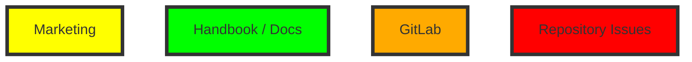
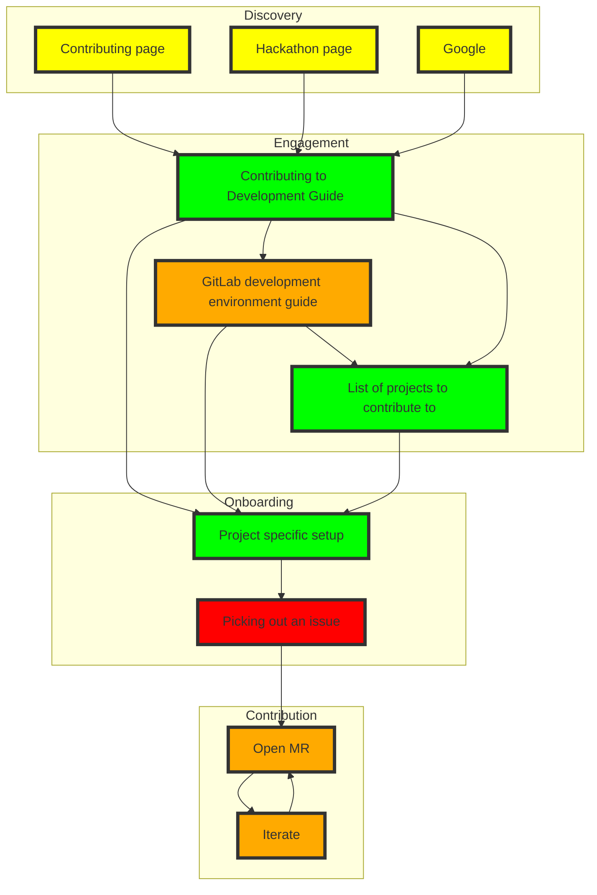

## On this page

{:.no_toc .hidden-md .hidden-lg}

- TOC
{:toc .toc-list-icons .hidden-md .hidden-lg}

{::options parse_block_html="true" /}

- - -

## Journey Map

### Legend

### Current

```mermaid
%%{init: {"flowchart": { "useMaxWidth": false } }}%%
flowchart TB
    start("New Contributor")
    
   
    subgraph id4["Contribute"]
        id4_heading("Ways to contribute")
        id4_box1("Contribute to Code")    
        id4_box2("Non Code contribution")    
        id4_heading --> id4_box1
        id4_heading --> id4_box2

        click id4_box1 "https://docs.gitlab.com/ee/development/contributing/"

    end
    
    subgraph id5["Contribution Process"]

        subgraph id5_box1["Tutorial: Make a GitLab contribution"]
        end
        subgraph id5_sg0["Join Community Forks (optional/advised)"]
        end
        subgraph id5_sg1["Developer Environment"]
        end
        subgraph id5_sg2["Issue workflow"]
        end
        subgraph id5_sg3["MR workflow"]
        end
        
        direction TB
        id5_box1 --> id5_sg0
        id5_sg0 --> id5_sg1
        id5_sg1 --> id5_sg2
        id5_sg2 --> id5_sg3
        %% id5_sg3 --> id5_sg4
        %% id5_sg4 --> id5_sg5
        %% id5_sg5 --> id5_sg6
        %% id5_sg6 --> id5_sg7
        %% id5_sg7 --> id5_sg8

        click id5_box1 "https://docs.gitlab.com/ee/development/contributing/first_contribution.html"
        click id5_sg1 "https://docs.gitlab.com/ee/development/contributing/#set-up-the-gitlab-development-kit"
        click id5_sg2 "https://docs.gitlab.com/ee/development/contributing/issue_workflow.html"
        click id5_sg3 "https://docs.gitlab.com/ee/development/contributing/merge_request_workflow.html"
        click id5_sg0 "https://gitlab.com/gitlab-community/community-members"
    end

  
   

    subgraph id7["."]
    direction RL
         id7_box0["Developer Env"]
         id7_sg1["Local dev"]
         id7_sg2["Remote Dev"]
         id7_box1["Gitpod"]
         id7_box2["Web IDE"]
         id7_box3["GDK"]

        
        id7_box0 --> id7_sg1
        id7_box0 --> id7_sg2
        id7_sg2 --> id7_box1
        id7_sg2 --> id7_box2
        id7_sg1 --> id7_box3

        click id7_box1 "https://docs.gitlab.com/ee/integration/gitpod.html"
        click id7_box2 "https://docs.gitlab.com/ee/user/project/web_ide/"
        click id7_box3 "https://gitlab.com/gitlab-org/gitlab-development-kit/-/blob/main/README.md"
    end


    subgraph id8["Issue workflow"]
        direction RL
        subgraph id8_sg1["Finding an Issue"]
        end
        subgraph id8_sg2["Claiming the Issue"]
        end
        subgraph id8_sg3["Opening a Merge Request"]
        end
        subgraph id8_sg4["Working on an Issue"]
        end
        subgraph id8_sg5["Completing the implementation Plan"]
        end
        
        click id8_sg4 "https://docs.gitlab.com/ee/development/contributing/issue_workflow.html#working-on-the-issue"

    end

    subgraph id9["MR Workflow"]
        direction TB
        subgraph id9_sg1["Follow MR Guidelines"]
        end
        subgraph id9_sg2["Changelog Entries/Conventional Commits"]
        end
        subgraph id9_sg3["Create draft MR"]
        end
        subgraph id9_sg4["Pipeline Runs"]
        end
        subgraph id9_sg5["Triage Process"]
        end
        subgraph id9_sg6["@gitlab-bot ready"]
        end
        subgraph id9_sg7["Code Review Process"]
        end  
        subgraph id9_sg8["Make changes"]
        end 
        subgraph id9_sg9["Finally getting it merged"]
        end

        click id9_sg2 "https://docs.gitlab.com/ee/development/changelog.html"
    
        id9_sg1 --> id9_sg2
        id9_sg2 --> id9_sg3
        id9_sg3 --> id9_sg4
        id9_sg4 --> id9_sg5
        id9_sg5 --> id9_sg6
        id9_sg6 --> id9_sg7
        id9_sg7 --> id9_sg8
        id9_sg8 --> id9_sg7
        id9_sg8 --> id9_sg9

    end
 subgraph id1["Ask Questions"]
        id1_box1("Discord")
        %% id1_box2("FAQs")
        id1_box3("GitLab Forum")

        click id1_box1 "https://discord.gg/rxWqW5e8"
        %% click id1_box2 "https://docs.gitlab.com/ee/development/fe_guide/frontend_faq.html"
        click id1_box3 "https://forum.gitlab.com/"
    end
    subgraph id2["Engagements"]
        id2_box1("Co-working Days")
        id2_box2("Office hours")
        id2_box3("Community Pairing")
        id2_box4("Hackathons")

        click id2_box2 "https://about.gitlab.com/handbook/marketing/developer-relations/contributor-success/#community-office-hours"
        click id2_box3 "https://about.gitlab.com/handbook/marketing/developer-relations/contributor-success/community-pairing-sessions.html"
        click id2_box4 "https://about.gitlab.com/company/culture/all-remote/informal-communication/#coffee-chats"
        click id2_box5 "https://about.gitlab.com/community/hackathon/"
        
    end
    subgraph id3["Learn about Gitlab"]
        id3_box1("Tutorials")
        id3_box2("Gitlab Handbook")

        click id3_box1 "https://docs.gitlab.com/ee/tutorials/"
        click id3_box2 "https://about.gitlab.com/handbook/"
    end

%% Root level mappings
    start --> id1
    start --> id2
    start --> id3
    start --> id4

    %% Contribution Process
    %% Mappings

    %% Mapping Subgraph contribute to code with Contribution Process
    id4_box1 --> id5_box1
    %% 3. Setting up local dev
            id5_sg1 --> id7
    %% 4. Issue Workflow
            id5_sg2 --> id8
    %% 5. MR WorkFlow
            id5_sg3 --> id9
    %% 6. Triage Process
```

### Goal

## Top Findings

1. The Contribution guide is overwhelming.
1. Triaging MRs is one of the major pain points. This leads to long review times and frustration.
1. Not all groups/products are properly labeling issues for new contributors.
1. Just a few groups/products are actively engaging contributors throughout their product development process.
1. The majority of 1st-time contributors for the past year never come back for a second one.
1. We don’t attract new long-term/core contributors.

## Detailed Findings

### Discovery

1. The Contributor guide is the main entry point for contributors.
1. There might be some misunderstanding between Contributing to GitLab and GitLab
Contribute (the annual conference).

### Engagement / Identification

1. The contributor guide is designed to help contribute to GitLab overall, without having in mind different groups/products and their development environment (e.g. [GitLab Runner](https://gitlab.com/gitlab-org/gitlab-runner))
1. It’s overwhelming
    1. There is a lot of information which is not relevant or digestible for contributors.
    1. It has a lot of text.
    1. It is driving contributors to a list of easy issues, to begin with, without additional information about the different projects/groups.
1. The user flow has a lot of exit/drop points.
1. There is an infinite loop between the contributor guide and the GitLab README file (that has the instructions for setting up the GitLab dev environment).

### Onboarding/Dev Environment

1. Users can't easily understand that there is more than one product at GitLab.
1. Different products are written in different programming languages; this means they have different development environments.
1. Products milestones are rarely published, so contributors aren't aware of priorities.
1. The product teams are not properly labeling issues or catering to them for community contributions.
1. There is no consistency across projects' documentation.

### Contribution

1. Long times triaging issues (applying the proper labels).
1. Not clear to who to assign the MRs for review.
1. Getting help is currently working just fine.
1. We have a stable average number of 11 days before a community MR is merged. It's not optimal, but it's acceptable and similar to the community's expectation (1 week).

### Retention

1. We attract a stable number of new contributors per milestone (~50), but our overall contributions are not increased accordingly.
    1. According to sample research, for the past year, the majority of 1st time contributors drop off after their MR is merged.

## Resources

1. [Community MR requests Dashboard](https://gitlab.biterg.io/app/kibana#/dashboard/b2218fd0-bc11-11e8-8aac-ef7fd4d8cbad?_g=(refreshInterval:(pause:!t,value:0),time:(from:now-10y,mode:relative,to:now))&_a=(description:'GitLab%20Merge%20Requests%20panel%20by%20Bitergia',filters:!(('$state':(store:appState),meta:(alias:Bots,disabled:!f,index:'4381a740-bc0c-11e8-8aac-ef7fd4d8cbad',key:author_bot,negate:!t,params:(query:!t,type:phrase),type:phrase,value:true),query:(match:(author_bot:(query:!t,type:phrase)))),('$state':(store:appState),meta:(alias:!n,disabled:!f,index:'4381a740-bc0c-11e8-8aac-ef7fd4d8cbad',key:author_org_name,negate:!t,params:(query:GitLab,type:phrase),type:phrase,value:GitLab),query:(match:(author_org_name:(query:GitLab,type:phrase))))),fullScreenMode:!f,options:(darkTheme:!f,hidePanelTitles:!f,useMargins:!t),panels:!((gridData:(h:8,i:'1',w:24,x:0,y:8),id:'03e16fb0-bc0e-11e8-8aac-ef7fd4d8cbad',panelIndex:'1',title:'Merge%20Requests,%20over%20time',type:visualization,version:'6.8.6'),(gridData:(h:16,i:'2',w:24,x:24,y:16),id:c7d1f570-bc0e-11e8-8aac-ef7fd4d8cbad,panelIndex:'2',title:'Merge%20Requests%20by%20Organization,%20over%20time',type:visualization,version:'6.8.6'),(embeddableConfig:(vis:(params:(config:(searchKeyword:''),sort:(columnIndex:!n,direction:!n)))),gridData:(h:16,i:'3',w:12,x:36,y:0),id:'841039a0-bc0e-11e8-8aac-ef7fd4d8cbad',panelIndex:'3',title:Projects,type:visualization,version:'6.8.6'),(embeddableConfig:(vis:(params:(config:(searchKeyword:''),sort:(columnIndex:!n,direction:!n)))),gridData:(h:24,i:'4',w:24,x:0,y:48),id:'671622d0-bc11-11e8-8aac-ef7fd4d8cbad',panelIndex:'4',title:Repositories,type:visualization,version:'6.8.6'),(gridData:(h:16,i:'5',w:12,x:24,y:0),id:'4748af70-bc0e-11e8-8aac-ef7fd4d8cbad',panelIndex:'5',title:'Submissions%20by%20Organization',type:visualization,version:'6.8.6'),(embeddableConfig:(vis:(params:(config:(searchKeyword:''),sort:(columnIndex:!n,direction:!n)))),gridData:(h:24,i:'6',w:24,x:0,y:24),id:'5760e7a0-bc0f-11e8-8aac-ef7fd4d8cbad',panelIndex:'6',title:Submitters,type:visualization,version:'6.8.6'),(gridData:(h:8,i:'7',w:24,x:0,y:16),id:'1a23fbd0-bc0e-11e8-8aac-ef7fd4d8cbad',panelIndex:'7',title:'Submitters,%20over%20time',type:visualization,version:'6.8.6'),(gridData:(h:8,i:'8',w:24,x:0,y:0),id:d00b6fc0-bc0c-11e8-8aac-ef7fd4d8cbad,panelIndex:'8',title:'Merge%20Requests',type:visualization,version:'6.8.6'),(embeddableConfig:(vis:(params:(config:(searchKeyword:''),sort:(columnIndex:!n,direction:!n)))),gridData:(h:16,i:'9',w:24,x:24,y:32),id:'1be49ac0-bc12-11e8-8aac-ef7fd4d8cbad',panelIndex:'9',title:Organizations,type:visualization,version:'6.8.6'),(embeddableConfig:(vis:(params:(config:(searchKeyword:''),sort:(columnIndex:!n,direction:!n)))),gridData:(h:24,i:'10',w:24,x:24,y:48),id:de6c3480-cb22-11e8-8aac-ef7fd4d8cbad,panelIndex:'10',title:Milestones,type:visualization,version:'6.8.6')),query:(language:lucene,query:''),timeRestore:!f,title:'GitLab%20Merge%20Requests',viewMode:view))
1. [Contributors dashboard](https://gitlab.biterg.io/app/kibana#/dashboard/b2218fd0-bc11-11e8-8aac-ef7fd4d8cbad?_g=(refreshInterval:(pause:!t,value:0),time:(from:now-10y,mode:relative,to:now))&_a=(description:'GitLab%20Merge%20Requests%20panel%20by%20Bitergia',filters:!(('$state':(store:appState),meta:(alias:Bots,disabled:!f,index:'4381a740-bc0c-11e8-8aac-ef7fd4d8cbad',key:author_bot,negate:!t,params:(query:!t,type:phrase),type:phrase,value:true),query:(match:(author_bot:(query:!t,type:phrase)))),('$state':(store:appState),meta:(alias:!n,disabled:!f,index:'4381a740-bc0c-11e8-8aac-ef7fd4d8cbad',key:author_org_name,negate:!t,params:(query:GitLab,type:phrase),type:phrase,value:GitLab),query:(match:(author_org_name:(query:GitLab,type:phrase))))),fullScreenMode:!f,options:(darkTheme:!f,hidePanelTitles:!f,useMargins:!t),panels:!((gridData:(h:8,i:'1',w:24,x:0,y:8),id:'03e16fb0-bc0e-11e8-8aac-ef7fd4d8cbad',panelIndex:'1',title:'Merge%20Requests,%20over%20time',type:visualization,version:'6.8.6'),(gridData:(h:16,i:'2',w:24,x:24,y:16),id:c7d1f570-bc0e-11e8-8aac-ef7fd4d8cbad,panelIndex:'2',title:'Merge%20Requests%20by%20Organization,%20over%20time',type:visualization,version:'6.8.6'),(embeddableConfig:(vis:(params:(config:(searchKeyword:''),sort:(columnIndex:!n,direction:!n)))),gridData:(h:16,i:'3',w:12,x:36,y:0),id:'841039a0-bc0e-11e8-8aac-ef7fd4d8cbad',panelIndex:'3',title:Projects,type:visualization,version:'6.8.6'),(embeddableConfig:(vis:(params:(config:(searchKeyword:''),sort:(columnIndex:!n,direction:!n)))),gridData:(h:24,i:'4',w:24,x:0,y:48),id:'671622d0-bc11-11e8-8aac-ef7fd4d8cbad',panelIndex:'4',title:Repositories,type:visualization,version:'6.8.6'),(gridData:(h:16,i:'5',w:12,x:24,y:0),id:'4748af70-bc0e-11e8-8aac-ef7fd4d8cbad',panelIndex:'5',title:'Submissions%20by%20Organization',type:visualization,version:'6.8.6'),(embeddableConfig:(vis:(params:(config:(searchKeyword:''),sort:(columnIndex:!n,direction:!n)))),gridData:(h:24,i:'6',w:24,x:0,y:24),id:'5760e7a0-bc0f-11e8-8aac-ef7fd4d8cbad',panelIndex:'6',title:Submitters,type:visualization,version:'6.8.6'),(gridData:(h:8,i:'7',w:24,x:0,y:16),id:'1a23fbd0-bc0e-11e8-8aac-ef7fd4d8cbad',panelIndex:'7',title:'Submitters,%20over%20time',type:visualization,version:'6.8.6'),(gridData:(h:8,i:'8',w:24,x:0,y:0),id:d00b6fc0-bc0c-11e8-8aac-ef7fd4d8cbad,panelIndex:'8',title:'Merge%20Requests',type:visualization,version:'6.8.6'),(embeddableConfig:(vis:(params:(config:(searchKeyword:''),sort:(columnIndex:!n,direction:!n)))),gridData:(h:16,i:'9',w:24,x:24,y:32),id:'1be49ac0-bc12-11e8-8aac-ef7fd4d8cbad',panelIndex:'9',title:Organizations,type:visualization,version:'6.8.6'),(embeddableConfig:(vis:(params:(config:(searchKeyword:''),sort:(columnIndex:!n,direction:!n)))),gridData:(h:24,i:'10',w:24,x:24,y:48),id:de6c3480-cb22-11e8-8aac-ef7fd4d8cbad,panelIndex:'10',title:Milestones,type:visualization,version:'6.8.6')),query:(language:lucene,query:''),timeRestore:!f,title:'GitLab%20Merge%20Requests',viewMode:view))
1. [Google Analytics](https://analytics.google.com/analytics/web/#/report/content-engagement-flow/a37019925w65271535p117457861/_u.date00=20200204&_u.date01=20210202&_r.threshold=50&_r.hlNode=0-0-235771201&_r.steps=8&_r.dimension=analytics.source/)
1. [GitCommunity Dashboard](https://gitlab.biterg.io/app/kibana#/dashboard/80a85e30-615e-11eb-a6f8-03728e7a4c82)
1. [Wider Community Contributions per milestone](https://gitlab.biterg.io/app/kibana#/dashboard/465b66f0-882a-11e9-b37c-9d3431060b53)
1. [GitLab Hackathon Dashboard](https://gitlab.biterg.io/app/kibana#/dashboard/9097a7d0-55bd-11eb-a6f8-03728e7a4c82)
1. [Closed Community MRs over time](https://gitlab.biterg.io/app/kibana#/visualize/edit/1701fec0-6b3b-11e9-8638-c11f0f1aa3fa)
1. [GitLab Community MRs Requests timing](https://gitlab.biterg.io/app/kibana#/dashboard/79c9aaa0-f9b0-11e8-9e44-9175bb6c0550?_g=(refreshInterval:(pause:!t,value:0),time:(from:now-10y,mode:relative,to:now))&_a=(description:'Community%20Merge%20Requests%20Timing%20by%20Bitergia',filters:!(('$state':(store:appState),meta:(alias:!n,disabled:!f,index:'4381a740-bc0c-11e8-8aac-ef7fd4d8cbad',key:state,negate:!f,params:(query:merged,type:phrase),type:phrase,value:merged),query:(match:(state:(query:merged,type:phrase)))),('$state':(store:appState),meta:(alias:!n,disabled:!f,index:'4381a740-bc0c-11e8-8aac-ef7fd4d8cbad',key:labels,negate:!f,params:!('Community%20contribution','Community%20Contribution'),type:phrases,value:'Community%20contribution,%20Community%20Contribution'),query:(bool:(minimum_should_match:1,should:!((match_phrase:(labels:'Community%20contribution')),(match_phrase:(labels:'Community%20Contribution'))))))),fullScreenMode:!f,options:(darkTheme:!f,hidePanelTitles:!f,useMargins:!t),panels:!((gridData:(h:8,i:'1',w:24,x:0,y:0),id:'6f332cc0-bc15-11e8-8aac-ef7fd4d8cbad',panelIndex:'1',title:Summary,type:visualization,version:'6.8.6'),(embeddableConfig:(vis:(legendOpen:!f)),gridData:(h:8,i:'2',w:12,x:12,y:8),id:e1320250-bc1b-11e8-8aac-ef7fd4d8cbad,panelIndex:'2',title:'80%20Percent%20Open%20TIme%20(Days),%20over%20time',type:visualization,version:'6.8.6'),(embeddableConfig:(vis:(legendOpen:!f)),gridData:(h:8,i:'3',w:12,x:0,y:8),id:'9f2ef530-bc15-11e8-8aac-ef7fd4d8cbad',panelIndex:'3',title:'Median%20Open%20Time%20(Days),%20over%20time',type:visualization,version:'6.8.6'),(gridData:(h:12,i:'4',w:12,x:24,y:0),id:b69849e0-bc1c-11e8-8aac-ef7fd4d8cbad,panelIndex:'4',title:Status,type:visualization,version:'6.8.6'),(gridData:(h:12,i:'5',w:12,x:36,y:0),id:'4748af70-bc0e-11e8-8aac-ef7fd4d8cbad',panelIndex:'5',title:'Merge%20Requests%20by%20Organization',type:visualization,version:'6.8.6'),(gridData:(h:8,i:'6',w:12,x:0,y:16),id:'03e16fb0-bc0e-11e8-8aac-ef7fd4d8cbad',panelIndex:'6',title:'GitLab%20Merge%20Requests,%20over%20time',type:visualization,version:'6.8.6'),(embeddableConfig:(vis:(legendOpen:!f)),gridData:(h:8,i:'7',w:12,x:12,y:16),id:'1a23fbd0-bc0e-11e8-8aac-ef7fd4d8cbad',panelIndex:'7',title:'Submitters,%20over%20time',type:visualization,version:'6.8.6'),(embeddableConfig:(vis:(params:(config:(searchKeyword:''),sort:(columnIndex:!n,direction:!n)))),gridData:(h:12,i:'8',w:24,x:24,y:12),id:dd0cd7c0-bc1d-11e8-8aac-ef7fd4d8cbad,panelIndex:'8',title:Organizations,type:visualization,version:'6.8.6'),(embeddableConfig:(vis:(params:(config:(searchKeyword:''),sort:(columnIndex:!n,direction:!n)))),gridData:(h:24,i:'9',w:24,x:0,y:24),id:'5760e7a0-bc0f-11e8-8aac-ef7fd4d8cbad',panelIndex:'9',title:Submitters,type:visualization,version:'6.8.6'),(embeddableConfig:(vis:(params:(config:(searchKeyword:''),sort:(columnIndex:!n,direction:!n)))),gridData:(h:16,i:'11',w:24,x:0,y:48),id:'671622d0-bc11-11e8-8aac-ef7fd4d8cbad',panelIndex:'11',title:Repositories,type:visualization,version:'6.8.6'),(embeddableConfig:(vis:(params:(config:(searchKeyword:''),sort:(columnIndex:!n,direction:!n)))),gridData:(h:24,i:'12',w:48,x:0,y:88),id:dc184920-bc1e-11e8-8aac-ef7fd4d8cbad,panelIndex:'12',title:'Latest%20Merge%20Request',type:visualization,version:'6.8.6'),(embeddableConfig:(vis:(params:(config:(searchKeyword:''),sort:(columnIndex:!n,direction:!n)))),gridData:(h:24,i:'13',w:48,x:0,y:64),id:'47ebe490-bc1f-11e8-8aac-ef7fd4d8cbad',panelIndex:'13',title:'Oldest%20Merge%20Requests',type:visualization,version:'6.8.6'),(embeddableConfig:(vis:(params:(config:(searchKeyword:''),sort:(columnIndex:!n,direction:!n)))),gridData:(h:24,i:'14',w:24,x:24,y:24),id:f68ba5a0-cbe0-11e8-8aac-ef7fd4d8cbad,panelIndex:'14',title:Milestones,type:visualization,version:'6.8.6')),query:(language:lucene,query:''),timeRestore:!t,title:'GitLab%20Community%20Merge%20Requests%20Timing',viewMode:view))
