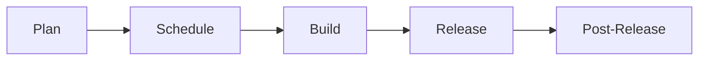

## On this page

{:.no_toc .hidden-md .hidden-lg}

- TOC
  {:toc .hidden-md .hidden-lg}

## Planning

### Kanban

We work in a continuous Kanban manner while still aligning with Milestones.

Epics and issues have the following lifecycle:

We use the following boards are used to monitor this process

### Planning Board

- [Release : Plan](https://gitlab.com/groups/gitlab-org/-/boards/1489550?scope=all&utf8=%E2%9C%93&state=opened&label_name[]=cicd%3A%3Aplanning&label_name[]=group%3A%3Arelease)

### Scheduling Board

- [Release : Schedule](https://gitlab.com/groups/gitlab-org/-/boards/1488068?&label_name[]=group%3A%3Arelease&label_name[]=workflow%3A%3Ascheduling)

### Build Board

- [Release : Build](https://gitlab.com/groups/gitlab-org/-/boards/1489558?&label_name[]=cicd%3A%3Aactive&label_name[]=group%3A%3Arelease)

#### Plan

We use the [Planning Boards](#planning-board) to triage issues that are not yet planned for a milestone. Issues in this board are labeled _cicd::planning_ and the group label _group::release_.

The Product Manager (PM) owns this board and uses it to advance issues through to becoming feasible Epics. When work leaves this board, it is in a fit state for the engineering team to implement the issue.

In this stage, the PM establishes new work that they would like to see in the Release feature. The _devops::release_ process follows the [Product Development Flow](/handbook/product-development-flow/#validation-track), as follows:

##### Problem validation

The PM tries to establish that the issue describes a problem with the Release feature that is customer-relevant (internal and external),
or has some other clear merit (e.g. a technical improvement in the backend). The PM will draw on other group members, customers and the UX organization where necessary.
If the problem is validated, the issue is moved forward to the next stage, otherwise it is closed with a short explanation on _why_ the problem will not be considered. This explanation should also contain a link [to the category strategy](/handbook/product/product-processes/#category-direction).

##### Solution validation

Once the problem is validated, the PM will consider creating an Epic if [the scope of the solution is large enough](/handbook/product/product-processes/#epics-for-a-single-iteration).
They will then reach out to the Engineering Manager (EM) for a technical contact in the team. The EM assigns [ownership](#epic-ownership) to an engineer. The engineer will work with the PM to determine a technical solution for the problem.

If designs are required, the PM will add the `workflow::design` label and collaborate with UX to create the user stories required to solve the customer problem. Story mapping is a recommended way to visualize the user stories of a new feature in a holistic way. The story map can even be annotated to indicate which user stories need to be included in each release increment. More information on this process is noted in the [Product Development Workflow](/handbook/product-development-flow/#validation-phase-4-solution-validation). In some situations, the PM and UX may decide the issue is ready for `cicd::active` and will move the issue to `workflow::scheduling` for EM review.

Occasionally, a proof-of-concept (POC) is necessary to determine a feasible technical path. When one is required, the PM
will create a POC issue that contains the context of the research to be conducted along with the goals of the POC. This
issue will be scheduled for work before any further breakdown of tasks is performed.

POC issues are also time-boxed with a due date applied to these items and should be labeled ~"POC". On the due date, the engineer is expected to provide a comment on the issue regarding the outcome of the POC. Time-boxing these issues is meant to constrain the scope of the work.

It is also important to note that not all POCs will be successful, and that is OK! Some avenues of research may not be successful, and the POC will have saved us from investing significant time in a solution that will not meet our needs. The goal is early feedback and fast iteration.

##### Planning Breakdown

The PM and the engineer will work together to create all of the issues required to build the solution. This includes

- documentation issues
- testing that is broader than the scope of individual issues
- post-release items such as rake tasks, migrations or monitoring issues

Post-release tasks that need to be performed by SRE's are created in the Infrastructure team project and cannot be
added to Epics as related issues. For these, it's useful to list them in the Epic description.

When they are satisfied that they have a reasonable solution with all issues weighted, they will send the Epic link out
for discussion and feedback. Planning is transparent anyway, but this serves to notify the team that the Epic is ready
for development.

During planning breakdown, the correct labels should be applied. These can include but are not limited to feature, backstage, frontend, backend, and performance. Issues are also given the "cicd::scheduling" label once `workflow::planning breakdown` has completed.

This signifies that from both a product and engineering point of view, this issue is prepared and ready to be built as soon as there is space in the schedule.

#### Schedule

We use the [Scheduling boards](#scheduling-board) for this phase.

Once per week, the PM and EM will meet to discuss the work that is currently active, and queue prepared items for development.

In this meeting, prepared items will be given the label "cicd::active", which will pull items into the Build board.

This meeting is recorded and open for anyone to join. Attendance for the Release Team is optional as it is recorded. We will
also try to move the time of the meeting around to suit epic owners when their epics are due to be scheduled.

The agenda for the meeting is:

1. What is active now?
1. What needs to be active next?
1. Are there any deliverables?
1. Is the active list in priority order?
1. Bugs list
1. Technical debt items arising

In Release we use three labels to indicate product priorities: 

- `Release::P1`, which is the current milestone's top focus and will often have a `~Deliverable` label as well. 
- `Release::P2`, is the next milestone's top focus and will be assigned a `~Release::P1` in the following milestone.
- `Release::P3`, are future priorities that can be escalated into a sooner milestone. 

#### Build

We use the [Build boards](#build-board) to look at _cicd::active_ issues in the current milestone labeled with _group::release_.

Because of the way that the boards in GitLab work, we needed to limit this to the started milestone, but are looking at how to have this roll in a more continuous manner.

The Engineering Manager (EM) owns this board and uses it to facilitate building out the Epics and issues that the team have decided are ready for development.

Issues are added in the "ready for development" column in priority order. When an engineer is open, they can pick unassigned issues from the top of this list.

When picking up an issue, please:

1. Assign yourself
2. Adjust to the appropriate Milestone (_Will the issue be closed in the current or next Milestone_)
3. Add a weight if necessary

As their work progresses, they advance the issue through the "in dev" and "in review" columns. Engineers need to keep the issues aligned with the status of the corresponding merge requests.

When an issue is "in review", the MR should be assigned to both the original engineer and the reviewer so that it is clear that the merge request has an active reviewer. This helps the EM to see how much work is allocated to each person.

The column for "verification" is where the owner of the Epic, or the PM will ensure that the issue fits into the context of the solution. This is also where we confirm if a release note is required for this issue, and assign the correct milestone.

#### Release and Post-Release

For some issues, there are tasks that need to be performed by SRE's after the release is completed. Because these tasks are often in the infrastructure project, they cannot be added to Epics. We still need to track these and follow them through to completion.

Finally, we ensure that any communication that needs to go out for this issue is delivered. These can take the form of blog posts, video tutorials, or demos.

### Epic Ownership

The Release team uses epics to describe features or capabilities that will increase the maturity of the Release categories over time.

Each Epic should be owned by an engineer who is responsible for all technical aspects of that Epic. If at any point, the owner needs to take leave that is more than a few days, they should assign another engineer to act as owner until they return.

**In the planning phase**, the engineering owner will work closely with the Product Manager to understand what the requirements are and why they are important to customers. The engineer will decide on how best to deliver the solution and create issues that encapsulate the technical work required. They may need to consult with other team members and stable counterparts to come up with the right approach to delivering the requirements.

They should include issues for documentation changes and additional testing requirements that are required. There should be an issue created to inform Release experts in the Support group about the change if needed. The engineer should also consider if there is any technical debt that is appropriate to address at the same time. Issues are also needed for any rollout or post-release tasks.

Each issue needs to be weighted and contain enough information for any other engineer on the team to be able to pick up that work.

When they are satisfied that all of the issues are created, and ready for development, they (with the PM) should present this information to the team for feedback. Preparation is still transparent and open to feedback at any point, this step is just a way to tell the team that the Epic is ready to be built and confirm that everyone is aware of what needs to be done.

**For the duration of building the epic**, the engineer does not need to be the only person implementing the issues. They should keep watch of the work that is done on the issues so that they can verify that the work is progressing correctly. Ideally, they should also be an approver on each MR for the Epic. If there are problems with the work, or lengthy delays,
they need to make sure the Product Manager and Engineering Manager are aware.

**When work is nearing completion**, the engineer should check the release note and work with the PM on any changes.
They should also make sure that any additional issues that may have come up during the build process are either
addressed, or scheduled for work. This will help to make sure that we do not build up technical debt while building.

**Finally**, they should also monitor any work that needs to occur while rolling out the Epic in production. If there are
rake tasks, database migrations, or other tasks that need to be run, they need to see those through to being
run on the production systems with the help of the Site Reliability counterpart. They may also need to assist the
Product Manager with creating the release note for the Epic.

This places a lot of responsibility with the owner, but the PM and EM are always there to support them. This ownership
removes bottlenecks and situations where only the PM or EM is able to advance an idea. In addition, the best people
to decide on how to implement an issue are often the people who will actually perform the work.

The responsibility of the Product Manager is to make sure that there is enough information for the engineer to develop the
correct solution that meets the requirements. They are also available to answer clarifying questions or consider how to
approach edge cases. At the end of an epic they also communicate this out to customers and other interested parties.

The Engineering Manager is responsible for clearing the path. They need to make sure the engineers performing the work
have the access to the right information, people, tools, and other resources to get the work done. They try to foresee
problems and clear any blockers that may arise while the work is in progress.

### Issue Breakdown

Sometimes an issue can be large and require multiple merge requests to resolve. In this case, it can help to create smaller, more narrowly defined issues that can be resolved with a single merge request.
Resolving these smaller implementation issues contributes to the completion of the larger parent issue. This has several benefits:

1. It keeps the conversations around each specific merge request within its own issue.
1. It makes it easier to see the progress of each merge request that contributes to the larger issue.
1. It promotes iteration and smaller merge requests.

For example, if an issue requires one frontend, one backend, and one database change, it can help to create three "sub-issues" that link back to the main issue.

To ensure the sequence for completion of the implementation issues is easy to track, we should utilize [`Blocks` and `Is blocked by` options](https://about.gitlab.com/handbook/marketing/project-management-guidelines/issues/#related-issues-and-blocking-issues) on each issue page.

### Addressing new issues quickly

When new issues arise (through testing, customer support issues, or other means) we still want to be able to address them
quickly without being delayed by process.
If you think a new issue needs to be worked on immediately:

1. Make sure there is enough detail on the ticket for someone else to understand the issue and for someone else to have
   enough context to review your work
1. Make sure there is a weight
1. Assign it into the current milestone
1. Add the `workflow::in dev` label and the `unplanned` label
1. Assign it to yourself

### Weights

As a byproduct of the engineering evaluation process, a rough estimate of the number of merge requests required to develop a
feature will be produced. This measure can be used as a way to determine issue weights. These weights can be useful during the
planning process to get a rough gauge of how many features can be worked on in a milestone, and to understand how much work the
team can do in a milestone. This metric also aligns with the throughput metric currently measured by engineering teams.

While entering the approximate weight, take a moment to confirm issues have the correctly added labels:

- `group::release`
- `category`
- `feature` or `bug`
- `frontend`
- `backend`
- `UX`
- `performance`
- `devops::release`

After weight has been entered, remove `needs weight` label.

If you are having a difficult time estimating the number of merge requests, please consider a [Proof of Concept MR](/handbook/engineering/development/ops/release/#tips-when-youre-having-hard-time-to-estimate-mr-count-consider-poc-step).

## FAQ

### What work should I pick up next?

"Pull from the right". That means, start at the right hand side of the build board, and move towards the left.

In order, that means:

- Can you help anyone with reviews?
- Can you unblock anyone in development?
- Pick from the top of the "ready for development" column on the [Build boards](#build-board).
