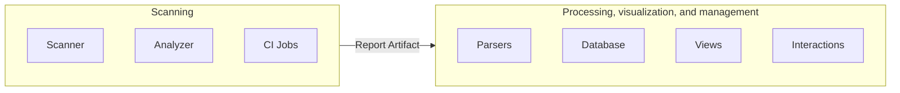

## On this page
{:.no_toc .hidden-md .hidden-lg}

- TOC
{:toc .hidden-md .hidden-lg}

The architecture supporting the Secure features is split into two main parts.

## 1. Scanning

The scanning part is responsible for finding vulnerabilities in given resources and exporting results.
The scans are executed in CI jobs via several small projects called [Analyzers](/handbook/engineering/development/secure/glossary-of-terms/#analyzer) which can be be found in our [Analyzers sub-group](https://gitlab.com/gitlab-org/security-products/analyzers).
The Analyzers are small wrappers around in-house or external security tools called [Scanners](/handbook/engineering/development/secure/glossary-of-terms/#scanner) to integrate them into GitLab.
The Analyzers are mainly written in Go and rely on our [Common Go library](https://gitlab.com/gitlab-org/security-products/analyzers/common).

Some 3rd party integrators also make additional Scanners available by following our [integration documentation](https://docs.gitlab.com/ee/development/integrations/secure), which leverages the same architecture.

The results of the scans are exported as JSON reports that must follow [Secure Report Format](https://about.gitlab.com/handbook/engineering/development/secure/glossary-of-terms/#secure-report-format) and are uploaded as [CI Job Report Artifacts](https://docs.gitlab.com/ee/ci/pipelines/job_artifacts.html#artifactsreports) to make them available for processing after the pipelines completes.

This part is mainly covered by the following groups:

- [Composition Analysis](/handbook/product/product-categories/#composition-analysis-group)
- [Dynamic Analysis](/handbook/product/product-categories/#dynamic-analysis-group)
- [Fuzz Testing](/handbook/product/product-categories/#fuzz-testing-group)
- [Static Analysis](/handbook/product/product-categories/#static-analysis-group)
- [Vulnerability Research](/handbook/product/product-categories/#vulnerability-research-group)

## 2. Processing, visualization, and management

Once the data is available as Report Artifact, it can be processed by the [GitLab rails application](https://gitlab.com/gitlab-org/gitlab) to enable our security features:

- [Security Dashboards](https://docs.gitlab.com/ee/user/application_security/security_dashboard/), Merge Request widget, Pipeline view, etc.
- [Interactions with vulnerabilities](https://docs.gitlab.com/ee/user/application_security/#interacting-with-the-vulnerabilities)
- [Approval rules](https://docs.gitlab.com/ee/user/application_security/#security-approvals-in-merge-requests)
- etc.

Depending on the context, the security reports can be stored in the database or stay as Report Artifacts for on-demand access.

This part is mainly covered by the [Threat Insights group](/handbook/product/product-categories/#threat-insights-group).
Though, the boundaries can sometimes be a bit blurry so [we're trying to delineate this as clearly as possible](https://about.gitlab.com/handbook/engineering/development/threat-management/delineate-secure-threat-management.html#technical-boundaries).
