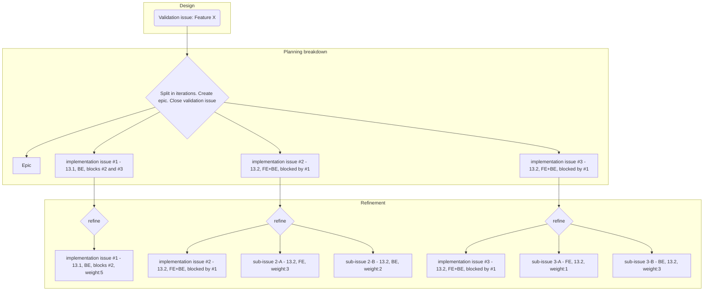

## On this page
{:.no_toc .hidden-md .hidden-lg}

- TOC
{:toc .hidden-md .hidden-lg}

## Overview

Secure uses a workflow based on the [Product Development Flow](/handbook/product-development-flow/) with some additions that are under experiment or specific to this sub-department.

Specific deadlines of this workflow are defined in the [Product Development Timeline](/handbook/engineering/workflow/#product-development-timeline) and should be followed unless specified explicitely.

To maximize our velocity and meet our deliverables, we also follow an [engineering refinement process for all issues](./refinement/), before actually scheduling them into a given milestone.

The Product Development Flow implies the existence of queues identified with `workflow::` labels and depending on your role in the group, you may be involved in different queues.

| Queue                 |  PM |  UX |  EM | Engineer |
|-----------------------|:---:|:---:|:---:|:--------:|
| validation backlog    |  X  |     |     |          |
| problem validation    |  X  |  X  |     |          |
| design                |  X  |  X  |  X  |     X    |
| solution validation   |  X  |  X  |     |          |
| planning breakdown    |  X  |  X  |  X  |     X    |
| refinement            |     |     |     |     X    |
| scheduling            |  X  |     |  X  |          |
| ready for development |  X  |     |  X  |     X    |
| In dev                |     |     |     |     X    |
| In review             |     |     |     |     X    |
| verification          |     |     |     |     X    |

## Details

The [Product Development Flow](/handbook/product-development-flow/) guideline explains each step in detail, but here are some clarifications/additions for Secure.

### `workflow::design`

- When requested by PM and UX, the engineering team will be involved in the design step. As this can represent a significant amount of work, it is important to apply the `~backend` and/or `~frontend` labels to the issue as early as possible.
- EMs then assign Engineers and roughly weight the issue (or timebox it) so that this effort is taken into account when doing capacity check.
- Engineers assigned to `workflow::design` issues collaborate with PM, UX and EM to provide a practical solution to the problem.

### `workflow::solution validation`

- The engineering team is NOT involved in solution validation since we assume the design step already delivered a viable solution from an engineering perspective.

### `workflow::planning breakdown`

- PM, UX, and EM break down the solution into smaller implementation issues. These issues represent deliverable chunks of the solution from a user perspective.
- This often means that an epic is created and an MVC is defined with follow-up issues, in further iterations, to deliver the complete solution.
- EM can delegate this to engineers when necessary.
- Implementation issues created during this process must have the `workflow::refinement` label.
- Issues created during this process must not be `sub-issue`. See [breakdown vs refinement](#planning-breakdown-vs-refinement).
- For simple features, there is no need for an epic nor to close the validation issue. The same issue is just kept and moved to `workflow::refinement` step.

### `workflow::refinement`

- Engineers [refine](./refinement/) the implementation issues from a technical perspective to validate requirements are clear and to provide estimate of the workload to help organizing scheduling.
- Issues in `workflow::refinement` must have `secure:refinement-backend` and/or `secure:refinement-frontend` to distinguish which teams need to refine it.
- Refinement can lead to the creation of `sub-issue`. See [breakdown vs refinement](#planning-breakdown-vs-refinement).

### `workflow::scheduling`

- PM priotizes issues in this queue to be picked up in upcoming milestones by EM.
- Issues remaining in this queue after EM has assigned up to their team's capacity, for a given milestone, must be moved to the next one(s).

### `workflow::ready for development`

- EM applies this label to issues that the engineering team commit to work on for a given milestone. This is based on capacity and other constraints.

### `workflow::In dev`

- Engineers apply this label when starting to work on an issue. If the issue involves multiple Merge Requests, it stays in this queue until they are all created and in review.

### `workflow::In review`

- Merge Requests are being reviewed by reviewers and maintainers.
- If the issue involves multiple Merge Requests, it stays in this queue until they are all merged.

#### What if reviewers are slow to respond?

We are located all around the world and lean on asynchronous communication to provide feedback, especially in Merge Requests. However, this can cause reviews to be delayed or take longer than one might expect. This can become especially true as we get closer to GitLab's monthly feature freeze and release gates.

We should expect high-quality reviews, and it takes time to provide meaningful feedback. While it may be painful or frustrating to wait, this is often the best and most efficient strategy. However, it may be helpful to do the following if a reviewer takes more than 1-2 business days to respond.

- Ping the reviewer in the Merge Request and on Slack (if the reviewer is a GitLab team member).
- Consider reassigning the Merge Request to a different person if the original reviewer continues to be unresponsive.

### `workflow::verification`

- Changes have been merged and engineers are waiting for them to be deployed on the different environments (staging, canary, and production). Once deployed, engineers enable the feature flag (if any) and validate that it's working as expected.

## Working with queues

We leverage issue boards and relevant filters to allow each team member to clearly see what they should focus on depending on their role.

### Engineer

Here is a (slightly outdated) video about how to work with issue boards as an Engineer: [https://www.youtube.com/watch?v=7CdVG9mAE30](https://www.youtube.com/watch?v=7CdVG9mAE30)

### Engineering Manager

Here is a (slightly outdated) video about how to work with issue boards as an Engineering Manager: [https://www.youtube.com/watch?v=YjPmsXkbxI0](https://www.youtube.com/watch?v=YjPmsXkbxI0)

### Regular syncs

We value asynchronous communication but it is also highly recommended to have a weekly sync meeting between PM, UX, and EM to review these queues: `design`, `solution validation`. `planning breakdown`, and `scheduling`. This ensures we keep moving issues forward and constantly have items to work on in each step of the process.

## Planning Breakdown vs Refinement

While these two steps both imply to break things down, and sometimes are tightly coupled, they aim at different purposes.

The goal of Planning breakdown is to create implementation issues that represent deliverable chunks of the solution from a user perspective. There can be some exceptions like having a technical pre-requisite, but the main purpose is to split big features into smaller independent bits. If an implementation issue needs both Frontend and Backend work to be delivered, it still needs to stay as a unique issue so that anyone can track the feature itself, instead of looking to several issues to know when the work planned for that iteration is completed.

Then, as part of the refinement process, engineers can break down an implementation issue into technical sub-issues by following the [sub-issues convention](#sub-issues-convention). For the above use case, this could mean one sub-issue for Frontend and one sub-issue for Backend but this could also end up into several sub-issues.

To summarize:

- Planning Breakdown must lead ot the creation of main issues only.
- Refinement can lead to the creation of sub-issues.

Here is an example of these two steps applied to a feature:

## Sub-issues convention

See [sub-issues convention](https://gitlab.com/gitlab-com/www-gitlab-com/issues/4588).

## Additional workflow information

- [Issues board](https://gitlab.com/groups/gitlab-org/-/boards/364216?scope=all&utf8=%E2%9C%93&state=opened&label_name[]=devops%3A%3Asecure): Add a `milestone` filter with the [current milestone +1](/releases/) (the current milestone is already released).
- [Merge Requests workflow](https://gitlab.com/gitlab-org/gitlab/blob/master/doc/development/contributing/merge_request_workflow.md)
- [Code Review process](https://docs.gitlab.com/ee/development/code_review.html)

## Issue Refinement

See our [Issue Refinement](./refinement/) page.

## Editing this page

### Update frequency

To avoid change fatigue, Secure team members stick to the same workflow for a quarter (aligned with Fiscal Year Quarters).
Updates such as grammatical fixes, typos, and clarifications are welcome at any time but substantive changes must be
submitted to [the draft of the next version](./drafts/) and will only be rolled out when the next quarter starts.

### Reviews and approvals

To make updates such as grammatical fixes and typos, you can create an MR and have it reviewed and merged by anyone with merge rights.

For updates that affect the overall phases by modifying core definitions, workflow labels or other cross-functionally utilized processes,
you can create an MR to the [the draft of the next version](./drafts/) and assign it to the relevant impacted counterparts (Engineering, roduct, UX, QA, etc.).

### Experiments

All team members are encouraged to expirement improvements to the existing workflow.
Trying things out is often the best way to see the benefit or downside of a suggested change.
To make sure this is clearly understood by all counterparts who may be affected by this temporary change,
it is very welcome that the experiment is listed here and clearly communicated first.

#### Ongoing experiments

<!---
- Title - DRI - link to an issue describing the change and collecting feedback.
-->
