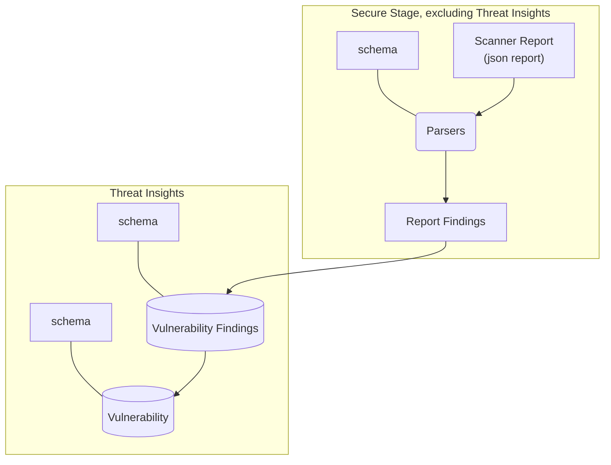

## On this page
{:.no_toc .hidden-md .hidden-lg}

- TOC
{:toc .hidden-md .hidden-lg}

## Why does this page exist?

In the spirit of establishing a [DRI](/handbook/people-group/directly-responsible-individuals/) for each set of functionality where this may not be obvious, the purpose of this page is to explicitly define which engineering group has reponsibility for which portions of the product and for specific decisions.

## Page/Function responsibilities

###	Security Dashboards

Displays summary of vulnerabilities and allows management of the list of vulnerabilities - [instance](https://docs.gitlab.com/ee/user/application_security/security_dashboard/#instance-security-dashboard), [group](https://docs.gitlab.com/ee/user/application_security/security_dashboard/#group-security-dashboard), [project](https://docs.gitlab.com/ee/user/application_security/security_dashboard/#project-security-dashboard).

* [Example](https://gitlab.com/gitlab-org/threat-management/webgoat/-/security/dashboard/?project_id=17172530&scope=dismissed&page=1&days=90)
* Product Manager: Matt Wilson
* Primary Development Group: [Secure:Threat Insights](/handbook/product/categories/#threat-insights-group)
* Engineering sub-department: Threat Management

###	Vulnerability list

Displays and allows management of a list of vulnerabilities.

* [Example](https://gitlab.com/gitlab-org/threat-management/webgoat/-/security/vulnerabilities)
* Product Manager: Matt Wilson
* Primary Development Group: [Secure:Threat Insights](/handbook/product/categories/#threat-insights-group)
* Engineering sub-department: Threat Management

###	Vulnerability detail

Allows user to view detail of vulnerability and manage it.

* [Example](https://gitlab.com/gitlab-org/threat-management/webgoat/-/security/vulnerabilities/870888)
* Product Manager: Matt Wilson
* Primary Development Group: [Secure:Threat Insights](/handbook/product/categories/#threat-insights-group)
* Engineering sub-department: Threat Management

###	Threat Monitoring

Displays statistics and other related information on container security enabled features such as web application firewall (WAF) and container network security (CNS).

* [Example](https://gitlab.com/gitlab-org/threat-management/waf-enablement-demo/-/threat_monitoring)
* Product Manager: Sam White
* Primary Development Group: [Protect:Container Security](/handbook/product/categories/#container-security-group)
* Engineering sub-department: Threat Management

###	Pipeline Security Tab

Secure: Composition Analysis, Displays vulnerability findings for a specific pipeline.

* [Example](https://gitlab.com/gitlab-org/threat-management/webgoat/pipelines/121635847/security)
* Product Manager: Matt Wilson
* Primary Development Group: [Secure:Threat Insights](/handbook/product/categories/#threat-insights-group)
* Engineering sub-department: Threat Management

###	Dependency List

Allows users to see their dependencies detected.

* [Example](https://gitlab.com/gitlab-org/threat-management/webgoat/-/dependencies)
* Product Manager: Nicole Schwartz
* Primary Development Group: [Secure:Composition Analysis](/handbook/product/categories/#composition-analysis-group)
* Engineering sub-department: Secure

###	License Compliance

Allows users to see their licenses detected and policies set

* [Example](https://gitlab.com/gitlab-org/threat-management/webgoat/-/licenses)
* Product Manager: Nicole Schwartz
* Primary Development Group: [Secure:Composition Analysis](/handbook/product/categories/#composition-analysis-group)
* Engineering sub-department: Secure

###	Security Configuration

View and configure scanners for a project.

**Note**: The main configuration screen falls under Vulnerability Management but the detailed configuration screen for any given scanner is owned by that scanner's PM and Secure team.

* [Example](https://gitlab.com/gitlab-org/threat-management/webgoat/-/security/configuration)
* Product Manager: Secure PMs by their categories
* Primary Development Group: [Secure by their categories](/handbook/product/categories/#secure-stage)
* Engineering sub-department: Secure

###	Merge Request Security Widget

Display comparison of source branch results with target branch results. Also includes [Security approvals in merge requests](https://docs.gitlab.com/ee/user/application_security/#security-approvals-in-merge-requests).

* [Example](https://docs.gitlab.com/ee/user/project/merge_requests/#security-reports)
* Product Manager: Matt Wilson
* Primary Development Group: [Secure:Threat Insights](/handbook/product/categories/#threat-insights-group)
* Engineering sub-department: Threat Management

###	Security Scanner Integration Documentation

Secure: Composition Analysis, Technical details about how to build a scanner that is compatible with GitLab.

* [Example](https://docs.gitlab.com/ee/development/integrations/secure.html)
* Product Manager: Matt Wilson
* Primary Development Group: [Secure by their categories](/handbook/product/categories/#secure-stage)
* Engineering sub-department: Secure

###	Secure Partner Onboarding Docs

Overview of how to partner with GitLab to build a scanner

* [Example](https://docs.gitlab.com/ee/development/integrations/secure_partner_integration.html#secure-partner-integration---onboarding-process)
* Product Manager: Sam Kerr
* Primary Development Group: [Secure by their categories](/handbook/product/categories/#secure-stage)
* Engineering sub-department: Secure

###	Interacting with the vulnerabilities

View, Dismiss, or Confirm (and create related Issue) vulnerability findings the configured scanners detect. This applies to all locations where we display a finding (dashboards, pipeline view, MR view. Also includes the generic auto-remediation flow (though the remediation data itself is provided by the analyzers so fall under the corresponding group for implementation)

* [Example](https://docs.gitlab.com/ee/user/application_security/index.html#interacting-with-the-vulnerabilities)
* Product Manager: Matt Wilson
* Primary Development Group: [Secure:Threat Insights](/handbook/product/categories/#threat-insights-group)
* Engineering sub-department: Threat Management

## Technical Boundaries

Ownership of the end-to-end technical solution spans multiple groups. This section clarifies
cross-group maintainership of code artifacts between [Threat
Insights](/handbook/product/categories/#threat-insights-group) and the remaining groups in
the [Secure Stage](/handbook/product/categories/#secure-stage).

The diagram below is an over-simplified representation of the architecture but helps understand the
delineation.

### Approval process

Issues are used to make the DRI and their backup aware of the change. In case a DRI is unavailable,
their line manager is the backup.

Merge Requests use [Code Owners](https://gitlab.com/gitlab-org/gitlab/-/blob/master/.gitlab/CODEOWNERS) to [enforce approval](https://docs.gitlab.com/ee/user/project/code_owners.html#approvals-by-code-owners) of changes.

#### Vulnerability Management Database Schema

* Product DRI: Matt Wilson.
* Engineering DRI: Thiago Figueiro.

#### [Security Report Schema](https://gitlab.com/gitlab-org/security-products/security-report-schemas)

The reports JSON schemas are maintained by the relevant Secure groups (Backend team) matching the corresponding categories.
For instance, the Static Analysis group is responsible for the SAST category, so its backend team is responsible for the `sast` report JSON schema.
Additionally, any modification of the shared definitions and structure must be approved by each group's backend team.

