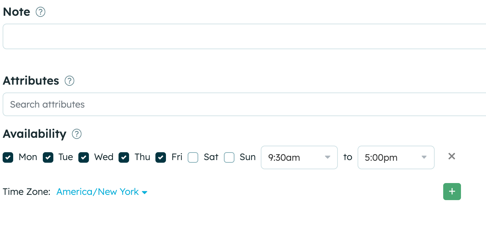

{::options parse_block_html="true" /}

## On this page
{:.no_toc .hidden-md .hidden-lg}

- TOC
{:toc .hidden-md .hidden-lg}

As an interviewer, you play a significant part in creating a seamless, candidate-centered experience for all applicants here at Gitlab. Keeping an up-to-date calendar and setting up your specific interviewer preferences is essential to help reduce interview cancellations or declines and the need for rescheduling. This page will provide links and examples on how to adjust your calendar and interviewer preferences as well. We urge you to visit this [Handbook page](https://about.gitlab.com/handbook/hiring/interviewing/#moving-candidates-through-the-process) for a deeper understanding of how Gitlab candidates are moved through the interview process. DRI: Candidate Experience Team

To provide you with the knowledge and skills necessary to conduct effective and equitable interviews and to make informed hiring decisions, please visit this [handbook page](https://about.gitlab.com/handbook/hiring/conducting-a-gitlab-interview/).

## Inclusive Interviewing

At Gitlab we strive to ensure our hiring teams are well versed in every aspect of diversity, inclusion, and cultural competence. A positive and comfortable candidate experience needs to be our priority. As an interviewer at Gitlab, we urge you to be committed to creating a welcoming and inclusive environment for all candidates.

We do not ask for the candidate's pronouns in the application form. This information is "sensitive information" according to GDPR and other applicable privacy acts. We encourage our interviewers to utilize Zoom's Pronoun feature and you're welcome to disclose your pronouns in any way you feel comfortable doing so.

## Tips for keeping your Google Calendar up to date

[Ensure your working hours are documented correctly](https://support.google.com/calendar/answer/7638168?hl=en&co=GENIE.Platform%3DDesktop). Update your OOO in a timely manner. Communicating with the recruiters in advance about anything that impacts your availability to interview candidates is appreciated. This can include:
- Public holidays
- Friends and family days
- PTO/ vacation time off
- Company offsites/ travel
- Block the time you are "On Call"
- Special business needs (QBRs/SKO)
- Please make adjustments to the timezone in Google Calendar when you are traveling outside the country.
- Set a free calendar appointment for 1-2 days after you return from vacation indicating "No Interviews" if you would prefer not to interview during that time.
- Set up designated time blocks on your calendar and name them as "Interviews Only" or "Hold for Interviews" in the anticipation of upcoming interviews. Our Candidate Experience team can book interviews within that time slot.

## How to decline interviews

CES uses your Google calendar to schedule interviews. Our scheduling tool, Prelude will provide us with open times during your working hours to schedule. This is why it is _incredibly_ important to maintain your calendar. Declined interviews prolong our recruiting process and negatively impact the experience of our candidates and hiring teams. Please only decline an interview invitation for an extenuating circumstance, such as an emergency, illness or childcare. We urge you to attend any scheduled interview to avoid a negative candidate experience. Please see best practices below when needing to decline and reschedule an interview.

- If absolutely necessary, please decline interview calendar invites within 24-48 hours of receiving it. To decline, click “No” on the calendar invite. This will alert CES to work on rescheduling the interview and notifying the candidate in an acceptable amount of time.
- When applicable, please provide a reason for declining the interview. (For example: if you’re feeling too ill to conduct the interview or if you were scheduled for another mandatory meeting, etc.). Then click Send.
- Declining the calendar invite allows our automated system to pick up the request, triage accordingly and bring it to the notice of the respective CES. All declined interviews will be considered urgent and CES will be prioritizing it accordingly.
- If you need to decline an interview within 48 hours of the scheduled time and  you are able to provide CES a replacement interviewer, that would be preferred.
- **Special Note:** Please do not add anyone else to your interview. If you need to swap with another interviewer or you would like to add a shadow, please tag @ces in your respective hiring channel or email ces@gitlab.com and we will happily make the adjustment to the invite.

## Prelude

Prelude is the scheduling tool that the Candidate Experience Team uses to book interviews. Prelude is integrated with Greenhouse via API. DRI: Candidate Experience Team

**Logging in to Prelude**
To log in, visit [Prelude.co](https://calendly.com/prelude), click "Log in to Prelude", click "Sign in with Google", and then use your GitLab email address.

**Set your Prelude preferences**
Within Prelude, interviewers can set their interviewing availability, set daily and weekly limits, and add notes to help CES schedule within their preferences.
- Once you have logged in to Prelude, you will either land on the main page or your profile page, depending upon your permissions. If the page title doesn't indicate that you're looking at your profile, just click the profile link near the top right.
**Note** - if you cannot log in, it may be because you do not have a Greenhouse account, which is required. Please submit an Access Request if this is the case for you.
- Scroll down to add notes and adjust the dates and times to match your preferences. Then ensure that your time zone is correct so that it matches your availability.

**_Examples of helpful notes include:_**
- “Can schedule 1 hour outside of availability with advance notice”
- “No interviews on Monday/ Wednesday mornings if possible”
- "CES can schedule over 1:1 or coffee chats”
- "Do not book over Focus Fridays / please ask before scheduling"

Additionally, you can help us understand which meetings are moveable and which are not. We’ve set up some recommendations in your Prelude account to get you started, but you can adjust these preferences yourself.

In Preferences, interviewers also have the ability to set daily and weekly Interview Limits. See screenshot below for an example. If you need assistance in setting this preference, please reach out to ces@gitlab.com as we can set these for you as well.

## Guide
Guide is the Interview Confirmation tool CES uses to send candidates their interview schedule. Guide provides candidates information about what their interview journey looks like, their interviewers, and Gitlab! You have the ability as an interviewer to update your Guide profile which can include a photo, bio and more about your role here at GitLab.

**Logging into Guide**
-  To log in, simply visit [Guide](https://app.guide.co/account/profile) and use your GitLab Google Account to log in.
- Once logged in, Click on your initials in the top right corner of the screen.
- Select Account and Preferences
- Select Edit Profile
- Finally, select Save Changes

## Greenhouse

Greenhouse is our Applicant Tracking System. To activate your greenhouse profile, simply log into Greenhouse via [Okta](https://gitlab.okta.com). This will launch the application and activate your profile. If you do not have a Greenhouse tile in your Okta account, please reach out to IT and submit and AR to have this added.

Once CES schedules you for an interview, you will have access to the candidates interview kit and be able to submit your scorecard/feedback after the interview concludes. Interviewers can find a scorecard link on their Greenhouse dashboard for any upcoming or past interviews.
