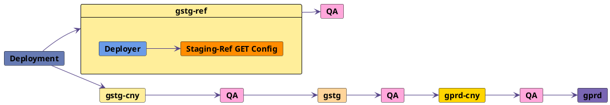

## On this page
{:.no_toc .hidden-md .hidden-lg}

- TOC
{:toc .hidden-md .hidden-lg}

## Staging Ref

Staging Ref is a sandbox environment used for pre-production testing of the latest Staging Canary code with full access to the environment and control over data.

| **Name** | **URL** | **Purpose** | **Deploy** | **Database** | **Terminal access** | **Slack channel** |
| ---- | --- | ------- | ------ | -------- | --------------- | --------- |
| Staging Ref | [staging-ref.gitlab.com](https://staging-ref.gitlab.com/users/sign_in) | Pre-production testing | Frequently (Parallel to `gstg-cny`) | Separate and local | All engineers | [`#staging-ref`](https://gitlab.slack.com/archives/C02LN0K1N3Y) |

### Purpose

- Cover testing needs of Quality and Development teams in a production-like environment
- Admin testing access
  - Current Staging (`gstg`) has customer data which is a blocker for giving more access to Development and Quality teams.
- Testing different paid tiers
- Democratizing testing and better test data
- Better access to test accounts and wider permissions
- Performant sandbox environment for engineers

### Environment information

- Staging Ref is a [10k Cloud Native Hybrid Reference Architecture](https://docs.gitlab.com/ee/administration/reference_architectures/10k_users.html#cloud-native-hybrid-reference-architecture-with-helm-charts-alternative) environment - stateless components (Webservice, Sidekiq, NGINX, etc) deployed to Google Kubernetes Engine cluster and the remaining stateful components installed to GCP virtual machines
- Deployed with [GitLab Environment Toolkit (GET)](https://gitlab.com/gitlab-org/gitlab-environment-toolkit) and [Deployer](https://ops.gitlab.net/gitlab-com/gl-infra/deployer)
- SSL Certificates automated with [Let's Encrypt](https://letsencrypt.org/)
- [Google OAuth](https://docs.gitlab.com/ee/integration/google.html) gives access to environment for GitLab team members
- [Outgoing email](https://docs.gitlab.com/charts/charts/globals.html#outgoing-email) configured with Mailgun
- [Advanced Search](https://docs.gitlab.com/ee/user/search/advanced_search.html) is configured with Elasticsearch and [GET](https://gitlab.com/gitlab-org/gitlab-environment-toolkit/-/blob/main/docs/environment_advanced.md#advanced-search-with-elasticsearch)

#### Deployment process

Staging Ref deployment runs parallel to Staging Canary deployment. [Deployer](https://ops.gitlab.net/gitlab-com/gl-infra/deployer) triggers a job in [Staging-Ref GET Config](https://gitlab.com/gitlab-org/quality/gitlab-environment-toolkit-configs/staging-ref) to update the environment. Notifications about new deployments are sent to the [`#announcements`](https://gitlab.slack.com/archives/C8PKBH3M5) Slack channel.

Staging Ref pipelines do not block the deployment. If there are any failures with deployment to `gstg-ref`, please reach out to `@release-managers`. After successful deployment, Sanity and Full QA pipelines are triggered. Results are posted to `#qa-staging-ref` and analysed by Quality on-call DRIs. Please refer to the [Quality Department pipeline triage rotation schedule](https://about.gitlab.com/handbook/engineering/quality/quality-engineering/oncall-rotation/#schedule) to identify the current DRI.

### How to use Staging Ref

Staging Ref is a safe playground for engineers who want to test latest Staging(`gstg-cny`) code. Staging Ref has several advantages that allow it to be a full-fledged sandbox environment:

- Staging Ref deployments do not block the deployment process and can be tweaked or updated by any GitLab engineer. Hence GitLab engineers have wide permissions and full control over the environment.
- Environment follows 10k hybrid architecture so it is more performant than existing Staging(`gstg`) and could be used for load testing if needed.

To sign in to the environment, navigate to [staging-ref.gitlab.com](https://staging-ref.gitlab.com/users/sign_in) and use your GitLab Google account in 'Sign in with Google' option.

After signing in you can proceed using the environment as required. If destructive changes were done to the environment or it ended up in a bad state after testing, create a request to rebuild the environment. Please reach out to the [`#staging-ref`](https://gitlab.slack.com/archives/C02LN0K1N3Y) Slack channel or raise an issue in [Staging-Ref GET Config](https://gitlab.com/gitlab-org/quality/gitlab-environment-toolkit-configs/staging-ref). The process is automated with [Staging-Ref GET Config](https://gitlab.com/gitlab-org/quality/gitlab-environment-toolkit-configs/staging-ref) and will take about an hour to finish.

#### Enable Feature Flags

[ChatOps commands](https://about.gitlab.com/handbook/support/workflows/chatops.html#feature-flags) can be used to enable or disable Feature Flags on Staging Ref. You can run this command in the [`#staging-ref`](https://gitlab.slack.com/archives/C02LN0K1N3Y) Slack channel and notifications will be sent to [`#qa-staging-ref`](https://gitlab.slack.com/archives/C02JGFF2EAZ) after a flag is enabled/disabled.

#### Admin access

To promote your user to Admin, please sign in as Admin using the `Staging Ref credentials` from [1Password Engineering vault](https://start.1password.com/open/i?a=LKATQYUATRBRDHRRABEBH4RJ5Y&v=6gq44ckmq23vqk5poqunurdgay&i=joq3ryhuirbx3dr66oo3cju4xq&h=gitlab.1password.com). Then navigate to the [Admin Area’s Users page](https://docs.gitlab.com/ee/user/admin_area/#administering-users) and edit your user's Access Level.

Note that Staging Ref environment is shared across all engineers. If you plan to perform changes to GitLab Admin settings, use the [`#staging-ref`](https://gitlab.slack.com/archives/C02LN0K1N3Y) Slack channel to communicate changes broadly.

#### Request access to GCP project and environment

If you need access to Staging Ref components in the GCP project(`gitlab-staging-ref`), create an issue in [the access-request project](https://gitlab.com/gitlab-com/team-member-epics/access-requests/-/issues/new?issuable_template=Individual_Bulk_Access_Request). Requests for access to server environments requires the approval of your manager and an Infrastructure manager.

A simplified process to request SSH access to Staging Ref virtual machines and the GKE cluster is being worked on in [issue#343938](https://gitlab.com/gitlab-org/gitlab/-/issues/343938).

Note that GitLab configuration changes will be overwritten by a new deployment to the environment. Environment updates can be locked if needed by a request to `@release-managers` in the `#staging-ref` Slack channel.

#### Trigger QA pipelines

Sanity or Full QA pipeline may be triggered on demand in [staging-ref](https://ops.gitlab.net/gitlab-org/quality/staging-ref/-/pipeline_schedules) project. Please reach out to [Quality on-call DRIs](https://about.gitlab.com/handbook/engineering/quality/quality-engineering/oncall-rotation/#schedule) if there are any questions.

#### Monitoring

Monitoring implementation was done in ([epic#594](https://gitlab.com/groups/gitlab-com/gl-infra/-/epics/594)). Documentation can be found in the [runbooks](https://gitlab.com/gitlab-com/runbooks/-/blob/master/docs/staging-ref/get-monitoring.md). 

### Future iterations and known limitations

Staging Ref environment has some known limitations that will be worked on:

- Test data configuration will be explored ([epic#7020](https://gitlab.com/groups/gitlab-org/-/epics/7020))
- Configure CustomersDot portal for Staging Ref ([issue#342150](https://gitlab.com/gitlab-org/gitlab/-/issues/342150))
- Incoming email setup ([issue#348970](https://gitlab.com/gitlab-org/gitlab/-/issues/348970))
- More advanced configurations like Geo ([issue#350741](https://gitlab.com/gitlab-org/gitlab/-/issues/350741))
- Load testing ([issue#344223](https://gitlab.com/gitlab-org/gitlab/-/issues/344223), [issue#344224](https://gitlab.com/gitlab-org/gitlab/-/issues/344224))
- QA test session reports are not linked to Release tasks ([issue#2168](https://gitlab.com/gitlab-com/gl-infra/delivery/-/issues/2168))
- Increase Staging Ref adoption and gather feedback - ([issue#350744](https://gitlab.com/gitlab-org/gitlab/-/issues/350744))

### Feedback

If you need some additional custom configuration for Staging Ref to be explored or you have other feedback and ideas for improvements, please reach out to [`#eng-allocation-new-staging`](https://gitlab.slack.com/archives/C02BA0YKRUH) Slack channel or add a comment to the feedback [issue#350744](https://gitlab.com/gitlab-org/gitlab/-/issues/350744).
