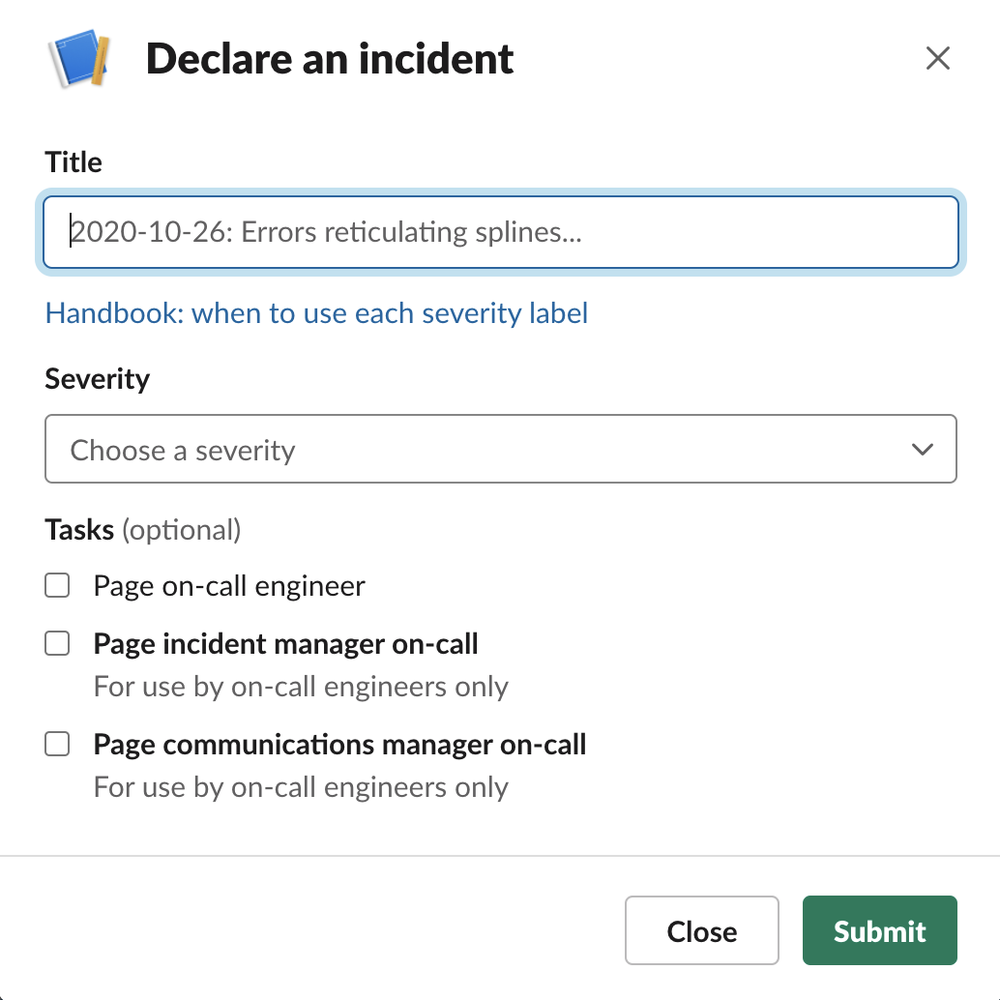
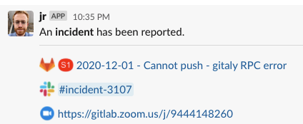
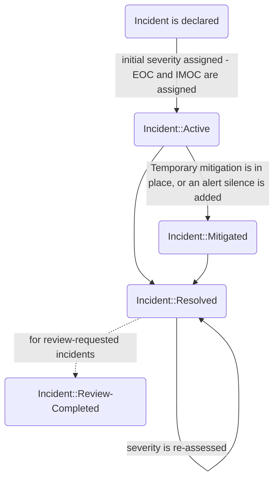

## On this page
{:.no_toc .hidden-md .hidden-lg}

- TOC
{:toc .hidden-md .hidden-lg}

If you're a GitLab team member and are looking to alert Reliability Engineering about an availability issue with GitLab.com, please find quick instructions to report an incident here: [Reporting an Incident](#reporting-an-incident).
{: .alert .alert-danger}

If you're a GitLab team member looking for who is currently the Engineer On Call (EOC), please see the [Who is the Current EOC?](#who-is-the-current-eoc) section.
{: .alert .alert-info}

If you're a GitLab team member looking for the status of a recent incident, please see the incident [board](https://gitlab.com/gitlab-com/gl-infra/production/-/boards/1717012?&label_name%5B%5D=incident). For detailed information about incident status changes, please see the [Incident Workflow](#incident-workflow) section.
{: .alert .alert-info}
## Incident Management

Incidents are **anomalous conditions** that result in—or may lead
to—service degradation or outages. These events require human
intervention to avert disruptions or restore service to operational status.
Incidents are _always_ given immediate attention.

The goal of incident management is to organize chaos into swift incident
resolution. To that end, incident management provides:

1. well-defined [roles and responsibilities](#roles-and-responsibilities) and [workflow](#incident-workflow) for members of the incident team,
1. control points to manage the flow **information** and the **resolution path**,
1. a **root-cause analysis** (RCA),
1. and a post-incident review where lessons and techniques are extracted and shared

When an [incident starts](#reporting-an-incident), the automation sends a message
in the [`#incident-management`](https://gitlab.slack.com/archives/CB7P5CJS1) channel
containing a link to a per-incident Slack channels for chat based communication, the
incident issue for permanent records, and the Situation Room Zoom link (also in all
incident channel descriptions) for incident team members to join for synchronous verbal
and screen-sharing communication.

### Ownership

There is only ever **one** owner of an incident—and only the owner of
the incident can declare an incident resolved. At anytime the incident owner
can engage the next role in the hierarchy for support. With the exception of
when GitLab.com is not functioning correctly, the incident issue should
be assigned to the current owner.

### Roles and Responsibilities

It's important to clearly delineate responsibilities during an incident.
Quick resolution requires focus and a clear hierarchy for delegation of
tasks. Preventing overlaps and ensuring a proper order of operations is vital
to mitigation.

| **Role** | **Description** | **Who?** |
| ---- | ----------- | ---- |
| `EOC` - **Engineer On Call** | The EOC is the usually the first person alerted - expectations for the role are in the [Handbook for oncall](/handbook/on-call/#expectations-for-on-call). The checklist for the EOC is in our [runbooks](https://gitlab.com/gitlab-com/runbooks/blob/master/on-call/checklists/eoc.md). If another party has declared an incident, once the EOC is engaged the EOC owns the incident. The EOC can escalate a page in PagerDuty to engage the IMOC and CMOC. | The Reliability Team **Engineer On Call** is generally an SRE and can declare an incident. They are part of the "SRE 8 Hour" on call shift in PagerDuty. |
| `IMOC` - **Incident Manager On Call** | The IMOC is engaged when incident resolution requires coordination from multiple parties. The IMOC is the tactical leader of the incident response team—not a person performing technical work. The IMOC assembles the incident team by engaging individuals with the skills and information required to resolve the incident. | The **Incident Manager** is an Engineering Manager, Staff Engineer, or Director from the Reliability team. The IMOC rotation is currently in the "SRE Managers" Pager Duty Schedule. |
| `CMOC` - **Communications Manager On Call** | The CMOC disseminates information internally to stakeholders and externally to customers across multiple media (e.g. GitLab issues, Twitter, status.gitlab.com, etc.). | The **Communications Manager** is generally member of the support team at GitLab. Notifications to the `Incident Management - CMOC` service in PagerDuty will go to the rotations setup for CMOC. |

These definitions imply several on-call rotations for the different roles.

#### Shared Incident Responsibilities

##### Incident Status Updates - EOC/IMOC
1. During an active incident, the EOC is initially responsible for posting regular status updates in the `Current Status` section of the incident issue description. These updates should summarize the current customer impact of the incident and actions we are taking to mitigate the incident.
    1. These updates should occur at regular intervals based on the severity of the incident. Refer to [Frequency of Updates](/handbook/support/workflows/cmoc_workflows.html#frequency-of-updates) for frequency guidelines.
    1. These status updates are used to:
        1. Help construct a detailed incident timeline to be used in Root Cause Analysis.
        1. Ensure CMOC has up to date and accurate information to communicate to customers, executives and other stakeholders.
        1. Ensure others in the company can track the state of the incident and the impact it is having on customers.
1. Once an IMOC has been engaged in the incident these responsibilities shift to the IMOC.

##### Incident Timeline Updates - EOC/IMOC
1. During an active incident, the EOC is initially responsible for ensuring that actions and events relevant to the issue and its resolution are captured in the timeline. These timeline updates should be captured in the `Timeline` section of the incident issue description, but can be captured in a comment thread, if rapid capture of events is needed. If capturing these events in comments on the incident issue, utilize the same format as the `Timeline` section of the incident issue.
1. Once an IMOC has been engaged in the incident these responsibilities are shared with IMOC. With the IMOC taking the initiative to capture these to preserve space for the EOC to work on mitigation. The EOC should therefore update the IMOC in the incident call with items relevant to the timeline.

#### Engineer on Call (EOC) Responsibilities

1. **As EOC, your highest priority for the duration of your shift is the stability of GitLab.com.**
1. The SSOT for who is the current EOC is the [GitLab Production](https://gitlab.pagerduty.com/service-directory/PATDFCE) service definition in PagerDuty.
1. Alerts that are routed to Pagerduty need to acknowledged within 15 minutes, otherwise they will be escalated to the oncall IMOC.
    1. Alert-manager alerts in [`#alerts`](https://gitlab.slack.com/archives/alerts) and [`#alerts-general`](https://gitlab.slack.com/archives/alerts-general) are an important source of information about the health of the environment and should be monitored during working hours.
    1. If the Pagerduty alert noise is too high, your task as an EOC is clearing out that noise by either fixing the system or changing the alert.
    1. If you are changing the alert, it is your responsibility to explain the reasons behind it and inform the next EOC that the change occurred.
    1. Each event (may be multiple related pages) should result in an issue in the `production` tracker. See [production queue usage](/handbook/engineering/infrastructure/production/#implementation) for more details.
1. If sources outside of our alerting are reporting a problem, and you have not received any alerts, it is still your responsibility to investigate. [Declare a low severity incident](#declaring-an-incident) and investigate from there.
    1. Low severity ([S3/S4](/handbook/engineering/infrastructure/production/#severity)) incidents (and issues) are cheap, and will allow others a means to communicate their experience if they are also experiencing the issue.
    1. **"No alerts" is not the same as "no problem"**
1. GitLab.com is a complex system. It is ok to not fully understand the underlying issue or its causes. However, if this is the case, as EOC you should engage with the IMOC to find a team member with the appropriate expertise.
    1. Requesting assistance does not mean relinquishing EOC responsibility. The EOC is still responsible for the incident.
    2. The [GitLab Organizational Chart](/company/team/org-chart/) and the [GitLab Team Page](/company/team/), which lists areas of expertise for team members, are important tools for finding the right people.
2. As soon as an [S1/S2](/handbook/engineering/infrastructure/production/#severity) [incident is declared](#declaring-an-incident), join the `The Situation Room Permanent Zoom`. The Zoom link is in the `#incident-management` topic.
    1. GitLab works in an asynchronous manner, but incidents require a synchronous response. Our collective goal is high availability of 99.95% and beyond, which means that the timescales over which communication needs to occur during an incident is measured in seconds and minutes, not hours.
3. Keep in mind that a GitLab.com incident is not an "infrastructure problem". It is a company-wide issue, and as EOC, you are leading the response on behalf of the company.
    1. If you need information or assistance, engage with Engineering teams. If you do not get the response you require within a reasonable period, escalate through the IMOC.
    2. As EOC, require that those who may be able to assist to join the Zoom call and ask them to post their findings in the incident issue or active incident Google doc. Debugging information in Slack will be lost and this should be strongly discouraged.
4. By acknowledging an incident in Pagerduty, the EOC is implying that they are working on it. To further reinforce this acknowledgement, post a note in Slack that you are joining the `The Situation Room Permanent Zoom` as soon as possible.
    1. If the EOC believes the alert is incorrect, comment on the thread in `#production`. If the alert is flappy, create an issue and post a link in the thread. This issue might end up being a part of RCA or end up requiring a change in the alert rule.
5. _Be inquisitive_. _Be vigilant_. If you notice that something doesn't seem right, investigate further.
6. After the incident is resolved, the EOC should review the comments and ensure that the [corrective actions](#corrective-actions) are added to the issue description, regardless of the incident severity. If it has a `~review-requested` label, the EOC should start on performing an [incident review](/handbook/engineering/infrastructure/incident-review/), in some cases this may be be a synchronous review meeting or an async review depending on what is requested by those involved with the incident.

#### Guidelines on Security Incidents

At times, we have a security incident where we may need to take actions to block a certain URL path or part of the application. This list is meant to help the Security Engineer On-Call and EOC decide when to engage help and post to status.io.

If any of the following are true, it would be best to engage an Incident Manager:

1. There is a S1/P1 report or security incident.
1. An entire path or part of functionality of the GitLab.com application must be blocked.
1. Any unauthorized access to a GitLab.com production system

In some cases, we may choose not to post to status.io, the following are examples where we may skip a post/tweet. In some cases, this helps protect the security of self managed instances until we have released the security update.

1. If a partial block of a URL is possible, for example to exclude problematic strings in a path.
1. If there is no usage of the URL in the last week based on searches in our logs for GitLab.com.

#### Incident Manager on Call (IMOC) Responsibilities

1. When the IMOC is engaged on an incident, they are responsible for keeping the `Current Status` section of the incident issue regularly updated.
1. The SSOT for who is the current IMOC is the [GitLab Production - IMOC](https://gitlab.pagerduty.com/service-directory/PE8A5MX) service definition in PagerDuty.
1. The IMOC should [monitor](https://gitlab.slack.com/archives/CB7P5CJS1) ongoing [incidents](https://gitlab.com/gitlab-com/gl-infra/production/-/issues?scope=all&utf8=%E2%9C%93&state=opened) and engage with the incident if it escalates to a user-impacting (S1 or S2) incident.
1. The IMOC should engage if requested by the EOC. [IMOC incident Checklist in runbooks](https://gitlab.com/gitlab-com/runbooks/-/blob/master/incidents/general_incidents.md#imoc-checklist)
1. For non-critical issues, or critical (S1, S2) issues with a short duration, the IMOC may also take on the role of CMOC.
    * Due to limited people on the IMOC rotation, there may be times of the day when the CMOC (if available; see [How to engage the CMOC](#how-to-engage-the-cmoc)) is a more friendly choice.
1. The IMOC should ensure that the appropriate team members from other teams engage within an appropriate amount of time.
    1. During a user-impacting incident, the appropriate time response time is minutes.
    1. If the IMOC is unable to obtain a response through Slack channels, they should escalate to a manager or director to obtain assistance.
1. They evaluate information provided by team members, lend technical direction, and coordinate troubleshooting efforts.
1. If applicable, coordinate the incident response with [business contingency activities](/handbook/business-ops/gitlab-business-continuity-plan/).
1. In the event of a Severity 1 incident which has been running for an hour or more or appears that it will be a long-running Severity 1 incident, page Infrastructure leadership via email at `severity-1@gitlab.pagerduty.com` or via the `GitLab Production - Severity 1 Escalation` service in PagerDuty (app or website) with a link to the incident.
1. After the incident is resolved, the IMOC is responsible for conducting the [post-incident review](/handbook/engineering/infrastructure/incident-review/).
1. For high severity bugs that affect customers, the IMOC is responsible for making sure Incident Reviews are coordinated with other departments in Engineering and go through the complete Incident Review process.

To engage the IMOC: either run `/pd trigger` in Slack, then select the "GitLab
Production - IMOC" service, or create an incident in [the Pagerduty page for the
service](https://gitlab.pagerduty.com/service-directory/PE8A5MX).

#### Communications Manager on Call (CMOC) Responsibilities

For serious incidents that require coordinated communications across multiple channels, the IMOC will rely on the CMOC for the duration of the incident.

The GitLab support team staffs an oncall rotation and via the `Incident Management - CMOC` service in PagerDuty. They have a section in [the support handbook](/handbook/support/workflows/cmoc_workflows.html) for getting new CMOC people up to speed.

During an incident, the CMOC will:

1. Be the voice of GitLab during an incident by updating our end-users, internal parties, and executive-level managers through updates to our [status page](https://status.gitlab.com/) hosted by Status.io.
1. Update the status page at regular intervals in accordance with [the severity of the incident](/handbook/support/workflows/cmoc_workflows.html#frequency-of-updates).
1. Notify GitLab stakeholders (e-group, customer success and community team) of current incident and reference where to find further information. Provide additional update when the incident is mitigated.

##### How to engage the CMOC?

If, during an incident, EOC or IMOC decide to engage CMOC, they should do that
by paging the on-call person:

- Using the `/pd trigger` command in Slack, then select the "Incident Management - CMOC" service from the modal.
or
- Directly from PagerDuty in the [Incident Management - CMOC Rotation](https://gitlab.pagerduty.com/escalation_policies#PNH1Z1L)
schedule in PagerDuty. That can be done by navigating to [Incidents page in PagerDuty](https://gitlab.pagerduty.com/incidents),
and then creating the new incident while picking **Incident Management - CMOC** as
**Impacted Service**.
CMOC coverage in APAC hours does not include the weekends. 24x7 coverage for CMOC is being worked in [support-team-meta#2822](https://gitlab.com/gitlab-com/support/support-team-meta/-/issues/2822).

Saturday / Sunday 00:00 - 08:00 UTC does not currently have CMOC coverage.

### Corrective Actions
Corrective Actions (CAs) are work items that we create as a result of an incident. They are designed to prevent or reduce the likelihood and/or impact of an incident recurrence.

Corrective Actions should be related to the incident issue to help with downstream analysis.

##### Best practices and examples, when creating a Corrective Action issue:
- They should be [SMART](https://en.wikipedia.org/wiki/SMART_criteria): Specific, Measurable, Achievable, Relevant and Time-bounded.
- Avoid creating CAs that:
  - Are too generic (most typical mistake, as oposed to Specific)
  - Only fix incident symptoms.
  - Introduce more human error.
  - will not help to keep the incident from happening again.
- Examples: (taken from several best-practices Postmortem pages)

| Badly worded                                                        | Better                            |
|-------------------------------------------------------|-----------------------------------------------------------|
| Fix the issue that caused the outage  | (Specific) Handle invalid postal code in user address form input safely      |
| Investigate monitoring for this scenario     | (Actionable) Add alerting for all cases where this service returns >1% errors |
| Make sure engineer checks that database schema can be parsed before updating  | (Bounded) Add automated presubmit check for schema changes  |

### Runbooks

[Runbooks](https://gitlab.com/gitlab-com/runbooks) are available for
engineers on call. The project README contains links to checklists for each
of the above roles.

**In the event of a GitLab.com outage**, a mirror of the runbooks repository is available on at https://ops.gitlab.net/gitlab-com/runbooks.

### Who is the Current EOC?

The chatops bot will give you this information if you DM it with `/chatops run oncall prod`.

### When to Contact the Current EOC

The current EOC can be contacted via the `@sre-oncall` handle in Slack, but please only use this handle in the following scenarios.

1. You need assistance in halting the deployment pipeline. note: this can also be accomplished by [Reporting an Incident](/handbook/engineering/infrastructure/incident-management/#reporting-an-incident) and labeling it as `~severity::2`.
1. You are conducting a production change via our [Change Management](/handbook/engineering/infrastructure/change-management/) process and as a required step need to seek the approval of the EOC.
1. For all other concerns please see the [Getting Assistance](/handbook/engineering/infrastructure/team/reliability/#getting-assistance) section.

The EOC will respond as soon as they can to the usage of the `@sre-oncall` handle in Slack, but depending on circumstances, may not be immediately available. If it is an emergency and you need an immediate response, please see the [Reporting an Incident](/handbook/engineering/infrastructure/incident-management/#reporting-an-incident) section.

### Reporting an Incident

If you are a GitLab team member and would like to report a possible incident related to GitLab.com and have the EOC paged in to respond, choose one of the reporting methods below. Regardless of the method chose, please stay online until the EOC has had a chance to come online and engage with you regarding the incident. Thanks for your help!

#### Report an Incident via Slack

Type `/incident declare` in the [`#production`](https://gitlab.slack.com/archives/C101F3796) channel in GitLab's Slack and follow the prompts. This will open an incident issue. If you suspect the issue is an emergency, tick the "Page the engineer on-call" box - not the incident manager or communications manager boxes. You do not need to decide if the problem is an incident, and should err on the side of paging the engineer on-call if you are not sure. We have triage steps below to make sure we respond appropriately. Reporting high severity bugs via this process is the preferred path so that we can make sure we engage the appropriate engineering teams as needed.

_Incident Declaration Slack window_

| Field | Description |
| ----- | ----------- |
| Title | Give the incident as descriptive as title as you can. Please prepend the title with a date in the format YYYY-MM-DD |
| Severity | If unsure about the severity to choose, but you are seeing a large amount of customer impact, please select S1. More details here: [Incident Severity](#incident-severity). |
| Tasks: page the on-call engineer | If you'd like to page the on-call engineer, please check this box. If in doubt, err on the side of paging if there is significant disruption to the site. |
| Tasks: page on-call managers | You can page the incident and/or communications managers on-call. |

_Incident Declaration Results_

As well as opening a GitLab incident issue, a dedicated incident Slack channel will be opened. The "woodhouse" bot will post links to all of these resources in the main `#incident-management` channel. Please note that unless you're an SRE, you won't be able to post in `#incident-management` directly. Please join the dedicated Slack channel, created and linked as a result of the incident declaration, to discuss the incident with the on-call engineer.

#### Report an Incident via Email

Email [gitlab-production-eoc@gitlab.pagerduty.com](mailto:gitlab-production-eoc@gitlab.pagerduty.com). This will immediately page the Engineer On Call.

### Definition of Outage vs Degraded vs Disruption

This is a first revision of the definition of Service Disruption (Outage), Partial Service Disruption, and Degraded Performance per the terms on Status.io.
Data is based on the graphs from the [Key Service Metrics Dashboard](https://dashboards.gitlab.net/d/general-service/service-platform-metrics?orgId=1)

Outage and Degraded Performance incidents occur when:

1. `Degraded` as any sustained 5 minute time period where a service is below its documented Apdex SLO or above its documented error ratio SLO.
1. `Outage` (Status = Disruption) as a 5 minute sustained error rate above the Outage line on the error ratio graph

SLOs are documented in the [runbooks/rules](https://gitlab.com/gitlab-com/runbooks/blob/master/rules/service_apdex_slo.yml)

To check if we are Degraded or Disrupted for GitLab.com, we look at these graphs:

1. Web Service
    - [Error Ratio](https://dashboards.gitlab.net/d/general-service/service-platform-metrics?orgId=1&fullscreen&panelId=8&var-PROMETHEUS_DS=Global&var-environment=gprd&var-type=web&var-stage=main&var-sigma=2)
    - [Apdex](https://dashboards.gitlab.net/d/general-service/service-platform-metrics?orgId=1&var-PROMETHEUS_DS=Global&var-environment=gprd&var-type=web&var-stage=main&var-sigma=2&fullscreen&panelId=7)
1. API Service
    - [Error Ratio](https://dashboards.gitlab.net/d/general-service/service-platform-metrics?orgId=1&fullscreen&panelId=8&var-PROMETHEUS_DS=Global&var-environment=gprd&var-type=api&var-stage=main&var-sigma=2)
    - [Apdex](https://dashboards.gitlab.net/d/general-service/service-platform-metrics?orgId=1&fullscreen&panelId=7&var-PROMETHEUS_DS=Global&var-environment=gprd&var-type=api&var-stage=main&var-sigma=2)
1. Git service(public facing git interactions)
    - [Error Ratio](https://dashboards.gitlab.net/d/general-service/service-platform-metrics?orgId=1&fullscreen&panelId=8&var-PROMETHEUS_DS=Global&var-environment=gprd&var-type=git&var-stage=main&var-sigma=2)
    - [Apdex](https://dashboards.gitlab.net/d/general-service/service-platform-metrics?orgId=1&fullscreen&panelId=7&var-PROMETHEUS_DS=Global&var-environment=gprd&var-type=git&var-stage=main&var-sigma=2)
1. GitLab Pages service
    - [Error Ratio](https://dashboards.gitlab.net/d/general-service/service-platform-metrics?orgId=1&fullscreen&panelId=8&var-PROMETHEUS_DS=Global&var-environment=gprd&var-type=pages&var-stage=main&var-sigma=2)
    - [Apdex](https://dashboards.gitlab.net/d/general-service/service-platform-metrics?orgId=1&fullscreen&panelId=7&var-PROMETHEUS_DS=Global&var-environment=gprd&var-type=pages&var-stage=main&var-sigma=2)
1. Registry service
    - [Error Ratio](https://dashboards.gitlab.net/d/general-service/service-platform-metrics?orgId=1&fullscreen&panelId=8&var-PROMETHEUS_DS=Global&var-environment=gprd&var-type=registry&var-stage=main&var-sigma=2)
    - [Apdex](https://dashboards.gitlab.net/d/general-service/service-platform-metrics?orgId=1&fullscreen&panelId=7&var-PROMETHEUS_DS=Global&var-environment=gprd&var-type=registry&var-stage=main&var-sigma=2)
1. Sidekiq
    - [Error Ratio](https://dashboards.gitlab.net/d/general-service/service-platform-metrics?orgId=1&var-PROMETHEUS_DS=Global&var-environment=gprd&var-type=sidekiq&var-stage=main&var-sigma=2&fullscreen&panelId=8)
    - [Apdex](https://dashboards.gitlab.net/d/general-service/service-platform-metrics?orgId=1&fullscreen&panelId=7&var-PROMETHEUS_DS=Global&var-environment=gprd&var-type=sidekiq&var-stage=main&var-sigma=2)

A Partial Service Disruption is when only part of the GitLab.com services or infrastructure is experiencing an incident. Examples of partial service disruptions are instances where GitLab.com is operating normally except there are:

1. delayed CI/CD pending jobs
1. delayed repository mirroring
1. high severity bugs affecting a particular feature like Merge Requests
1. Abuse or degradation on 1 gitaly node affecting a subset of git repos. This would be visible on the Gitaly service metrics

#### High Severity Bugs

In the case of high severity bugs, we prefer that an incident issue is still created via [Reporting an Incident](/handbook/engineering/infrastructure/incident-management/#reporting-an-incident). This will give us an incident issue on which to track the events and response.

In the case of a high severity bug that is in an ongoing, or upcoming deployment please follow the steps to [Block a Deployment](https://about.gitlab.com/handbook/engineering/releases/#deployment-blockers).

### Security Incidents

If an incident may be security related, engage the Security Operations on-call by using `/security` in Slack. More detail can be found in [Engaging the Security On-Call](/handbook/engineering/security/#engaging-the-security-on-call).

## Communication

Information is an asset to everyone impacted by an incident. Properly managing the flow of information is critical to minimizing surprise and setting expectations. We aim to keep interested stakeholders apprised of developments in a timely fashion so they can plan appropriately.

This flow is determined by:

1. the type of information,
1. its intended audience,
1. and timing sensitivity.

Furthermore, avoiding information overload is necessary to keep every stakeholder’s focus.

To that end, we will have:


1. a dedicated Zoom call for all incidents. A link to the Zoom call can be found in the topic for the [`#incident-management`](https://gitlab.slack.com/archives/incident-management) room in Slack.
1. a Google Doc as needed for multiple user input based on the [shared template](https://docs.google.com/document/d/1NMZllwnK70-WLUn_9IiiyMWeXs-JKPEiq-lordxJAig/edit#)
1. a dedicated [`#incident-management`](https://gitlab.slack.com/archives/incident-management) channel for internal updates
1. regular updates to status.gitlab.com via status.io that disseminates to various media (e.g. Twitter)
1. a dedicated repo for issues related to [Production](https://gitlab.com/gitlab-com/production) separate from the queue that holds Infrastructure's workload: namely, issues for incidents and changes.

### Status

We manage incident [communication](#communication) using status.io, which updates [status.gitlab.com](https://status.gitlab.com). Incidents in status.io have **state** and **status** and are updated by the incident owner.

Definitions and rules for transitioning state and status are as follows.

| **State** | **Definition** |
| ----- | ---------- |
| Investigating | The incident has just been discovered and there is not yet a clear understanding of the impact or cause. If an incident remains in this state for longer than 30 minutes after the EOC has engaged, the incident should be escalated to the IMOC. |
| Identified | The cause of the incident is believed to have been identified and **a step to mitigate has been planned and agreed upon**. |
| Monitoring | The step has been executed and metrics are being watched to ensure that we're operating at a baseline. If there is a clear understanding of the specific mitigation leading to resolution and high confidence in the fact that the impact will not recur it is preferable to skip this state. |
| Resolved | The incident is closed and status is again Operational. |

Status can be set independent of state. The only time these must align is when an issues is

| **Status** | **Definition** |
| ------ | ---------- |
| Operational | The default status before an incident is opened and after an incident has been resolved. All systems are operating normally. |
| Degraded Performance | Users are impacted intermittently, but the impacts is not observed in metrics, nor reported, to be widespread or systemic. |
| Partial Service Disruption | Users are impacted at a rate that violates our SLO. The IMOC must be engaged and monitoring to resolution is required to last longer than 30 minutes. |
| Service Disruption | This is an outage. The IMOC must be engaged. |
| Security Issue | A security vulnerability has been declared public and the security team has asked to publish it. |

## Severities

### Incident Severity

**Incident severities encapsulate the impact of an incident and scope the resources allocated to handle it**. Detailed definitions are provided for each severity, and these definitions are reevaluated as new circumstances become known. Incident management uses our standardized severity definitions, which can be found under [availability severities](/handbook/engineering/quality/issue-triage/#availability).

### Alert Severities

1. Alerts severities do not necessarily determine incident severities. A single incident can trigger a number of alerts at various severities, but the determination of the incident's severity is driven by the above definitions.
1. Over time, we aim to automate the determination of an incident's severity through service-level monitoring that can aggregate individual alerts against specific SLOs.

## Incident Workflow

### Summary

In order to effectively track specific metrics and have a single pane of glass for incidents and their reviews, specific labels are used. The below [workflow diagram](#workflow-diagram) describes the path an incident takes from `open` to `closed`. All `S1` incidents require a review, other incidents can also be reviewed as [described here](/handbook/engineering/infrastructure/incident-review/#review-criteria).

GitLab uses the [Incident Management](https://about.gitlab.com/handbook/engineering/infrastructure/incident-management/) feature of the GitLab application. Incidents are [reported](/handbook/engineering/infrastructure/incident-management/#reporting-an-incident) and closed when they are resolved. A resolved incident means the degradation has ended and will not likely re-occur.

If there is additional follow-up work that requires more time after an incident is resolved and closed (like a detailed root cause analysis or a corrective action) a new issue may need to be created and linked to the incident issue.
It is important to add as much information as possible as soon as an incident is resolved while the information is fresh, this includes a high level summary and a timeline where applicable.

### Assignees

The EOC and the IMOC, at the time of the incident, are the default assignees for an incident issue. They are the assignees for the entire workflow of the incident issue.

### Labeling

The following labels are used to track the incident lifecycle from active incident to completed incident review. [Label Source](https://gitlab.com/gitlab-com/gl-infra/production/-/labels?utf8=%E2%9C%93&subscribed=&search=Incident%3A%3A)

#### Workflow Labeling

In order to help with attribution, we also label each incident with a scoped label for the Infrastructure Service (Service::) and Group (group::) scoped labels.

| **Label** | **Workflow State** |
| ----- | -------------- |
| `~Incident::Active` | Indicates that the incident labeled is active and ongoing. Initial severity is assigned when it is opened. |
| `~Incident::Mitigated` | Indicates that the incident has been mitigated, but immediate post-incident activity may be ongoing (monitoring, messaging, etc.). A mitigated issue means there is the potential for the impact to return. It may be appropriate to leave an incident mitigated while there is an alert silence with an expiration set. |
| `~Incident::Resolved` | Indicates that SRE engagement with the incident has ended and the condition that triggered the alert has been resolved. Incident severity is re-assessed and determined if the initial severity is still correct and if it is not, it is changed to the correct severity. Once an incident is resolved, it should be closed. |
| `~Incident::Review-Completed` | Indicates that an incident review has been completed, this should be added to an incident after the review is completed if it has the `~review-requested` label. |

#### Root Cause Labeling

Labeling incidents with similar causes helps develop insight into overall trends and when combined with Service attribution, improved understanding of Service behavior. Indicating a single root cause is desirable and in cases where there appear to be multiple root causes, indicate the root cause which precipitated the incident.

The EOC, as DRI of the incident, is responsible for determining root cause.

The current Root Cause labels are listed below. In order to support trend awareness these labels are meant to be high-level, not too numerous, and as consistent as possible over time.

   | Root Cause | Description |
   | ---------- | ----------- |
   | `~RootCause::Software-Change` | feature or other code change |
   | `~RootCause::Feature-Flag` | a feature flag toggled in some way (off or on or a new percentage or target was chosen for the feature flag)  |
   | `~RootCause::Config-Change` | configuration change, other than a feature flag being toggled |
   | `~RootCause::SPoF` | the failure of a service or component which is an architectural SPoF (Single Point of Failure) |
   | `~RootCause::Malicious-Traffic` | deliberate malicious activity targeted at GitLab or customers of GitLab (e.g. DDoS) |
   | `~RootCause::Saturation` | failure resulting from a service or component which failed to scale in response to increasing demand (whether or not it was expected) |
   | `~RootCause::External-Dependency` | resulting from the failure of a dependency external to GitLab, including various service providers. Use of other causes (such as `~RootCause::SPoF` or `~RootCause::Saturation`) should be strongly considered for most incidents. |
   | `~RootCause::Release-Compatibility` | forward- or backwards-compatibility issues between subsequent releases of the software running concurrently, and sharing state, in a single environment (e.g. Canary and Main stage releases). They can be caused by incompatible database DDL changes, canary browser clients accessing non-canary APIs, or by incompatibilities between Redis values read by different versions of the application. |
    | `~RootCause::Security` | an incident where the [SIRT team](/handbook/engineering/security/#sirt---security-incident-response-team-former-security-operations) was engaged, generally via a request originating from the SIRT team or in a situation where Reliability has paged SIRT to assist in the mitigation of an incident not caused by `~RootCause::Malicious-Traffic` |
    | `~RootCause::Flaky-Test` | an incident, usually a deployment pipeline failure found to have been caused by a flaky QA test |
    | `~RootCause::Indeterminate` | when an incident has been investigated, but the root cause continues to be unknown and an agreement has been formed to not pursue any further investigation. |

#### "Needs" labeling

The following labels are added and removed by [triage-ops](https://gitlab.com/gitlab-com/gl-infra/triage-ops/) automation depending on whether the corresponding label has been been added.

   | Needs Label | Description |
   | ---------- | ----------- |
   | `~NeedsRootCause` | Will be added/removed automatically based on there being a `~RootCause::*` label |
   | `~NeedsService` | Will be added/removed automatically based on there being a `~Service::*` label |
   | `~NeedsCorrectiveActions` | Will be added/removed automatically based on there being at least one link on the `Corrective Actions` section of the Issue description |

#### Required Labeling

These labels are always required on incident issues.

| **Label** | **Purpose** |
| ----- | ------- |
| `~incident` | Label used for metrics tracking and immediate identification of incident issues. |
| `~Service::*` | Scoped label for service attribution. Used in metrics and error budgeting. |
| `~Severity::*` | Scoped label for severity assignment. Details on severity selection can be found in the [availability severities](/handbook/engineering/quality/issue-triage/#availability) section. |
| `~RootCause::*` | Scoped label indicating root cause of the incident. |

#### Optional Labeling

In certain cases, additional labels will be added as a mechanism to add metadata to an incident issue for the purposes of metrics and tracking.

| **Label** | **Purpose** |
| ----- | ------- |
| `~self-managed` | Indicates that an incident is **exclusively** an incident for self-managed GitLab. [Example self-managed incident issue](https://gitlab.com/gitlab-com/gl-infra/production/-/issues/2651) |
| `~incident-type::automated traffic` | The incident occurred due to activity from security scanners, crawlers, or other automated traffic |
| `~incident-type::deployment related` | Indicates that the incident is a failing deployment or that the incident was caused by a deployment. Failures may be caused by failing tests, application bugs, or pipeline problems. Incidents during deploys may be the result of disconnects or other deploy-related errors. |
| `~group::*` | Any development group(s) related to this incident |
| `~review-requested` | Indicates that that the incident would benefit from undergoing additional review. All S1 incidents are required to have a review. Additionally, anyone including the EOC can request an incident review on any severity issue. Although the review will help to derive [corrective actions](#corrective-actions), it is expected that corrective actions are filled whether or not a review is requested. If an incident does not have any corrective actions, this is probably a good reason to request a review for additional discussion. |

### Workflow Diagram

* As soon as an incident transitions to `Incident::Resolved` the incident issue will be closed
* All `Severity::1` incidents will automatically be labeled with `review-requested`

### Incident Board

The board which tracks all GitLab.com incidents from active to reviewed is located [here](https://gitlab.com/gitlab-com/gl-infra/production/-/boards/1717012?&label_name%5B%5D=incident).

## Near Misses

A near miss, "near hit", or "close call" is an unplanned event that has the potential to cause, but does not actually result in an incident.

### Background

In the United States, the Aviation Safety Reporting System has been collecting reports
of close calls since 1976. Due to near miss observations and other technological improvements,
the rate of fatal accidents has dropped about 65 percent.
[source](https://en.wikipedia.org/wiki/Near_miss_(safety))

As [John Allspaw states](https://qz.com/504661/why-etsy-engineers-send-company-wide-emails-confessing-mistakes-they-made/):

> Near misses are like a vaccine. They help the company better defend against
> more serious errors in the future, without harming anyone or anything in the process.

### Handling Near Misses

When a near miss occurs, we should treat it in a similar manner to a normal incident.

1. Open an [incident](/handbook/engineering/infrastructure/incident-management/#reporting-an-incident) issue, if one is not already opened. Label it with the severity label appropriate to the incident it would have caused, had the incident actually occurred. Label the incident issue with the `~Near Miss` label.
1. [corrective actions](/handbook/engineering/infrastructure/incident-management/#corrective-actions) should be treated in the same way as those for an actual incident.
1. Ownership of the incident review should be assigned to the team-member who noticed the near-miss, or, when appropriate, the team-member with the most knowledge of how the near-miss came about.
