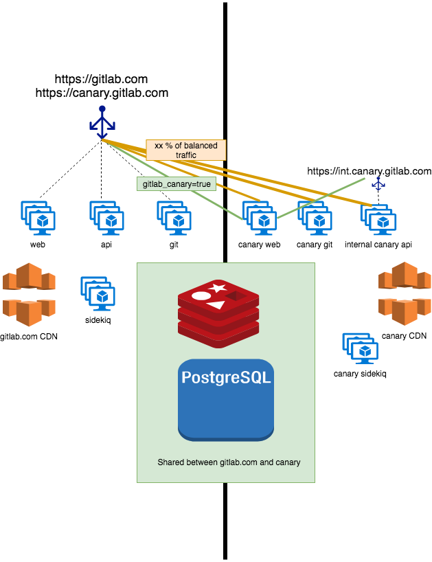

## On this page
{:.no_toc .hidden-md .hidden-lg}

- TOC
{:toc .hidden-md .hidden-lg}

Issue: [`infra/5025`](https://gitlab.com/gitlab-com/gl-infra/infrastructure/issues/5025)

## Overview

At GitLab, the Infrastructure Department makes use of a “canary stage” which is the final deploy step before changes are released to production. Part of the infrastructure migration to GCP from Azure has given us the opportunity to improve this configuration and make some updates to improve our ability to see problems before customers do.


### Issues

* [Create a canary sidekiq cluster](https://gitlab.com/gitlab-com/gl-infra/infrastructure/issues/5137)
* [Create an internal api endpoint for canary](https://gitlab.com/gitlab-com/gl-infra/infrastructure/issues/5136)
* [Setup web, api and git canary to receive a small percentage of web traffic, via chatops](https://gitlab.com/gitlab-com/gl-infra/infrastructure/issues/5135)
* [Configuration updates to introduce optional backend weights to the haproxy configuration](https://gitlab.com/gitlab-com/gl-infra/infrastructure/issues/5134)
* [canary.gitlab.com should use the corresponding backends for api/git traffic](https://gitlab.com/gitlab-com/gl-infra/infrastructure/issues/5232)

### Canary Configuration

Since migrating to GCP, we have improved our canary stage. This will accomplish the following goals:

* Share configuration between the https://GitLab.com and the canary stage to avoid configuration drift and achieve parity between the two environments.
* Perform database migrations prior to deploying to canary. Post deployment migrations will be completed after the application is fully deployed to GitLab.com.
* Allow a small percentage of load balanced traffic to reach the canary web and git fleet.
* Control the amount of traffic that is sent to canary with GitLab chatops so it can easily be turned off and on.
* Exercise the api fleet by configuring the canary fleet to use an internal api endpoint that points to canary api servers.
* Use the prometheus labels `stage=cny` and `stage=main` to identify the canary fleet and the main fleet that receives traffic for the environment.



### Configuration and Deployment

In order to ensure we don’t see configuration drift between staging and production in the new GCP environment, there is a common topology configuration between them. Doing this for canary may not seem to make much sense, as there is not as much use for a canary stage in Staging. We have however, purposely decided to create a staging canary so that every configuration change we make to both Chef and Terraform are validated before they receive any production traffic. 

1. Ensuring that the majority of Chef, Terraform, and pinned Chef cookbook versions are shared between the Canary node and other nodes that receive the same type of traffic.
1. Using HAProxy weights, configure a default weighting of zero for the canary node that can be overridden using GitLab Chatops or command line scripts.
1. Run migrations on Canary for every deployment. Database migrations are implemented to be backwards compatible so prior to deploying to the canary stage, they are executed although the majority of production traffic is being handled by nodes at the previous version of the GitLab application.


The new deployment execution becomes (duplicated for the staging environment):

* Deploy to canary production
* Run migrations
* Install the GitLab omnibus on the canary nodes
* Validate canary by looking at canary specific dashboards for error increases
* Deploy to production
* Install the GitLab omnibus across the fleet
* Run post-deploy migrations


### Implementation Considerations

The main consideration for testing and validation will be to build out the canary stage on staging before we build it out on production. This means creating a separate canary stage in staging that has an identical topology as production. The other consideration will be to ensure that production traffic is by default, not enabled for canary. Using tooling the amount of load-balanced traffic that arrives at the canary endpoint can be adjusted incrementally.

### CDN and content Content-Security-Policy

Canary has a dedicated CDN. The reason for this is because we still deploy assets to disk. Because assets change from release to release there needs to be a CDN with canary configured as an origin for the newer canary assets that are deployed there.
GitlLab.com sets a content-security-policy that authorizes requests to both cdns in both the canary stage and the main stage:

```
Content-Security-Policy: object-src 'none'; worker-src https://assets.gitlab-static.net https://gl-canary.global.ssl.fastly.net https://gitlab.com blob:; script-src 'self' 'unsafe-inline' 'unsafe-eval' https://assets.gitlab-static.net https://gl-canary.global.ssl.fastly.net https://www.google.com/recaptcha/ https://www.gstatic.com/recaptcha/ https://apis.google.com; style-src 'self' 'unsafe-inline' https://assets.gitlab-static.net https://gl-canary.global.ssl.fastly.net; img-src * data: blob:; frame-src 'self' https://www.google.com/recaptcha/ https://content.googleapis.com https://content-compute.googleapis.com https://content-cloudbilling.googleapis.com https://content-cloudresourcemanager.googleapis.com https://*.codesandbox.io; frame-ancestors 'self'; connect-src 'self' https://assets.gitlab-static.net https://gl-canary.global.ssl.fastly.net wss://gitlab.com https://sentry.gitlab.net https://customers.gitlab.com https://snowplow.trx.gitlab.net
```

### Web, Git and API backend weighting

For the api, web and git fleet we will use backend weighting.  Below is the configuration change that we will add to the haproxy config, the bolded sections for the added weighting:

1. The web, git and api fleet will all receive a configured percentage of load balanced production traffic.
1. Any call that uses the internal api from the canary web, git or sidekiq fleet will go to the canary api.
1. By default a weight of zero will be configured for the canary nodes, using GitLab chatops we can then control how much traffic is sent to the canary. For more information see the [canary runnbook](https://gitlab.com/gitlab-com/runbooks/blob/master/howto/canary.md).


```
backend web
    mode http
    balance roundrobin
    ...
    option httpchk GET /-/health HTTP/1.1\r\nHost:\ gitlab.com
    server web-01-sv-gprd web-01-sv-gprd.c.gitlab-production.internal:443 weight 100 check check-ssl inter 2s fastinter 1s downinter 5s fall 3 ssl verify none
    server web-02-sv-gprd web-02-sv-gprd.c.gitlab-production.internal:443 weight 100 check check-ssl inter 2s fastinter 1s downinter 5s fall 3 ssl verify none
    server web-03-sv-gprd web-03-sv-gprd.c.gitlab-production.internal:443 weight 100 check check-ssl inter 2s fastinter 1s downinter 5s fall 3 ssl verify none
    server web-cny-01-sv-gprd web-cny-01-sv-gprd.c.gitlab-production.internal:443  weight 0 check check-ssl inter 2s fastinter 1s downinter 5s fall 3 ssl verify none


backend ssh
    mode tcp
    balance source
    option splice-auto
    ...
    option httpchk GET /-/health HTTP/1.1\r\nHost:\ gitlab.com
    server git-01-sv-gprd git-01-sv-gprd.c.gitlab-production.internal:22 weight 100 check check-ssl port 443 inter 2s fastinter 1s downinter 5s fall 3 verify none
    server git-02-sv-gprd git-02-sv-gprd.c.gitlab-production.internal:22 weight 100 check check-ssl port 443 inter 2s fastinter 1s downinter 5s fall 3 verify none
    server git-03-sv-gprd git-03-sv-gprd.c.gitlab-production.internal:22 weight 100 check check-ssl port 443 inter 2s fastinter 1s downinter 5s fall 3 verify none
    server git-cny-01-sv-gprd git-cny-01-sv-gprd.c.gitlab-production.internal:22 weight 0 check check-ssl port 443 inter 2s fastinter 1s downinter 5s fall 3 verify none

backend https_git
    mode http
    balance roundrobin
    option forwardfor
    option splice-auto
    timeout server-fin 5s
    option httpchk GET /-/health HTTP/1.1\r\nHost:\ gitlab.com
    server git-01-sv-gprd git-01-sv-gprd.c.gitlab-production.internal:443 check check-ssl inter 2s fastinter 1s downinter 5s fall 3 ssl verify none
    server git-02-sv-gprd git-02-sv-gprd.c.gitlab-production.internal:443 check check-ssl inter 2s fastinter 1s downinter 5s fall 3 ssl verify none
    server git-03-sv-gprd git-03-sv-gprd.c.gitlab-production.internal:443 check check-ssl inter 2s fastinter 1s downinter 5s fall 3 ssl verify none
    server git-cny-01-sv-gprd git-cny-01-sv-gprd.c.gitlab-production.internal:22 weight 0 check check-ssl inter 2s fastinter 1s downinter 5s fall 3 ssl verify none

backend api
    mode http
    balance roundrobin
    option forwardfor
    option splice-auto
    timeout server-fin 5s
    option httpchk GET /-/health HTTP/1.1\r\nHost:\ gitlab.com
    server api-01-sv-gprd api-01-sv-gprd.c.gitlab-production.internal:443 weight 100 check check-ssl inter 2s fastinter 1s downinter 5s fall 3 ssl verify none
    server api-02-sv-gprd api-02-sv-gprd.c.gitlab-production.internal:443 weight 100 check check-ssl inter 2s fastinter 1s downinter 5s fall 3 ssl verify none
    server api-03-sv-gprd api-03-sv-gprd.c.gitlab-production.internal:443 weight 100 check check-ssl inter 2s fastinter 1s downinter 5s fall 3 ssl verify none
    server api-cny-01-sv-gprd web-cny-01-sv-gprd.c.gitlab-production.internal:443  weight 0 check check-ssl inter 2s fastinter 1s downinter 5s fall 3 ssl verify none


```
