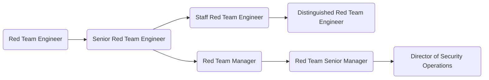

As members of GitLab's [Security Operations sub department](/handbook/engineering/security/operations/), the [Red Team](/handbook/engineering/security/operations/red-team/) emulates real world adversary activities in order to better our enterprise and product security. This team requires thinking like an attacker while understanding the various levels of defensive technologies and their effectiveness. Creativity is key. Our Red Team develops in depth attack plans that focus on compromising GitLab, test existing defenses or assist in building new defenses based on real world attack data. The Red Team does not do penetration testing or vulnerability assessments, we conduct real world attack operations against live targets. To sum it up -- you need to be someone that is a true hacker at heart while understanding the various defensive techniques that make your job harder.

## Responsibilities
* Understanding of GitLab’s products and how they work
* Utilize Threat Modeling methodologies to identify threats and shape Red Team operations
* Understanding of Mitre’s ATT&CK Framework
* Focus on designing, researching, and executing real world attacks on GitLab infrastructure and products
* Incorporate current security trends, advisories, publications, and academic research
* Report on the Red Team engagements providing an in-depth analysis of the security issues identified
* Collaborate with defensive and infrastructure teams to improve defenses
* Identify complex security vulnerabilities and build exploits
* Publish blog posts and present talks at security conferences
* Contribute to GitLab products by testing and proposing new features

## Requirements
* Ability to use GitLab
* Experience with designing and implement processes and tools to identify gaps in GitLab's security posture
* Technical knowledge of systems in a multi-tenant, cloud environment
* Proficiency to communicate over a text-based medium (Slack, GitLab Issues, Email) and can succinctly document technical details.

## Levels

### Red Team Engineer (Intermediate)
This position reports to the [Manager, Red Team](#manager-red-team).

#### Red Team Engineer (Intermediate) Job Grade
The Red Team Engineer is a [grade 6](/handbook/total-rewards/compensation/compensation-calculator/#gitlab-job-grades).

#### Red Team Engineer (Intermediate) Responsibilities
* Participate in threat modeling sessions on various aspects of our infrastructure and products
* Participate in performing Red Team Operations
* Contribute to Red Team open source projects and internal tooling efforts
* Publish Red Team Tech Notes outlining attack techniques and other technical concepts

#### Red Team Engineer (Intermediate) Requirements
* Bachelor’s degree in Computer Science, Computer Engineering, Electrical Engineering or equivalent and 3+ years of professional experience in cyber security or related field
* Proven technical task management experience
* Experience working remotely on a widely distributed team
* Can convey technical information in writing at an intermediate level
* Intermediate knowledge of exploit techniques, and common TTPs 
* Intermediate knowledge of one or more programming or scripting languages

### Senior Red Team Engineer
This position reports to the [Manager, Red Team](#manager-red-team).

#### Senior Red Team Engineer Job Grade
The Senior Red Team Engineer is a [grade 7](/handbook/total-rewards/compensation/compensation-calculator/#gitlab-job-grades).

#### Senior Red Team Engineer Responsibilities
* Extends Red Team Engineer responsibilities, plus;
* Lead both solo and group Red Team Operations
* Submit talk abstracts to top tier Information Security conferences
* Help identify new Red Team Operations
* Perform "read outs" of completed Red Team Operations
* Collaborate closely with defensive and infrastructure teams

#### Senior Red Team Engineer Requirements
* Bachelor’s degree in Computer Science, Computer Engineering, Electrical Engineering or equivalent and 5+ years of professional experience in cyber security or related field
* Proven technical task management experience
* Experience working remotely on a widely distributed team
* Can convey technical information in writing at a senior level
* Intermediate knowledge of exploit techniques, and common TTPs
* Intermediate knowledge of one or more programming or scripting languages

### Staff Red Team Engineer
This position reports to the [Manager, Red Team](#manager-red-team).

#### Staff Red Team Engineer Job Grade
The Staff Red Team Engineer is a [grade 8](/handbook/total-rewards/compensation/compensation-calculator/#gitlab-job-grades).

#### Staff Red Team Engineer Responsibilities
* Extends Senior Red Team Engineer responsibilities, plus;
* Lead threat modeling sessions on various aspects of our infrastructure and products
* Identify new Red Team open source project opportunities and internal tooling needs
* Identify areas of Red Team process improvement
* Identify new Red Team Operations, document an attack plan and execute
* Collaborate closely with defensive and infrastructure teams
* Show thought leadership both internally at GitLab and externally with the general community

#### Staff Red Team Engineer Requirements
* Bachelor’s degree in Computer Science, Computer Engineering, Electrical Engineering or equivalent and 8+ years of professional experience in cyber security or related field
* Proven technical task management experience
* Experience working remotely on a widely distributed team
* Can convey technical information in writing at an expert level
* Profound knowledge of exploit techniques, and common TTPs 
* Senior knowledge of one or more programming or scripting languages

### Manager, Red Team 
This position reports to the [Senior Manager, Red Team ](#senior-manager-red-team).

#### Manager, Red Team Job Grade
The Red Team Manager is a [grade 8](/handbook/total-rewards/compensation/compensation-calculator/#gitlab-job-grades).

#### Manager, Red Team Responsibilities
* Hire a world class team of security engineers to work on their team
* Help their team grow their skills and experience
* Provide input on security architecture, issues, and features
* Hold regular 1:1's with all members of their team
* Create a sense of psychological safety on their team
* Be your team's role model in terms of positive thinking, de-escalating conflict, and taking time off
* Identify the need to, and drive the implementation of security-related technical and process improvements
* Author project plans for security initiatives
* Draft and succesfully deliver quarterly OKRs
* Train team members to screen candidates and conduct managerial interviews
* Draft and deliver operation reports and hold retrospectives
* Build a substantial, collaborative partnership with Legal, Infrastructure, Alliances, and Product teams
* Draft and present findings from Red Team operations to relevant stakeholders and business owners
 
#### Manager, Red Team Requirements
* Proven track record as a member of offensive security, security research, or similar teams
* Experience with leading security teams
* Experience with working at a SaaS, or product company
* Willingness to be part of the Security Manager on-call rotation
* Robust sense of ownership, urgency, and drive
* Excellent written and verbal communication skills, especially experience with executive-level communications
* Capability to make sound decisions in the face of ambiguity and imperfect knowledge
* Willingness to be part of the Security Manager On-Call rotation
* First hand experience with major cloud providers - GCP, AWS, Azure, Digital Ocean
* Share our [values](/handbook/values/), and work in accordance with those values
* Alignment with Manager responsibilities as outlined in [Leadership at GitLab](/company/team/structure/#management-group)

### Senior Manager, Red Team 
This role extends the Security Incident Response Team Manager role by adding vision and strategy. It consolidates all SIRT teams' efforts and drives them towards a set of strategic goals. The Senior Manager, Red Team reports to the [Director of Security Operations](/job-families/engineering/security-management/#director-of-security).

#### Senior Manager, Red Team Job Grade
The Security Incident Response Team Senior Manager is a [9](/handbook/total-rewards/compensation/compensation-calculator/#gitlab-job-grades).

#### Senior Manager, Red Team Responsibilities
* Extends Manager, Red Team responsibilities, plus;
* Provide tactical oversight of the teams' daily efforts
* Maintain vision for the teams' immediate and near-term future
* Develop and maintain teams' KPIs
* Be your teams' role model in terms of positive thinking, de-escalating conflict, and taking time off
* Help teams prioritise efforts	and ensure they align with the overall direction of the company
* Draft and successfully deliver on quarterly OKRs
* Train team members to screen candidates and conduct managerial interviews
* Build a substantial, collaborative partnership with peers from Legal, Infrastructure, Alliances, and Product departments
* Take the role of an Incident Manager during larger security events not necessarily related to Red Team efforts
* Take part in the Security Escalation On-Call rotation

#### Senior Manager, Red Team Requirements
* Experience with leading people managers
* Experience with leading Security or security-focused Site Reliability teams
* Experience with working at a SaaS, or product company
* Excellent written and verbal communication skills, especially experience with executive-level communications
* Capability to make concrete progress in the face of ambiguity and imperfect knowledge
* Being comfortable with rapid context switching
* Willingness to be part of the Security Escalation On-Call rotation
* Robust understanding of security issues, mitigations, and a solid grasp of the current global threat landscape
* Experience with the role of an incident manager during large scale security events
* Familiarity with major cloud providers - GCP, AWS, Azure, Digital Ocean
* You share our [values](/handbook/values/), and work in accordance with those values
* Alignment with Manager responsibilities as outlined in [Leadership at GitLab](/company/team/structure/#management-group)

## Performance Indicators
* Improve the security posture of the organisation by [executing operations that mimic real-world adversaries](/handbook/engineering/security/performance-indicators/).

### Career Ladder

For details on the Security organization leadership roles, to include the Security Operations Director and VP of Security, see the Security Leadership page.

## Hiring Process
Candidates for this position can expect the hiring process to follow the order below. Please keep in mind that candidates can be declined from the position at any stage of the process. To learn more about someone who may be conducting the interview, find their job title on our [team page](/company/team/).

- Qualified candidates will be invited to schedule a 30 minute [screening call](/handbook/hiring/interviewing/#screening-call) with one of our Global Recruiters.
- Next, candidates will be invited to schedule an interview with Red Team Manager 
- Candidates will then be invited to schedule an interview with Senior Red Team Engineer, Security Incident Response Team Manager, Trust & Safety Manager
- Candidates will then be invited to schedule an interview with Director of Security Operations
- Successful candidates will subsequently be made an offer via email

Additional details about our process can be found on our [hiring page](/handbook/hiring).
