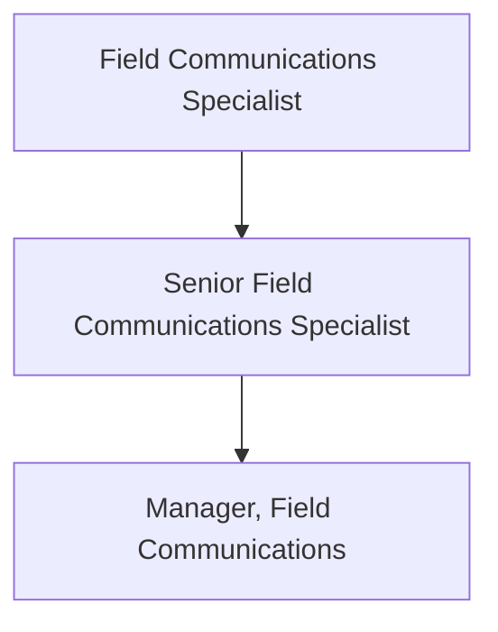

Field Communications is part of the Field Enablement team and is responsible for creating effective, timely, and easily consumable communications with Sales and Customer Success audiences. The team's goal is to help GitLab's field organization sell better, faster, and smarter with communication programs that keep them better informed of organizational/business updates that impact their roles, as well as useful resources that will enable day-to-day work. 

## Responsibilities
- Develop and manage effective field enablement communication strategies and tactics including but not limited to newsletters, videos, memos, presentations, and more
- Collaborate and partner with GitLab Field Operations leaders and Field Enablement team members to build and execute holistic, cross-program communications and change management plans in support of prioritized field enablement-related initiatives
- Champion efforts to improve field enablement communications via [GitLab’s handbook-first approach to learning and development](/handbook/sales/field-operations/field-enablement/#handbook-first-approach-to-gitlab-learning-and-development-materials)
- Develop and implement a strategy for soliciting feedback from GitLab Sales and Customer Success team members to inform enablement priorities and requirements
- Assist in communication of strategies or messages from senior leadership as needed
- Take on additional projects and responsibilities as needed

## Requirements
- BS/BA in communications or relevant field
- Experience in copywriting and editing
- Excellent communication (oral and written) and presentation skills
- Outstanding organizational and planning abilities
- Excellent team player and ability to effectively collaborate with others
- Strong project management skills and attention to detail needing minimal supervision
- Working knowledge of Google docs; photo and video-editing software is an asset
- Excellent communication (oral and written) and presentation skills
- Outstanding organizational and planning abilities
- Excellent team player and ability to effectively collaborate with others
- Knowledge of the software development life cycle, DevOps, and/or open source software is preferred
- You share our [values](/handbook/values/), and work in accordance with those values.
- Ability to use GitLab

## Levels
### Field Communications Specialist (Intermediate) 
The Field Communications Specialist reports to the Manager, Field Communications (if applicable) or the [Senior Director, Field Enablement](/job-families/sales/director-of-field-enablement/#senior-director-field-enablement).

#### Intermediate Job Grade
The Field Communications Specialist (Intermediate) is [6](/handbook/total-rewards/compensation/compensation-calculator/#gitlab-job-grades).

#### Intermediate Responsibilities
- See core responsibilities above

#### Intermediate Requirements
- Proven experience as a communications specialist, preferably with high-tech B2B sales audiences
- Proven experience developing and executing effective sales newsletters is a huge plus
- Experience with Mailchimp (or a similar marketing/communications platform) is preferred 
- Experience in web design and content production is a plus

### Senior Field Communications Specialist
The Senior Field Communications Specialist reports to the Manager, Field Communications (if applicable) or the [Senior Director, Field Enablement](/job-families/sales/director-of-field-enablement/#senior-director-field-enablement).

#### Senior Job Grade
The Senior Field Communications Specialist (Intermediate) is [7](/handbook/total-rewards/compensation/compensation-calculator/#gitlab-job-grades).

#### Senior Responsibilities
* Provide strategic communications advice to field leadership with change management, project management, and internal communications support for key revenue-impacting field initiatives
* Champion efforts to define, maintain, and improve communication and alignment between Go-To-Market functions including Field, Marketing and Product teams
* Lead the planning and execution of key field events including Sales Kick Off and Quarterly Business Reviews
* Develop and manage effective communication strategies that improve transparency and efficiency across the entire field team and with supporting functions
* Oversee Field Communications specialists responsible for managing field communication tactics including QBRs, newsletters, videos, memos, presentations, and more
* Lead a Sales Advocacy program and standardize feedback collection and response to more efficiently bring visibility to team member questions and blockers
* Spearhead efforts to ensure field communications are aligned with expectations, rules, and regulations as we strive toward an IPO
* Iterate on current field communication channels to improve accessibility and adoption across the field organization

#### Senior Requirements
* Proven experience developing and executing effective communication strategies within a high-tech B2B sales environment
* Change management experience
* Impeccable communication (oral and written) and presentation skills

### Manager, Field Communications
The Manager, Field Communications reports to the [Senior Director, Field Enablement](/job-families/sales/director-of-field-enablement/#senior-director-field-enablement).

#### Manager Job Grade
The Manager, Field Communications is [8](/handbook/total-rewards/compensation/compensation-calculator/#gitlab-job-grades).

#### Manager Responsibilities
* Manage, coach, and develop Field Communications Specialist(s) responsible for managing and executing field communication tactics including QBRs, newsletters, videos, memos, presentations, and more

#### Manager Requirements
* People management experience preferred

## Performance Indicators
- [Sales communication/newsletter open and click-through rates](/handbook/sales/field-communications/field-flash-newsletter/#measurement)
- Field survey response rates
- Feedback from key stakeholders

## Career Ladder

### Hiring Process
Candidates for this position can expect the hiring process to follow the order below. Please keep in mind that candidates can be declined from the position at any stage of the process. To learn more about someone who may be conducting the interview, find their job title on our [team page](/company/team/).
* Qualified candidates will be invited to schedule a 30 minute [screening call](/handbook/hiring/interviewing/#screening-call) with one of our Global Recruiters.
* Next, candidates will meet with members of the [GitLab Field Operations team](/company/team/?department=field-operations),
* Then, candidates will meet with the Senior Director of Field Enablement, 
* Finally, candidates will meet with the VP of Field Operations.

Additional details about our process can be found on our [hiring page](/handbook/hiring/).
