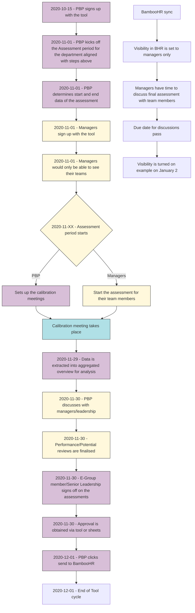

## On this page
{:.no_toc}

- TOC
{:toc}

## Overview

To support the People Group with setting up 9 box assessment for all our team members, People Engineering created a tool.

It's currently still a very basic tool that tries to replace the previous/current method of using Google Slides that were prepared by the People Business Partners. The goal is to have different teams within GitLab use the tool and iterate with feedback provided by the users.

#### Current Sign Up Process
- To use the tool, you can sign up with a GitLab email address via [this link](https://assessment.gitlab.net/). _Note: The email address you sign up with needs to be your email address that is known in BambooHR. This is needed as we fetch data from BambooHR._
- Once you've signed up, you will receive an email to confirm your account. When you confirm, your email address will be automatically linked with your BambooHR ID (that we later will use to fetch data from BambooHR).
- After confirming your account you can sign in via [this link](https://assessment.gitlab.net/users/sign_in) to the tool and get started. 

_Note: There's [an open issue](https://gitlab.com/gitlab-com/people-group/peopleops-eng/assessment-tool/-/issues/20) to look into using Okta as the authentication method._

### Data Used From BambooHR

The tool uses BambooHR as the single source of truth for all the team members data. It has `read-only` access to the following fields:

- Name
- Email
- Division
- Department
- Job Title
- Region (Americas, EMEA or JAPAC)
- Manager
- Employment Status
- Date of Birth
- Entity
- GitLab username
- Gender

It has `write` access to the following fields:
- Performance factor
- Potential factor

The access level for the API token is approved by the Total Rewards Team. If additional access is needed, an Access Request needs to be created.

The tool does not display gender or birth dates for individuals, but rather uses this information as aggregate data for reporting. 

We follow our [confidentiality rules](/handbook/people-group/engineering/#confidentiality) for this project and mirror it to a private project on ops.gitlab.net.

### How To Use The Tool

On 2020-11-05 we had a live training session on the use of the tool and Calibration sessions. You can review the video below and [slides](https://docs.google.com/presentation/d/1EqLUSBSLWbtSRCRqqeQkR-TRRsUdgWYKsD5jiN44vCY/edit?usp=sharing) for reference.  

<figure class="video_container">
<iframe width="560" height="315" src="https://www.youtube.com/embed/Ano9nn6f8Ek" frameborder="0" allow="accelerometer; autoplay; clipboard-write; encrypted-media; gyroscope; picture-in-picture" allowfullscreen></iframe>
</figure>

#### Individual Contributors

As an individual contributor, you are not required to sign up for or use the tool. Your manager will be asked to use the tool to make their recommendations and assess. 

#### People Managers

Before creating an account, it is recommended that you read up on [what Performance/Potential Assessments at GitLab are](/handbook/people-group/performance-assessments-and-succession-planning/).

Once you're familiar with the process, you need to create an account (see "Creating an Account" section) to begin assessments.

**Please note that you will not be able to begin assessments until your aligned [People Business Partner](/handbook/people-group/#people-business-partner-alignment-to-division) initiates the assessment round for your department.**

##### Steps For Managers When Assessing Team Members 

1. Click "Assess your team members within [TEAM]"
1. Click `Open Box View`. This will take you to the Performance/Potential axis view for your team members. 
1. If you are managing other managers, you can check and uncheck the filter for `Direct Reports Only` to view your direct reports only. 
1. On the left side, you will see an overview of all the team members who directly or indirectly report to you. This view is in alphabetical order. 
1. The view is divided in `Eligible team members`, `New hires (started in the last 90 days)` and `Excluded from the Assessment Round`. Team members that are Excluded from the Assessment round have a start date before the threshold as set by the People Business Partner. For example of November 1st as stated [in the handbook](/handbook/people-group/performance-assessments-and-succession-planning/#eligibility). 
1. You can filter your view for `Division`, `Department`, `Roles`, and `Team`. By clicking the "x" next to the filter you can "unfilter" and revert back to the full overview. 
1. The colors indicate the location of the team members. We use this to create awareness pertaining to potential [unconscious bias](/company/culture/inclusion/unconscious-bias/) with regards to locations and regions.
1. After familiarizing with the tool, you're ready to assess your team members and place them in the appropriate box. (Example: Developing with High potential would be aligned with the bottom right box, or box 6).  
1. When hovering over the box numbers you can view the definition, actions, and meaning for each box. This is aligned with the training material provided in [this slide deck](https://docs.google.com/presentation/d/151ys8xkOak9ifU9IPXQydZ44sb_BoMpMocWmjVonLHE/edit#slide=id.g817046ecd3_0_44) and in our [Performance/Potential handbook page](handbook/people-group/performance-assessments-and-succession-planning/#the-performancepotential-matrix). 
1. If you prefer to review team members in a table view, you can click the button in the top left that reads `table view mode`.
1. By clicking `assess` behind the team members' name, you will be asked to `Assess Potential` from a drop down menu and `Assess Performance` from a drop down menu. 
1. If Succession planning is enabled for this round, you can click the `+` behind the team members' name and indicate if and when they would be a successor for the next level. Options are: `Within 6 months`, `Within 12 months` or `After 12-24 months`. Also if someone has been the `Emergency contact`  while the next level leader has been away you can indicate that by checking the box. Note that the Succession part if enabled doesn't have to be filled out for all team members - you could fill out Succession for a limited amount of team members/it's optional. 
1. If Promotion planning is enabled for this round, you can click the `+` behind the team members' name and indicate if and when they would be ready for a promotion. Options are: `Within 3 months`, `Within 6 months`, `Within 12 months` or `More than 12 months away`. The results of this assessment will help with promotion planning for the remainder of/the upcoming year. 
1. After completing the assessment of all team members in box view mode or table view mode, click `Save`. Note: you can also click `Save` in between so that your work doesn't get lost. 
1. Finally, you can start preparing for the [callibration meeting](/handbook/people-group/performance-assessments-and-succession-planning/#calibration-session) to discuss the assessments of your team members and calibrate.  

Note: For Director level and up, there is an extra option to **confirm** the assessments. This is a way to communicate that the assessment
has been _approved_.

#### People Business Partners

If you have any direct reports, you will also be able to use the tool to assess your team members. However, you will also have access
to assess all the team members that are within your People Business Partner (PBP) client group. 

##### Steps For PBPs To Initiate Assessment Periods

1. Log in to the tool via [this link](https://assessment.gitlab.net/users/sign_in) 
1. Click `Start a new round` in the top right corner
1. Select the Department you want to start the Assessment round for from the drop down menu
1. Enter the start and end date of the Assessment round. The handbook provides a period [ranging between 4-6 weeks](/handbook/people-group/performance-assessments-and-succession-planning/#matrix-assessment-timeline) for the full assessment process. 
1. Determine if you want to `Enable Succession planning` and/or `Enable Promotion planning`. This function will give you and your managers the opportunity to add `Emergency contact` status `Successor timeline` as well as `Promotion readiness`. General recommendation is to enable [both](/handbook/people-group/performance-assessments-and-succession-planning/#succession-planning), as it is not possible to turn this feature on after the assessment period has started. 
1. Determine the `Cut off date`. _Note: This is only needed if you want to exclude team members with a hire date after the determined cut off date. For example, to exclude team members hired after October 31st in the review cycle for Q4, October 31st would be the "cut off date".
1. Click `Create Assessment Round` when all details are filled in. 
1. The review round for the department has now been created and managers can sign in within the tool and perform their assessments. Their assessments would only be saved if thy click the `Save` button. 

##### Steps For PBPs to move to review stage used for calibration sessions
1. Log in to the tool via [this link](https://assessment.gitlab.net/users/sign_in) 
1. Click `Dashboard` in the top right corner. 
1. Click `Overview` for any of the departments you would want to be reviewing. 
1. Click on the `Move to Review` button to move the department to review. 
1. Depending on the participants in the Live review session you can select team members who will not be shown in the review session. This can be helpful if someone is joining the review session (a manager for example) but has also been reviewed by the next level leader. 
1. When ticking the box - the team member wil not be shown in the box overview. 
1. If during the calibration session team members move box, it's important to `Save` any changes in placements by clicking the `Save` button. 
1. After the live calibration session, as a PBP, you can analyse results and click `Finalize` when all managers/leaders are on board with the placements. 

##### Steps for PBPs to analyse results after review session
1. Log in to the tool via [this link](https://assessment.gitlab.net/users/sign_in) 
1. Click `Dashboard` in the top right corner. 
1. Click `Overview` for any of the departments you would want to be reviewing. 
1. You will be taken to an overview for that department with bar charts - indicating how many team members are assessed at each level for Potential, Performance and for both. 
1. You can check the boxes behind `Aggregated Data:` to `Show male vs non-male` , `Use Percentages` and/or `Show Regions`. 
1. In the [Performance/Potential handbook page](/handbook/people-group/performance-assessments-and-succession-planning/#what-is-performance) there are guidelines on distribution for team members overall. 
1. Note: Team members who are not places in a box would not count towards the total %. 
1. This functionality already works before assessments have been confirmed and before the calibration sessions. Therefore it can be helpful to review before going into the [live calibration sessions](/handbook/people-group/performance-assessments-and-succession-planning/#calibration-session). 

#### Workflow Process For The Tool

### Feedback and/or Bugs

You can provide feedback or report bugs by creating issues on the project for this tool: [https://gitlab.com/gitlab-com/people-group/peopleops-eng/assessment-tool/](https://gitlab.com/gitlab-com/people-group/peopleops-eng/assessment-tool/)
