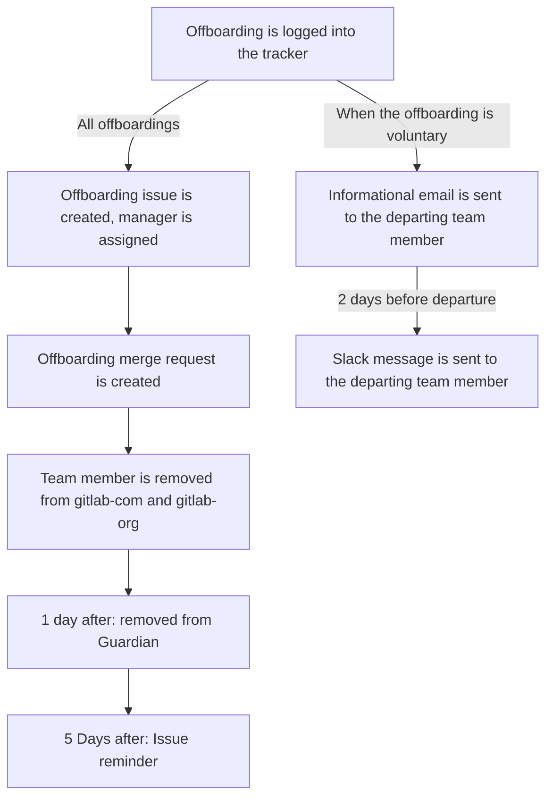

## On this page

{:.no_toc}

- TOC
{:toc}

# Introduction
The People Group Engineering team aims to reduce as much manual work as possible. One of the areas we have done this, is everything related to the employment automation flow.

# Offboarding
Note: this section only discusses items in the offboarding where People Engineering was involved. You can read more about offboarding at GitLab on [this handbook page](/handbook/people-group/offboarding/)

## Timeline Flow


## Automations

### Voluntary offboarding email

When a team member voluntarily leaves GitLab, an email going over the offboarding interview and frequently asked questions is automatically sent to them.

The pipeline is scheduled to run every hour and scan the offboarding spreadsheet for new rows since the last run. For each row, an email is sent to the departing team member using different templates depending on the team member's country.

### Scheduled offboarding issue creation

Every 15 minutes, a pipeline scans the offboarding spreadsheet for rows where the `Garden Leave (Non-US) Start Date`/`Last Working Day (US only) Start Date` occurred within the past 15 minutes. If neither are specified, `Termination Effective Date` is used as a fallback. For each row matching this criterion, it will perform the same actions as if a People Experience Associate ran `/pops run offboarding <id_in_BambooHR_URL>` (see [Manually initiated offboarding issue creation](#manually-initiated-offboarding-issue-creation) and [Offboarding merge request](#offboarding-merge-request) sections).

The manual process is kept as a backup process should the automation fail or for exceptional cases where a team member offboarding cannot be added to the offboarding spreadsheet.

### Manually initiated offboarding issue creation

The Slack command used by the People Experience Associate for offboarding issues is:

```
/pops run offboarding <id_in_BambooHR_URL>
```

The offboarding issue will be automatically assigned to the People Experience Associate
who ran the command and the outgoing team member's Manager.

The job then grabs various details of the outgoing team member, like country of
residence, entity through which they are hired, division, department, job title
etc. For each of these details, it checks for the existence of a task file in
the [`offboarding_tasks` folder](https://gitlab.com/gitlab-com/people-group/people-operations/employment-templates/-/tree/master/.gitlab%2Fissue_templates%2Foffboarding_tasks)
of the `employment` project. These tasks files are of the format
`country_<country name>.md`, `entity_<entity name>.md`, `division_<division name>.md`,
`department_<department name>.md`, etc. If such a file is found, it includes
contents of those files also in the offboarding issue.

This issue is added to the [team member's epic](/handbook/people-group/engineering/employment-issues#epics).

### Offboarding merge request

The `offboarding` command will also create a merge request to the `www-gitlab-com` project. This MR
includes:
- Removing the individual file from the `data/team_members/person` directory
- Removing the picture used in the previous file
- Adjusting the `reports_to` in case the offboarded team member had reports
- Removing the pet picture in case the team member had any
- Update the CODEOWNERS file: change to the manager or remove if the manager is already a codeowner for that file

### Remove from Guardian

When a team member leaves GitLab they also need to be _terminated_ on Guardian. We have a daily check for offboarded team members. Every day we check if there are any new offboarding issues created for the day before. For those, we check if the team member is located in the United States. If there are matches, we create a file with the following naming convention: `04_employee_termination_mmddyyhhmmss.csv` and add the users employee id and their end date to the file. This is then uploaded to Guardian so they can process it.

You can read more about how team members are added to Guardian [here](/handbook/people-group/engineering/onboarding#sync-to-guardian).

### Redirect rule reminder

When a team member is offboarded, there's a redirect rule that is setup on Google Workspace for
the outgoing team member. After 5 days this redirect rule needs to be removed.
To make sure this isn't forgotten, a scheduled pipeline is set up for the bot to leave a
GitLab issue comment reminding the People Experience Associates to removes the rule.

Currently, the pipeline is scheduled to run everyday at 04:00 AM UTC. It will comment on
all the offboarding issues created 5 days before the current date.
