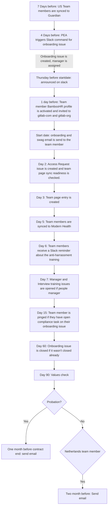

## On this page

{:.no_toc}

- TOC
{:toc}

# Introduction

The People Group Engineering team aims to reduce as much manual work as possible. One of the areas we have done this, is everything related to the employment automation flow.
Everything on this page, assumes the team member is already present in BambooHR. To read more about how they get synced to BambooHR, you can read [this handbook section](/handbook/people-group/engineering/gh-bhr-sync).

# Onboarding

Note: this section only discusses items in the onboarding where People Engineering was involved. You can read more about onboarding at GitLab on [this handbook page](/handbook/people-group/general-onboarding/)

## Timeline Flow



## Sync to Guardian

I-9 forms are used to verify the identity and employment authorization of individuals hired for employment in the United States. All U.S. employers must properly complete Form I-9 for each individual they hire for employment in the United States. At GitLab we use [Guardian](https://www.Guardian.com/products/meet-guardian/) to help us with this process.

To avoid manually having to manage team members to this tool, there is a custom sync set up between BambooHR and Guardian. This sync works with uploading CSV files to them. There are 4 different files to be uploaded in the process, two of them are fully automated and two need a trigger from a People Experience Associate.

Note: this only looks at team members with "United States" as their listed country in BambooHR. All other team members are ignored for this sync.

### New hires

This syncs the new hires to Guardian and is fully automated. Every day we check which team members have a start date in 7 days. If there are team members, we create a file with the following naming convention: `01_employee_add_mmddyyhhmmss.csv`. For every eligible team member the following information is added to the file:

- hire date: the date they start working at GitLab
- employee id: the unique employee ID that has been assigned to them in BambooHR (not to be confused with the ID of the user in BambooHR)
- legal entity: either `GitLab Inc` or `GitLab Federal LLC`. This depends on what is filled in on the `location` field in BambooHR.
- first and last name
- personal email address

Note that if a team member is added as a last minute hire (in this case defined as with less then 7 days to their start date), the team member will not be picked up by the sync. However a People Experience Associate can run the following command in Slack so that a new team member upload file is created to Guardian:

`/pops run uploadtoi9 <ID_IN_BambooHR_URL>`

### Update hires

This syncs updates to Guardian. If a change happens in hire date, legal entity or the team member's name, this change needs to be reflected on Guardian as well. This one needs to be triggered by a People Experience Associate by running the following Slack command:

`/pops run reuploadtoi9 <ID_IN_BambooHR_URL>`

This will trigger a pipeline that fetches the team member on BambooHR. A file with the following naming convention is created: `02_employee_update_mmddyyhhmmss.csv`. The same fields as for new hires are added to this file. Once done, the file is uploaded to Guardian where they process it.

### Rehired team member

This syncs rehires to Guardian. A rehire is defined as a team member who has a previous I-9 record in Guardian that was terminated and the employee is being rehired. This one needs to be triggered by a People Experience Associate by running the following Slack command:

`/pops run rehirei9 <ID_IN_BambooHR_URL>`

This will trigger a pipeline that fetches the team member on BambooHR. A file with the following naming convention is created: `03_employee_rehire_mmddyyhhmmss.csv`. The same fields as for new hires are added to this file except that there is also a column `rehire` added where the value is set to `yes`. Once done, the file is uploaded to Guardian where they process it.

If an I-9 is not on record in Guardian then you will need to run New Hire Pops command above.

## Onboarding issue creation
The onboarding issue creation is a semi-automated process. Meaning that it needs to be triggered by a People Experience Associate to be started. The way they trigger this is by using a Slack command:

```
/pops run onboarding <id_in_BambooHR_URL>
```

The onboarding issue will be automatically assigned to the People Experience Associate
who ran the command and the incoming team member's Manager.

The onboarding tasks that are applicable to all team members are listed in the
general [`onboarding.md`](https://gitlab.com/gitlab-com/people-group/people-operations/employment-templates/-/blob/master/.gitlab/issue_templates/onboarding.md)
file. It will be included by default in the onboarding issue.

The job then grabs various details of the incoming team member, like country of
residence, entity through which they are hired, division, department, job title
etc. For each of these details, it checks for the existence of a task file in
the [`onboarding_tasks` folder](https://gitlab.com/gitlab-com/people-group/people-operations/employment-templates/-/tree/master/.gitlab/issue_templates/onboarding_tasks)
of the `employment` project. These tasks files are of the format
`country_<country name>.md`, `entity_<entity name>.md`, `division_<division name>.md`,
`department_<department name>.md`, `role_<exact job title>.md`, etc. If such a file is found, it includes
contents of those files also in the onboarding issue.

Role templates don't take seniority into level. For example SDR 1, 2, or 3 would all receive the SDR template.

If you receive a question from a manager about why a template was not linked in an onboarding issue, be sure to check the naming convention of the template and ensure everything matches up in BambooHR with the entity, division, department, etc. If everything looks like it's matched up, reach out to the People Group Engineer for additional assistance.

Note: If a People Experience Associate needs to create the onboarding issue for interns, they can use the same Slack command.

This issue is added to the [team member's epic](/handbook/people-group/engineering/employment-issues#epics).

If you want to read more about how employment issues are set up, please read [this section](/handbook/people-group/engineering/employment-issues).

## Joining announcement

A scheduled pipeline is configured to automatically send a message containing a
list of all new team members who are joining GitLab in the following week. It
includes details like name, email address, joining date, and their job title.
The message also includes a link to a [Sisense chart](https://app.periscopedata.com/app/gitlab/503779) containing a
detailed breakdown and overview of the hiring process over time.

While we create this message, we check if there are any team members that have
"missing data". When they do, the message, is sent to `#peopleops-alerts`. This
way, the People Experience associate, can make sure the data is added and run the
following command to re-run the pipeline:

```
/pops run joiningannouncement
```

When there is no missing data, the message is posted directly to `#team-member-updates`.

Currently, the pipeline is scheduled to be run at 08:00 AM UTC every
Thursday.

## Invited to GitLab.com
We run a scheduled pipeline every day that invites team members starting the following day to the two main GitLab groups:

- gitlab-com
- gitlab-org

The invite email is send to their `GitLab` email address which they will get access to the next day.

## Enable self-service
Our team members are expected to update their BambooHR profile on their first day at GitLab. To be able to do that they need to have `self-service` access level enable on BambooHR. We run a scheduled pipeline every day that enables this for team members starting the following day.

## Onboarding Email

This is the [email](https://gitlab.com/gitlab-com/people-group/people-operations/employment-templates/-/tree/master/email_templates) that is sent to our team members on the morning of their first day of employment (based upon the onboarding date in the issue title). The email is cc'd to `people-exp@domain`.

Every day we run 3 scheduled pipelines. They are each set up for a specific region:

- Americas at 10 AM UTC
- EMEA at 4 AM UTC
- JAPAC at 6 PM UTC

For the JAPAC pipeline, it will fetch the team members with a start date for the next day (timezones).
For the EMEA and Americas pipeline, it will fetch all the team members that have a start day equal
to the current day (so who is starting today). The pipeline then filters out the ones for the region
they need to send the email to. This all is to ensure we don't send out the email too late or too early.
The region of the team member is determined from the region that is on their BambooHR profile. This is the
first iteration, if we need to split it up by country, we can rework the current implementation.

We fetch some other data besides the region as well:

- their onboarding issue URL
- their name

This data is used to populate the email that we then send to them. The email address used to send the email is `onboarding@domain` and is set with a `reply-to: people-exp@domain` as nobody monitors replies to `onboarding@`. The email address is strictly used for automation.

## Swag Email

This is the [email](https://gitlab.com/gitlab-com/people-group/people-operations/employment-templates/-/blob/master/email_templates/swag_email.md) that is sent on the first day of a new team member so they receive the code to get a discount at the swag store. The email is cc'd to `people-exp@domain`.

Every day at 9 AM UTC we run a scheduled pipeline. This pipeline will fetch all the eligible team members. An eligible team
member means:

- Team member who is on their first day of employment at GitLab

The email address used to send the email is `onboarding@domain` and is set with a `reply-to: people-exp@domain` as nobody
monitors replies to `onboarding@domain`. The email address is strictly used for automation.


## Access Request issue creation

To get access to the tools our team members need for their job, an Access Request (AR)
issue needs to be created. To make sure our team members experience a good onboarding,
we automated this process by creating the AR Role based entitlement issue
with the bot.

Every day we run 3 scheduled pipelines. They are each set up for a specific region:
- Americas at 10 AM UTC
- EMEA at 4 AM UTC
- JAPAC at 6 PM UTC

For the JAPAC pipeline, it will fetch the team members with a start date for the current day (timezones).
For the EMEA and Americas pipeline, it will fetch all the team members that have a start day equal
to the previous day (so who started yesterday). The pipeline then filters out the ones for the region
they need to send the email to. This all is to ensure we don't create the issue too late or too early.
The region of the team member is determined from the region that is on their BambooHR profile.

For all these members it will check if it is possible to create an Access Request
issue. It will only work for the members with roles that have a set template in the
[role baseline access requests tasks directory](https://gitlab.com/gitlab-com/team-member-epics/access-requests/tree/master/.gitlab/issue_templates/role_baseline_access_request_tasks).

The templates are created on a role level and can be created for the specialty level as well. For example
if you have a person with the role `Security Engineer, Strategic Security`. The code will look for two templates:
`role_security_engineer.md` and `role_security_engineer_strategic_security.md`. Note: you don't need to have both created,
but if there are two, the code will use both to create the issue, if there is just one, it will create the one it can find.

The issue will be created in the [AR project](https://gitlab.com/gitlab-com/team-member-epics/access-requests).

The bot will announce in Slack (#peopleops-alerts) the list of people that we were able to
create the AR. As well as the list of people (with their role) that we weren't
able to create the AR for. This way we can connect with the teams so they can add a template for this role.

For those that we can not create an issue, the Employment bot will leave a comment on the onboarding issue. In this comment the manager is tagged to inform them and we ask them to create the issue and if needed to create a template for future hires.

Note: People Operations is not responsible for creating or maintaining the templates, each team
is responsible for creating the templates for their roles. This is also explained in the
[README](https://gitlab.com/gitlab-com/team-member-epics/access-requests/blob/master/README.md) of the project.

Here's a video with the People Group Engineer going over the AR automation. They discuss
how it works and how a template can be added.
<figure class="video_container"><iframe src="https://www.youtube.com/embed/aPe77q23OE8" width="560" height="315"></iframe></figure>

## Team page readiness check
Every day at 09AM UTC, we have a pipeline running that fetches all the team members that started yesterday and check if they can be synced to the team page. Currently the only required item to 
determine if we can sync them is that they need to have a GitLab username.

If we can't determine their GitLab username (from the issue or from their BambooHR profile) we 
will leave an issue note on the onboarding issue asking them to fill in their BambooHR profile correctly.

## Sync to team page
Every day at 09AM UTC, we have a pipeline running that syncs our new team members to the `www-gitlab-com` project, so that they show up on the team page.

We fetch all the new team members with a start date of the day before yesterday and check if they opted-in on
being synced to the team page. Opt-in happens by setting `Export Name/Location to Team Page?` to `Yes` on their BambooHR profile. This is a task on day one for the new team member.

If they selected yes, we grab some data (name, job title, start date, department and country) and format it,
so it can be added to the team page entry. If they did not opt-in, we still add an entry to the team page.
However that entry is anonymized. For every new team member, we commit a new file in the `data/team_members` directory.

We then create a merge request on `www-gitlab-com` project so it can be merged.

The merge request is assigned to the People Experience Team and they set it to merge when the pipeline succeeds.

In case team members did not fill in the required data, we won't be able to sync them. A People Experience Associate
can later on sync them with the following Slack command:

`/pops run teampageindividual <bamboo_id>`.

This will spin up a pipeline and fetch the details. Note that if the team member was synced already, it will abort the sync.

## Sync to Modern Health
[Modern Health](/handbook/total-rewards/benefits/modern-health) needs a weekly update about all our active
team members. This proces has been automated by using their `Upload to AWS S3` functionality. Every Friday
at 1PM UTC we run a scheduled job. This job fetches all the active team members from BambooHR and stores
the following in a CSV file:

- First name
- Last name
- Work email
- Employee ID
- Department
- Start Date

This CSV file is then uploaded to a S3 bucket that is maintained by Modern Health. They process the file
so the team members can have access to Modern Health.

## Slack reminder for the anti-harrassment training
We have a daily pipeline that checks everyday who started 6 days ago. For those team members, we send a reminder
that they have to complete the anti-harrassment training.

## Manager and Interview training issues
There's a scheduled pipeline that runs every day that checks for hires that started a week ago.
For those hires we will look if the incoming
team member is a people manager. Currently there's no exact field
on BambooHR for us to check this. The way we do this is by by looking
at their job title. If it **starts** with any of the following:

- `Team Lead`
- `Manager`
- `Senior Manager`
- `Director`
- `Senior Director`
- `Chief`
- `VP`
- `Vice President`

We also consider the person a people manager when the job title **ends** with:

- `Area Sales Manager`

We create the Interview Training and Becoming a Manager issues in the
[People Group Training project](https://gitlab.com/gitlab-com/people-group/Training).

## Onboarding compliance checks
We run a scheduled pipeline every day that fetches our team members that are on their 15th day of employment at GitLab. We look on their onboarding issue if they have any compliance tasks open.

A compliance task is marked with the `:red-circle` icon. If they have any open tasks the onboarding bot will tag the user asking to finish the open tasks.
## Onboarding issue closing

It is expected that onboarding issues be completed and closed within 30 days of
opening. To remind team members about this, we are using the `due date`
functionality in GitLab issues. When an onboarding issue is created, we
automatically calculate the due date by adding 31 days to their start date.
GitLab will send a reminder notification email to all the assignees of the issue
near the due date.

In addition to this due date, team members get an additional 30 days to complete
and close the onboarding issue. In total, a team member gets around 60 days
to complete their onboarding issue.

We have a scheduled pipeline to close the outdated issues (issues that
have been open for more than 60 days). This pipeline will add a comment on the
issue that it is being automatically closed and what the team members should do
if they have onboarding tasks remaining.

Currently, the pipeline is scheduled to be run at 09:30 PM on every Friday. It
will close all the onboarding issues created before 60 days from that date.

## Values-check in Email

This is the [email](/handbook/people-group/values-check-in/) that is sent to our team members after 90 days of employment.

Every day at 10 AM UTC we run a scheduled pipeline. This pipeline will fetch all the team members that are eligible to get this values check-in.
For every eligible team member we send out two emails:

- one to the team member
- one to the team member's manager: this is determined by the manager for the team member on BambooHR

The email address used to send the email is `peoplespecialists@domain` and is set with a `reply-to: peopleops@domain` as nobody monitors replies to `peoplespecialists@domain`. The email address is strictly used for automation.

## Probation Ending Email

This is the [email](https://gitlab.com/gitlab-com/people-group/General/-/blob/master/.gitlab/email_templates/probation_ending_manager.md)
that is sent when a probation period is about to end for a team member. The email is sent to the team member's manager and CC'd to `people-exp@domain`

Every day at 9 AM UTC we run a scheduled pipeline. This pipeline will fetch all the eligible team members. An eligible team
member means:

- the country listed on their BambooHR profile is a country that uses probation
- they have probation that will end in 14 days

The email address used to send the email is `onboarding@domain` and is set with a `reply-to: people-exp@domain` as nobody
monitors replies to `onboarding@domain`. The email address is strictly used for automation.

## Netherlands Contract Ending Email

This is the [email](https://gitlab.com/gitlab-com/people-group/General/-/blob/master/.gitlab/email_templates/netherlands_temp_contract_renewal.md) that is sent to the team member's manager two months before the team member's contract end. The email is cc'd to `peopleops@domain` and the relevant People Business Partner.

Every day at 9 AM UTC we run a scheduled pipeline. This pipeline will fetch all the eligible team members. An eligible team
member means:

- Team member who lives in the Netherlands
- and who's temporary contract ends in two months.

The email address used to send the email is `peoplespecialists@domain` and is set with a `reply-to: peopleops@domain` as nobody monitors replies to `peoplespecialists@domain`. The email address is strictly used for automation.
