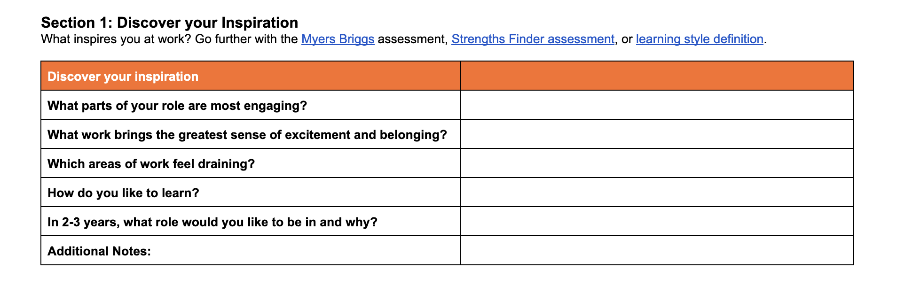
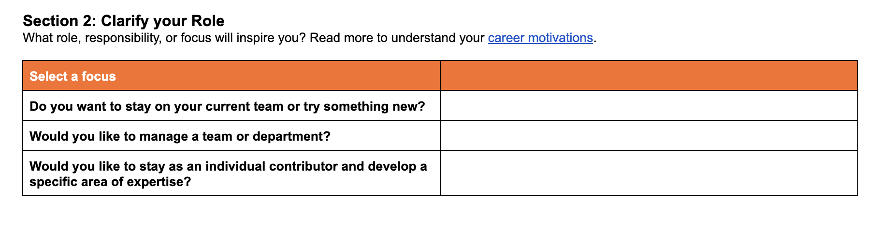
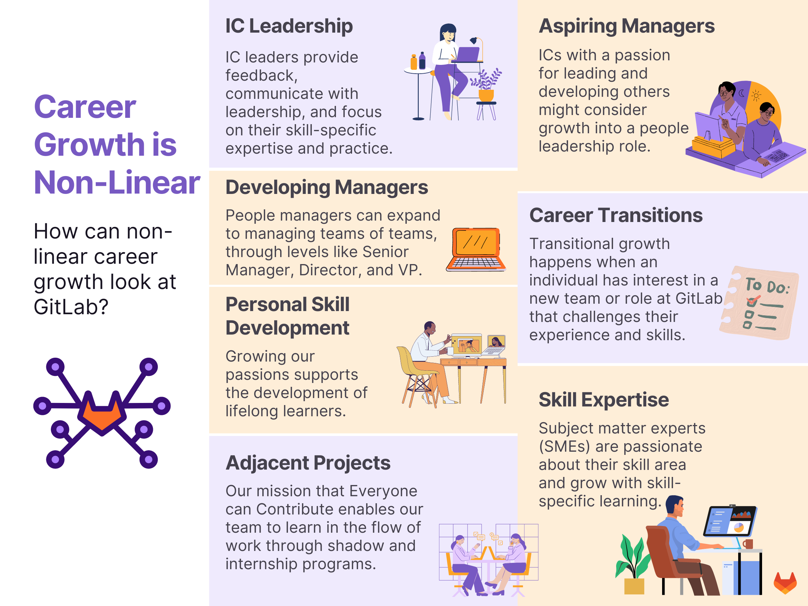
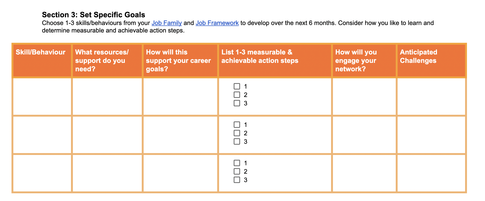
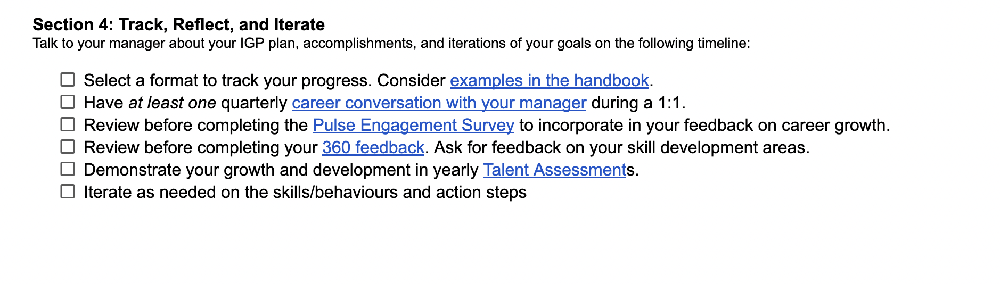

## On this page
{:.no_toc .hidden-md .hidden-lg}

- TOC
{:toc .hidden-md .hidden-lg}

# Step by Step Guide to Completing the GitLab Individual Growth Plan (IGP)

This guide is for team members who are looking for guidance on how to complete their IGP. The guide will go through each section of the IGP including resources, inspiration, and suggestions for how to best use the template to plan and take action towards your career goals.

# Your Role with the IGP

As the Directly Responsible Individual (DRI) of your career, it’s your responsibility to make decisions that best serve your growth. Consider this course as guidance, not prescription. At its core, the Individual Growth Plan (or IGP) is a tool to reflect, set, and action on goals.

Once your IGP is complete, it’s important to think about how you’ll practice continuous learning. 
The best way to do this is to block calendar time for learning. This blocked time might start with your work on the IGP and evolve to taking a course, earning a certification, or attending a webinar. Socialize the time you’re spending learning to your team - especially if you’re a manager. We all play a role in modeling continuous learning at GitLab and encouraging other to prioritize their growth.

# Section 1: Discover your Inspiration

Reflection helps guide our career decisions. Section 1 of the IGP is focused on reflection, asking these 5 questions:

{: .shadow.medium.center}

Be flexible with yourself in this section. Some choose to make this an elaborate reflection and lean on resources like the Myers Briggs assessment, Strengths Finder assessment, or learning style definition. Others treat it like a quick check-in.

**Get Inspired: Listen to a group of GitLab team members share what gives them energy, and what drains them, at work. Do you notice any of the same trends in your own reflection?**

**What energizes you?**

<!-- blank line -->
<figure class="video_container">
  <iframe src="https://www.youtube.com/embed/vkFVwW-sovA" frameborder="0" allowfullscreen="true"> </iframe>
</figure>
<!-- blank line -->

**What drains your energy?**
<!-- blank line -->
<figure class="video_container">
  <iframe src="https://www.youtube.com/embed/ST2IA-4iX-E" frameborder="0" allowfullscreen="true"> </iframe>
</figure>
<!-- blank line -->

**Tip: Having trouble answering these questions? Try using a journal to record your energy throughout the day for 1 week, then look back at what drained or energized you.**

# Section 2: Clarify your Role

Knowing your growth direction helps you set goals and find the right resources. This is the goal of Section 2 of the IGP - to clarify your role trajectory. 

{: .shadow.medium.center}

Think big in this section. Do you want to become a manager? Are you growing as an IC leader? Maybe you’re ready for a career transition to a new team. Remember that at GitLab, career growth is non-linear - we grow in all directions. 

{: .shadow.medium.center}

# Exploration: Prepare for Section 3

If you’re a planner, section 3 might feel like home. Or, you might feel uncomfortable fitting your big career goals into one Google Sheet.

**Remember - Make this your own - if you have 7 career goals this year, add 7 lines to the page. If you have 1, remove the others. It’s your learning plan!**

GitLab team members have a repository of resources, programs, and learning platforms at their disposal. Before you start filling in Section 3, it’s important to do some exploration. [Here’s a directory](/handbook/people-group/learning-and-development/career-development/#directory) of handbook links to guide you. Bookmark learning programs that are most relevant to the direction you’d like to grow.

**Tip: If you can’t find resources internally, refer to the Growth and Development Benefit to cover university programs, coding classes, external certifications, and more.**

# Section 3: Set Specific Goals

Done exploring for now? It’s time to populate section 3 of the IGP. Let’s review each column:

{: .shadow.medium.center}

| Column | Description |
| ----- | --------------- |
| Skill/Behavior | What are you learning? Identify the main skill/behavior that you want to develop. |
| What resources/support do you need? | List the results of your exploration. Include handbook links, Growth and Development benefit issues, self-paced course names, etc. |
| How will this support your career goals? | How will this make you a better team member? How will it contribute to your ability to do your job and live our CREDIT values? |
| List 1-2 measurable and achievable action steps | Get specific here. Do you need to sign up or apply? Set aside time to learn? Is there a deadline? Clarify all necessary steps. |
| How will you engage your network? | Plan to share what you  learn. Will you post on LinkedIn, present to your team, or share with your coach/mentor? |
| Anticipated Challenges | Get ahead of challenges for greater support. Will it be hard to find time? Do you need accountability support? |

# Section 4: Track, Reflect, and Iterate

The IGP is a dynamic, living document. To make the most of your IGP, we’ve made suggestions about how and when you might reference, reflect, and iterate on your goals. Review them and set calendar reminders where appropriate so you don’t forget to revisit your IGP. Check them off directly in the IGP as you complete each piece.

{: .shadow.medium.center}

# Get Inspired

Review these example IGPs for ideas and inspiration:

1. [IC growing in your role](https://docs.google.com/document/d/19griy2U2nXxpNPfbrGeQn_LTazAE62osgyGmExLbYlY/edit)
1. [Aspiring Manager (IC to manager)](https://docs.google.com/document/d/1-osaABt5dsS9GO7Wm-USohcyiSuS2BXAru-kf9K6ItA/edit)
1. [People Manager growth (within role and to senior+ roles)](https://docs.google.com/document/d/1jP3qPN69otQ8fXI1LXfvnjgO-Prq_rODux6sLXygrQ4/edit)
1. [Lateral Growth/Career Transition (new team or division)](https://docs.google.com/document/d/1grTPbWxFHDcfskAEI23t4EUV1UoW1sJQgxNE4LTfD6k/edit)

# Additional Resources

1. [LinkedIn Learning Course: Building a Career Plan](https://www.linkedin.com/learning/how-to-develop-your-career-plan/introduction?autoplay=true&dApp=94866976&leis=LAA&u=2255073)

1. Watch this interview with a GitLab team member who’s used the IGP to plan a career transition at GitLab:

<iframe width="560" height="315" src="https://www.youtube.com/embed/0ih0lMoKxN0" title="YouTube video player" frameborder="0" allow="accelerometer; autoplay; clipboard-write; encrypted-media; gyroscope; picture-in-picture; web-share" allowfullscreen></iframe>

1. Listen to team members speak about non-linear careers at GitLab:

<iframe width="560" height="315" src="https://www.youtube.com/embed/ttQv6tCaDD0" title="YouTube video player" frameborder="0" allow="accelerometer; autoplay; clipboard-write; encrypted-media; gyroscope; picture-in-picture; web-share" allowfullscreen></iframe>

