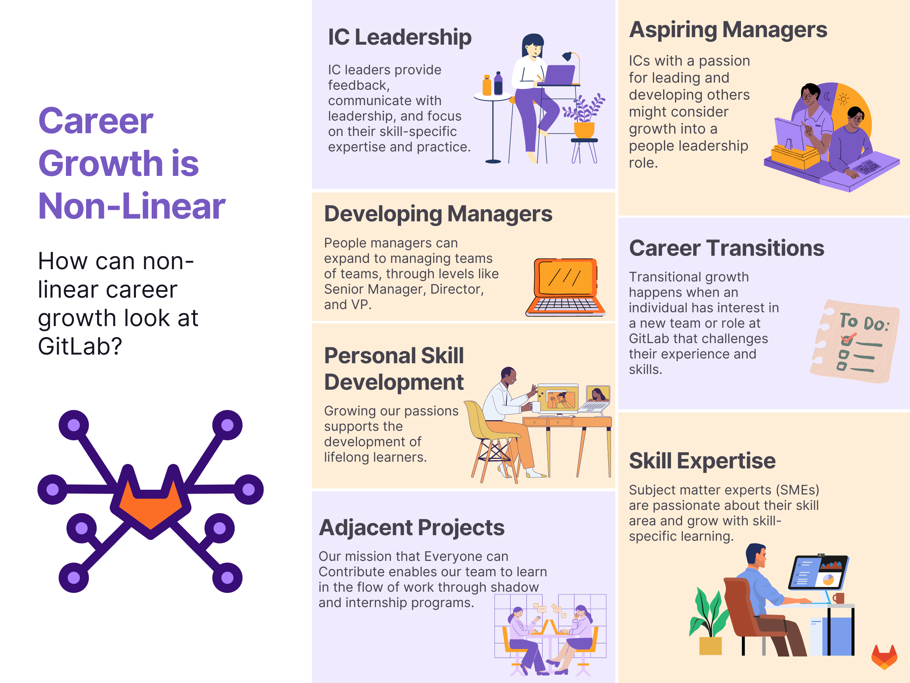

## On this page
{:.no_toc .hidden-md .hidden-lg}

- TOC
{:toc .hidden-md .hidden-lg}

## What is Career Development

Career development is the non-linear, lifelong growth process integrating learning, work, leisure, and change. It happens in all directions, including subject matter and skill expertise, lateral growth to new and adjacent teams, and linear growth through a job family. Utilize the recources on this page to help you navigate your career development journey at GitLab.

{: .shadow.medium.center}

### Self authorship and your career development

A live speaker series hosted in March 2022 with [Lavinia Mehedintu](https://www.linkedin.com/in/laviniamehedintu/) gets to the 'why' of career development. Embrace your own self-authorship while using the following tools to fit your goals. In the session, Lavinia spoke about:

1. The impact of growth mindet on career development, and tips for shifting out of a fixed mindset
1. Trust building in an all remote space and the role that people managers play in building this trust
1. Learning and building out loud, sharing career development externally, and the power of social learning

<iframe width="560" height="315" src="https://www.youtube.com/embed/UsGlTOmM2DM" title="YouTube video player" frameborder="0" allow="accelerometer; autoplay; clipboard-write; encrypted-media; gyroscope; picture-in-picture" allowfullscreen></iframe>

## Directory

Navigate to various career development resources located throughout the GitLab handbook:

### Resources

  

    <a href="/handbook/total-rewards/benefits/general-and-entity-benefits/#growth-and-development-benefit" class="btn btn-purple" style="width:250px;margin:5px;"> Growth and Development Benefit </a>
    <a href="/handbook/people-group/learning-and-development/career-development/ic-development" class="btn btn-purple" style="width:250px;margin:5px;">Programs for Individual Contributors</a>
    <a href="/handbook/people-group/learning-and-development/career-development/#skill-of-the-month" class="btn btn-purple" style="width:200px;margin:5px;">Skill of the Month</a>
    <a href="https://docs.google.com/presentation/d/1yY0ofMGgzN07ylTAnRP5geFnWcgUYkiVlcIyR54tpD0/edit#slide=id.g29a70c6c35_0_68" class="btn btn-purple" style="width:200px;margin:5px;">Career Development Workshop</a>
    <a href="/handbook/people-group/learning-and-development/career-development/skill-of-the-month" class="btn btn-purple" style="width:250px;margin:5px;">Skill of the Month Recordings</a>
  

### Programs

  

    <a href="/handbook/people-group/learning-and-development/career-development/#skill-of-the-month" class="btn btn-purple" style="width:200px;margin:5px;">Mentorship</a>
    <a href="/handbook/people-group/learning-and-development/internship-for-learning" class="btn btn-purple" style="width:200px;margin:5px;">Internship for Learning</a>
    <a href="/handbook/ceo/shadow/" class="btn btn-purple" style="width:200px;margin:5px;">CEO Shadow</a>
  

### Organization Tools

  

    <a href="/handbook/people-group/learning-and-development/career-development/#tracking-your-career-development" class="btn btn-purple" style="width:200px;margin:5px;">Goal Tracking Resources</a>
    <a href="/handbook/people-group/learning-and-development/career-development/#having-career-development-conversations" class="btn btn-purple" style="width:250px;margin:5px;">Career Development Conversations </a>
    <a href="/company/team/structure/#job-frameworks" class="btn btn-purple" style="width:200px;margin:5px;">Job Frameworks</a>
    <a href="https://docs.google.com/document/d/1O45gRkQqUa3dEgjJXGwdBE7iZbBI22EPC7zrkS3T4dM/edit" class="btn btn-purple" style="width:200px;margin:5px;">Tips for Creating Effective Growth Plans</a>
  

## Roles and Responsibilities

| Role | Responsibilities |
| -------- | --------------- |
| Team Member Owned | - Take charge of your own development and career  - Close the skill gap for current and future positions   - Seize development and stretch opportunities   - Remember there are no promises or guarantees of a promotion |
| Manager Facilitated| - Take time with team members to discuss their career aspirations   - Listen and provide feedback, ideas and contacts   - Make choices to support their development |
| GitLab Supported | - Communicate future direction and skills requirements   - Provide information and tools when applicable   - Communicate internal opportunities |

### 70-20-10 Rule for Development

<iframe frameborder="0" width="600" height="550" style="position: absolute; top: 0; left: 0; width: 100%; height: 100%;" src="https://view.genial.ly/62fd2aa9021efd0018b7c8eb" type="text/html" allowscriptaccess="always" allowfullscreen="true" scrolling="yes" allownetworking="all"></iframe> 
 

1. 70% of your development should come from on-the-job and action learning.  This can include development experiences like managing a project, serving on a cross-functional team, taking on a new task, job shadowing, job rotation, etc.
1. 20% of your development should come from interactions with others.  This includes having a mentor, being a mentor, coaching, participating in communities of practice, providing and receiving feedback, serving as a leader in your organization, etc.
1. 10% of your development should come from training, including classes, seminars, webinars, podcasts, reading, conferences, etc. GitLab offers a [growth and development benefit](https://about.gitlab.com/handbook/total-rewards/benefits/general-and-entity-benefits/growth-and-development/) to help with this.

## Career Development versus Career Mobility

GitLab team members [should not feel pressure to climb the proverbial ladder](/handbook/leadership/1-1/#key-points). We recognize that not everyone wants to advance or move to a new level. Skill development and promotion are not mutually exclusive.

[Unique characteristics and experiences influence how we solve problems](/company/culture/inclusion/) and view success. Not everyone views promotion as a measure of success, and team members will not be thought less of or penalized for holding this view.

Team members are encouraged to be [open and honest](/handbook/values/#transparency) with their manager. You are encouraged to learn and develop your skills without pressure to in turn seek promotion. If you feel you are not being supported in this way, please visit the [Need Help?](/handbook/people-group/#reach-peopleops) portion of the People Group Handbook.

| Topic | Definition | Examples |
| ----- | ----- | ----- | 
| Development | Choosing and building a career path that accelerates professional growth. | Learn new skills, complete a course, be a mentee |
| Mobility | Career mobility involves both lateral (promotions) and horizontal (transfers) movement along a career path. Mobility involves applying experience and skills as leverage for a new role. | Mentor to learn leadership skills with the intention of applying for a manager role; Complete a job shadow or internship and upskill to transfer to a new team.  |

## Career Development and Wellbeing
<!-- blank line -->
<figure class="video_container">
  <iframe src="https://www.youtube.com/embed/2XmmGYlsEP8" frameborder="0" allowfullscreen="true"> </iframe>
</figure>
<!-- blank line -->
Watch this live speaker series where we talk to Leah Weiss of [Skylyte](https://www.skylyte.com/) about the connection between wellbeing, purpose, and our career growth.

## Document your Career Development

### Start Here

| Purpose | Resource |
| --------------- | ----- |
| I want to plan and document my career and skill-based goals at GitLab. | [Individual Growth Plan, or IGP](/handbook/people-group/learning-and-development/career-development/#individual-growth-plan) |
| I want to keep track of my value-aligned contributions. | [Accomplishment Tracker](/handbook/people-group/learning-and-development/career-development/#tracking-your-accomplishments) |
| I want to monitor the status of my goals and achievements. | [Health Tracker: Growth Plan](/handbook/people-group/learning-and-development/career-development/#health-tracker-growth-plan)|
| I prefer to use GitLab to track my career goals. | [Using GitLab Epics](/handbook/people-group/learning-and-development/career-development/#use-gitlab-epics-to-track-your-career-development) |
| I need advice on what skills to develop based on my role at GitLab. | [Job Frameworks](/company/team/structure/#job-frameworks) |

### Individual Growth Plan 

The [Individual Growth Plan (IGP)](https://docs.google.com/document/d/1ZjdIuK5mNpljiHnFMK4dvqfTOzV9iSJj66OtoYbniFM/edit) is a great way to plan and action on your career growth. 

Watching the [How to Develop your Career Plan](https://www.linkedin.com/learning/how-to-develop-your-career-plan/introduction?u=2255073) course on LinkedIn Learning for guidance on how to get started filling out your IGP. 

1. Make a copy of the [Individual Growth Plan (IGP) Template](https://docs.google.com/document/d/1ZjdIuK5mNpljiHnFMK4dvqfTOzV9iSJj66OtoYbniFM/edit) + save to your drive
1. Fill out the template. Refer to the [job frameworks](https://about.gitlab.com/company/team/structure/#job-frameworks) and your job family to determine a skill and behavior focus.
1. Have a career conversation with your manager and review your IGP in your next 1:1
1. Make a plan that integrates working on your IGP during the flow of work by setting aside weekly or monthly time dedicated to learning

Watch: interivew with a GitLab team member who's used the Individual Growth Plan in their career development. 
<!-- blank line -->
<figure class="video_container">
  <iframe src="https://www.youtube.com/embed/0ih0lMoKxN0" frameborder="0" allowfullscreen="true"> </iframe>
</figure>
<!-- blank line -->

Watch: August 2021 Live Learning on filling out the IGP
<!-- blank line -->
<figure class="video_container">
  <iframe src="https://www.youtube.com/embed/dJezH0ToqLk" frameborder="0" allowfullscreen="true"> </iframe>
</figure>
<!-- blank line -->

### Tracking your Accomplishments

Some call it a "brag sheet". Some call it a CREDIT Tracker. Either way, it's a great place to collect your accomplishments and feedback. Utizlize the accomplishment tracker in conjunction with the IGP and GitLab Epics. 

<iframe width="560" height="315" src="https://www.youtube.com/embed/oVd3jN76b5c" title="YouTube video player" frameborder="0" allow="accelerometer; autoplay; clipboard-write; encrypted-media; gyroscope; picture-in-picture" allowfullscreen></iframe>

1. Make a copy of the [Accomplishment Tracker Template](https://docs.google.com/document/d/1tBjEbX-p4MYinEsdU-91KDQ_BJkihwrBKZ0n9yfdLjo/edit?usp=sharing) + save to your drive
1. Start filling it out (check out the video below for a walkthrough) with links, notes, and screenshots
1. Set a weekly or monthly calendar reminder to continuosly add to your tracker

### Health Tracker: Growth Plan

Make a copy of this [health tracker in Google Sheets](https://docs.google.com/spreadsheets/d/1Pr_yl8TRAXucSr4qYml6TdsO86PgiaKB/edit#gid=2104005676) and save it to your drive. Use it to track the current status and long term goals you've set for your growth.

### Use GitLab Epics to track your career development

<iframe width="560" height="315" src="https://www.youtube.com/embed/xuisSgBQtaU" title="YouTube video player" frameborder="0" allow="accelerometer; autoplay; clipboard-write; encrypted-media; gyroscope; picture-in-picture" allowfullscreen></iframe>

Epics are a great way to [transparently](/handbook/values/#transparency) and [efficiently](/handbook/values/#efficiency) track your work and connect learning to your [results](/handbook/values/#results). 

1. Open an epic in a personal or team project
1. Use the description to highlight your learning goals, ideal programs or resources you want to review, considerations when planning, etc.
1. Open issues to track actions you'll take as a result from things learned and resources used
1. Mark issues as related to your epic. Use a thread in the epic to link issues from different projects.
1. Refer to [Example 1](https://gitlab.com/groups/gitlab-com/people-group/learning-development/-/epics/43) and [Example 2](https://gitlab.com/groups/gitlab-com/people-group/learning-development/-/epics/47) for inspiration

## Having Career Conversations

CREDIT and Career Conversations

| Value | Career Conversation Application |
| —-- | —------------ | 
| Collaboration | Growth is led by individuals and supported by managers.  |
| Results | Growth increases engagement with work which drives greater results. |
| Efficiency | Growth happens in the flow of work. |
| Diversity, Inclusion, and Belonging | Our experiences influence career motivations and the support we need. |
| Iteration| Motivation changes and promotes growth that is meaningful, interesting, and relevant. |
| Transparency | Trust enables vulnerability and support in reaching true career goals. |

<iframe width="560" height="315" src="https://www.youtube.com/embed/mpgqa4SHbVI" title="YouTube video player" frameborder="0" allow="accelerometer; autoplay; clipboard-write; encrypted-media; gyroscope; picture-in-picture" allowfullscreen></iframe>

_Watch the full conversation with Camilla Boyer at GitLab [here](https://youtu.be/3pZoNORrDjU)_

### Having Career Conversations with your Manager

The video below is a recording of the Live Learning that took place in August 2021 as part of our Career Development [Skill of the Month](/handbook/people-group/learning-and-development/learning-initiatives/#fy22-topic-outline).

<figure class="video_container">
  <iframe src="https://www.youtube.com/embed/JA3NNTGoELU" frameborder="0" allowfullscreen="true"> </iframe>
</figure>

### Having Career Development Conversations with your Team

#### Manager responsibilities

| During career conversations, managers: | Description |
| ----- | ---------- |
| Listen | Understand career goals and unique challenges your team faces. |
| Are aware of bias | Recognize the power dynamic and unconscious bias that could be present. |
| Ask questions | Challenge and encourage your team to think critically about their career motivations and learning goals. |
| Surface resources | Share what you know, including internal and external resources, network connections, and suggested actions. |
| Suggest iterations | Encourage reassessment of goals and adjustments as needed. |
| Set expectations | Decide together the date of your next career conversations and the outcomes to achieve by that date. |

#### Resources

Use the following templates to plan and prepare for career conversations with your team:

1. [Career Conversation Agenda Template](https://docs.google.com/document/d/1ugfwvhOcX6xPuxsn_oqZi7HV8364nQ5VnGO42IDlZkU/edit)
1. [Checklist for career conversation prep - Google Docs](https://docs.google.com/document/d/1zIEmXUuW6tsSH-hgAEx_yhmRow6HEPbXm_3YfJUg2_8/edit)
1. [Checklist for career conversation prep - GitLab Issue](https://docs.google.com/document/d/11VYcT7vABhrEELNoguQ0XDQ3s1cZ0PNs6KzZw5K3LD0/edit)

#### Practice

What do managers ask about when it comes to having career conversations with their teams? Watch the short question and answer videos below to learn more. Watch the full training from 2021-08 [here](https://www.youtube.com/embed/f1T2KKlrZCY).

1. You started managing a team 6 months ago with 4 direct reports. One is performing well, but has not yet talked to you about career development. As their manager, What steps should you take?

<iframe width="400" height="250" src="https://www.youtube.com/embed/A4mfSgN3a5s" title="YouTube video player" frameborder="0" allow="accelerometer; autoplay; clipboard-write; encrypted-media; gyroscope; picture-in-picture" allowfullscreen></iframe>

2. One of your direct reports has indicated they aren't interested in growing to the next level or developing further as they are happy in their current role. As their manager, what steps would you take?

<iframe width="400" height="250" src="https://www.youtube.com/embed/oALcZZWvkfI" title="YouTube video player" frameborder="0" allow="accelerometer; autoplay; clipboard-write; encrypted-media; gyroscope; picture-in-picture" allowfullscreen></iframe>

3. Your direct report has indicated they are ready to move to, and are already performing at, the next level. As their manager, what steps would you take?

<iframe width="400" height="250" src="https://www.youtube.com/embed/a2-lnhVvM2M" title="YouTube video player" frameborder="0" allow="accelerometer; autoplay; clipboard-write; encrypted-media; gyroscope; picture-in-picture" allowfullscreen></iframe>

4. A direct report feels ready to move to the next level, but aren't fully performing in their current role. As their manager, what steps would you take?

<iframe width="400" height="250" src="https://www.youtube.com/embed/MuXQcorCVcs" title="YouTube video player" frameborder="0" allow="accelerometer; autoplay; clipboard-write; encrypted-media; gyroscope; picture-in-picture" allowfullscreen></iframe>

5. A career conversation becomes emotional - what do you do?

<iframe width="400" height="250" src="https://www.youtube.com/embed/sJRFS08V_-Y" title="YouTube video player" frameborder="0" allow="accelerometer; autoplay; clipboard-write; encrypted-media; gyroscope; picture-in-picture" allowfullscreen></iframe>

6. How often do you have career conversations with your team?

<iframe width="400" height="250" src="https://www.youtube.com/embed/uFKoU53Vj8U" title="YouTube video player" frameborder="0" allow="accelerometer; autoplay; clipboard-write; encrypted-media; gyroscope; picture-in-picture" allowfullscreen></iframe>

7. What about team members who don't have strong sense of their career goals yet? How do you support them?

<iframe width="400" height="250" src="https://www.youtube.com/embed/pSAjpQxEx04" title="YouTube video player" frameborder="0" allow="accelerometer; autoplay; clipboard-write; encrypted-media; gyroscope; picture-in-picture" allowfullscreen></iframe>

8. What fears do managers at GitLab have when it comes to having career conversations?

<iframe width="400" height="250" src="https://www.youtube.com/embed/oHlrlAlRB7Y" title="YouTube video player" frameborder="0" allow="accelerometer; autoplay; clipboard-write; encrypted-media; gyroscope; picture-in-picture" allowfullscreen></iframe>

#### Questions to ask your team

1. Do you have any overused strengths or underdeveloped skills that might cause your career to stall or derail?
1. Considering feedback from others, are you perceived to have the skills required for the business needs of the future? If not, how could you shape that perception in a favorable direction?
1. How can you leverage your current skills and talents for your future aspirations?
1. What skills or talents are missing to qualify you for your future aspirations?
1. Does your feedback from others tell you anything about how feasible your aspirations are?
1. Do you currently have the skills and talents needed for the future business needs?  If not what can you do now to get ready?

#### Career Mapping and Development
{:#career-mapping-and-development}

We have started this process at GitLab by defining Junior, Senior and Staff advancement levels. Career Mapping helps GitLab team members to understand and develop the skills they need to achieve their goals, giving them clear criteria.
Mapping helps managers and leaders internally develop the skills and knowledge they need to achieve future business goals. The key to this is to identify the key skills, knowledge, and abilities needed to master each level. Another essential tool is a career development plan, here are some examples:

1. [Career Plan](https://docs.google.com/document/d/1hJIzMnVhEz3X4k24oAwNnlgGhBeQ518Cps9kLVRRoWQ/edit)
- [Template - Development Scorecard](https://docs.google.com/spreadsheets/d/1DBrukzzsV6InaCkZf8_ngLeTcLQ9uj6ynE93qLmHkQA/edit#gid=1677297587)
1. [Career Plan Template](https://performancemanager.successfactors.com/doc/po/develop_employee/carsample.html)

Managers should discuss career development at least once a month at the [1:1](/handbook/leadership/1-1/) and then support their team members with creating a plan to help them achieve their career goals. If you would to know more about this please checkout the [career mapping course video](https://www.youtube.com/watch?v=YoZH5Hhygc4)

#### Recomendations for Managers to support the learning of team members

Managers should support their direct reports with their professional development goals. Implement the following into a [1-1](/handbook/leadership/1-1/), team meeting, or async communication to support your team.

1. Encourage team members to create an [Individual Growth Plan](/handbook/people-group/learning-and-development/career-development/#internal-resources-1) or use [Gitlab Epics to track their career development](/handbook/people-group/learning-and-development/career-development/#use-gitlab-epics-to-track-your-career-development).
1. Utilize the [Growth & Development Benefit](/handbook/total-rewards/benefits/general-and-entity-benefits/growth-and-development/).
1. Recommend (and model) blocking [time to learn during the work week](/handbook/people-group/learning-and-development/learning-initiatives/#take-time-out-to-learn-campaign).
1. Organize team specific and cross-functional learning communities to practice [social learning.](/handbook/people-group/learning-and-development/learning-initiatives/#social-learning-through-live-learning).
1. Model and share your own career and professional development pursuits.
1. Create a [Learning Hub](/handbook/people-group/learning-and-development/work-with-us/#creating-a-learning-hub-for-your-team) in Level Up with curated learning material for your team from LinkedIn Learing, the Handbook, and other external resources.

#### Career Development Conversation Acknowledgements

Career development is a key factor in team member engagement and role satisfaction. As part of the FY'20 GitLab annual [engagement survey results](/handbook/people-group/engagement/) it was clear that team members want to have meaningful conversations with their managers on an annual basis or even more frequently.

#### Cadence

This process is just an acknowledgement by the team member that they have had career conversations. Aligned with the Performance/Potential [matrix cadence](/handbook/people-group/performance-assessments-and-succession-planning/#regular-cadence), formal career conversations will ideally happen twice per year:

* Once in Q2
* Once in Q4

The bi-annual cadence is not required, but recommended. Some team members may prefer annual career conversations, other team members may prefer more informal check-ins quarterly. This is a personal decision that should be made between team member and manager. The minimal recommended cadence for career development conversations is annnually, the most frequency recommended cadence is quarterly.

#### Process 

_Please note that while managers can facilitate career development conversations with team members and help guide growth plans by using our [internal resources](/handbook/people-group/learning-and-development/career-development/#internal-resources),  managers cannot complete the acknowledgement process for team members._

*  This is not mandatory, however we highly encourage all team members to discuss their career goals with their manager.
*  There is not one right way to document a career development conversation. Some team members may use their 1:1 document to capture the conversation and actions, others may use the [tools provided above](/handbook/people-group/learning-and-development/career-development/#internal-resources) to help guide the conversation, or a team member may use their own personal template or process to have a career development conversation.
*  There is no timeline or deadline on this process, however, the goal is for all team members to acknowledge at least one career development conversation in FY'22.
*  If you have not had a career conversation yet it is up to you to schedule a time to review and discuss with your manager.
*  If you are new to GitLab the recommendation is that you start career conversations after your first 90 days.
*  Career conversations should not be confused with promotion conversations. Team members who do not want to increase their scope of work or be promoted, but are performing, should not feel pressured to move up or out. Career conversations can also focus on helping team members identify projects or other activities that keep the team member engaged and learning new skills. _Please note that development can also include lateral moves, or moving to another speciality within the same job family and job level._

<figure class="video_container">
  <iframe src="https://www.youtube.com/embed/xUNupnJyTNY" frameborder="0" allowfullscreen="true"> </iframe>
</figure>

#### E-Group Performance Enablement Review

Effective FY21, each member of the E-Group will have a performance conversation with their direct manager, the [CEO](/company/team/#sytses), at the beginning of the new fiscal year. These conversations will assess alignment to each of our [credit values](/handbook/values/#credit), performance and personal development.

The E-Group will follow a similar process to our GitLab team member process with the additional requirement of a [self review](https://docs.google.com/document/d/1pi-nv6NtMejosVOXlr1O4rZGxmGUzuN01OMnXn5dxKU/edit#).

**Performance Factors**

1. Developing in role, i.e., you are new to company / new to role or there is performance development required
1. Performing in role, i.e., you are meeting all requirements
1. Exceeding in role, i.e., you are knocking it out of the park

**Compensation Reviews**

When conducting compensation reviews for the E-Group, GitLab will review two items:
1. Alignment to market rates
1. Performance factors

