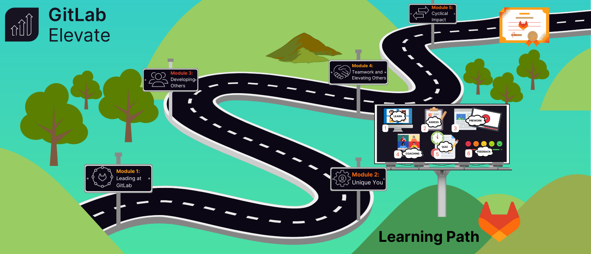

## On this page
{:.no_toc .hidden-md .hidden-lg}

- TOC
{:toc .hidden-md .hidden-lg}

## Overview
Managers at GitLab enable our mission that [everyone can contribute](/company/mission/). We need to equip our people leaders with the skills to lead globally dispersed, all-remote teams to support our business growth at scale.

The handbook provides guidance on GitLab [leadership competencies](/handbook/competencies/#manager-and-leadership-competencies) and principles. Bringing these practices to life requires training and practice. **Elevate**, GitLab's leaadership development program, provides opportunity for people leaders to learn to lead at GitLab. 

### Goal

In FY24, 85% of people leaders will complete Elevate and earn the GitLab Elevate certification.

## What is Elevate

Elevate is a highly interactive, all-remote program where managers will learn with, and from, each other. The goal is to provide a common, well understood leadership framework which demonstrates GitLab [values](/handbook/values/), [leadership competencies](/handbook/competencies/#manager-and-leadership-competencies), and [mission](/company/mission/). 

In Elevate, participants will:

1. Learn what it means to lead at GitLab
1. Practice the [Manager & Leadership competencies](/handbook/competencies/#manager-and-leadership-competencies)
1. Build cross-functional relationships with coaching cohort members
1. Demonstrate leadership competency by completing the Elevate Leadership Certification

## What concepts are taught in Elevate

Elevate is organized into 5 learning modules. Read more about the skills covered in each module below:

<iframe src="https://docs.google.com/presentation/d/e/2PACX-1vStxYG-P-8yUN11RIqpj0duhEbfH08KhMn0qOZ1MhasYc1Yt_rbCQ5NnUcBb5NxwQ/embed?start=false&loop=false&delayms=3000" frameborder="0" width="960" height="569" allowfullscreen="true" mozallowfullscreen="true" webkitallowfullscreen="true"></iframe>

## Time Commitment

Elevate runs for a total of 5 months and is organized into 5 learning modules. In each module, participants spend a total of 3-4 hours in the following learning activities:

| Steps | Title | Description | Time Spent |
| ----- | ----- | ---------- | ----- |
| Step 1 | Live Learning Session | 1x monthly synchronous learing session on the relevant module topic | 50 minutes |
| Step 2 | Asynchronous Learning | Videos, reading, journaling, self-reflections, and quizzes to reinforce concepts completed in Level Up | 45 minutes |
| Step 3 | Group Coaching | Cross-functional group coaching sessions with 10-12 other GitLab people leaders to practice module concepts | 80 minutes | 
| Step 4 | Asses your Learning | Take a quiz in Level Up to demonstrate your understanding of new concepts. |

The visual below illustrates the 5 Elevate modules:

{: .shadow.medium.center}

### Additional expectations

1. Demonstrate mastery of material at the end of module 5 to earn the GitLab Elevate certification.

## Frequenlty Asked Questions

### Is my participation in Elevate required?

Yes, this is a required training for all people leaders at GitLab.

### Where do I communicate my questions, concerns, and feedback as I go through the program?

When the program begins, you'll be added to a Slack group that includes all members of your cohort. The naming convention used is `#elevate-cohort-x`. You can also reach out directly to your manager or the Learning and Development team.

### I missed, or cannot attend, a live learning or coaching sessions. What do I do?

It's a requirement to make up missed sessions within each month to ensure that you're learning each new skill and moving through the program in the appropriate order. Makeup sessions for Live Learning Session and Cohort Group Coaching will be scheduled monthly. **Please reach out proactively to a member of the Learning and Development Team if you need to be included in a makeup session.**

## Supporting your team in Elevate

People Leaders with direct reports who are in a current Elevate cohort have the responsibilities to ensure the program is a success.

1. Notify team members of nomination and participation in Elevate during a 1:1 meeting and/or via Slack. Communications and timeline will be provided by the Learning and Development team.
1. Disucss the impact and benefits of Elevate during your 1:1. Answer questions that arise using this handbook page and direct further questions to the Learning and Development team.
1. If/when prompted by the Learning and Development team, follow up with reminders to team members who have missed live sessions or are not responsive to program communications.
1. Field conversations on a case-by-case basis from team members who express that the timing of their cohort is not right based on workload and/or personal obligations while understanding that this is a mandatory training program for all people leaders in FY24.

