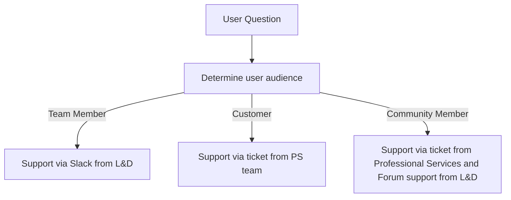
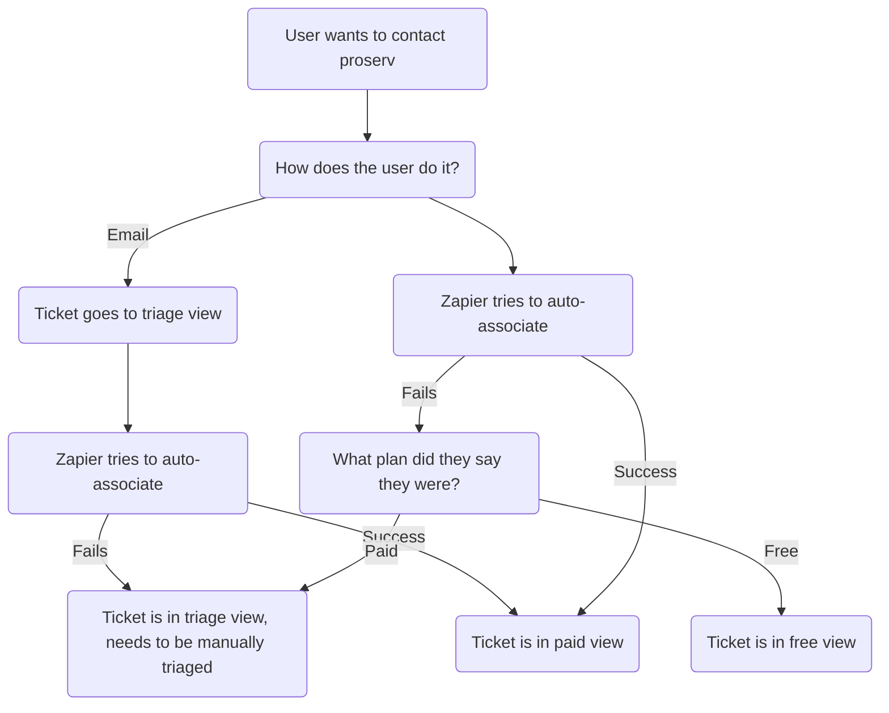

## On this page
{:.no_toc .hidden-md .hidden-lg}

- TOC
{:toc .hidden-md .hidden-lg}


# Navigating GitLab Learn Admin Content

On this page, team members working in the GitLab Learn platform will find documented processes and best practices for content creation. The page is split into the following sections.

| Title | Purpose |
| ----- | ----- | 
| [Best practices for content creation and organization](/handbook/people-group/learning-and-development/gitlab-learn/admin/#best-practices-for-content-creation-and-organization) | Outlines best practices for creating on-brand, handbook first learning content in GitLab learn. Please get familiar with this section before creating or organizing content in GitLab Learn. |
| [Processes, management, and maintenance of content in EdCast](/handbook/people-group/learning-and-development/gitlab-learn/admin/#processes-management-and-maintence-of-content-in-edcast)) | Outlines processes in the frontend and backend of GitLab Learn that are used to create, edit, and maintain content |
| [Reporting](/handbook/people-group/learning-and-development/gitlab-learn/admin/#approvals) | Includes key links and trainings in EdGraph |
| [Moderation](/handbook/people-group/learning-and-development/gitlab-learn/admin/#moderation) | TBD |
| [Support](/handbook/people-group/learning-and-development/gitlab-learn/admin/#support)| Includes support workflows for users and templates for contacting EdCast support |

Questions? Please reach out to the [L&D team in Slack](https://app.slack.com/client/T02592416/CMRAWQ97W/thread/CAEEVBR2M-1608029461.344100).

## Best practices for content creation and organization

If you're just getting started using EdCast, watch this short overview of the user experience in the platform and how new learning content fits into this design.

<iframe width="560" height="315" src="https://www.youtube.com/embed/Hm7SLOiV08o" frameborder="0" allow="accelerometer; autoplay; clipboard-write; encrypted-media; gyroscope; picture-in-picture" allowfullscreen></iframe>


### Contributing learning content

Definitions and examples of SmartCards, Journeys, Pathways, Channels, Carousels, Channels, and Groups can be found in our [GitLab Learn contribution docs](/handbook/people-group/learning-and-development/gitlab-learn/contribute/#learning-content-in-the-lxp)

Before reviewing the documented best practices below, take time to watch these recorded video examples of how content is contributed to GitLab Learn. These demos will help familiarize you with the terminology and structure of content in the platform and give context to the documented best practices.


#### Examples: Contributing content to GitLab Learn


##### Contribute an interesting article or video

<iframe width="560" height="315" src="https://www.youtube.com/embed/0cvYt5o3sWk" frameborder="0" allow="accelerometer; autoplay; clipboard-write; encrypted-media; gyroscope; picture-in-picture" allowfullscreen></iframe>


##### Contribute a new Pathway or Journey

<iframe width="560" height="315" src="https://www.youtube.com/embed/cuhI8Plcrbo" frameborder="0" allow="accelerometer; autoplay; clipboard-write; encrypted-media; gyroscope; picture-in-picture" allowfullscreen></iframe>

### Content creation best practices

#### Applicable to all content

1. URLs for SmartCards are generated automatically by the title that is first entered for the content and cannot be deleted or edited. This applies to all content in the platform, including Journeys, Channels, and Groups, so take care to properly name content when you're creating it for the first time for the most accurate URL. If content is deleted, that URL can no longer be used.
1. Add clarifying language to explain progressive unlocking when used in both Pathways and Journeys. Some examples are included below:
     - `Welcome to the GitLab 101 Certification! By completing this badge, you'll earn the GitLab 101 badge to share on your GitLab Learn and LinkedIn Profile. This training is geared toward GitLab team members and the wider community who are in non-engineering roles (i.e. recruiting, peopleops, marketing, finance, etc) and/or have not used a DevOps tool like GitLab before. This can also be helpful for non-engineering people outside of GitLab wanting to learn how to use GitLab for personal projects. You'll see that some of the SmartCards in this learning path are currently 'locked' - to unlock these SmartCards, please start with the first card in the pathway. When you've completed that card, the next card will unlock it for you to access.`
     - `Welcome to the GitLab Values badge! By completing this badge, you'll earn the GitLab Values badge to share on your GitLab Learn and LinkedIn Profile. You'll see that some of the SmartCards in this learning path are currently 'locked' - to unlock these SmartCards, please start with the first card in the pathway. When you've completed that card, the next card will unlock it for you to access.To earn your GitLab Values badge, complete all the SmartCards in this pathway as well as pass the corresponding quiz with at least an 80%.`

#### SmartCards

1. SmartCards created in a Pathway or Journey are only discoverable from within that pathway or Journey. Create SmartCards with quizzes, polls, or other action items from learners from within the Journey or Pathway
1. Create content based SmartCards independently from a Journey or Pathway so that content can be repurposed and discovered
1. Always set an estimated time to finish for each SmartCard, as this is used to give an accurate guess on how long the content will take to consume

Check out this video of a few of these SmartCard best practices in action:

<iframe width="560" height="315" src="https://www.youtube.com/embed/bORBlaaOwD8" title="YouTube video player" frameborder="0" allow="accelerometer; autoplay; clipboard-write; encrypted-media; gyroscope; picture-in-picture" allowfullscreen></iframe>

#### Pathways

1. The `Mark as Complete` setting platform-wide is set to `auto-mark as complete`. This setting allows our integration with LinkedIn Learning to track content completed on the LinkedIn platform itself and should not be changed. As a result, if you'd like users to manually mark content as complete, please be sure to select `Manually` at the Pathway setting to override the `auto-mark as complete` setting. Otherwise, leave Pathways to the `Automatically` mark as complete setting.
1. Badges can be awarded upon completion of a Pathway.
1. Enable `lock` functions for pathways where you want learners to go through the content in a specific order. For locked pathways, leave the first SmartCard unlocked, and lock all subsequent Smartcards.
1. Enable `leap` functions for pathways where you want to redirect the learner based on how they perform on a quiz. For example, if a user passes a quiz, they can leap to the next SmartCard, but if they fail, they can be directed back to a SmartCard to review content before taking the quiz again.
1. End Pathways that earn a badge with the sharing a [GitLab Learn badge SmartCard](https://gitlab.edcast.com/pathways/gitlab-certification/cards/1045949)
1. Consider ending Pathways with a SmartCard that provides next steps for learning. This could be a call to action to take a similar Pathway or follow a Channel.

##### Lock and Leap Example

In the GitLab 101 certification, a user must first read the handbook page on technical terminology, then take the knowledge assessment. If the user passes the quiz, they will leap to the next SmartCard, which brings them to the next handbook section. If the user fails, they will leap back to the initial SmartCard to review the quiz content. In the same pathway, we have a short poll used as a knowledge check. In this case, if the user answers either correctly or incorrectly, they move forward through the locked SmartCards as normal without any using leap functionality.

Watch this video example that explains the use of lock and leap in a Pathway:

<iframe width="560" height="315" src="https://www.youtube.com/embed/qQRhuGK8QVs" frameborder="0" allow="accelerometer; autoplay; clipboard-write; encrypted-media; gyroscope; picture-in-picture" allowfullscreen></iframe>

#### Journeys

1. Badges can be awarded upon the completion of a Journey
1. End Journeys that earn a badge with the sharing a [GitLab Learn badge SmartCard](https://gitlab.edcast.com/pathways/gitlab-certification/cards/1045949)
1. Consider ending Pathways with a SmartCard that provides next steps for learning. This could be a call to action to take a similar Pathway or follow a Channel.
1. Refer to the best practices for Pathways above when building Pathways that create a Journey.


### Order of Operations for Content Creation

This section defines how to restrict content to specific audiences on GitLab Learn. Since GitLab Learn is available to both internal and external audiences, it's important to understand who can access your content. Whenever possible, we should make learning public to align with our [transparency value](/handbook/values/#transparency), but in some cases, learning will only be accessible to team members or may require payment.

#### Step 1: Determine if content is `public` or `private`

| Content Type | Definition | Example Audience |
| ----- | ----- | ----- |
| `private` | Content is only visible to a specific audience | Content for the GitLab team or customers only |
| `public` | Content is discoverable and visible to all learners in the platform | Content for wider community members |

Watch this video that explains the difference between public and private content in GitLab Learn:

<iframe width="560" height="315" src="https://www.youtube.com/embed/MDu7CbyNHj8" frameborder="0" allow="accelerometer; autoplay; clipboard-write; encrypted-media; gyroscope; picture-in-picture" allowfullscreen></iframe>

#### Step 2: Build smartcards depending on content status 

This video outlines the three scenarios for building public versus private content outlined below:

<iframe width="560" height="315" src="https://www.youtube.com/embed/__6zr0C3Dmk" frameborder="0" allow="accelerometer; autoplay; clipboard-write; encrypted-media; gyroscope; picture-in-picture" allowfullscreen></iframe>

##### Building `public` content

1. Build SmartCards independently of any Pathways or Journey
1. Make sure the `private` content checkbox is unchecked for SmartCards, Pathways, and Journeys
1. Add SmartCards to relevant Pathways, Journeys, Channels, and Groups

**Example:** L&D creates a publicly available course called GitLab 101. The SmartCards for this course link to the handbook and should be public to all users in the platform. The team will create each SmartCard independently in the EdCast platform, then add them all to a Pathway. Quizzes for the course will be created within the Pathway to utilize progressive unlocking features. The course can be broadcasted on public channels for new learners to discover the content.

##### Building `private` content 

1. Build Smartcards within a Pathway or Journey
1. Make sure the `private` content checkbox is checked for SmartCards, Pathways, and Journeys
1. Assign or share content directly to an individual user, private Group, or private Channel

**Example:** L&D uploads a compliance course with graded content for a specific group of learners. Since it is graded, interactive content, we want this path to only be assigned to the GitLab team. SmartCards will be built within a private Pathway that will be assigned directly to team members via a Group. In the future, the team might create a public course without the graded elements that could be public for the wider community.

**Important Note:** If you share `private` content on a `public` channel, anyone following that channel will be able to view the content. If you need to restrict content, please be sure only to share `private` content with `private` channels AND groups.

##### Building content with both `public` and `private` elements

If parts of the content are for a certain audience and parts are available to all learners

1. Create a Pathway and confirm the `private` content checkbox is checked
1. Create `private` content in SmartCards in a Pathway
1. Create `public` content in a SmartCard outside of the private Pathway
1. Assign Pathway to specific learners or groups

**Example:** L&D hosts a [manager challenge course](/handbook/people-group/learning-and-development/manager-challenge/) with graded content for a specific group of learners. The team wants the manager content available for the wider community but needs the graded content to be restricted to assigned learners. SmartCards with public content will be built independently of any Pathway, then added to the private manager challenge Pathway. SmartCards with private content will be built within the private manager challenge Pathway. This private Pathway will be assigned to specific audiences and the wider community can discover content in SmartCards.

There is also the option to organize these public SmartCards into a second Pathway that the wider community can access without the graded requirements. Perhaps a quick quiz or poll could be utilized here instead. 

#### Step 3: Sharing private content with the right audience

Once you've built your `public` or `private` content, you'll need to share with the correct audiences.

##### Overview

Please review these key structures and how they can impact **who can access your content**.

**Important Note: The first line in the table below is the ONLY way to ensure your content is truly restricted to a specific audience.**

| Content Type | Shared With | Who can Access | 
| ----- | ----- | ----- |
| Private | Private Group or Private Channel | Only members of that Group or people added to the Channel |
| Public | Public Group or Public Channel | Anyone in the Group or Channel and discoverable via search |
| Private | Public Group or Public Channel | Anyone can join the public Group or Channel, therefor anyone can see your content |

##### Explanation of `public` and `private` content

With the combination of `private` content, Groups, and Channels, you can restrict content to certain audiences in GitLab Learn. This is an essential EdCast feature for the GitLab team, as we're using GitLab Learn to share content across internal and external audiences. Examples include:

1. Sales enablement content that is for internal audiences only
1. Training platforms for specific teams that are for specific team members only
1. Professional Services content that is for paid customers only

Below outlines use case examples when using `private` Groups, Channels, and content. It's important to understand how stacking `public`/`private` content with `public`/`private` Channels and Groups will impact user access.

1. Begin by reviewing the steps above that explain how to mark content as `public` or `private`
1. `private` content can be shared with Groups and Channels
1. If you share `private` content with a `private` Group, only members of that Group can access the content. Be sure this Group is **not** open so that non-designated users can't join the Group. An example of this use case is the Field Enablement team, who creates trainings that are shared only with the `GitLab Internal Team Members` group, or with Professional Services, who create trainings that are shared with specific customer groups.
1. If you share `private` content with a `public` Group, only that Group can access the content, **but anyone can join the group**. This use case can be used if you want to organize users with similar interests into a Group, but make the Group available for anyone to join.
1. If you share `private` content with a `private` Channel, only followers of that Channel can see the content. This is a great way to organize and curate content for specific audiences. For example, before launching our entire course catalog, the L&D team will restrict our external content offerings on GitLab Learn to 3 courses. However, we still want all our material to be available to GitLab team members. To do this, we can create a `private` Channel and share that Channel with the `GitLab Internal Team Members` Group. This will ensure that the content on the `private` Channel can only be seen by members of the `private` Group. Later, we can make this Channel `public` and share with all users.
1. If you share `private` content with a `public` Channel, only followers of that Channel can see the content, **but anyone can follow the Channel**. This is a similar use case as sharing `private` content with a `public` group. If you'd like to organize users with similar interests by inviting them to follow a `public` Channel, this use case might work.


### Badges

Badges are available with the creation of both pathways and journeys and are awarded to the learner on the EdCast platform upon completing a set Pathway or Journey. Badges can also be [shared by the learner](/handbook/people-group/learning-and-development/gitlab-learn/user/#sharing-your-gitlab-learn-badges) on their LinkedIn profiles.

Teams should choose to use a badge to recognize learners achievements when:

- Learning Pathways are completed
- Journeys that do not require an official certification or accreditation 
- Setting goals, motivating behaviors, representing achievements, and communicating success

Follow the steps below for [creating a badge in EdCast](/handbook/people-group/learning-and-development/gitlab-learn/admin/#creating-a-badge)

Watch this video to review how to add badges to a Pathway or Journey:

<iframe width="560" height="315" src="https://www.youtube.com/embed/VnBSYZ8Cbws" frameborder="0" allow="accelerometer; autoplay; clipboard-write; encrypted-media; gyroscope; picture-in-picture" allowfullscreen></iframe>


### Image guidelines

Images in the LXP enable us to: 

- maintain a look and feel that aligns with the GitLab brand
- help users identify different kinds of content in the platform

The following outlines best practices for choosing images to use in the LXP. When content is created in the LXP in any form, an image or placeholder is automatically generated. Follow these best practices to update these placeholder images before publishing new content.

#### Choosing photographs

The GitLab team will use the following photographers on [Unsplash.com](https://unsplash.com/) for images in the LXP.

- [LinkedIn Sales Navigator](https://unsplash.com/@linkedinsalesnavigator)
- [WOCintech](https://unsplash.com/@wocintechchat)

Future photographers will be added as needed.

If you're looking for pre-approved images for your content, please review the [GitLab Learn photo drive](https://drive.google.com/drive/folders/1GvE-MUtHzGbZ9KX-16bsTvwFDn-Cd4hy?ths=true).

Keep the following in mind when choosing a photograph:

1. Look for opportunities to demonstrate [GitLab culture](/company/culture/). For example, consider choosing an image of a learner working on their laptop to reflect [all-remote work](/company/culture/all-remote/), two people working together to demonstrate [collaboration](https://about.gitlab.com/handbook/values/#collaboration), or a family or small group of friends learning together to reflect [friends and family first, work second](/handbook/values/#family-and-friends-first-work-second)
1. Choose inclusive images that reflect our values of [Diversity, Inclusion, and Belonging](/company/culture/inclusion/)
1. Look for opportunities to use images that demonstrate learning. This could include virtual classroom discussion, social learning/networking, working on a project, use of mobile, leadership talks, etc. 
1. Avoid images of large groups as it could make content look out of date
1. Keep the focal point of the image in the middle to enable better cropping and addition of the image overlays described below

#### Images for SmartCards

SmartCards without an image uploaded will either generate a random image from the EdCast system or will show no image at all. Both cases don't align with the look and feel of GitLab Learn. Follow one of the two options below when adding images to SmartCards

1. Preferred Option: Upload a GitLab image from the [SmartCard image folder](https://drive.google.com/drive/u/1/folders/1r3Z0bLvwwswSHF550kSLsdr9kvivkql8?ths=true). This will hard code an image to the SmartCard that will not change.
1. Secondary Option: Use the image generated from the web source on a link SmartCard. This is a secondary option because if the image on the site your link is from changes, the SmartCard will either populate with a random image from EdCast or provide no image at all, both of which negatively impact the overall look and feel of GitLab Learn.

#### Images for Journeys and Pathways

Journeys and Pathways will be identified with a white graphic image overlay and the GitLab logo using either black or white text. Here's an example:


[Example of images in Canva](https://www.canva.com/design/DAEQ-5KGqe4/7JF_Fz8qV2a0owZDQGLlcw/view?utm_content=DAEQ-5KGqe4&utm_campaign=designshare&utm_medium=link&utm_source=publishsharelink)

We've organized a [GitLab Learn photo drive](https://drive.google.com/drive/folders/1GvE-MUtHzGbZ9KX-16bsTvwFDn-Cd4hy?ths=true) so that contributors to GitLab Learn can access pre-edited photos to upload.

#### Images for Channels

Channels will be identified with a branded banner image with a custom Tanuki in the center. Here's an example:


This [basic Channel image in Canva](https://www.canva.com/design/DAEQ_HWFcFs/238nynM1dCJOSWUrrecCqA/view?utm_content=DAEQ_HWFcFs&utm_campaign=designshare&utm_medium=link&utm_source=publishsharelink) can be used for any Channel in the platform.

The LXP implementation team will collaborate with the brand team to customize the Channel images to fit specific content when necessary.

You can find pre-approved Channel images in the [GitLab Learn photo drive](https://drive.google.com/drive/folders/1GvE-MUtHzGbZ9KX-16bsTvwFDn-Cd4hy?ths=true)

#### Images for Groups

Groups will be identified with images that use a purple graphic overlay on the left side of the image, with the GitLab logo and white text. Here's an example of multiple Groups displayed on the Discover page:


[Example of images in Canva](https://www.canva.com/design/DAEQ-q4s2pY/soqq_hq3ND1oUNh7x6KPHA/view?utm_content=DAEQ-q4s2pY&utm_campaign=designshare&utm_medium=link&utm_source=publishsharelink)

You can find pre-approved Group images in the [GitLab Learn photo drive](https://drive.google.com/drive/folders/1GvE-MUtHzGbZ9KX-16bsTvwFDn-Cd4hy?ths=true)

#### Profile photos

Individual learners are responsible for uploading their own profile and banner photos.


### Peer review content before publishing

It's important to have another member of your team review your content before making it live on the platform. Consider using this process to review content in the LXP. If your team decides on a different peer-review process, please document on this page.

#### Prior to peer review

1. The content creator or curator builds the content in the LXP, including opening SmartCards, branded images, and organizing Pathways and Journeys
1. Mark content to `save for later`, which leaves it in a draft state (not yet published)
1. Team collaborates in Slack to find a reviewer for their private content by sharing the direct link to EdCast
1. Reviewer uses the following checklist to confirm that content is ready to be shared with the wider GitLab Learn audience:

#### Peer reviewing for GitLab Learning Evangelists

When completing a peer review, Learning Evangelists can

1. Ask the L&D team for support, or
1. Ask another Learning Advocate

As new team members are onboarded as Learning Evangelists, the L&D team will serve as the primary peer reviewers for contributed content. As the Learning Evangelists get more confident in the platform, a process will be developed to share and review content together. For now, please reach out to the L&D team in the [#learninganddevelopment Slack channel](https://app.slack.com/client/T02592416/CMRAWQ97W) and request for your learning content to be reviewed.

#### Content review checklist items

To be reviewed in the front end of GitLab Learn

1. Click into the `edit` mode to review content in each Journey or Pathway
1. Content is organized in a Pathway or Journey
1. Name is clear and identifies what the learner will achieve upon completion
1. Description of the Pathway or Journey clearly defines the content
1. Images are branded based on correct image guidelines
1. Learning level is set
1. Badge status is set and uploaded
1. Each SmartCard has a clear description
1. Content is compliant with the [DIB quality check process](/culture/inclusion/#diversity-inclusion-and-belonging-quality-check-learning--development-and-external-training)

To be reviewed in the EdCast backend:

1. Language is specified
1. Tags are added based on related content keywords
1. Relevant channels are included
1. User taxonomy topics are chosen

When the peer-review is complete, content should be switched on by the content creator to the `published` state.

### Sharing content

Content can be shared either using the `Share` or `Restrict` options. The key difference between each method is outlined below:

| Method | User Experience | Usage Example |
| ----- | ----- | ----- |
| `Share` | User gets a notification about content | The content creator wants the user to know about new learning they can take or they are required to take |
| `Restrict` | User does not get a notification about content | The content creator wants to provide access to learners, but does not want to trigger a notification or plans to share in a different way, like a Slack announcement |


#### Assigning Content

If a course is required by specific users to complete, it's best pracitce to assign that learning to the user. Below are some important considerations to make when assigning content

1. Learning Evangeslists, Content Administrators, and Platform Administrators in GitLab Learn can make learning assignments. Navigate to the SmartCard, Pathway, or Journey you want to assign and click the 3 dots on the top right corner of the card. Here you have the option to `Assign`. You can assign to individuals, groups, or channels. Assigning to the `GitLab Internal Team Members` group is the most common use case for required GitLab trainings.
1. When learning is assigned, users get an email notification to alert them about the newly assigned item
1. When making an assignment, you can add a message. This message appears in the email subject line of the assignment notification email
1. You can also add a start and due date to the assignment. 
1. Notifications about the upcoming due dates on assigned content are pushed to users 6 days before, 2 days before, and on the due date of the assignment
1. When assinging content, consider the following
     1. Is it absolutely required by the learner? If not, use the `Share` method instead of making an assignment
     1. Assign content during the work week, during a time where as many team members as possible will see the assignment email and/or Slack announcements about the newly assigned contnet


#### Using groups

Groups are best utilized to organize learners around a specific quality. Examples include role and team. Consider these best practices when creating a group:

1. Decide if your group is private or public. Private groups cannot be discovered by learners who are not members of the group. These are best used when you want to organize a group of only your direct team members. Public groups are discoverable by any learner on the platform. These are best used when you'd like to broadcast the group to a wide audience
1. If groups are not marked private, then members can click the option to join. If you want to make them visible and share with everyone, do not mark the group as private
1. Groups can be used to assign content to a specific group of people. Learning can be assigned to all members of a group
1. Content can be shared privately with one or more groups. When it's not shared with someone outside of that group, they won't discover it
1. When new members are added to a group, they will automatically be assigned all content that has been assigned to that group
1. Groups offer a space to create a community of learners around a similar topic or goal
1. All groups must have a group administrator that will take responsibility for managing content in the group, curating new content for the group, and creating new ways to maintain a community. Group admin are encouraged to open an MR to this page and add best practices for group management

##### Inviting new members to groups

Engage learners in groups using the following practices

1. Learners automatically added by the HRIS integration from BambooHR to groups based on their role in the organization
1. Manually adding users to groups by navigating to the group and clicking the `invite` option
1. Broadcast open groups on the Discover page to invite new members

##### Dynamic Group Workflows

Dynamic group workflows automatically add users to groups based on user account settings. The integration with BambooHR allows GitLab team members to be sorted by team, role, location, etc. All data available to sort by in dynamic group workflows can be viewed in the `User` section under the `Accounts` tab. 

The following steps describe the process for creating a new dynamic group workflow.

1. Login to the EdCast admin panel
1. Under the `Accounts` tab, click on `Dynamic Group Management`
1. This panel shows the status of all current dynamic group workflows, if the workflows are enabled, name, date created, and their owner. There is also the option to run, edit, view, or delete existing workflows.
1. Create a new workflow by clicking the `add new` button
1. Give a name to your workflow. It is best practice to make sure the name indicates what users will be moving through the workflow. Considering naming the workflow the same as the related group.
1. Use the `Criteria` tab to set the conditions of your workflow. These are set up similar to an `if` or `if, then` statement.
1. Choose a `column`. This data correlates directly to the columns of data pulled in from BambooHR for team members, listed on the `Users` admin page.
1. Set a condition. For example, use the `Equals` condition to indicate that the column variable you picked is `true`.
1. Choose a variable from the data `column` to sort by. For example, if you choose the `Role` column, your condition choices here will be `manager`, `individual contributor`, and `leader`.
1. The option exists to add multiple rules if you need to make your workflow drill down into a more specific cross-section of people. Use the `add rule` button to create another condition for your workflow.
1. In the `Configuration` tab, decide where this workflow will add users. Choose to create a new group, create a custom group, or add to an existing group.
1. Click `Save`. This will **not** run your workflow.
1. After saving, you'll return to the main `Dynamic Group Management` page. The new workflow will appear at the top of the list.
1. To run the workflow, toggle the button in the `Enable` column so that the workflow is `on`. Then, click the play button in the `Actions` column. This will start to run your workflow.
1. The EdCast platform runs these workflows on a certain cadence, so your groups might not populate right away. Check back on your workflow over the course of a few hours to confirm the workflow has run as expected.
1. Workflows in the `on` state will continuously, adding new users to your group as they join the platform.
1. To stop the workflow, navigate to this `Dynamic Group Management` page and toggle your workflow to the `off` status.

Here is an example of a dynamic group workflow that pulls all GitLab team members into an existing group:


###### Dynamic group workflows for team members

When building a dynamic group workflow for team members, be sure to include the following two rules

1. `Department` should be set to the specific department you're sorting by. This will fill the group with team members who fit that department in BambooHR.
2. `GitLab Internal` should be set to `t`, or `true`. This will make sure that only team members are added to this group.

#### Broadcasting on Channels

Channels are used to collect and broadcast information based on like content. Users can follow channels to stay up to date on all new learning content in a specific area of interest. 

1. Use Channels to share content with a wider audience. For example, if the L&D team created a training on effective communication for the GitLab team and assigned it to the GitLab team group, the same content could be shared on a Remote Communication Channel so the wider community could train on this course as well
1. Channels should have a clear title and description that defines what content the user will find in the channel
1. SmartCards, Pathways, and Journeys can be shared to channels upon creation or can be added to relevant channels later on
1. Channels can have multiple curators to encourage collaboration and content sharing

#### How Learning Evangelists can share content

Learning Evangelists can use the following processes to broadcast or highlight their contributed content

1. Raise attention to new content with the L&D team via Slack. The team will help you determine the best Carousels, Groups, or Channels to broadcast your content
1. Share content with a Group you're a part of, like your team
1. Share content to a Channel with a relevant topic, like Remote Work Foundations

### Adding collaborators to your pathway

Learning evangelists can add other Learning Evangelists as collaborators to Pathways or Journeys they create. In order to do this:

1. In the Pathway or Journey settings, add the person you'd like to collaborate with to the `Collaborators` field
1. Reach out to the #learninganddevelopment Slack channel to ensure that this person has `Collaborator` permissions
1. Collaborate together by creating SmartCards in the same Pathway or Journey

Please note that collaborators **cannot** edit existing SmartCards if they are not the author.

A workaround for this limitation is outlined below. If you'd like a `Collaborator` to edit existing SmartCards in a Pathway:

1. The original author of the Pathway can change the author to the desired `Collaborator`
1. The `Collaborator` will then have access to edit any SmartCards that are created **inside** the Pathway
1. If the `Collaborator` needs to edit SmartCards that were created outside of the Pathway, they will need to be changed to the author on each of these SmartCards
1. When the `Collaborator` is done editing, they can change the author of the Pathway back to the original author

### Designing the discover page

The discover page is the page where learners will land upon logging into the LXP. On this page, users can discover new content, navigate to their followed channels, find their groups, and more.

The discover page can be leveraged by admin to: 

- advertise new learning opportunities
- share new channels
- highlight learning from specific users

The discover page is also curated based on the user. For example, if a carousel appears on the discover page that includes private groups, only groups that the user is a part of will appear.

Use these best practices when designing and updating the discover page in EdCast:

1. Consider multiple user perspectives when adding static content to the discover page. For example, the first iteration of the discover page includes links to EdCast user docs, which is relevant for all users in their first few times accessing the platform 
1. Use custom carousels to organize content by topic. Carousels can display either channels or users
1. Custom carousels with channels should be clearly named and invite the learner to explore a specific topic
1. Custom carousels with users should feature engaged learners and leaders in the platform 
1. Leverage a carousel of groups by creating SmartCards that link directly to groups that you want to highlight


## Processes, management, and maintenance of content in EdCast

This section documents specific workflows in EdCast that admin will use when creating and maintaining content. As the LXP implementation team discovers new ways to utilize EdCast, these processes should be updated. All admin should consider opening an MR to this page and workflows as they explore new tools in the platform.

### Journeys, Pathways, and SmartCards

#### Create a Journey

1. Click the `Create` button in the top navigation bar
1. Choose to create a `Journey`
1. This will open a pop-up on the page where you'll create your Journey.
1. It's important to review the [order of operations for public and private content creation](/handbook/people-group/learning-and-development/gitlab-learn/admin/#order-of-operations-for-content-creation) at this point to determine the best place to create Pathways and SmartCards for your Journey
1. Fill in the `title`, `description`, `level`, and `tags` for your Journey
1. Decide if your Journey will use a [badge](/handbook/people-group/learning-and-development/gitlab-learn/admin/#choosing-between-a-badge-or-certification) and mark the `badge` setting as necessary
1. Decide if you'd like your Journey to be `Self Paced` or `Progressive Unlocking`
1. Update your Journey image based on the [image guidelines](/handbook/people-group/learning-and-development/gitlab-learn/admin/#images-for-journeys-and-pathways)
1. Either build out Pathways and SmartCards from within the Journey or add content you've already created. Drag and drop Pathways and Smartcards to determine the desired order
1. Choose to `Save for Later` to be reviewed or `Publish` for content to be available on the platform.

#### Create a Pathway

1. Click the `Create` button in the top navigation bar
1. Choose to create a `Pathway`
1. This will open a pop-up on the page where you'll create your Pathway.
1. It's important to review the [order of operations for public and private content creation](/handbook/people-group/learning-and-development/gitlab-learn/admin/#order-of-operations-for-content-creation) at this point to determine the best place to create Pathways and SmartCards for your Pathway
1. Fill in the `title`, `description`, `level`, and `tags` for your Pathway
1. Decide if your Journey will use a [badge](/handbook/people-group/learning-and-development/gitlab-learn/admin/#choosing-between-a-badge-or-certification) and mark the `badge` setting as necessary
Update your Journey image based on the [image guidelines](/handbook/people-group/learning-and-development/gitlab-learn/admin/#images-for-journeys-and-pathways)
1. Either build out new SmartCards from within the Pathway or add content you've already created. Drag and drop Pathways and Smartcards to determine the desired order
1. Choose to `Save for Later` to be reviewed or `Publish` for content to be available on the platform.
1. Document all quiz questions and answers in a Google doc. Since you cannot edit or view quizzes after they've been taken by a user, this will help you make edits quickly if necessary

#### Create a Smartcard

1. Click the `Create` button in the top navigation bar
1. Choose to create a `SmartCard`
1. Choose the type of content you'd like to share
1. Each content type requires a different set of requirements to be provided. Follow the prompts based on each content type
1. Be sure to add a `title`, `duration`, `tags` and `level` to all SmartCards
1. Click `Create`

#### Create a Project SmartCard

Project SmartCards are used to collect URL project submissions from users. Use cases for the GitLab team could include submitting a blog post, Google doc link, or Issue/MR link.

<iframe width="560" height="315" src="https://www.youtube.com/embed/lM-bxY8wN9U" title="YouTube video player" frameborder="0" allow="accelerometer; autoplay; clipboard-write; encrypted-media; gyroscope; picture-in-picture" allowfullscreen></iframe>

1. Create a new SmartCard either within a Pathway or Journey or as an independent SmartCard
1. Choose the `Project Card` option at the top of the SmartCard
1. Enter a descriptive title and a set of instructions for what the learner will be uploading to this card
1. Upload an image that will appear in Pathways, Journeys, and Carousels that this SmartCard is shared to based on the GitLab Learn image guidelines
1. Choose your grading scale. You can set the grading to be either `A-F`, `0-10`, or `0-100`
1. Choose the Submitter options. This will define who can submit a project on this card. It is advised that you choose only `Assignees` if your team does not have capacity to grade/assess projects that could be submitted by any community or team member.
1. Choose the grader of the project. This will be who is assigned to grade submissions. Your options are either the `Assignor`, `Author` (of the SmartCard), or `Manager`. The `Manager` assignment will only work for team members, as our community does not have manager data uploaded into the system
1. Follow best practices above to share and mark content private as required
1. Add descriptive tags to help users search for this content
1. Add a duration for how long it should take for users to complete this project
1. Choose the `Content Type` to indicate what kind of project will be submitted. `Other` is an option if your project doesn't fit one of the offered project types
1. Click `Create` to save your SmartCard.
1. It's important to note that as the **author** you will not see the option to submit a project. You can test out the user view by asking a team member to look at the card. You can see the behavior of project cards from the non-author perspective in the [training video](https://youtu.be/lM-bxY8wN9U) displayed above.
1. Project cards are not marked as `complete` until the submission is graded. Using the Lock and Leap function in combination with Project Cards will hault the user at the incomplete Project Card until their submission is graded.


#### Using iframes and the Rich Text Editor (RTE) EdCast feature

EdCast has enabled a Rich Text Editor(RTE) that enables iframes in text SmartCards. This is a great way to create [handbook first learning content](/handbook/people-group/learning-and-development/interactive-learning) directly in GitLab Learn. 

To use the RTE:

1. Navigate to the Discover page, or click into the Pathway where you want to create the text card
1. Click the `Create` button and choose `SmartCard`. When choosing the type of SmartCard to create, choose the `Text` option.
1. Include your iframe directly in the text box on the text card. For best practices for building iframes, refer to how we use [iframes in Articulate360](/handbook/people-group/learning-and-development/interactive-learning/#using-iframes-to-display-the-gitlab-handbook)
1. If you'd like to upload a photo, you can do so in the text card. This photo will be used as the thumbnail image on the card when it appears in Pathways, Journeys, etc.

If you have access to our Sandbox instance, you can see a couple of examples there. This is an example of [no scrolling](https://gitlabsandbox.edcast.com/insights/using-iframes-for-handbook-first-learning) which can be used to focus on a specific section or a video. This is an example of [scrolling](https://gitlabsandbox.edcast.com/insights/test-learning) if you are wanting to include an entire handbook page. 

### Editing Journeys, Pathways, and SmartCards

Moderation and limited editing occur in the admin backend. The following steps outline how to access these limited edits and moderate Journeys, Pathways, and SmartCards.

#### Making edits in the admin panel

1. Login to Edcast and navigate to the `admin` panel
1. Click on the `content` tab
1. Choose either the `SmartCards`, `Journeys`, or `Pathways`
1. In each tab, you'll find a list display of all the content in each type. From this list, you can:
     - View data about the content, like creation date, creator, title, tags, related channels, and state
     - Promote content using the toggle on/off option
     - Delete content using the trash icon
     - Edit backend content information by clicking on the pencil icon

##### Limitations of backend content editing

Edits that you'd like to made related to the arrangement of content in the LXP will be done in the front end. The following are examples of edits you **cannot** make in the admin section and will need to use the EdCast front end to edit:

- Arrangement of SmartCards in a Pathway, or Pathways in a Journey
- Badging information

#### Editing Pathways after users have completed the Pathway

At GitLab, we iterate quickly and ship things that aren't perfect. The EdCast system does not easily enable us to make iterative updates and changes to Pathways once published, especially after a user has accessed or completed the Pathway. This section outlines the limitations of the tool and best practices for editing Pathways.

##### Limitations

- Quizzes that have been completed by users cannot be edited
- Administrators cannot see quizzes once they have been completed
- If a pathway is edited after a user earns the pathway badge, they will retain their badge, but their completion status on the pathway will show up as a percentage less than 100%, depending on how many SmartCards are now `incomplete` after editing

##### Best Practices

1. Use the [lxp-contributions issue board](https://gitlab.com/gitlab-com/people-group/learning-development/lxp-contributions/-/boards) to triage reports of errors in GitLab Learn
1. Open the Pathway that contains the error. This original Pathway is considered your Version 1 or V1 of the Pathway. Click the three dots in the top right corner of the Pathway and choose `Make a Copy`. This new copy is now considered your Version 2 or V2 of the Pathway.
1. Navigate to your `Profile` page and click `Content` to view the V2 Pathway. This will be titled automatically as `Copy Of {Pathway Name}`
1. Return to the V1 of your Pathway and rename it as `DEPRECATED V1: {Pathway Name}`
1. Now, you must remove the Pathway from any related Channels, Groups, or Assignments in order to keep users from finding it. Do **NOT** delete the V1 Pathway as this will remove any user data related to the Pathway.
1. After removing any Channels, Groups, or Assignments from the Pathway, mark the Pathway as `private`.
1. Return to the V2 of your Pathway and rename it to the correct title of the Pathway
1. Make necessary updates to the V2 Pathway. This will most often include replacing current quiz SmartCards with new SmartCards that will correct spelling, answer accuracy, or other content.
1. This V2 Pathway is now the most up to date version of the Pathway content. Reshare this new V2 Pathway with any related Channels, Groups, or Assignments. 
1. Refer to the Reporting section of this admin page to understand how the combination of reports from V1 and V2 Pathways will give a full picture of completion.
1. If you need to update V2 or versions beyond of a Pathway, follow this same process but replace the version names with `VX` or `version X` where `X` is the correct version number.

### Channels

#### Creating a new channel

1. Login to Edcast and navigate to the `admin` panel
1. Click on the `content` tab
1. Click on `channels`
1. Click on `add channel`
1. In the `setup` tab, define the following for your channel:
     - Name: This is the name users will see on the discover page and across the top of the channel
     - Description: Provide a short text description about content this channel will broadcast
     - Profile image: Refer to the image guidelines below 
     - Topics: Add at least 3 topics to categorize content that will be in this channel. This will help users discover the channel in the platform
     - Provider: Define who is creating the channel or where the content is coming from. For example, 'GitLab Field Enablement Team'. This step is not required.
     - Provider Image: Add an image to correspond with the provider above. This step is not required. This image will overwrite the channel image
     - Private, Open, Allow Follow, and Automated Pin Cards: Confirm all permissions
1. Click `save channel`
1. After you click `save channel`, the following tabs will open for editing: `content`, `people` and `carousels`
1. These tabs will allow you to further define permissions for your channel. These are not required to create your channel, but will help customize and organize content. 

**Documentation Note:** For the purposes of MVC documentation, the L&D team will stop channel documentation here and iterate in the future as we discover how customization within these additional tabs can be leveraged.

#### Editing an existing channel

1. Login to Edcast and navigate to the `admin` panel
1. Click on the `content` tab
1. Click on `channels`
1. Here, you can turn the `promotion` tab on or off if you'd like to promote the channel
1. You have the option to delete or view the history of the channel, see the title, and related user information
1. Locate the channel you'd like to edit in the list. Click on the small pencil button to edit. 
1. Follow the steps above for `Creating a new channel` to make any edits or updates to the existing channel

#### Creating custom carousels on a channel

Custom carousels in a channel can help organize and guide users to highlighted content. Content needs to first be shared to the channel to add to a custom carousel. Content can be shared to multiple custom carousels.

1. Login to Edcast and navigate to the `admin` panel
1. Click on the `content` tab
1. Click on `channels`
1. Locate the channel you'd like to edit in the list. Click on the small pencil button to edit. 
1. Click on the `carousels` tab on the top right corner
1. From here, you can `enable` or `disable` existing carousels
1. You can also create new carousels here. Enter the name of your new carousel and click on the `create carousel` button 
1. When the new carousel has been created, click the small pencil button to edit.
1. Click the `add item` box to add content to that carousel. Remember that only shared content to the specific channel will appear here.
1. The changes will save automatically. Navigate to the channel in the GitLab Learn front end and refresh the page to see your changes

#### Curating a channel as a Curator

[GitLab Learn Curators](https://about.gitlab.com/handbook/people-group/learning-and-development/gitlab-learn/contribute/team-member-contributions/#become-a-gitlab-learn-curator) can organize and curate content on a channel using the EdCast front end. Below are the outlined steps and training video for this process:
<!-- blank line -->
<figure class="video_container">
  <iframe src="https://www.youtube.com/embed/P3hyrcfmIsw" frameborder="0" allowfullscreen="true"> </iframe>
</figure>
<!-- blank line -->
1. Open the channel where you're added as a `Curator`
1. After you've shared related content to the channel, click into the `edit` button on the channel level
1. Scroll down to open the `Advanced Settings` option
1. Scroll down to the `Content Categories` section. Here, you will see all the existing carousels on your channel. All channels will automatically have the following carousels turned on: SmartCards, Pathways, Journeys, Courses and Streams
1. Toggle these automatic carousels on and off as needed
1. To add a new carousel, enter the name of your carousel and click the `+add` button
1. Edit this carousel by clicking into the pencil that appears to the right of the toggle enable/disable button
1. Here, you can search and select any card shared to that channel to appear in the carousel

It's best practice to create these custom carousel on a channel rather than use the automatic options as these provide a more curated and specific experience for the learner.

### Carousels

#### Creating a custom carousel

1. Login to Edcast and navigate to the `admin` panel
1. Click on the `content` tab
1. Click on `custom carousels`
1. Choose `select type` and decide on the type of channel you'd like to create. You can feature users, SmartCards, or channels in a carousel
1. Add a name to the carousel. This name will appear on the discover page above the carousel and should indicate what the learner will find or achieve in this carousel
1. Click `create carousel`
1. This will open a tab where you can further build the carousel
1. If you create a carousel of smart cards, use the `default` rectangular shape for display. If you create a carousel of channels, use the `classic icon` shape for display
1. Add relevant channels or SmartCards by searching and clicking on the content you'd like to feature. You can drag and drop these items to arrange the order and delete unnecessary content using the trash icon
1. When you've completed your carousel, click the `done` button
1. Return to the `custom carousels` tab and be sure the enable/disable tab is `on` for it to appear on the discover page. If you'd like to save the carousel to be featured at a later date, leave this tab in the `off` mode

#### Editing existing custom carousels

1. Login to Edcast and navigate to the `admin` panel
1. Click on the `content` tab
1. Click on `custom carousels`
1. Here, you can edit and enable/disable carousels. Disabled carousels will not be visible on the Discover page
1. Click on the pencil icon
1. In editing a carousel, you can change the style and add channels, users, or SmartCards. When you're done editing, click the `done` button to save your changes 
1. You can update the name of your carousel. Click the `update carousel name` button to save your changes


### Editing the Discover page

1. Login to Edcast and navigate to the `admin` panel
1. Click on the `settings` tab
1. Click on `configuration`
1. Navigate to the `discover` tab
1. On this page, you can
     - Drag and drop carousels to edit their arrangement on the discover page
     - Rename built-in carousels
     - Toggle built-in carousels to be on or off


### Creating a badge

Badges are used in the EdCast platform to award learners who have finished a Pathway or Journey. Badges can be shared in the EdCast platform and externally on learner's LinkedIn profiles. Use the GitLab [requesting design help process](/handbook/marketing/corporate-marketing/brand-activation/brand-standards/#requesting-design-help) to request a new badge.

#### Adding a badge to EdCast

1. If necessary, collaborate with the brand team to [create a new badge](/handbook/marketing/corporate-marketing/brand-activation/brand-guidelines/#requesting-design-help). Otherwise, locate the existing badge file. The ideal specs for the badge is a square image of 300x300 pixels.
1. Email `support@edcast.com` with the request to upload the file to the platform
1. Navigate to the pathway or journey you'd like to add the badge to. In the `create` or `edit` tab, navigate to the `badge` setting
1. Mark the check box to indicate that `Upon completing this pathway/journey, assignee will get a badge`
1. Decide if you'd like to unlock the badge after a quiz, and mark the checkbox if needed
1. Click on the badge you'd like to associate with the course
1. Add a badge name
1. Click the `done` button

### Changing user permissions

GitLab team members can complete the [Learning Evangelist or Learning Curator pathways](/handbook/people-group/learning-and-development/gitlab-learn/contribute/team-member-contributions/) to earn `Learning Evangelist` status in GitLab Learn. This role will enable team members to create and curate existing and new content for audiences on GitLab Learn.

Team members can also request access to view EdGraph reports.

After a team member has completed the Access Request process for any elevated permissions beyond the basic `member` role:

1. Confirm the user has earned the Learning Evangelist badge by navigating to their profile. The easier way to do this is from the admin panel. Go to `Accounts` -> `Users` then search for the user using their email. From here, click on the user's name, which will redirect you to their account in GitLab Learn.
1. Review the `Badges` section for the Learning Evangelist or Learning Curator badge. If the badge appears here, then the user has completed the learning path. This step does not apply for the EdGraph access.
1. Return to the admin panel. Still in the `Users` section, relocate the user. Click on `Role`. This should show the current roles this user has.
1. Under their current roles, there is the option to `Add New Role`. In the drop down menu, select `Learning Evangelist`, `Learning Curator` or `Edgraph` then hit `Save`.
1. Alert the user they now have Learning Evangelist permissions in GitLab Learn and can begin contributing content. If they need support, remind them to reach out in the #learninganddevelopment Slack channel.


## Reporting

EdCast uses a tool called EdGraph, hosted by Domo, to provide pre-built and custom reports for users on GitLab Learn. EdGraph is powered by data sets that are stored in a system called [EdData](https://docs.edcast.com/docs/eddata). This documentation is important to review to understand what variables and attributes are captured in the data lake, and how you can access and combine these points.

### EdGraph Key Dashboards

EdGraph comes with 6 dashboards, pre-populated with 5-10 reports each. These reports are some of the most commonly requested data arrangements requested by EdCast customers. These reports can be filtered, copied, saved, and shared and are a great jumping point for customization of existing data sets.

Each dashboard and the corresponding reports in that dashboard can be found on the [EdGraph documentation page](https://docs.edcast.com/docs/edgraph)

### GitLab Custom Dashboards

EdGraph has the option of building custom dashboards to organize data and reports in a central location. These dashboards are great for teams to organize commonly accessed reports and share results with leadership.

Below is a list of current custom dashboards used by the LXP team:

1. [Field Sales Reports](https://edcast-536.domo.com/page/1094270617)
1. [GitLab Learn Metrics: All Users](https://edcast-536.domo.com/page/2188975)
1. [DIB Certification Completions](https://edcast-536.domo.com/page/2098296181)
1. [Key L&D Reports](https://edcast-536.domo.com/page/1036257110)
1. [Executive Insights](https://edcast-536.domo.com/page/622335069)

Please note that in order to view the above dashboards, you must have both access to EdGraph and be added to each dashboard. Please work with the L&D team to process an access request if you'd like to view reports in EdGraph.

### How to get EdGraph Access

Follow the steps outlined in the handbook to open an [individual access request for the `EdGraph` role in EdCast](/handbook/business-technology/team-member-enablement/onboarding-access-requests/access-requests/). First obtain manager approval on this AR, then assign the AR to `@slee24`.

Once processed, you'll be able to be added as a collaborator on reports in EdGraph. Please work with the L&D team to be sure the essential reports are shared to your account.

### Building Custom Reports

#### Using key dashboards to build customs reports

Existing reports on EdGraph key dashboards can be filtered and saved to create and share custom, specialized reports. Recorded examples of this functionality are included below.

{Video training coming soon}

##### Using data sets to build custom reports

This process is currently being built by the L&D, Field Enablement and PeopleOps team at GitLab. Additional information can be found in previous office hours recordings in this [Google Drive folder](https://drive.google.com/drive/u/1/folders/1RMqJqYNwO2KMjnDKb5FwNxvwDHCcmbk6) 

### Building Custom Dashboards

#### Create a new dashboard

1. Go to the [EdGraph Domo site](https://edcast-536.domo.com/page/-100000)
1. In the top navigation click the circle icon with a `+` sign in the center and choose `Dashboard`
1. Give a name to your dashboard. This can be edited later.
1. Your dashboard will automatically open, with instructions to do 3 different steps: Add Content, Resize and move, and Add styling.
1. The vertical navigation bar on the right side of the page has style elements you can drag and drop on to your dashboard. These elements will house text, images, and reports and enable you to organize them on the page to communicate key information to the dashboard viewer.
1. Building your dashboard requires a combination of sharing content to the dashboard and arranging it using these style elements. Further customization and styling can be done to add brand alignment, colors, etc. Training for this will be included in future iterations.
1. In the vertical navigation bar, you'll see the option to add `Header`, `Layout`, `Card`, `Image`, `Text` and `Border`. Review the use case for each element in the chart below:

| Element | Use |
| ----- | ----- | 
| Header | Text header to give titles on your dashboard | 
| Layout | Built-in organization options for multiple report cards | 
| Card | A single report card | 
| Image | Upload and display an image to the dashboard | 
| Text | Add a textbox |
| Border | Add a solid horizontal line to delineate space on the dashboard | 

{Video training coming soon}

#### Share reports to a dashboard

1. Navigate to the report you want to share. This could be a built-in report from one of the EdGraph dashboards, or a custom report you've already built.
1. Click the drop down toggle image in the top right hand corner of the report and select `Save As`. This will create a copy of the original report and save the copy to your selected dashboard.
1. Rename the report how you'd like and add a description if needed.
1. From the drop down menu, select the dashboard you'd like to save the report to. 
1. The `Take me to the new card when I'm done` option is auto-checked. If you'd like to stay on the current page in EdGraph, remember to uncheck this box. If you'd like to automatically go to this new report, keep the box checked.
1. Click `Save`
1. Navigate to the dashboard where the report was saved. The report will appear in the `Appendix` section at the bottom of the report. From here, you can edit and filter the report, change the display, and stylize/arrange the report on your dashboard.

{Video training coming soon}

#### Style a dashboard

Stylized dashboards can:

1. tell a story with data
1. organize data by learning experience, audience, and other factors
1. quickly communicate key results to stakeholders.

This training video demonstrates some of the stylized additions you can make to your dashboards. Please not this is not an expansive training and that taking time to explore Domo and EdGraph is one of the best ways to try out different dashboard style options and arrangements. 

{Video training coming soon}

#### Add users to a dashboard

1. First, ensure the user has access to EdGraph. Review steps below to correctly add users to EdGraph using an access request.
1. Navigate to the dashboard or report you'd like to share. In the top navigation bar, you'll see an `add user` button, next to a set of profile images or empty circles that illustrate users already on that report.
1. Click the `add user` button and the option to share will appear in a pop-up
1. Add the user name, name, or email address of the person you'd like to share this report with
1. Add a note to the shared messaage
1. If you'd like this event to trigger an email, keep the box selected to send an email. If not, unclick the box
1. Click the `Share` button
1. Shared users now have access to view reports or dashboards shared with them. Note that the LXP implementation team are `editors` in EdGraph, but other users are `participants`. Participants cannot edit or manipulate data, they can only drill down and see the graphs and results you've curated.


### Recorded trainings

#### Office Hours Recordings

1. This [Google Drive](https://drive.google.com/drive/u/1/folders/1RMqJqYNwO2KMjnDKb5FwNxvwDHCcmbk6) contains recordings of office hours with EdCast that have a heavy focus on reporting using EdGraph and are great training resources for team members looking to build and access reports using the tool.
1. [2021-04-02 EdGraph training](https://drive.google.com/file/d/1AIqtuWA3ttErKT-9iZXnpbthSfRLcWg_/view?usp=sharing) - building custom reports, drilling down into data sets, sharing dashboards, and general Q&A.

#### L&D Monthly Reporting

The following private videos can be viewed by team members using the GitLab Unfiltered account for training on how to create reports using EdGraph and Domo.

1. [How L&D uses custom dashboards and reports in GitLab Learn](https://youtu.be/xQwhmX_hRYg)
1. [How to create a custom report using EdGraph](https://youtu.be/ofqAjoUkJuM)
1. [Monthly L&D reports](https://youtu.be/vS0XuxkAH_E) - this training walks through how our [Learning and Development Key Reports](https://edcast-536.domo.com/page/1036257110) is used to fill in monthly data in our [FY22 GC Metrics sheet](https://docs.google.com/spreadsheets/d/1NxY5VWJlsQsOWmQrNAGPr7IIJ2Sa8qixXY7Et0cj45k/edit#gid=0)

#### Other training

These training materials are for team members who need to access custom reports on EdGraph and are for internal use only.

1. [PBP training for DIB certification completions](https://drive.google.com/drive/folders/1t4YCkrqoGYrfOTJA1DeMkGhQyEW-PJwZ?usp=sharing)


## Support

### Temporary Support Model

GitLab Learn is planned to launch to external audiences on 2021-03-15. Without a dedicated LXP admin, the implementation team will use this temporary support process across the Professional Services and Learning and Development Teams to enable and support all users.



#### SLAs for temporary support workflow

GitLab team members should work towards responding to internal and external requests for support based on the following SLAs:

| Audience | Support Method | SLA |
| ----- | ----- | ----- |
| Team Members | Slack support from L&D team | 2 business days |
| Customers | Zendesk support from PS team | TBD by PS Team |
| Community Members | Zendesk support from PS or L&D teams | 1 week |
| Community Members | Fourm support from L&D team | 1 week |

Workflows, email templates, and outlines below will remain the same for this temporary support model.

### End-goal Support Model

This section outlines workflows and processes that the GitLab team uses to provide support to GitLab Learn users.

Due to the diversity in audience on the GitLab Learn platform, support is managed and supported by multiple teams at GitLab.

This workflow will be implemented when the LXP implementation team has adequate staffing for platform administration.

```mermaid
graph TD
    A[User Question] --> B[Determine user audience]
    B -->|Team Member| D[Support via Slack from L&D]
    B -->|Customer| E[Support via ticket from PS team]
    B -->|Community Member| F[Support via ticket or Community Forum answer from LXP admin

```

### Pathways for user support

#### Team member support via Slack

##### Slack workflow

GitLab team members are directed to seek support for the GitLab Learn platform in the #learninganddevelopment Slack channel. From this channel, the Learning and Development team will answer questions and support with platform issues. The L&D team monitors the #learninganddevelopment Slack thread daily. If questions are posed that L&D cannot solve, they will engage EdCast for further support via email.

Field sales team members might naturally reach out to existing channels of support from the Field Enablement team for their specific content. If Field Enablement questions are posted in the Learning and Development Slack channel, the team will route inquiries to the correct team member.

This chart outlines common questions and triage actions taken by the L&D team:

| Question Topic | Triage |
| ----- | ----- |
| Platform Permissions or Functionality | Check admin panel and engage EdCast when necessary |
| Learning Content | Support 1:1 in Slack |
| Content contribution process | Direct to Learning Evangelist Pathway |
| Field Enablement or Professional Services content | Tag FE and PS DRIs |


#### Customers and community members support via Zendesk

Zendesk will be our main hub for providing user support for external audiences on GitLab Learn. 

Customers and community members will be directed to open a ticket using the professional services contact form.

The following workflow outlines how new tickets are directed to the appropriate Zendesk view:



##### Customer support workflow using Zendesk(Paid Users)

The workflow for customers using the LXP will be determined by the Professional Services team via the `paid` Zendesk view.

##### Community support workflow using Zendesk (Free Users)

Zendesk tickets from users with free GitLab accounts or without a GitLab.com account will be routed to the `free` view and processed by the LXP admin.

When providing support to community members, please review the `Support for frequently asked questions` section below for common workflows and templates used to provide free support.

#### Community Forum Support (Paid and Free Users)

The GitLab Community Forum has a category entitled `GitLab Learn` for users to connect and ask questions about GitLab Learn. Responses to this category will be managed by the LXP admin.

Below are a collection of key questions and answers posted on the forum. Consider linking to these threads when providing support on the forum, in Zendesk, or in Slack.

Important considerations when responding to questions in the forum:

1. If you need personal information from the user, direct them to open a ticket. This could include problems with logging in, accessing their account, or updating accout information.
1. Whenever possible, link back to the [GitLab Learn user docs](/handbook/people-group/learning-and-development/gitlab-learn/user/) in your response. If the information you're sharing isn't documented on that page, add it.
1. Review other ways to [use and interact with users on the forum](/handbook/marketing/community-relations/community-operations/#forum-uses)


### Support for frequently asked questions

The following Zendesk macros are set up in the Professional Services Zendesk view to provide efficient support to free and paid users:

| FAQ | Macro Title| 
| ----- | ----- |
| Team member opens a Zendesk ticket for support | Send `Professional Services -> Team-member-ticket` macro in Zendesk |
| How do I share my GitLab Learn badges externally? | Send `Professional Services -> Share-badge` macro in Zendesk |
| I'm having trouble creating an account/logging in to my account on GitLab Learn | Send `Professional Services -> Login-problems` macro in Zendesk |
| I can't see all the content in a Pathway or Journey on GitLab Learn. | Send `Professional Services -> Content-Not-Seen` |
| I found a mistake in GitLab Learn - how do I report it? | Send `Professional Services -> Report-a-Problem` macro in Zendesk |
| How do I contribute to GitLab Learn? | Send `Professional Services -> Contribute` macro in Zendesk |


### Automatic email templates

The following are email templates generated automatically either via Zendesk or Gmail and are meant to point users to the correct pathways for support.

The `gitlablearn@gmail.com` will trigger a new professional services Zendesk ticket for each email. The email inbox is managed by the L&D team but is not monitored, and Zendesk is instead used to provide support.

#### Zendesk macro for free users

```
Hello,

Thanks for contacting GitLab Support with your questions about the GitLab Learn platform.

Please note, you have opened this ticket through our paid support channel and we were unable to automatically determine your GitLab.com subscription. If you do not have a subscription, or you are on a trial, be aware that only **community support** is included; consider searching for and posting your question in our [community forum](https://forum.gitlab.com/) if you haven't already.

If you're looking for support regarding a frequently asked question, please take a moment to review our [GitLab Learn user documentation](https://about.gitlab.com/handbook/people-group/learning-and-development/gitlab-learn/user/).

The Learning and Development team will address community member support questions as capacity allows.

For additional information on our support policies and the community-driven support resources available to you, please see our [statement of support](https://about.gitlab.com/support/statement-of-support.html#free-plan-users).


If you believe that you received this response in error and already have a GitLab.com subscription, please reply with the organization or subscriber name and the email address the subscription was purchased under.

Sincerely, 

The GitLab Learning and Development Team
```

### Admin Support

This section outlines workflows and processes that the GitLab Learn admin can use to obtain support from EdCast.
#### Submitting a feature request to EdCast

To make a feature request to the EdCast product, email the EdCast team along with `support@edcast.com` with the following information:

```
1. Indicate the Enhancement Request Subject Area:

- Admin Functionality
- SmartCards / Journeys / Pathways
- Search
- Taxonomy
- Language
- Analytics / Reporting
- Users / Onboarding
- Group Management
- Content Curation 
- Integrations
- Notifications
- Mobile 
- Other
 
2. In what way would the Enhancement Request enhance or impact your business(align use case)
- [ ] Quality / Performance improvements
- [ ] Will drive usage, engagement and adoption
- [ ] Will improve overall usability / UX
- [ ] Will improve or enhance business outcomes
- [ ] Affects ability to achieve specific business goals (specify)
- [ ] Affects planned rollout, adoption and initiatives.
- [ ] Other
 
3. Enhancement Description - Please provide a detailed description of the business problem and use cases. Specify affected user flow, steps to recreate the scenario, add screenshots/videos.
 
4. Expected Outcome - Please provide a detailed description of what the expected outcome of the enhancement request would be. Please specify how these outcomes help achieve business goal(s), 
5. Why is this feature important (State the business impact)

6. What is the level of urgency and expected timeframe? In months & quarters. If possible, quantify the value associated with business impact. (Remember, if everything is urgent then nothing is!)
```


#### Engaging EdCast's support team for platform issues

##### Web Incidents

To engage the EdCast team in an incident on EdCast Web, email the EdCast team with the following information:

```
 
1. Incident Details
- Date / time of the incident
- User Information 
- No of users affected
 
2. Subject Area 
- Admin Functionality
- SmartCards / Journeys / Pathways
- Search
- Taxonomy
- Language
- Analytics / Reporting
- Users / Onboarding
- Group Management
- Content Curation 
- Integrations
- Notifications
- Other
 
3. Incident Description - Please provide a detailed description.

4. Are you able to reproduce this incident in test environment (Yes/ No)

5. What are the steps to reproduce this incident

6. What are the expected results

7. What was the actual results

8. Attach any screenshots or video recording of the incident

9. Any additional information that you would like to share with the support team
 ```

##### Mobile Incidents

To engage the EdCast team in an incident on EdCast Mobile, email the EdCast team with the following information:

```
Below is the information that would be needed when opening a “mobile” related support ticket.
 
- Incident Details
- Date / time of the incident
- User Information -
- Mobile platform - Android or iOS
- Version number of the app
- No of users affected

2. Incident Description - Please provide a detailed description.

3. Are you able to reproduce this incident in test environment (Yes/ No)

4. What are the steps to reproduce this incident

5. What are the expected results

6. What was the actual results

7. Attach any screenshots or video recording of the incident

8. Any additional information that you would like to share with the support team

```

##### Reporting performance issues on edcast.com

To engage the EdCast team in a performance related incident, email the EdCast team with the following information:

``` 
1. Incident Details
- Date / time of the incident
- User Information - user credentials
- No of users that are encountering the same behavior
- Location - is the incident isolated to user’s location or is it global
 
2. Subject Area 
- Admin Functionality
- SmartCards / Journeys / Pathways
- Search
- Taxonomy
- Language
- Analytics / Reporting
- Users / Onboarding
- Group Management
- Content Curation 
- Integrations
- Notifications
- Other
 
3. Incident Description - Please provide a detailed description.

4. Are you able to reproduce this incident in test environment (Yes/ No)

5. What are the steps to reproduce this incident

6. What are the expected results

7. What was the actual results

8. Please provide video recording of the user behavior

9. Please provide a (HAR) file. 

10. Any additional information that you would like to share with the support team
```

## Moderation

Users on the GitLab Learn platform are expected to follow our [GitLab Code of Conduct](https://about.gitlab.com/community/contribute/code-of-conduct/). The following processes will be implemented to enforce our CoC when violated on the GitLab Learn platform.

#### Moderation DRI

Moderation of user activity on the GitLab learn platform will be maintained by the Learning and Development team.

#### Moderation Workflows

1. Navigate to the EdCast admin panel
1. Click on `Content` -> `Reported Content` or `Reported Comment`
1. Options for reported content/comments include to `unreport` which will remove the reported flag and keep content/comments available to users, or `trash` which will delete the content from the platform.
1. Triage the reported content starting at the bottom of the list to address reports as they have come in.
1. Click the name link in the column titled `Content Title` to review the reported content. Clicking this link will open the content in a new tab. After reviewing the content, take the following actions:
1. If the content is **not** in violation of our CoC, but is reported as a technical issue, refer to the correct section of the admin documentation to resolve the issue and click the `unreport` button.
1. If the content is in clear violation of our CoC, take the following actions:
     1. Open a confidential issue on the EdCast Moderation issue board. Use the `moderation` issue template and fill in relevant user information.
     1. In the issue, determine appropriate action for the user's account.
     1. If the user is to be suspended, email the user with the `CoC Violation` email template, suspend the user's GitLab Learn account, and close the issue. Add the issue to the `suspended-account` list on the issue board.
     1. If the user is not to be suspended, email the user with the `CoC Moderation` email template keep the issue open. Add the issue to the `active-account` list on the issue board
     1. Choose the `trash` option to remove the content
1. If it is unclear if the content is in violation of our CoC, take the following actions:
     1. Open an issue on the EdCast Moderation issue board. Use the `moderation` issue template and fill in relevant user information
     1. In the issue, determine appropriate action for the user's account.
     1. Collaborate with the L&D and security team to determine the appropriate action for the user's account
     1. If the user is to be suspended, email the user with the `CoC Violation` email template, suspend the user's GitLab Learn account, and close the issue. Add the issue to the `suspended-account` list on the issue board.
     1. If the user is not to be suspended, email the user with the `CoC Moteration` email template keep the issue open. Add the issue to the `active-account` list on the issue board

##### CoC Violation email template

```
Dear {{user.firstname}}

Please note that your account on GitLab Learn has been suspended due to unacceptable behavior that does not follow or [GitLab Community Code of Conduct](https://about.gitlab.com/community/contribute/code-of-conduct/).

{{Add details on which content was flagged and removed}}

If you have any questions, please respond to this email.

Sincerely,

{{agent.firstname}}

```

##### CoC Moderation email template


```
Dear {{user.firstname}}

Please note that your {SmartCard/Comment/Other Content} has been removed as it does not follow the guidelines in our [GitLab Community Code of Conduct](https://about.gitlab.com/community/contribute/code-of-conduct/).

{{Add details on which content was flagged and removed}}

If you have any questions, please respond to this email.

Sincerely,

{{agent.firstname}}

```

