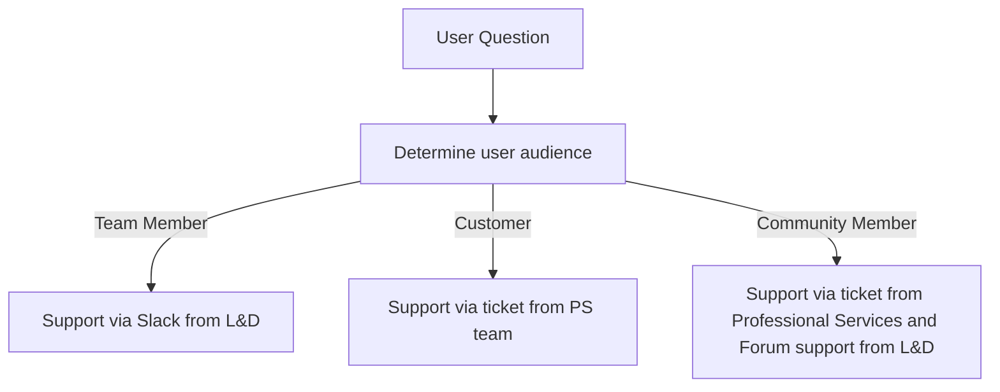
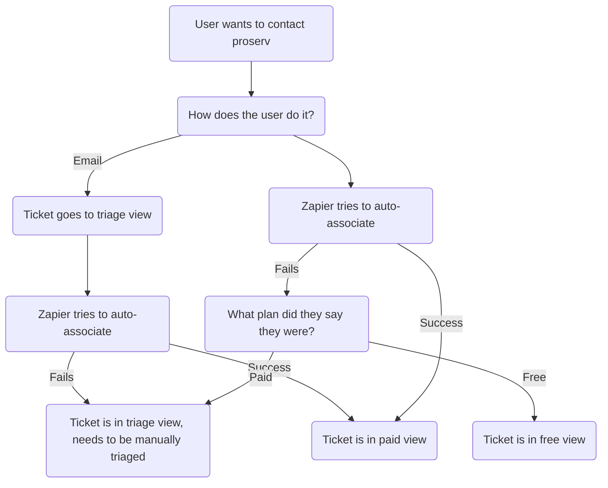

## On this page
{:.no_toc .hidden-md .hidden-lg}

- TOC
{:toc .hidden-md .hidden-lg}


# Navigating GitLab Learn Admin Content

On this page, team members working in the GitLab Learn platform will find documented processes and best practices for content creation. The page is split into the following sections.

| Title | Purpose |
| ----- | ----- | 
| [Best practices for content creation and organization](/handbook/people-group/learning-and-development/gitlab-learn/admin/#best-practices-for-content-creation-and-organization) | Outlines best practices for creating on brand, handbook first learning content in GitLab learn. Please get familiar with this section before creating or organizing content in GitLab Learn. |
| [Processes, management, and maintenance of content in EdCast](/handbook/people-group/learning-and-development/gitlab-learn/admin/#processes-management-and-maintence-of-content-in-edcast)) | Outlines processes in the frontend and backend of GitLab Learn that are used to create, edit, and maintain content |
| [Reporting](/handbook/people-group/learning-and-development/gitlab-learn/admin/#approvals) | Includes key links and trainings in EdGraph |
| [Moderation](/handbook/people-group/learning-and-development/gitlab-learn/admin/#moderation) | TBD |
| [Support](/handbook/people-group/learning-and-development/gitlab-learn/admin/#support)| Includes support workflows for users and templates for contacting EdCast support |

Questions? Please reach out to the [L&D team in Slack](https://app.slack.com/client/T02592416/CMRAWQ97W/thread/CAEEVBR2M-1608029461.344100).

## Best practices for content creation and organization

If you're just getting started using EdCast, watch this short overview of the user experience in the platform and how new learning content fits into this design.

<iframe width="560" height="315" src="https://www.youtube.com/embed/Hm7SLOiV08o" frameborder="0" allow="accelerometer; autoplay; clipboard-write; encrypted-media; gyroscope; picture-in-picture" allowfullscreen></iframe>


### Contributing learning content

Definitions and examples of SmartCards, Journeys, Pathways, Channels, Carousels, Channels, and Groups can be found in our [GitLab Learn contribution docs](/handbook/people-group/learning-and-development/gitlab-learn/contribute/#learning-content-in-the-lxp)

Before reviewing the documented best practices below, take time to watch these recorded video examples of how content is contributed to GitLab Learn. These demos will help familiarize you with the terminology and structure of content in the platform and give context to the documented best practices.


#### Examples: Contributing content to GitLab Learn


##### Contribute an interesting article or video

<iframe width="560" height="315" src="https://www.youtube.com/embed/0cvYt5o3sWk" frameborder="0" allow="accelerometer; autoplay; clipboard-write; encrypted-media; gyroscope; picture-in-picture" allowfullscreen></iframe>


##### Contribute a new Pathway or Journey

<iframe width="560" height="315" src="https://www.youtube.com/embed/cuhI8Plcrbo" frameborder="0" allow="accelerometer; autoplay; clipboard-write; encrypted-media; gyroscope; picture-in-picture" allowfullscreen></iframe>

### Content creation best practices

#### Applicable to all content

1. URLs for content cannot be deleted or edited, and they are generated automatically by the title that is first entered for the content. This is the same for all content in the platform, so take care to properly name content when you're creating it for the first time. When content is deleted, that URL can no longer be used.
1. The `Mark as Complete` setting platform wide is set to `auto-mark as complete`. This setting allows our integration with LinkedIn Learning to track content completed on the LinkedIn platform itself and should not be changed. As a result, if you'd like users to manually mark content as complete, please be sure to select `Manually` at the Pathway setting to override the `auto-mark as complete` setting. Otherwise, leave Pathways to the `Automatically` mark as complete setting.

#### SmartCards

1. SmartCards created in a Pathway or Journey are only discoverable from within that pathway or Journey. Create SmartCards with quizzes, polls, or other action items from learners from within the Journey or Pathway
1. Create content based SmartCards independently from a Journey or Pathway so that content can be repurposed and discovered
1. Always set an estimated time to finish for each SmartCard, as this is used to give an accurate guess on how long the content will take to consume

Check out this video of a few of these SmartCard best pracitces in action:

<iframe width="560" height="315" src="https://www.youtube.com/embed/bORBlaaOwD8" title="YouTube video player" frameborder="0" allow="accelerometer; autoplay; clipboard-write; encrypted-media; gyroscope; picture-in-picture" allowfullscreen></iframe>

#### Pathways

1. Badges can be awarded upon completion of a Pathway. If the Pathway is not part of a Journey, use the Pathway level badges
1. Enable lock functions for pathways where you want learners to go through the content in a specific order. For locked pathways, leave the first SmartCard unlocked, and lock all subsequent Smartcards.
1. End Pathways that earn a badge with the sharing a [GitLab Learn badge SmartCard](https://gitlab.edcast.com/pathways/gitlab-certification/cards/1045949)
1. Consider ending Pathways with a SmartCard that provides next steps for learning. This could be a call to action to take a similar Pathway or follow a Channel.
1. Enable leap functions for pathways where you want to redirect the learner based on how they perform on a quiz. For example, if a user passes a quiz, they can leap to the next SmartCard, but if they fail, they can be directed back to a SmartCard to review content before taking the quiz again.

Here is an example where you might use lock and leap in a Pathway:

In the GitLab 101 certification, a user must first read the handbook page on technical terminology, then take the knowledge assessment. If the user passes the quiz, they will leap to the next SmartCard, which brings them to the next handbook section. If the user fails, they will leap back to the initial SmartCard to review the quiz content. In the same pathway, we have a short poll used as a knowledge check. In this case, if the user answers either correctly or incorrectly, they move forward through the locked SmartCards as normal without any using leap functionality.

Watch this video example that explains the use of lock and leap in a Pathway:

<iframe width="560" height="315" src="https://www.youtube.com/embed/qQRhuGK8QVs" frameborder="0" allow="accelerometer; autoplay; clipboard-write; encrypted-media; gyroscope; picture-in-picture" allowfullscreen></iframe>

#### Journeys

1. Badges can be awarded upon the completion of a Journey. It's best to require all pathways be completed in order to earn a badge and use a Journey level badge over Pathway level badges
1. End Journeys that earn a badge with the sharing a [GitLab Learn badge SmartCard](https://gitlab.edcast.com/pathways/gitlab-certification/cards/1045949)
1. Consider ending Pathways with a SmartCard that provides next steps for learning. This could be a call to action to take a similar Pathway or follow a Channel.


### Order of Operations for Content Creation

#### Step 1: Determine if content is `public` or `private`

| Content Type | Definition | Example Audience |
| ----- | ----- | ----- |
| `private` | Content is only visible to the assigned learner, assigned group, or channel | Content for the GitLab team or customers only |
| `public` | Content is discoverable and visible to all learners in the platform | Content for wider community members |

Watch this video that explains the difference between public and private content in GitLab Learn:

<iframe width="560" height="315" src="https://www.youtube.com/embed/MDu7CbyNHj8" frameborder="0" allow="accelerometer; autoplay; clipboard-write; encrypted-media; gyroscope; picture-in-picture" allowfullscreen></iframe>

#### Step 2: Build smartcards depending on content status 

This video outlines the three scenarios for building public versus private content outlined below:

<iframe width="560" height="315" src="https://www.youtube.com/embed/__6zr0C3Dmk" frameborder="0" allow="accelerometer; autoplay; clipboard-write; encrypted-media; gyroscope; picture-in-picture" allowfullscreen></iframe>

##### Building `public` content

1. Build SmartCards independently of any Pathways or Journey
1. Make sure the `private` content checkbox is unchecked for SmartCards, Pathways, and Journeys
1. Add SmartCards to relevant Pathways, Journeys, Channels, and Groups

**Example:** L&D creates a publicly available course called GitLab 101. The SmartCards for this course link to the handbook and should be public to all users in the platform. The team will create each SmartCard independently in the EdCast platform, then add them all to a Pathway. Quizzes for the course will be created within the Pathway to utilize progressive unlocking features. The course can be broadcasted on public channels for new learners to discover the content.

##### Building `private` content 

1. Build Smartcards within a Pathway or Journey
1. Make sure the `private` content checkbox is checked for SmartCards, Pathways, and Journeys
1. Assign content directly to an individual user, group, or channel

**Example:** L&D uploads a compliance course with graded content for a specific group of learners. Since it is graded, interactive content, we want this path to only be assigned to the GitLab team. SmartCards will be built within a private Pathway that will be assigned directly to team members via a Group. In the future, the team might create a public course without the graded elements that could be public for the wider community.

**Important Note:** If you share `private` content on a `public` channel, anyone following that channel will be able to view the content. If you need to restrict content, please be sure only to share `private` content with `private` channels AND groups.

##### Building content with both `public` and `private` elements

Option 3: If parts of the content are for a certain audience and parts are available to all learners

1. Create a Pathway and confirm the `private` content checkbox is checked
1. Create `private` content in SmartCards in a Pathway
1. Create `public` content in a SmartCard outside of the private Pathway
1. Assign Pathway to specific learners or groups

**Example:** L&D hosts a [manager challenge course](/handbook/people-group/learning-and-development/manager-challenge/) with graded content for a specific group of learners. The team wants the manager content available for the wider community but needs the graded content to be restricted to assigned learners. SmartCards with public content will be built independently of any Pathway, then added to the private manager challenge Pathway. SmartCards with private content will be built within the private manager challenge Pathway. This private Pathway will be assigned to specific audiences and the wider community can discover content in SmartCards.

There is also the option to organize these public SmartCards into a second Pathway that the wider community can access without the graded requirements. Perhaps a quick quiz or poll could be utilized here instead. 

#### Sharing private content with the right audience

With the combination of `private` content, Groups, and Channels, you can restrict content to certain audiences in GitLab Learn. This is an essential EdCast feature for the GitLab team, as we're using GitLab Learn to share content across internal and external audiences. Examples include:

1. Sales enablement content that is for internal audiences only
1. Training platforms for specific teams that are for specific team members only
1. Professional Services content that is for paid customers only

Below outlines use case examples when using `private` Groups, Channels, and content. It's important to understand how stacking `public`/`private` content with `public`/`private` Channels and Groups will impact user access.

1. Begin by reviewing the steps above that explain how to mark content as `public` or `private`
1. `private` content can be shared with Groups and Channels
1. If you share `private` content with a `private` Group, only members of that Group can access the content. Be sure this Group is **not** open so that non-designated users can't join the Group. An example of this use case is the Field Enablement team, who creates trainings that are shared only with the `GitLab Internal Team Members` group, or with Professional Services, who create trainings that are shared with specific customer groups.
1. If you share `private` content with a `public` Group, only that Group can access the content, **but anyone can join the group**. This use case can be used if you want to organize users with similar interests into a Group, but make the Group available for anyone to join.
1. If you share `private` content with a `private` Channel, only followers of that Channel can see the content. This is a great way to organize and curate content for specific audiences. For example, before launching our entire course catalog, the L&D team will restrict our external content offerings on GitLab Learn to 3 courses. However, we still want all our material to be available to GitLab team members. To do this, we can create a `private` Channel and share that Channel with the `GitLab Internal Team Members` Group. This will ensure that the content on the `private` Channel can only be seen by members of the `private` Group. Later, we can make this Channel `public` and share with all users.
1. If you share `private` content with a `public` Channel, only followers of that Channel can see the content, **but anyone can follow the Channel**. This is a similar use case as sharing `private` content with a `public` group. If you'd like to organize users with similar interests by inviting them to follow a `public` Channel, this use case might work.


### Choosing between a badge or certification

#### Badges

Badges are available with the creation of both pathways and journeys and are awarded to the learner on the EdCast platform upon completing a set Pathway or Journey. Badges can also be [shared by the learner](/handbook/people-group/learning-and-development/gitlab-learn/user/#sharing-your-gitlab-learn-badges) on their LinkedIn profiles.

Teams should choose to use a badge to recognize learners achievements when:

- Learning Pathways are completed
- Journeys that do not require an official certification or accreditation 
- Setting goals, motivating behaviors, representing achievements, and communicating success

Follow the steps below for [creating a badge in EdCast](/handbook/people-group/learning-and-development/gitlab-learn/admin/#creating-a-badge)

Watch this video to review how to add badges to a Pathway or Journey:

<iframe width="560" height="315" src="https://www.youtube.com/embed/VnBSYZ8Cbws" frameborder="0" allow="accelerometer; autoplay; clipboard-write; encrypted-media; gyroscope; picture-in-picture" allowfullscreen></iframe>

#### Certification

_Please note that as of 2021-03-11, Certifications are not yet enabled in EdCast._

Certifications are available for content updated in the Leapest LMS Lite with the combination of assessments created in Mettl. The certifications can be shared externally.

Teams should choose to use certifications to recognize learners achievements when:

- Learners require an official certification upon completion
- Establishing credibility in a specific skill area, etc.


### Image guidelines

Images in the LXP enable us to: 

- maintain a look and feel that aligns with the GitLab brand
- help users identify different kinds of content in the platform

The following outlines best practices for choosing images to use in the LXP. When content is created in the LXP in any form, an image or placeholder is automatically generated. Follow these best practices to update these placeholder images before publishing new content.

#### Choosing photographs

The GitLab team will use the following photographers on [Unsplash.com](https://unsplash.com/) for images in the LXP.

- [LinkedIn Sales Navigator](https://unsplash.com/@linkedinsalesnavigator)
- [WOCintech](https://unsplash.com/@wocintechchat)

Future photographers will be added as needed.

If you're looking for pre-approved images for your content, please review the [GitLab Learn photo drive](https://drive.google.com/drive/folders/1GvE-MUtHzGbZ9KX-16bsTvwFDn-Cd4hy?ths=true).

Keep the following in mind when choosing a photograph:

1. Look for opportunities to demonstrate [GitLab culture](/company/culture/). For example, consider choosing an image of a learner working on their laptop to reflect [all-remote work](/company/culture/all-remote/), two people working together to demonstrate [collaboration](https://about.gitlab.com/handbook/values/#collaboration), or a family or small group of friends learning together to reflect [friends and family first, work second](/handbook/values/#family-and-friends-first-work-second)
1. Choose inclusive images that reflect our values of [Diversity, Inclusion, and Belonging](/company/culture/inclusion/)
1. Look for opportunities to use images that demonstrate learning. This could include virtual classroom discussion, social learning/networking, working on a project, use of mobile, leadership talks, etc. 
1. Avoid images of large groups as it could make content look out of date
1. Keep the focal point of the image in the middle to enable better cropping and addition of the image overlays described below

### Images for SmartCards

SmartCards without an image uploaded will either generate a random image from the EdCast system or will show no image at all. Both cases don't align with the look and feel of GitLab Learn. Follow one of the two options below when adding images to SmartCards

1. Preferred Option: Upload a GitLab image from the [SmartCard image folder](https://drive.google.com/drive/u/1/folders/1r3Z0bLvwwswSHF550kSLsdr9kvivkql8?ths=true). This will hard code an image to the SmartCard that will not change.
1. Secondary Option: Use the image generated from the web source on a link SmartCard. This is a secondary option because if the image on the site your link is from changes, the SmartCard will either populate with a random image from EdCast or provide no image at all, both of which negatively impact the overall look and feel of GitLab Learn.

#### Images for Journeys and Pathways

Journeys and Pathways will be identified with a white graphic image overlay and the GitLab logo using either black or white text. Here's an example:


[Example of images in Canva](https://www.canva.com/design/DAEQ-5KGqe4/7JF_Fz8qV2a0owZDQGLlcw/view?utm_content=DAEQ-5KGqe4&utm_campaign=designshare&utm_medium=link&utm_source=publishsharelink)

We've organized a [GitLab Learn photo drive](https://drive.google.com/drive/folders/1GvE-MUtHzGbZ9KX-16bsTvwFDn-Cd4hy?ths=true) so that contributors to GitLab Learn can access pre-edited photos to upload.

#### Images for SmartCards

Use the following chart to determine what image is best to use for your SmartCard content

| Scenario | Image Guidelines |
| ----- | ----- |
| The SmartCard will be broadcasted on the Discover page | Follow guidelines for Journey and Pathway images |
| The SmartCard links to the Handbook | Use the auto-generated GitLab logo |
| The SmartCard is stored within a Pathway or Journey | You may either update each image following the guidelines for Journey and Pathway images or use the auto-generated images in the platform |

#### Images for Channels

Channels will be identified with a branded banner image with a custom Tanuki in the center. Here's an example:


This [basic Channel image in Canva](https://www.canva.com/design/DAEQ_HWFcFs/238nynM1dCJOSWUrrecCqA/view?utm_content=DAEQ_HWFcFs&utm_campaign=designshare&utm_medium=link&utm_source=publishsharelink) can be used for any Channel in the platform.

The LXP implementation team will collaborate with the brand team to customize the Channel images to fit specific content when necessary.

You can find pre-approved Channel images in the [GitLab Learn photo drive](https://drive.google.com/drive/folders/1GvE-MUtHzGbZ9KX-16bsTvwFDn-Cd4hy?ths=true)

#### Images for Groups

Groups will be identified with images that use a purple graphic overlay on the left side of the image, with the GitLab logo and white text. Here's an example of multiple Groups displayed on the Discover page:


[Example of images in Canva](https://www.canva.com/design/DAEQ-q4s2pY/soqq_hq3ND1oUNh7x6KPHA/view?utm_content=DAEQ-q4s2pY&utm_campaign=designshare&utm_medium=link&utm_source=publishsharelink)

You can find pre-approved Group images in the [GitLab Learn photo drive](https://drive.google.com/drive/folders/1GvE-MUtHzGbZ9KX-16bsTvwFDn-Cd4hy?ths=true)

#### Profile photos

Individual learners are responsible for uploading their own profile and banner photos.


### Peer review content before publishing

It's important to have another member of your team review your content before making it live on the platform. Consider using this process to review content in the LXP. If your team decides on a different peer-review process, please document on this page.

#### Prior to peer review

1. The content creator or curator builds the content in the LXP, including opening SmartCards, branded images, and organizing Pathways and Journeys
1. Mark content to `save for later`, which leaves it in a draft state (not yet published)
1. Team collaborates in Slack to find a reviewer for their private content by sharing the direct link to EdCast
1. Reviewer uses the following checklist to confirm that content is ready to be shared with the wider GitLab Learn audience:

#### Peer reviewing for GitLab Learning Evangelists

When completing a peer review, Learning Evangelists can

1. Ask the L&D team for support, or
1. Ask another Learning Advocate

As new team members are onboarded as Learning Evangelists, the L&D team will serve as the primary peer reviewers for contributed content. As the Learning Evangelists get more confident in the platform, a process will be developed to share and review content together. For now, please reach out to the L&D team in the [#learninganddevelopment Slack channel](https://app.slack.com/client/T02592416/CMRAWQ97W) and request for your learning content to be reviewed.

#### Content review checklist items

To review in the front end of GitLab Learn

1. Click into the `edit` mode to review content in each Journey or Pathway
1. Content is organized in a Pathway or Journey
1. Name is clear and identifies what the learner will achieve upon completion
1. Description of the Pathway or Journey clearly defines the content
1. Images are branded based on correct image guidelines
1. Learning level is set
1. Badge status is set and uploaded
1. Each SmartCard has a clear description

To review in the EdCast backend

1. Language is specified
1. Tags are added based on related content keywords
1. Relevant channels are included
1. User taxonomy topics are chosen

When the peer-review is complete, content should be switched on by the content creator to the `published` state.


### Sharing content

#### Using groups

Groups are best utilized to organize learners around a specific quality. Examples include role and team. Consider these best practices when creating a group:

1. Decide if your group is private or public. Private groups cannot be discovered by learners who are not members of the group. These are best used when you want to organize a group of only your direct team members. Public groups are discoverable by any learner on the platform. These are best used when you'd like to broadcast the group to a wide audience
1. If groups are not marked private, then members can click the option to join. If you want to make them visible and share with everyone, do not mark the group as private
1. Groups can be used to assign content to a specific group of people. Learning can be assigned to all members of a group
1. Content can be shared privatley with one or more groups. When its not shared with someone outside of that group, they won't discover it
1. When new members are added to a group, they will automatically be assigned all content that has been assigned to that group
1. Groups offer a space to create a community of learners around a similar topic or goal
1. All groups must have a group administrator that will take responsibility for managing content in the group, curating new content for the group, and creating new ways to maintain a community. Group admin are encouraged to open an MR to this page and add best practices for group management

##### Inviting new members to groups

Engage learners in groups using the following practices

1. Learners automatically added by the HRIS integration from BambooHR to groups based on their role in the organization
1. Manually adding users to groups by navigating to the group and clicking the `invite` option
1. Broadcast open groups on the Discover page to invite new members

##### Dynamic Group Workflows

Dynmaic group workflows automatically add users to groups based on user account settings. The integration with BambooHR allows GitLab team members to be sorted by team, role, location, etc. All data available to sort by in dynamic group workflows can be viewed in the `User` section under the `Accounts` tab. 

The following steps describe the process for creating a new dynamic group workflow.

1. Login to the EdCast admin panel
1. Under the `Accounts` tab, click on `Dynamic Group Management`
1. This pannel shows the status of all current dynamic group workflows, if the workflows are enabled, name, date created, and their owner. There is also the option to run, edit, view, or delete existing workflows.
1. Create a new workflow by clicking the `add new` button
1. Give a name to your workflow. It is best practice to make sure the name indicates what users will be moving through the workflow. Considering naming the workflow the same as the related group.
1. Use the `Criteria` tab to set the conditions of your workflow. These are set up similar to an `if` or `if, then` statement.
1. Choose a `column`. This data correlates directly to the columns of data pulled in from BambooHR for team members, listed on the `Users` admin page.
1. Set a condition. For example, use the `Equals` condition to indicate that the column variable you picked is `true`.
1. Choose a variable from the data `column` to sort by. For example, if you choose the `Role` column, your condition choices here will be `manager`, `individual contributor`, and `leader`.
1. The option exists to add a multiple rules if you need to make your workflow drill down into a more specific cross section of people. Use the `add rule` button to create another condition for your workflow.
1. In the `Configuration` tab, decide where this workflow will add users. Choose to create a new group, create a custom group, or add to an existing group.
1. Click `Save`. This will **not** run your workflow.
1. After saving, you'll return to the main `Dynamic Group Management` page. The new workflow will appear at the top of the list.
1. To run the workflow, toggle the button in the `Enable` column so that the workflow is `on`. Then, click the play button in the `Actions` column. This will start to run your workflow.
1. The EdCast platform runs these workflows on a certain cadence, so your groups might not populate right away. Check back on your workflow over the course of a few hours to confirm the workflow has run as expected.
1. Workflows in the `on` state will continuoulsy, adding new users to your group as they join the platform.
1. To stop the workflow, navigate to this `Dynamic Group Management` page and toggle your workflow to the `off` status.

Here is an example of a dynamic group workflow that pulls all GitLab team members into an existing group:


###### Dynamic group workflows for team members

When building a dynamic group workflow for team members, be sure to include the following two rules

1. `Department` should be set to the specific department you're sorting by. This will fill the group with team members who fit that department in BambooHR.
2. `GitLab Internal` should be set to `t`, or `true`. This will make sure that only team members are added to this group.

#### Broadcasting on Channels

Channels are used to collect and broadcast information based on like content. Users can follow channels to stay up to date on all new learning content in a specific area of interest. 

1. Use Channels to share content with a wider audience. For example, if the L&D team created a training on effective communication for the GitLab team and assigned it to the GitLab team group, the same content could be shared on a Remote Communication Channel so the wider community could train on this course as well
1. Channels should have a clear title and description that defines what content the user will find in the channel
1. SmartCards, Pathways, and Journeys can be shared to channels upon creation or can be added to relevant channels later on
1. Channels can have multiple curators to encourage collaboration and content sharing

#### How Learning Evangelists can share content

Learning Evangelists can use the following processes to broadcast or highlight their contributed content

1. Raise attention to new content with the L&D team via Slack. The team will help you determine the best Carousels, Groups, or Channels to broadcast your content
1. Share content with a Group you're a part of, like your team
1. Share content to a Channel with a relevant topic, like Remote Work Foundations

### Designing the discover page

The discover page is the page where learners will land upon logging into the LXP. On this page, users can discover new content, navigate to their followed channels, find their groups, and more.

The discover page can be leveraged by admin to: 

- advertise new learning opportunities
- share new channels
- highlight learning from specific users

The discover page is also curated based on the user. For example, if a carousel appears on the discover page that includes private groups, only groups that the user is a part of will appear.

Use these best practices when designing and updating the discover page in EdCast:

1. Consider multiple user perspectives when adding static content to the discover page. For example, the first iteration of the discover page includes links to EdCast user docs, which is relevant for all users in their first few times accessing the platform 
1. Use custom carousels to organize content by topic. Carousels can display either channels or users
1. Custom carousels with channels should be clearly named and invite the learner to explore a specific topic
1. Custom carousels with users should feature engaged learners and leaders in the platform 
1. Leverage a carousel of groups by creating SmartCards that link directly to groups that you want to highlight


## Processes, management, and maintenance of content in EdCast

This section documents specific workflows in EdCast that admin will use when creating and maintaining content. As the LXP implementation team discovers new ways to utilize EdCast, these processes shoud be updated. All admin should consider opening an MR to this page and workflows as they explore new tools in the platform.


### Journeys, Pathways, and SmartCards

#### Create a Journey

1. Click the `Create` button in the top navigation bar
1. Choose to create a `Journey`
1. This will open a pop-up on the page where you'll create your Journey.
1. It's important to review the [order of operations for public and private content creation](/handbook/people-group/learning-and-development/gitlab-learn/admin/#order-of-operations-for-content-creation) at this point to determine the best place to create Pathways and SmartCards for your Journey
1. Fill in the `title`, `description`, `level`, and `tags` for your Journey
1. Decide if your Journey will use a [badge](/handbook/people-group/learning-and-development/gitlab-learn/admin/#choosing-between-a-badge-or-certification) and mark the `badge` setting as necessary
1. Decide if you'd like your Journey to be `Self Paced` or `Progressive Unlocking`
1. Update your Journey image based on the [image guidelines](/handbook/people-group/learning-and-development/gitlab-learn/admin/#images-for-journeys-and-pathways)
1. Either build out Pathways and SmartCards from within the Journey or add content you've already created. Drag and drop Pathways and Smartcards to determine the desired order
1. Choose to `Save for Later` to be reviwed or `Publish` for content to be available on the platform.

#### Create a Pathway

1. Click the `Create` button in the top navigation bar
1. Choose to create a `Pathway`
1. This will open a pop-up on the page where you'll create your Pathway.
1. It's important to review the [order of operations for public and private content creation](/handbook/people-group/learning-and-development/gitlab-learn/admin/#order-of-operations-for-content-creation) at this point to determine the best place to create Pathways and SmartCards for your Pathway
1. Fill in the `title`, `description`, `level`, and `tags` for your Pathway
1. Decide if your Journey will use a [badge](/handbook/people-group/learning-and-development/gitlab-learn/admin/#choosing-between-a-badge-or-certification) and mark the `badge` setting as necessary
Update your Journey image based on the [image guidelines](/handbook/people-group/learning-and-development/gitlab-learn/admin/#images-for-journeys-and-pathways)
1. Either build out new SmartCards from within the Pathway or add content you've already created. Drag and drop Pathways and Smartcards to determine the desired order
1. Choose to `Save for Later` to be reviwed or `Publish` for content to be available on the platform.
1. Document all quiz questions and answers in a Google doc. Since you cannot edit or view quizzes after they've been taken by a user, this will help you make edits quickly if necessary

#### Create a Smartcard

1. Click the `Create` button in the top navigation bar
1. Choose to create a `SmartCard`
1. Choose the type of content you'd like to share
1. Each content type requires a different set of requirements to be provided. Follow the prompts based on each content type
1. Be sure to add a `title`, `duration`, `tags` and `level` to all SmartCards
1. Click `Create`

#### Using iframes and the Rich Text Editor (RTE) EdCast feature

EdCast has enabled a Rich Text Editor(RTE) that enables iframes in text SmartCards. This is a great way to create [handbook first learning content](/handbook/people-group/learning-and-development/interactive-learning) directly in GitLab Learn. 

To use the RTE:

1. Navigate to the Discover page, or click into the Pathway where you want to create the text card
1. Click the `Create` button and choose `SmartCard`. When choosing the type of SmartCard to create, choose the `Text` option.
1. Include your iframe directly in the text box on the text card. For best practices for building iframes, refer to how we use [iframes in Articulate360](/handbook/people-group/learning-and-development/interactive-learning/#using-iframes-to-display-the-gitlab-handbook)
1. If you'd like to upload a photo, you can do so in the text card. This photo will be used as the thumbnail image on the card when it appears in Pathways, Journeys, etc.

If you have access to our Sandbox instance, you can see a couple examples there. This is an example of [no scrolling](https://gitlabsandbox.edcast.com/insights/using-iframes-for-handbook-first-learning) which can be used to focus on a specific section or a video. This is an example of [scrolling](https://gitlabsandbox.edcast.com/insights/test-learning) if you are wanting to include an entire handbook page. 

### Editing Journeys, Pathways, and SmartCards

Moderation and limited editing occurs in the admin backend. The following steps outline how to access these limited edits and moderate Journeys, Pathways, and SmartCards.

#### Making edits in the admin panel

1. Login to Edcast and navigate to the `admin` panel
1. Click on the `content` tab
1. Choose either the `SmartCards`, `Journeys`, or `Pathways`
1. In each tab, you'll find a list display of all the content in each type. From this list, you can:
     - View data about the content, like creation date, creator, title, tags, related channels, and state
     - Promote content using the toggle on/off option
     - Delete content using the trash icon
     - Edit backend content information by clicking on the pencil icon

##### Limitations of backend content editing

Edits that you'd like to made related to the arrangement of content in the LXP will be done in the front end. The following are examples of edits you **cannot** make in the admin section and will need to use the EdCast front end to edit:

- Arrangement of SmartCards in a Pathway, or Pathways in a Journey
- Badging information

#### Editing Pathways after users have completed the Pathway

At GitLab, we iterate quickly and ship things that aren't perfect. The EdCast system does not easily enable us to make iterative updates and changes to Pathways once published, especially after a user has accessed or completed the Pathway. This section outlines the limitations of the tool and best practices for editing Pathways.

##### Limitations

- Quizzes that have been completed by users cannot be editied
- Administrators cannot see quizzes once they have been completed
- If a pathway is edited after a user earns the pathway badge, they will retain their badge, but their completion status on the pathway will show up as a percentage less than 100%, depending on how many SmartCards are now `incomplete` after editing

##### Best Practices

1. Use the [lxp-contributions issue board](https://gitlab.com/gitlab-com/people-group/learning-development/lxp-contributions/-/boards) to triage reports of errors in GitLab Learn
1. Open the Pathway that contains the error. This original Pathway is considered your Version 1 or V1 of the Pathway. Click the three dots in the top right corner of the Pathway and choose `Make a Copy`. This new copy is now consiered your Version 2 or V2 of the Pathway.
1. Navitgate to your `Profile` page and click `Content` to view the V2 Pathway. This will be titled automatically as `Copy Of {Pathway Name}`
1. Return to the V1 of your Pathway and rename it as `DEPRECATED V1: {Pathway Name}`
1. Now, you must remove the Pathway from any related Channels, Groups, or Assignments in order to keep users from finding it. Do **NOT** delete the V1 Pathway as this will remove any user data related to the Pathway.
1. After removing any Channels, Groups, or Assignments from the Pathway, mark the Pathway as `private`.
1. Return to the V2 of your Pathway and rename it to the correct title of the Pathway
1. Make necessaary updates to the V2 Pathway. This will most often include replacing current quiz SmartCards with new SmartCards that will correct spelling, answer accuracy, or other content.
1. This V2 Pathway is now the most up to date version of the Pathway content. Reshare this new V2 Pathway with any related Channels, Groups, or Assignments. 
1. Refer to the Reportinig section of this admin page to understand how the combination of reports from V1 and V2 Pathways will give a full picture of completion.
1. If you need to update V2 or versions beyond of a Pathway, follow this same process but repalce the version names with `VX` or `version X` where `X` is the correct version number.

### Channels

#### Creating a new channel

1. Login to Edcast and navigate to the `admin` panel
1. Click on the `content` tab
1. Click on `channels`
1. Click on `add channel`
1. In the `setup` tab, define the following for your channel:
     - Name: This is the name users will see on the discover page and across the top of the channel
     - Description: Provide a short text description about content this channel will broadcast
     - Profile image: Refer to the image guidelines below 
     - Topics: Add at least 3 topics to categorize content that will be in this channel. This will help users discover the channel in the platform
     - Provider: Define who is creating the channel or where the content is coming from. For example, 'GitLab Field Enablement Team'. This step is not required.
     - Provider Image: Add an image to correspond with the provider above. This step is not required. This image will overwrite the channel image
     - Private, Open, Allow Follow, and Automated Pin Cards: Confirm all permissions
1. Click `save channel`
1. After you click `save channel`, the following tabs will open for editing: `content`, `people` and `carousels`
1. These tabs will allow you to further define permissions for your channel. These are not required to create your channel, but will help customize and organize content. 

**Documentation Note:** For the purposes of MVC documentation, the L&D team will stop channel documentation here and iterate in the future as we discover how customization within these additional tabs can be leveraged.

#### Editing an existing channel

1. Login to Edcast and navigate to the `admin` panel
1. Click on the `content` tab
1. Click on `channels`
1. Here, you can turn the `promotion` tab on or off if you'd like to promote the channel
1. You have the option to delete or view the history of the channel, see the title, and related user information
1. Locate the channel you'd like to edit in the list. Click on the small pencil button to edit. 
1. Follow the steps above for `Creating a new channel` to make any edits or updates to the existing channel

#### Creating custom carousels on a channel

Custom carousels in a channel can help organize and guide users to highlighted content. Content needs to first be shared to the channel to add to a custom carousel. Content can be shared to multiple custom carousels.

1. Login to Edcast and navigate to the `admin` panel
1. Click on the `content` tab
1. Click on `channels`
1. Locate the channel you'd like to edit in the list. Click on the small pencil button to edit. 
1. Click on the `carousels` tab on the top right corner
1. From here, you can `enable` or `disable` existing carousels
1. You can also create new carousels here. Enter the name of your new carousel and click on the `create carousel` button 
1. When the new carousel has been created, clikc the small pencil button to edit.
1. Click the `add item` box to add content to that carousel. Remember that only shared content to the specific channel will appear here.
1. The changes will save automatically. Navigate to the channel in the GitLab Learn front end and refresh the page to see your changes


### Carousels

#### Creating a custom carousel

1. Login to Edcast and navigate to the `admin` panel
1. Click on the `content` tab
1. Click on `custom carousels`
1. Choose `select type` and decide on the type of channel you'd like to create. You can feature users, SmartCards, or channels in a carousel
1. Add a name to the carousel. This name will appear on the discover page above the carousel and should indicate what the learner will find or achieve in this carousel
1. Click `create carousel`
1. This will open a tab where you can further build the carousel
1. If you create a carousel of smart cards, use the `default` rectangular shape for display. If you create a carousel of channels, use the `classic icon` shape for display
1. Add relevant channels or SmartCards by searching and clicking on the content you'd like to feature. You can drag and drop these items to arrange the order and delete unnecessary content using the trash icon
1. When you've completed your carousel, click the `done` button
1. Return to the `custom carousels` tab and be sure the enable/disable tab is `on` for it to appear on the discover page. If you'd like to save the carousel to be featured at a later date, leave this tab in the `off` mode

#### Editing existing custom carousels

1. Login to Edcast and navigate to the `admin` panel
1. Click on the `content` tab
1. Click on `custom carousels`
1. Here, you can edit and enable/disable carousels. Disabled carousels will not be visible on the Discover page
1. Click on the pencil icon
1. In editing a carousel, you can change the style and add channels, users, or SmartCards. When you're done editing, click the `done` button to save your changes 
1. You can update the name of your carousel. Click the `update carousel name` button to save your changes


### Editing the Discover page

1. Login to Edcast and navigate to the `admin` panel
1. Click on the `settings` tab
1. Click on `configuration`
1. Navigate to the `discover` tab
1. On this page, you can
     - Drag and drop carousels to edit their arrangement on the discover page
     - Rename built-in carousels
     - Toggle built-in carousels to be on or off


### Moderating content

Admin processing for moderating content will be outlined in future iterations.


### Creating a badge

Badges are used in the EdCast platform to award learners who have finished a Pathway or Journey. Badges can be shared in the EdCast platform and externally on learner's LinkedIn profiles. Use the GitLab [requesting design help process](/handbook/marketing/corporate-marketing/brand-activation/brand-guidelines/#requesting-design-help) to request a new badge.

#### Adding a badge to EdCast

1. If necessary, collaborate with the brand team to [create a new badge](/handbook/marketing/corporate-marketing/brand-activation/brand-guidelines/#requesting-design-help). Otherwise, locate the existing badge file
1. Email EdCast account rep with the request to upload the file to the platform
1. Navigate to the pathway or journey you'd like to add the badge to. In the `create` or `edit` tab, navigate to the `badge` setting
1. Mark the check box to indicate that `Upon completing this pathway/journey, assignee will get a badge`
1. Decide if you'd like to unlock the badge after a quiz, and mark the checkbox if needed
1. Click on the badge you'd like to associate with the course
1. Add a badge name
1. Click the `done` button


## Reporting

EdCast uses a tool called EdGraph, hosted by Domo, to provide pre-built and custom reports for users on GitLab Learn. 

### Key Dashboards

1. [GitLab Learn Key Reports - All Users](https://edcast-536.domo.com/page/2188975) - this dashboard displays key reports that give insight into course completion and use engagement platform wide on GitLab Learn. This is the best dashboard to view metrics that are **not** segmented by audience.

### How to get EdGraph Access

Follow the steps outlined in the handbook to open an [individual access request for the `EdGraph` role in EdCast](/handbook/business-technology/team-member-enablement/onboarding-access-requests/access-requests/). First obtain manager approval on this AR, then assign the AR to `@slee24`.

Once processed, you'll be able to be added as a collaborator on reports in EdGraph. Please work with the L&D team to be sure the essential reports are shared to your account.

### L&D Teaam Dashboards

1. [Learning and Development Key Reports](https://edcast-536.domo.com/page/1036257110) - this dashboard displays custom reports that share information for only GitLab team members on the GitLab Learn platform
1. [DIB Certification Completion Reports](https://edcast-536.domo.com/page/2098296181) - this dashboard shows team member completion of the DIB certification broken down by department level

### Reporting Training Materials

#### Office Hours Recordings

This [Google Drive](https://drive.google.com/drive/u/1/folders/1RMqJqYNwO2KMjnDKb5FwNxvwDHCcmbk6) contains recordings of office hours with EdCast that have a heavy focus on reporting using EdGraph and are great training resources for team members looking to build and access reports using the tool.

#### L&D Monthly Reporting

The following private videos can be viewed by team members using the GitLab Unfiltered account for training on how to create reports using EdGraph and Domo.

1. [How L&D uses custom dashboards and reports in GitLab Learn](https://youtu.be/xQwhmX_hRYg)
1. [How to create a custom report using EdGraph](https://youtu.be/ofqAjoUkJuM)
1. [Monthly L&D reports](https://youtu.be/vS0XuxkAH_E) - this training walks through how our [Learning and Development Key Reports](https://edcast-536.domo.com/page/1036257110) is used to fill in monthly data in our [FY22 GC Metrics sheet](https://docs.google.com/spreadsheets/d/1NxY5VWJlsQsOWmQrNAGPr7IIJ2Sa8qixXY7Et0cj45k/edit#gid=0)


## Moderation

Moderation and CoC workflows are being determiend by the LXP implementation team and will be documented in future iterations.


## Support

### Temporary Support Model

GitLab Learn is planned to launch to external audiences on 2021-03-15. Without a dedicated LXP admin, the implementation team will use this temporary support process across the Professional Services and Learning and Development Teams to enable and support all users.



#### SLAs for temporary support workflow

GitLab team members should work towards responding to internal and external requests for support based on the following SLAs:

| Audience | Support Method | SLA |
| ----- | ----- | ----- |
| Team Members | Slack support from L&D team | 2 business days |
| Customers | Zendesk support from PS team | TBD by PS Team |
| Community Members | Zendesk support from PS or L&D teams | 1 week |
| Community Members | Fourm support from L&D team | 1 week |

Workflows, email templates, and outlines below will remain the same for this temporary support model.

### End goal Support Model

This section outlines workflows and processes that the GitLab team uses to provide support to GitLab Learn users.

Due to the diversity in audience on the GitLab Learn platform, support is managed and supported by multiple teams at GitLab.

This workflow will be implemented when the LXP implementation team has adeuqate staffing for platform administration.

```mermaid
graph TD
    A[User Question] --> B[Determine user audience]
    B -->|Team Member| D[Support via Slack from L&D]
    B -->|Customer| E[Support via ticket from PS team]
    B -->|Community Member| F[Support via ticket or Community Forum answer from LXP admin

```

### Pathways for user support

#### Slack support for team members

##### Slack workflow

GitLab team members are directed to seek support for the GitLab Learn platform in the #learninganddevelopment Slack channel. From this channel, the Learning and Development team will answer questions and support with platform issues. The L&D team monitors the #learninganddevelopment Slack thread daily. If questions are posed that L&D cannot solve, they will engage EdCast for further support via email.

Field sales team members might naturally reach out to exising channels of support from the Field Enabement team for their specific content. If Field Enablement questions are posted in the Learning and Development Slack channel, the team will route inquiries to the correct team member.

This chart outlines common questions and triage actions taken by the L&D team:

| Question Topic | Triage |
| ----- | ----- |
| Platform Permissions or Functionality | Check admin panel and engage EdCast when necessary |
| Learning Content | Support 1:1 in Slack |
| Content contribution process | Direct to Learning Evangelist Pathway |
| Field Enablement or Professional Services content | Tag FE and PS DRIs |


#### Zendesk support for customers and community members

Zendesk will be our main hub for providing user support for external audiences on GitLab Learn. 

Customers and community members will be directed to open a ticket using the professional services contact form.

The following workflow outlines how new tickets are directed to the appropriate Zendesk view:



##### Customer support workflow using Zendesk(Paid Users)

The workflow for customers using the LXP will be determined by the Professional Services team via the `paid` Zendesk view.

##### Community support workflow using Zendesk (Free Users)

Zendesk tickets from users with free GitLab accounts or without a GitLab.com account will be routed to the `free` view and processed by the LXP admin.

When providing support to community members, please review the `Support for frequently asked questions` section below for common workflows and templates used to provide free support.

#### Community Forum Support (Paid and Free Users)

The GitLab Community Forum has a category entitled `GitLab Learn` for users to connect and ask questions about GitLab Learn. Responses to this category will be managed by the LXP admin.

Below are a collection of key questions and answers posted on the forum. Consider linking to these threads when providing support on the forum, in Zendesk, or in Slack.

| Question | Forum Thread Link |
| ----- | ----- | 
| | |
| | |

Important considerations when responding to questions in the forum:

1. If you need personal information from the user, direct them to open a ticket. This could include problems with logging in, accessing their account, or updating accout information.
1. Whenever possible, link back to the [GitLab Learn user docs](/handbook/people-group/learning-and-development/gitlab-learn/user/) in your response. If the information you're sharing isn't documented on that page, add it.
1. Review other ways to [use and interact with users on the forum](/handbook/marketing/community-relations/community-operations/#forum-uses)


### Support for frequently asked questions

#### Team member opens a Zendesk ticket for support

##### Support workflow

1. Use the Zendesk macro to direct team members to Slack

##### Response

```
Dear {{user.firstname}}

Team members can get support for GitLab Learn in Slack from the Learning and Development team. Please reach out to them with your question in the [#learninganddevelopment](https://app.slack.com/client/T02592416/CMRAWQ97W) channel.

Sincerely,

{{agent.firstname}}

Want to connect with other GitLab Learn users? Check out our category on the GitLab Learn Community Forum!
```

#### How do I share my GitLab Learn badges externally?

##### Support workflow

1. Use the Zendesk macro to direct the user to the correct SmartCard and handbook documentation

##### Response

```
Dear {{user.firstname}}

Thanks for reaching out to our team about your GitLab Learn badge! We're happy to hear you've earned a badge and are ready to share your success with your LinkedIn network.

[This SmartCard](https://gitlab.edcast.com/insights/ECL-15365c36-f581-47fd-8c43-bf6d85e61656) will walk you through the process of sharing your badge externally on LinkedIn. 

You can also find this information in our [GitLab Learn user documentation](https://about.gitlab.com/handbook/people-group/learning-and-development/gitlab-learn/user/#sharing-your-gitlab-learn-badges).

Please let us know if there is anything else we can help you with!

Sincerely,

{{agent.firstname}}

Want to connect with other GitLab Learn users? Check out our category on the GitLab Learn Community Forum!
```

#### I'm having trouble creating an account/logging in to my account on GitLab Learn

##### Support Workflow

1. Confirm the user does not already have an account via the GitLab Learn admin panel
1. If they **do** have an account set up:
     1. Send response template below
     1. Impersonate the account on EdCast if troubleshooting is needed
1. If they **do not** have an account set up:
     1. Point to the training on [creating a new GitLab Learn account](https://about.gitlab.com/handbook/people-group/learning-and-development/gitlab-learn/user/#first-time-login-to-gitlab-learn)
     1. Confirm users are accessing the platform using Google Chrome browser
     1. If logging in using GitLab.com account, confirm that user has an existing GitLab.com account

##### Response if they **do** have an account set up:

```
Dear {{user.firstname}}

I'm sorry to hear you're having trouble creating a GitLab Learn account. I've checked our system and do see an account successfully created with the email: {{user.email}}.

Please visit the [GitLab Learn login page](https://gitlab.edcast.com/ and select the `forgot your password` option to reset your account.

If you're still having trouble after trying to reset your password, please respond to this email and include the following information:

1. Email used while attempting to create and account:
1. Browser used while attempting to create an account:

Thank you for your patience while we process your request!

Sincerely,

{{agent.firstname}}

Want to connect with other GitLab Learn users? Check out our category on the GitLab Learn Community Forum!
```


##### Response if they **do not** have an account set up:

```
Dear {{user.firstname}}

I'm sorry to hear you're having trouble creating a GitLab Learn account. I've checked our system and do not see an account created using the email {{user.email}}.

In order to help get your account set up, I will share a few resources and confirm a few things with you:

1. If you haven't yet reviewed our user docs, please watch this video on [setting up your GitLab Learn account for the first time](https://about.gitlab.com/handbook/people-group/learning-and-development/gitlab-learn/user/#first-time-login-to-gitlab-learn)
1. Be sure you're accessing GitLab Learn via the Google Chrome browser, as it performs best in this browser.

If you've attempted these 3 possible solutions and are still having trouble, please respond to this email and include the following information:

1. Email used while attempting to create and account:
1. Browser used while attempting to create an account:

Thank you for your patience while we process your request!

Sincerely,

{{agent.firstname}}

Want to connect with other GitLab Learn users? Check out our category on the GitLab Learn Community Forum!
```

#### I can't see all the content in a Pathway or Journey on GitLab Learn.

##### Support Workflow

1. Confirm which content the user is trying to view.
1. Respond with macro explaining internaly only content.

##### Response

```
Dear {{user.firstname}}

Thanks for reaching out with your question about GitLab Learn.

Can you please clarify which Pathway or Journey you're having trouble accessing? Please include a link to the content in your response.

Please note that not all learning content on the GitLab Learn platform is available to our wider community. As we grow, we'll release additional learning Pathways and Journeys for you to continue your personal and professional development.

If you have any suggetsions of content you'd like to see in the GitLab Learn platform, please post in our GitLab Community Forum.

Sincerely,

{{agent.firstname}}

Want to connect with other GitLab Learn users? Check out our category on the GitLab Learn Community Forum!

```

#### I found a mistake in GitLab Learn - how do I report it?

##### Support Workflow

1. Ask user to open an issue to report the mistake

##### Response

```
Dear {{user.firstname}}

Thanks for helping us keep the content in GitLab Learn up to date! Please refer to the [reporting an error on GitLab Learn handbook section above](/handbook/people-group/learning-and-development/gitlab-learn/user/#reporting-content-errors-in-gitlab-learn) for instructions.

Sincerely,

{{agent.firstname}}

```

#### How do I contribute to GitLab Learn?

##### Support Workflow

1. Send macro that links to contribution process

##### Response

```
Dear {{user.firstname}}

Thanks for reaching out! Please see our handbook page that outlines [how to contribute learning content to GitLab Learn](https://about.gitlab.com/handbook/people-group/learning-and-development/gitlab-learn/contribute/) and let us know if you have any questions!

Sincerely,

{{agent.firstname}}

```


### Automatic email templates

The following are email templates generatetd automatically either via Zendesk or Gmail and are meant to point users to the correct pathways for support.

#### EdCast notification emails

EdCast sends notification emails on a cadence editable by the user. These emails reveal a support email address in the footer of the email. To avoid confusion, the following workflow has been put in place:

1. The support email for the plaform has been set the `gitlablearn@gitlab.com`. This is a Google Group managed by the L&D team.
1. This Google Group email address will not be monitored by the L&D team and is only meant to route users to the correct space for support.
1. Any emails sent to this email address will receive the following auto-responded message:

```
Thanks for using GitLab Learn and for reaching out to our team!

In order to get your support question to the right team, please follow the instructions below:
Before reaching out for additional support, please review our [GitLab Learn User Documentation](/handbook/people-group/learning-and-development/gitlab-learn/user/)

1. If you are a GitLab team member, please post your question in the #learninganddevelopment Slack channel for support from our Learning and Development team.

2. If you are a GitLab customer or community member, please [submit a support ticket](https://support.gitlab.com/hc/en-us/requests/new?ticket_form_id=360000647759)

Thanks again for reaching out. Please do not respond to this email, as this inbox is not regularly monitored.

Sincerely,

The GitLab Learning and Development Team`
```

***Important note for users***: If you are reading this documentation, please do ***not*** email `gitlablearn@gitlab.com` for support. This email inbox is not monitored. Instead, please visit the [user documentation and check the correct support workflow]((/handbook/people-group/learning-and-development/gitlab-learn/user/#support-options-for-gitlab-learn-users)


#### Zendesk macro for free users

```
Hello,

Thanks for contacting GitLab Support with your questions about the GitLab Learn platform.

Please note, you have opened this ticket through our paid support channel and we were unable to automatically determine your GitLab.com subscription. If you do not have a subscription, or you are on a trial, be aware that only **community support** is included; consider searching for and posting your question in our [community forum](https://forum.gitlab.com/) if you haven't already.

If you're looking for support regarding a frequently asked question, please take a moment to review our [GitLab Learn user documentation](https://about.gitlab.com/handbook/people-group/learning-and-development/gitlab-learn/user/).

The Learning and Development team will address community member support questions as capacity allows.

For additional information on our support policies and the community-driven support resources available to you, please see our [statement of support](https://about.gitlab.com/support/statement-of-support.html#free-plan-users).


If you believe that you received this response in error and already have a GitLab.com subscription, please reply with the organization or subscriber name and the email address the subscription was purchased under.

Sincerely, 

The GitLab Learning and Development Team
```

### Admin Support

This section outlines workflows and processes that the GitLab Learn admin can use to obtain support from EdCast.
#### Submitting a feature request to EdCast

To make a feature request to the EdCast product, email the EdCast team along with `support@edcast.com` with the following information:

```
1. Indicate the Enhancement Request Subject Area:

- Admin Functionality

- SmartCards / Journeys / Pathways

- Search

- Taxonomy

- Language

- Analytics / Reporting

- Users / Onboarding

- Group Management

- Content Curation 

- Integrations

- Notifications

- Mobile 

- Other

 
2. In what way would the Enhancement Request enhance or impact your business
(align use case)
- [ ] Quality / Performance improvements

- [ ] Will drive usage, engagement and adoption

- [ ] Will improve overall usability / UX

- [ ] Will improve or enhance business outcomes

- [ ] Affects ability to achieve specific business goals (specify)

- [ ] Affects planned rollout, adoption and initiatives.

- [ ] Other

 
3. Enhancement Description - Please provide a detailed description of the business problem and use cases. Specify affected user flow, steps to recreate the scenario, add screenshots/videos.
 

4. Expected Outcome - Please provide a detailed description of what the expected outcome of the enhancement request would be. Please specify how these outcomes help achieve business goal(s), 

5. Why is this feature important (State the business impact)


6. What is the level of urgency and expected timeframe? In months & quarters. If possible, quantify the value associated with business impact. (Remember, if everything is urgent then nothing is!)

```


#### Engaging EdCast's support team for platform issues

##### Web Incidents

To engage the EdCast team in an incident on EdCast Web, email the EdCast team with the following information:

```
 
1. Incident Details

- Date / time of the incident

- User Information 

- No of users affected

 
2. Subject Area 

- Admin Functionality

- SmartCards / Journeys / Pathways

- Search

- Taxonomy

- Language

- Analytics / Reporting

- Users / Onboarding

- Group Management

- Content Curation 

- Integrations

- Notifications

- Other

 
3. Incident Description - Please provide a detailed description.


4. Are you able to reproduce this incident in test environment (Yes/ No)


5. What are the steps to reproduce this incident


6. What are the expected results


7. What was the actual results


8. Attach any screenshots or video recording of the incident


9. Any additional information that you would like to share with the support team

 ```

##### Mobile Incidents

To engage the EdCast team in an incident on EdCast Mobile, email the EdCast team with the following information:

```
Below is the information that would be needed when opening a “mobile” related support ticket.
 
- Incident Details

- Date / time of the incident

- User Information -

- Mobile platform - Android or iOS

- Version number of the app

- No of users affected


2. Incident Description - Please provide a detailed description.


3. Are you able to reproduce this incident in test environment (Yes/ No)


4. What are the steps to reproduce this incident


5. What are the expected results


6. What was the actual results


7. Attach any screenshots or video recording of the incident


8. Any additional information that you would like to share with the support team


```

##### Reporting performance issues on edcast.com

To engage the EdCast team in a performance related incident, email the EdCast team with the following information:

``` 
1. Incident Details

- Date / time of the incident

- User Information - user credentials

- No of users that are encountering the same behavior

- Location - is the incident isolated to user’s location or is it global

 
2. Subject Area 

- Admin Functionality

- SmartCards / Journeys / Pathways

- Search

- Taxonomy

- Language

- Analytics / Reporting

- Users / Onboarding

- Group Management

- Content Curation 

- Integrations

- Notifications

- Other

 
3. Incident Description - Please provide a detailed description.


4. Are you able to reproduce this incident in test environment (Yes/ No)


5. What are the steps to reproduce this incident


6. What are the expected results


7. What was the actual results


8. Please provide video recording of the user behavior


9. Please provide a (HAR) file. 


10. Any additional information that you would like to share with the support team

```

