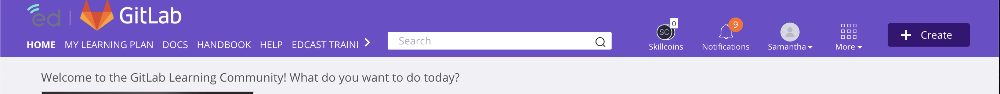

## On this page
{:.no_toc .hidden-md .hidden-lg}

- TOC
{:toc .hidden-md .hidden-lg}

## GitLab Learn Users

The following resources can be used by learners in the [GitLab Learn](https://about.gitlab.com/handbook/people-group/learning-and-development/gitlab-learn/) platform to help navigate the login process, explore new content, and more.

**Have additional questions?**

GitLab team members can reach out to the Learning and Development team via the [#learninganddevelopment Slack channel](https://app.slack.com/client/T02592416/CMRAWQ97W) for additional support with GitLab Learn.

#### A note about naming

Review the following terms to get familiar with language used in this documentation.

| Term | Definition |
| ----- | ----- |
| EdCast | The vendor we're collaborating with to create GitLab Learn. |
| GitLab Learn | GitLab's EdCast instance |
| Learning Experience Platform (LXP) | The type of learning platform that GitLab is using to organize learning content. Learn more in the [L&D handbook](https://about.gitlab.com/handbook/people-group/learning-and-development/#gitlab-learn-edcast-learning-experience-platform-lxp) |

### First time login to GitLab Learn

When you log on to GitLab Learn for the first time, you'll be prompted through the account setup process. The platform will use your answers to suggest new learning content based on your interests and expertise.

Below is a [firt time login training video](https://www.youtube.com/embed/uE-1KRFArpA) to walk you through each step.

<iframe width="560" height="315" src="https://www.youtube.com/embed/uE-1KRFArpA" frameborder="0" allow="accelerometer; autoplay; clipboard-write; encrypted-media; gyroscope; picture-in-picture" allowfullscreen></iframe>

GitLab Learn first time login steps:

1. GitLab team members should choose `LogIn with SSO option` via Okta
1. Enter your first and last name
1. Upload a profile photo. This step is optional at this phase of the sign on process and can be uploaded/edited within the platform at a later date
1. Click `Next Step`
1. Add up to 3 learning goals to your profile. Use the search bar to locate learning goals in the platform. These learning goals can be about any topic you are interested in learning about. Some examples could be `product marketing`, `technical writing`, or `leadership`. If you need help determining your learning goals, reach out to the [L&D team in slack](https://app.slack.com/client/T02592416/CMRAWQ97W)
1. When adding learning goals, you may get an error that reads `The goal you are trying to add does not exist`. This indicates that the goal you've entered does not yet exist in the database. Consider using a different learning goal or phrase. 
1. Click `Next Step`
1. Add skills to your profile. These skills should reflect your own expertise
1. Click `Next Step`
1. At this point, you will be dropped into the GitLab Learn platform on the Discover page, and can begin to explore GitLab learning content! 

### Getting familiar with the platform

Watch this [video tour](https://youtu.be/1AtZPxpauiw) of the GitLab Learn platform to get familiar with what you'll see upon logging in.

<iframe width="560" height="315" src="https://www.youtube.com/embed/1AtZPxpauiw" frameborder="0" allow="accelerometer; autoplay; clipboard-write; encrypted-media; gyroscope; picture-in-picture" allowfullscreen></iframe>

#### Navigating the discover page

When you first log into GitLab Learn, you'll arrive on the Discover page. This page will:

- Introduce you to trending topics on the platform and among other GitLab learners
- Provide quick access to your learning paths and assigned content
- Explore content channels to discover content you might be interested in
- Highlight initiatives from the GitLab L&D team and other content creators

### Using the top navigation bar

There are many resources you can access using this top navigation from any page in the platform.

#### My Learning Plan

In your learning plan, you can view:

- courses assigned to you
- courses you've enrolled in or followed

#### GitLab Learn Support Resources

This navgation bar links to the following support resources:

1. [GitLab Docs](https://docs.gitlab.com/)
1. [GitLab Support Ticket](https://support.gitlab.com/hc/en-us)
1. [GitLab Handbook](https://about.gitlab.com/handbook/)
1. User Documentation and Trainings (on this page)

#### Search bar

Use the search bar to find new content and other learner profiles in the LXP. [Additional search strategies](/handbook/people-group/learning-and-development/gitlab-learn/edcast-user-docs/#finding-new-learning-content) are outlined below.

#### Notifications

View notifications to see when new content is assigned to you, when users have commented on something you follow, and more.

#### Your Profile

Access your [GitLab Learn profile page](/handbook/people-group/learning-and-development/gitlab-groundworks/edcast-user-docs/#setting-up-your-profile-page).

### Setting up your profile page

You can edit and customize your profile page from within the platform using the following steps.

1. In the top navigation bar, locate your name and profile image. This will link to your profile page
1. On your profile, you can review your dashboard, content, learning plan, and more
1. In the top right corner of the screen, click `Edit Profile`
1. Confirm you are viewing the `Account Details` tab
1. From this page, you can edit and update the following information:
     - First and last name
     - Bio
     - Login information
     - Handle
     - Preferred language
     - Profile and banner image
     - Job title

### Understanding content in GitLab Learn

<iframe width="560" height="315" src="https://www.youtube.com/embed/pJzj4l3tG-4" frameborder="0" allow="accelerometer; autoplay; clipboard-write; encrypted-media; gyroscope; picture-in-picture" allowfullscreen></iframe>

Learning material is built and organized in the GitLab Learn LXP to help you follow a clear path. This is created using Smartcards, Pathways, and Journeys. More information on this content can be found on the [GitLab Learn contribution page](/handbook/people-group/learning-and-development/gitlab-learn/contribute) and in [this video training](https://youtu.be/pJzj4l3tG-4)

| Content Type | Purpose | Example |
| ----- | ----- | ----- |
| Journey | A collection of learning pathways | The Field Enablement team uses a journey to organize all content in the field certification. |
| Pathway | A single learning pathway | In the DIB certification, one required piece includes the reivew of a YouTube Video, reading 1 handbook page, and answering a short quiz. All 3 steps are contained in one pathway. |
| Smartcard | A single unit of learning content | One video, a 5 minute handbook read, a poll, and more. These are the basic units of learning content in the LXP and are used to build pathways and journeys. |

In addition, learing content and users are organized in the LXP to help you discover new learning material and follow learners interested in similar topics. The following strucutres organize content and users.

| Content Type | Purpose | Example |
| ----- | ----- | ----- |
| Carousel | Carousels are horizontal containers of related channels or content assets.
 | On the Discover page, you might see a carousel of featured DevOps pathways and smartcards |
| Channel | Channels are the principal way in which content (SmartCards, Pathways, and Journeys) are broadcasted to learners. | A series of SmartCards, Pathways, and Journeys on Agile Project Management |
| Group | Organize learners with a common job title, team, or interest | A group is organized for all GitLab team members to access the correct anti-harassment course | 

### Finding new learning content

There are 2 ways to search GitLab Learn for new learning content.

1. **Use the search bar.** This search feature will allow you to search by key word, username, or topic. This search bar is helpful if you're looking for material on a certain topic, or you're interested in seeing what your team members are learning.

1. **Use the `More` option in the top navigation bar.** This waffle icon will allow you to sort through content based on users, groups, and more. If you'd like to learn more about the types of content in the LXP, reivew the [LXP contribution process](/handbook/people-group/learning-and-development/gitlab-learn/contribute)

## Frequently asked questions

### When will content in GitLab Learn be available for the entire GitLab team, customers, and community members?

The LXP implementation team is planning a phased rollout of the platform to multiple GitLab audiences. Progress and additional information can be found on the [LXP implementation issue board](https://gitlab.com/gitlab-com/people-group/learning-development/edcast-lxp-implementation/-/boards)

### Where is the content in the LXP stored?

Content in GitLab Learn is developed using a [handbook first](https://about.gitlab.com/handbook/people-group/learning-and-development/interactive-learning/) approach. All learning content is stored in the handbook. Teams at GitLab use additional tools like Articulate 360 and Rise to build interactive courses.

In addition to GitLab learning material stored in the handbook, GitLab team members will have access to off the shelf learning opportunity from other vendors and organizations, like LinkedIn Learning and WILL Learning.

### How can I contribute?

The contribution process to the LXP is being built, and you can follow updates in the [learning and development handbook](https://about.gitlab.com/handbook/people-group/learning-and-development/gitlab-learn/contribute/).

## Have additional questions about GitLab Learn?

Questions from team members about the LXP can be directed to the Learning and Development team via the [#learninganddevelopment Slack channel](https://app.slack.com/client/T02592416/CMRAWQ97W).

