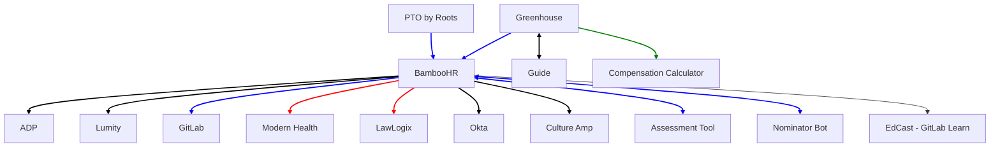

## On this page

{:.no_toc}

- TOC
{:toc}

## Overview
On this page you can find an overview of all the integrations that go into and out of our HR systems. We opted for a mermaid chart so others can easily edit this graph.

