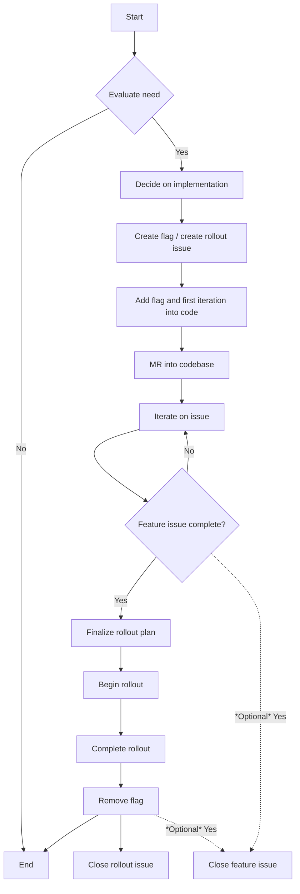

## On this page
{:.no_toc .hidden-md .hidden-lg}

- TOC
{:toc .hidden-md .hidden-lg}

**NOTE**:
The content below covers feature flags used by GitLab to deploy its own features, which **is not** the same
as the [feature flags offered as part of the product](https://docs.gitlab.com/ee/development/feature_flags/).

This page contains the process documentation of the feature flag lifecycle. More detailed technical information can be found in the [developer documentation](https://docs.gitlab.com/ee/development/feature_flags/index.html)

## When to use feature flags

Developers are required to use feature flags for changes that could affect availability of existing GitLab functionality (if it only affects the new feature you're making that is probably acceptable).
Such changes include:

1. New features in high traffic areas (e.g. a new merge request widget, new option in issues/epics, new CI functionality).
1. Complex performance improvements that may require additional testing in production (e.g. rewriting complex queries, changes to frequently used API endpoints).
1. Invasive changes to the user interface (e.g. introducing a new navigation bar, removal of a sidebar, UI element change in issues or MR interface).
1. Introducing dependencies on third-party services (e.g. adding support for importing projects).
1. Changes to features that can cause data corruption or cause data loss (e.g. features processing repository data or user uploaded content).

Situations where you might consider not using a feature flag:

1. Adding a new API endpoint
1. Introducing new features in low traffic areas (e.g. adding a new export functionality in the admin area/group settings/project settings)
1. Non-invasive frontend changes (e.g. changing the color of a button, or moving a UI element in a low traffic area)

In all cases, those working on the changes should ask themselves:

> Why do I need to add a feature flag? If I don't add one, what options do I have to control the impact on application reliability, and user experience?

For perspective on why we limit our use of feature flags please see
[Feature flags only when needed](https://www.youtube.com/watch?v=DQaGqyolOd8).

In case you are uncertain if a feature flag is necessary, simply ask about this in an early merge request, and those reviewing the changes will likely provide you with an answer.

When using a feature flag for UI elements, make sure to _also_ use a feature
flag for the underlying backend code, if there is any. This ensures there is
absolutely no way to use the feature until it is enabled.

## How to use Feature Flags

Feature flags can be used to gradually deploy changes, regardless of whether
they are new features or performance improvements. By using feature flags,
you can determine the impact of GitLab-directed changes, while still being able
to disable those changes without having to revert an entire release.

For an overview about starting with feature flags in GitLab development,
use this [training template](https://gitlab.com/gitlab-com/www-gitlab-com/-/blob/master/.gitlab/issue_templates/feature-flag-training.md).

Before using feature flags for GitLab development, review this page and the following development guides:

1. [Developing with feature flags](https://docs.gitlab.com/ee/development/feature_flags): Learn about the types of
  feature flags, their definition and validation, how to create them, frontend and
  backend details, and other information.
1. [Documenting features deployed behind feature flags](https://docs.gitlab.com/ee/development/documentation/feature_flags.html):
  How to document features deployed behind feature flags, and how to update the
  documentation for features' flags when their states change.
1. [Controlling feature flags](https://docs.gitlab.com/ee/development/feature_flags/controls.html): Learn the process for deploying
  a new feature, enabling it on GitLab.com, communicating the change,
  logging, and cleaning up.

User guides:

1. [How GitLab administrators can enable and disable features behind flags](https://docs.gitlab.com/ee/administration/feature_flags.html):
  An explanation for GitLab administrators about how they can
  enable or disable GitLab features behind feature flags.
1. [What "features deployed behind flags" means to the GitLab user](https://docs.gitlab.com/ee/user/feature_flags.html):
  An explanation for GitLab users regarding how certain features
  might not be available to them until they are enabled.

## Feature Flag Lifecycle

### Planning

1. Evaluate if you need a feature flag:
   1. [Process for evaluation](#when-to-use-feature-flags).
   1. The engineer thinks about the solution to the issue they are working on. They make a decision on whether or not they will implement the solution with a feature flag.
1. Decide how you will implement the feature flag and its rollout:
   1. Decide on [Type](https://docs.gitlab.com/ee/development/feature_flags#types-of-feature-flags).
   1. Decide on [the definition](https://docs.gitlab.com/ee/development/feature_flags#feature-flag-definition-and-validation) and plan out the YAML.
   1. Decide on what type of [actor](https://docs.gitlab.com/ee/development/feature_flags#feature-actors) to bind your feature flag to (if any).
   1. Think about where your feature flag should toggle in the code.
1. Create a feature flag definition in code and make a follow-up rollout issue:
   1. [Create a feature flag](https://docs.gitlab.com/ee/development/feature_flags#create-a-new-feature-flag).
   1. [Create a feature flag rollout issue using the template](https://docs.gitlab.com/ee/development/feature_flags#development-type) (if necessary).
   1. Ping the EM/PM on the feature flag rollout issue to get it scheduled/planned/refined.
   1. EM and Engineer work together to finalize the rollout plan for the feature flag. Not all steps in the feature flag rollout template are mandatory for every feature flag.

### Development

1. Add the feature flag into the code for the backend, frontend, and in tests:
   1. [Develop with the feature flag](https://docs.gitlab.com/ee/development/feature_flags#develop-with-a-feature-flag) in your vertical slice.
   1. [Include your feature flag in tests](https://docs.gitlab.com/ee/development/feature_flags#feature-flags-in-tests) that test with it on and off.
   1. [Use your feature flag locally](https://docs.gitlab.com/ee/development/feature_flags#enabling-a-feature-flag-locally-in-development) to ensure it works.
1. Make an MR that adds the feature flag to the codebase.
   1. Follow the [outline on the process page](#feature-flags-in-gitlab-development) when creating an MR that introduces a feature flag.
1. Continue to iterate towards issue completion, using the feature flag to test logical slices:
   1. You may use your feature flag in more than one MR. Continue to iterate until the issue is complete.
1. When slices are deemed complete enough (keeping in mind [low level of shame](https://about.gitlab.com/handbook/values/#low-level-of-shame), proceed to the next step.
   1. Ensure you follow the [documentation guidelines for feature flags](https://docs.gitlab.com/ee/development/documentation/feature_flags.html) and keep them up-to-date according to the feature flag state.
   1. Some teams may choose to close the feature issue here once it is complete, other teams may want to wait until the feature flag rollout issue is closed. If you close your feature issues after the code is present in the default branch, you should close the issue here.

### Rollout

1. Finalize the rollout plan:
   1. Following the [rollout guidelines](https://docs.gitlab.com/ee/development/feature_flags/controls.html#rolling-out-changes) determine a plan for rolling out your feature flag.
1. Begin rollout plan:
   1. Rollout plans vary flag to flag, take the steps you’ve outlined in your [feature flag rollout issue](https://gitlab.com/gitlab-org/gitlab/-/blob/master/.gitlab/issue_templates/Feature%20Flag%20Roll%20Out.md).
1. Removing the flag and cleaning up:
   1. Follow the [feature flag clean up process](https://docs.gitlab.com/ee/development/feature_flags/controls.html#cleaning-up).
   1. Ensure the flag is removed from the code and from the database with the [chatops feature flag removal command](https://docs.gitlab.com/ee/development/feature_flags/controls.html#cleanup-chatops).
   1. If your team closes the feature issue after the feature flag has been removed, it should be closed here.

### Flowchart

## Feature flags process

### Feature flags for user applications

This document only covers feature flags used in the development of GitLab
itself. Feature flags in deployed user applications can be found at
[Feature Flags feature documentation](https://docs.gitlab.com/ee/operations/feature_flags.html).

### Feature flags in GitLab development

Engineers should refer to the steps outlined in the [feature flag development docs](https://docs.gitlab.com/ee/development/feature_flags#feature-flags-in-gitlab-development) when using feature flags.

#### Including a feature behind feature flag in the final release

In order to build a final release and present the feature for self-managed
users, the feature flag should be at least defaulted to **on**. If the feature
is deemed stable and there is confidence that removing the feature flag is safe,
consider removing the feature flag altogether. It's _strongly_ recommended that
the feature flag is [enabled **globally** on **production**](https://docs.gitlab.com/ee/development/feature_flags/controls.html#enabling-a-feature-for-gitlabcom) for **at least one day**
before making this decision. Unexpected bugs are sometimes discovered during this period.

The process for enabling features that are disabled by default can take 5-6 days
from when the merge request is first reviewed to when the change is deployed to
GitLab.com. However, it is recommended to allow 10-14 days for this activity to
account for unforeseen problems.

Feature flags must be [documented according to their state (enabled/disabled)](https://docs.gitlab.com/ee/development/documentation/feature_flags.html),
and when the state changes, docs **must** be updated accordingly.

NOTE:
Take into consideration that such action can make the feature available on
GitLab.com shortly after the change to the feature flag is merged.

Changing the default state or removing the feature flag has to be done before
the 22nd of the month, _at least_ 3-4 working days before, in order for the change
to be included in the final self-managed release.

In addition to this, the feature behind feature flag should:

- Run in all GitLab.com environments for a sufficient period of time. This time
  period depends on the feature behind the feature flag, but as a general rule of
  thumb 2-4 working days should be sufficient to gather enough feedback.
- The feature should be exposed to all users within the GitLab.com plan during
  the above mentioned period of time. Exposing the feature to a smaller percentage
  or only a group of users might not expose a sufficient amount of information to aid in
  making a decision on feature stability.

While rare, release managers may decide to reject picking or revert a change in
a stable branch, even when feature flags are used. This might be necessary if
the changes are deemed problematic, too invasive, or there simply isn't enough
time to properly measure how the changes behave on GitLab.com.

#### The cost of feature flags

When reading the above, one might be tempted to think this procedure is going to
add a lot of work. Fortunately, this is not the case, and we'll show why. For
this example we'll specify the cost of the work to do as a number, ranging from
0 to infinity. The greater the number, the more expensive the work is. The cost
does _not_ translate to time, it's just a way of measuring complexity of one
change relative to another.

Let's say we are building a new feature, and we have determined that the cost of
this is 10. We have also determined that the cost of adding a feature flag check
in a variety of places is 1. If we do not use feature flags, and our feature
works as intended, our total cost is 10. This however is the best case scenario.
Optimizing for the best case scenario is guaranteed to lead to trouble, whereas
optimizing for the worst case scenario is almost always better.

To illustrate this, let's say our feature causes an outage, and there's no
immediate way to resolve it. This means we'd have to take the following steps to
resolve the outage:

1. Revert the release.
1. Perform any cleanups that might be necessary, depending on the changes that
   were made.
1. Revert the commit, ensuring the "master" branch remains stable. This is
   especially necessary if solving the problem can take days or even weeks.
1. Pick the revert commit into the appropriate stable branches, ensuring we
   don't block any future releases until the problem is resolved.

As history has shown, these steps are time consuming, complex, often involve
many developers, and worst of all: our users will have a bad experience using
GitLab.com until the problem is resolved.

Now let's say that all of this has an associated cost of 10. This means that in
the worst case scenario, which we should optimize for, our total cost is now 20.

If we had used a feature flag, things would have been very different. We don't
need to revert a release, and because feature flags are disabled by default we
don't need to revert and pick any Git commits. In fact, all we have to do is
disable the feature, and in the worst case, perform cleanup. Let's say that
the cost of this is 2. In this case, our best case cost is 11: 10 to build the
feature, and 1 to add the feature flag. The worst case cost is now 13:

- 10 to build the feature.
- 1 to add the feature flag.
- 2 to disable and clean up.

Here we can see that in the best case scenario the work necessary is only a tiny
bit more compared to not using a feature flag. Meanwhile, the process of
reverting our changes has been made significantly and reliably cheaper.

In other words, feature flags do not slow down the development process. Instead,
they speed up the process as managing incidents now becomes _much_ easier. Once
continuous deployments are easier to perform, the time to iterate on a feature
is reduced even further, as you no longer need to wait weeks before your changes
are available on GitLab.com.

#### The benefits of feature flags

It may seem like feature flags are configuration, which goes against our [convention-over-configuration](https://about.gitlab.com/handbook/product/product-principles/#convention-over-configuration)
principle. However, configuration is by definition something that is user-manageable.
Feature flags are not intended to be user-editable. Instead, they are intended as a tool for Engineers
and Site Reliability Engineers to use to de-risk their changes. Feature flags are the shim that gets us
to Continuous Delivery with our monorepo and without having to deploy the entire codebase on every change.
Feature flags are created to ensure that we can safely rollout our work on our terms.
If we use Feature Flags as a configuration, we are doing it wrong and are indeed in violation of our
principles. If something needs to be configured, we should intentionally make it configuration from the
first moment.

Some of the benefits of using development-type feature flags are:

1. It enables Continuous Delivery for GitLab.com.
1. It significantly reduces Mean-Time-To-Recovery.
1. It helps engineers to monitor and reduce the impact of their changes gradually, at any scale,
   allowing us to be more metrics-driven and execute good DevOps practices, [shifting some responsibility "left"](https://devops.com/why-its-time-for-site-reliability-engineering-to-shift-left/).
1. Controlled feature rollout timing: without feature flags, we would need to wait until a specific
   deployment was complete (which at GitLab could be at any time).
1. Increased psychological safety: when a feature flag is used, an engineer has the confidence that if anything goes wrong they can quickly disable the code and minimize the impact of a change that might be risky.
1. Improved throughput: when a change is less risky because a flag exists, theoretical tests about
   scalability can potentially become unnecessary or less important. This allows an engineer to
   potentially test a feature on a small project, monitor the impact, and proceed. The alternative might
   be to build complex benchmarks locally, or on staging, or on another GitLab deployment, which has a
   large impact on the time it can take to build and release a feature.

## Dashboard & Metrics

For more information on the lifecycle of a feature flag, such as how many are introduced per release, how long they exist in the application, or how long they've been enabled, [see this dashboard](https://app.periscopedata.com/app/gitlab/792066/Engineering-::-Feature-Flags) (internal only). We also carry 7 days worth of data [in Kibana](https://log.gprd.gitlab.net/goto/d060337c017723084c6d97e09e591fc6) (internal only) for feature flags that become disabled or enabled.
