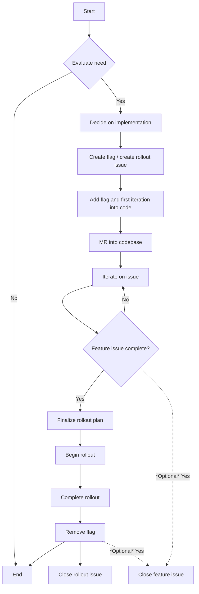

This page contains an overview of the feature flag lifecycle. More detailed information can be found in the [developer documentation](https://docs.gitlab.com/ee/development/feature_flags/process.html)

## On this page
{:.no_toc .hidden-md .hidden-lg}

- TOC
{:toc .hidden-md .hidden-lg}

# Feature Flag Lifecycle

### Planning

1. Evaluate if you need a feature flag:
   1. [Process for evaluation](https://docs.gitlab.com/ee/development/feature_flags/process.html#when-to-use-feature-flags).
   1. The engineer thinks about the solution to the issue they are working on. They make a decision on whether or not they will implement the solution with a feature flag.
1. Decide how you will implement the feature flag and its rollout:
   1. Decide on [Type](https://docs.gitlab.com/ee/development/feature_flags/development.html#types-of-feature-flags).
   1. Decide on [the definition](https://docs.gitlab.com/ee/development/feature_flags/development.html#feature-flag-definition-and-validation) and plan out the YAML.
   1. Decide on what type of [actor](https://docs.gitlab.com/ee/development/feature_flags/development.html#feature-actors) to bind your feature flag to (if any).
   1. Think about where your feature flag should toggle in the code.
1. Create a feature flag definition in code and make a follow-up rollout issue:
   1. [Create a feature flag](https://docs.gitlab.com/ee/development/feature_flags/development.html#create-a-new-feature-flag).
   1. [Create a feature flag rollout issue using the template](https://docs.gitlab.com/ee/development/feature_flags/development.html#development-type) (if necessary).
   1. Ping the EM/PM on the feature flag rollout issue to get it scheduled/planned/refined.
   1. EM and Engineer work together to finalize the rollout plan for the feature flag. Not all steps in the feature flag rollout template are mandatory for every feature flag.

### Development

1. Add the feature flag into the code for the backend, frontend, and in tests:
   1. [Develop with the feature flag](https://docs.gitlab.com/ee/development/feature_flags/development.html#develop-with-a-feature-flag) in your vertical slice.
   1. [Include your feature flag in tests](https://docs.gitlab.com/ee/development/feature_flags/development.html#feature-flags-in-tests) that test with it on and off.
   1. [Use your feature flag locally](https://docs.gitlab.com/ee/development/feature_flags/development.html#enabling-a-feature-flag-locally-in-development) to ensure it works.
1. Make an MR that adds the feature flag to the codebase.
   1. Follow the [outline on the process page](https://docs.gitlab.com/ee/development/feature_flags/process.html#feature-flags-in-gitlab-development) when creating an MR that introduces a feature flag.
1. Continue to iterate towards issue completion, using the feature flag to test logical slices:
   1. You may use your feature flag in more than one MR. Continue to iterate until the issue is complete.
1. When slices are deemed complete enough (keeping in mind [low level of shame](https://about.gitlab.com/handbook/values/#low-level-of-shame), proceed to the next step.
   1. Ensure you follow the [documentation guidelines for feature flags](https://docs.gitlab.com/ee/development/documentation/feature_flags.html) and keep them up-to-date according to the feature flag state.
   1. Some teams may choose to close the feature issue here once it is complete, other teams may want to wait until the feature flag rollout issue is closed. If you close your feature issues after the code is present in the default branch, you should close the issue here.

### Rollout

1. Finalize the rollout plan:
   1. Following the [rollout guidelines](https://docs.gitlab.com/ee/development/feature_flags/controls.html#rolling-out-changes) determine a plan for rolling out your feature flag.
1. Begin rollout plan:
   1. Rollout plans vary flag to flag, take the steps you’ve outlined in your [feature flag rollout issue](https://gitlab.com/gitlab-org/gitlab/-/blob/master/.gitlab/issue_templates/Feature%20Flag%20Roll%20Out.md).
11. Removing the flag and cleaning up:
   1. Follow the [feature flag clean up process](https://docs.gitlab.com/ee/development/feature_flags/controls.html#cleaning-up).
   1. Ensure the flag is removed from the code and from the database with the [chatops feature flag removal command](https://docs.gitlab.com/ee/development/feature_flags/controls.html#cleanup-chatops).
   1. If your team closes the feature issue after the feature flag has been removed, it should be closed here.

### Flowchart

