{::options parse_block_html="true" /}

**Product Development Flow Draft**
{: .panel-heading}

This is the draft version of the Product Development Flow. All changes to this document will be merged into `product-development-flow/index.html.md`[Handbook link](https://about.gitlab.com/handbook/product-development-flow/) by the 17th of each month* and announced (including a list of changes) via a release post if larger changes are included. Please see the [Product Development Timeline](https://about.gitlab.com/handbook/engineering/workflow/#product-development-timeline)

|              |             |              |              |
|--------------|-------------|--------------|--------------| 
| Version      | Change   | Milestone |Release Date
| 1.0 | Introduce new structure and core content | 13.5 | 2020-10-22 |
| 1.1 | Introduce visuals and optimize supporting resources | 13.6 | 2020-11-22 |
| 1.2 | Incropriate feedback from 13.6 Gitlab dogfooding | 13.7 | 2020-12-22 |

*Version 1.0 will stay on draft page for dogfooding. Version 1.1 will be the first push to `product-development-flow/index.html.md`

## On this page
{:.no_toc .hidden-md .hidden-lg}

- TOC
{:toc .hidden-md .hidden-lg}

## Overview & philosophy

GitLab's product mission is to consistently create products and experiences that users love and
value. To deliver on this mission, it's important to have a clearly defined and repeatable flow for
turning an idea into something that offers customer value. Note that it's also important to allow
open source contributions at any point in the process from the wider GitLab community - these will
not necessarily follow this process.

This page is an evolving description of how we expect our cross-functional development teams to work and reflects the current process being used. All required steps in this development flow are denoted as follows:

> <i class="fab fa-gitlab fa-fw" style="color:rgb(252,109,38); font-size:1.25em" aria-hidden="true"></i>  Denotes a required aspect of the product development workflow. 

Feature development is expected to pass through all required phases, while the rest of the development flow should be considered a set of best practices and tools to aid with completing these phases. 

The goal is to have this page be the single source of truth, but it will take time to eliminate duplication elsewhere in the handbook; in the meantime, where there are conflicts this page takes precedence. 

Because this page needs to be concise and consistent, please ensure to follow the prescribed [change process](#editing-this-page).

## But Wait, Isn't This Waterfall? 

No. Although the phases below appear to be independent and linear, they're not. They are presented as such on the page for simplicity and ease of navigation. It is common to iterate through the Validation phases multiple times before moving to Build. Once in the Build phases, it may be necessary to go back to Validation phases as roadblocks or technical challenges arise. 

## Workflow Summary

```mermaid
  graph LR;
  subgraph Validation
    validationbacklog(Validation Backlog) --> problemvalidation(Problem Validation)
    problemvalidation --> design(Design)
    design --> solutionvalidation(Solution Validation)
  end

  subgraph Build
    plan(Plan) --> developtest(Develop and Test)
    developtest --> launch(Launch)
    launch --> improve(Improve)
  end

  solutionvalidation --> plan

  solutionvalidation .- review(Review)
  review .-> plan
    
  click Validation "#validation-track"
  click validationbacklog "#validation-phase-1-validation-backlog"
  click problemvalidation "#validation-phase-2-problem-validation"
  click design "#validation-phase-3-design"
  click solutionvalidation "#validation-phase-4-solution-validation"
  
  click review "#review-track-optional"

  click Build "/handbook/source/handbook/product-development-flow/product-development-flow-draft.html#build-track"
  click plan "#build-phase-1-plan"
  click developtest "#build-phase-2-develop-test"
  click launch "#build-phase-3-launch"
  click improve "#build-phase-4-improve"

  classDef optional stroke-dasharray: 5 5;
  class review optional
```

> <i class="fab fa-gitlab fa-fw" style="color:rgb(252,109,38); font-size:1.25em" aria-hidden="true"></i> Workflow labels must be applied for each phase that is used to enable tracking and collaboration across teams. 

| Stage (Label)                     | Track                                      | Responsible                          | Completion Criteria                                                                                                                                    | Who Transitions Out   |
|-----------------------------------|--------------------------------------------|--------------------------------------|--------------------------------------------------------------------------------------------------------------------------------------------------------|-----------------------|
| `workflow::validation backlog`    | N/A                                        | Product                              | Item has enough information to enter problem validation.                                                                                               | Product               |
| `workflow::problem validation`    | [Validation](#validation-track)            | Product, UX Research                 | Item is validated and defined enough to propose a solution                                                                                             | Product               |
| `workflow::design`                | [Validation](#validation-track)            | Product Design                       | Design work is complete enough for issue to be validated or implemented. Product and Engineering confirm the proposed solution is viable and feasible. | Product Design        |
| `workflow::solution validation`   | [Validation](#validation-track)            | Product, Product Design              | Product Manager works with Product Designer to validate the solution with users.                                                                       | Product               |
| `workflow::planning breakdown`    | [Build](#build-track)                      | Product, Product Design, Engineering | Issue has backend and/or frontend labels and estimated weight attached                                                                                 | Engineering           |
| `workflow::scheduling`            | [Build](#build-track)                      | Engineering                          | Issue has a numerical milestone label                                                                                                                  | Product/Engineering   |
| `workflow::ready for development` | [Build](#build-track)                      | Engineering, SET                     | An engineer has started to work on the issue. Dedicated SETs have completed quad-planning.                                                             | Engineering           |
| `workflow::In dev`                | [Build](#build-track)                      | Engineering                          | Initial engineering work is complete and review process has started                                                                                    | Engineering           |
| `workflow::In review`             | [Build](#build-track)                      | Engineering                          | MR(s) are merged                                                                                                                                       | Engineering           |
| `workflow::verification`          | [Build](#build-track)                      | Engineering                          | Work is demonstrable on production                                                                                                                     | Engineering           |
| `workflow::blocked`               | N/A                                        | Product/Engineering                  | Work is no longer blocked                                                                                                                              | Engineering           |

### Issue descriptions as the SSOT

> <i class="fab fa-gitlab fa-fw" style="color:rgb(252,109,38); font-size:1.25em" aria-hidden="true"></i> Issue descriptions shall always be maintained as the single source of truth. 
 

It's not [efficient](/handbook/values/#efficiency) for contributors to need to read through every comment in an issue to understand the current state.

* When transitioning an issue out to a new workflow stage, the department named in the "Who Transitions Out" column is responsible for updating the issue description.

## Validation track

For new ideas where the customer problem and solution is not well understood, Product Managers (PMs) and the User Experience Department (UXers) should work together to validate new opportunities before moving to the Build track. The **Validation** track is an independent track from the always moving **Build** track. PMs and UXers should work together to get 1-2 months ahead, so that the Build track always has well-validated product opportunities ready to start. Milestone work should be prioritized with the understanding that some milestones may include more validation efforts than others. Validation cycles may not be necessary for things like bug fixes, well understood iterative improvements, minor design fixes, technical debt, etc.

### Validation Goals & Outcomes

**When:** When our confidence about the proposed problem or solution isn't high. For example, if we aren't reasonably sure that the problem is important to a significant number of users, and/or that the solution is easy to understand and use.

**Who:** Product Manager, Product Designer, UX Research, Engineering Manager

**What:**

✅ **Understand** the user problem we are trying to solve

✅ **Identify** business goals & key metrics to determine success

✅ **Generate** hypotheses and research/experiment/user-test

✅ **Define** MVC and potential future iterations

✅ **Minimize** risks to value, usability, feasibility, and business viability with qualitative and quantitative analysis

**Outcome:** We have confidence that a proposed solution will positively impact one or more [Product KPIs](/handbook/business-ops/data-team/kpi-index/#product-kpis). There may be reason for exceptions, so the team would need to be clear in that case and be able to justify that it is still important without mapping back to our KPIs.

If we don't have confidence in the MVC or what success looks like, we should continue validation cycles before we move to the build track.

### Opportunity Canvas

One of the primary artifacts of the validation track is the Opportunity Canvas. The Opportunity Canvas introduces a lean product management philosophy to the validation track by quickly iterating on level of confidence, hypotheses, and lessons learned as the document evolves.  At completion, it serves as a concise set of knowledge which can be transferred to the relevant issues and epics to aid in understanding user pain, business value, and the constraints to a particular problem statement. Just as valuable as a completed Opportunity Canvas is an incomplete one. The tool is also useful for quickly invalidating ideas. A quickly invalidated problem is often **more valuable** than a slowly validated one.

Please note that an opportunity canvas is not required for product functionality or problems that already have well-defined [jobs to be done (JTBD)](/handbook/engineering/ux/ux-resources/#jobs-to-be-done-jtbd). For situations where we already have a strong understanding of the problem and its solution, it is appropriate to skip the opportunity canvas and proceed directly to solution validation. It might be worth using the opportunity canvas template for existing features in the product to test assumptions and current thinking, although not required. 

**References**:
* [Opportunity Canvas Template](https://docs.google.com/document/d/1pTEMcwH10xWilQEnVc65oC6PdC3VMjn2XoARfNTaHkc/edit#)
* [Completed Opportunity Canvas Reviews](https://drive.google.com/drive/u/0/folders/19ryr0HFXpkchh65MQ2JQv3f9dYBCC01q)
* [Opportunity Canvas YouTube Playlist](https://www.youtube.com/playlist?list=PL05JrBw4t0KqqGtUIbnmAaE5kNymwifZ1)
* [Example Opportunity Canvas - Fine Grained Access Control (GoogleDoc)](https://docs.google.com/document/d/1c_FPLZ8W7Gjl0tvZSybEKWvcCzJ3AgxlQNFvwm92IHo/edit#heading=h.4mt5fmtn0ax4)
* [Example Opportunity Canvas - Error Tracking (Mural)](https://app.mural.co/t/gitlab2474/m/gitlab2474/1568925801645/71e7e6352180a1492a19a3d3ed6f96d48fefd597)

#### Opportunity Canvas Lite 

Opportunity Canvases are a great assessment for ill-defined or poorly understood problems our customers are experiencing that may result in net new features. As noted previously, opportunity canvases may be helpful for existing features, which is where the [`Product-Opportunity-Opportunity-Canvas-Lite`](https://gitlab.com/gitlab-com/Product/-/blob/master/.gitlab/issue_templates/Product-Opportunity-Canvas-Lite.md) issue template delivers. This template offers a lightweight approach to quickly identify the customer problem, business case, and feature plan in a convenient issue. The steps to use the template are outlined in the [Instructions](https://gitlab.com/gitlab-com/Product/-/blob/master/.gitlab/issue_templates/Product-Opportunity-Canvas-Lite.md#instructions) section and for clarity one would create this issue template for an existing feature they are interested in expanding. For example, this template would be great to use if you are evaluating the opportunity to add a third or fourth iteration to an MVC. This issue should leverage already available resources and be used to collate details to then surface to leadership for review. Once you fill out the template, you will assign to the parties identifed in the issue and you can always post in the `#product` channel for visibility. 

### Validation phase 1: Validation backlog

<i class="fab fa-gitlab fa-fw" style="color:rgb(252,109,38); font-size:1.25em" aria-hidden="true"></i> Label: `workflow::validation backlog`

#### Key Participants

| Role           | Function                                       |
|----------------|------------------------------------------------|
| DRI:           | - Product Manager                              |
| Collaborators: | - Product Designer   - Engineering Manager  |
| Informed:      | - Customers   - Technical Account Manager   Product Marketing Manager   Other [stakeholders](/handbook/product/product-processes/#whats-a-stakeholder) as appropriate |

#### Description

The health of a world class product begins with a well maintained backlog. Product Managers are responsible for refining a groups backlog to ensure validation opportunities are scoped and prioritized in line with category direction and stage or section level strategy. The backlog is also the SSoT for [stakeholders](/handbook/product/product-processes/#whats-a-stakeholder) to understand and engage with your group. An issue or Epic's position in the backlog, along with the description, discussion and metadata on those issues are key pieces of data necessary to keep stakeholders up to date. 

#### Outcomes and Activities

| Outcomes|Activities|DRI|
|---|---|---|
| <i class="fab fa-gitlab fa-fw" style="color:rgb(252,109,38); font-size:1.25em" aria-hidden="true"></i> **Up to date issues and epics** - At GitLab, issues are the single source of truth for any change to the product. Issues are created in response to a [sensing mechanism](/handbook/product/product-processes/#sensing-mechanisms). Consider using the _Problem Validation_ issue template for new features. If an issue already exists, keep its description and metadata up to date based on inputs both in the issue (comment threads) and external to the issue (including synchronous discussions and research output). | - review issue discussions and update relevant info in the description   - keep related metadata (labels, etc) up to date   - actively respond to stakeholder comments   - transfer discussion notes, and external information to the issue (as links or discussion/description details) | Product Manager |
| <i class="fab fa-gitlab fa-fw" style="color:rgb(252,109,38); font-size:1.25em" aria-hidden="true"></i> **Prioritized backlog** - The issue and epic backlog is the primary signal stakeholders use to know what's "up next" for a group. The backlog is also the queue for a group to work from, as features progress through the Product Development Flow phases. This queue is kept up to date with milestones and rank ordering on issue boards. Consider using the [RICE formula](https://www.productplan.com/glossary/rice-scoring-model/) to help make prioritization tradeoffs.   | - regular review of issue prioritization (issue board ordering, milestone assignment)   - align prioritized backlog to category direction and category maturity state | Product Manager |

### Validation phase 2: Problem validation

<i class="fab fa-gitlab fa-fw" style="color:rgb(252,109,38); font-size:1.25em" aria-hidden="true"></i> Label: `workflow::problem validation`

#### Key Participants

| Role |Function|
|---|---|
| DRI | Product Manager |
| Collaborators | UX Researcher |
| Informed | Product Designer  Engineering Team  Other [stakeholders](/handbook/product/product-processes/#whats-a-stakeholder) as appropriate |

#### Description

In order to ensure the right solutions are delivered, the team must start their work with a validated problem. This can take many forms and be achieved through Product Manager and UX Researcher collaboration. 

If the problem is small and well-understood, it may be possible to quickly move through this phase by documenting the known data about the user problem.  

If the problem is nuanced, then it will likely take longer to validate with users properly. This phase's primary outcome is a clear understanding of the problem, along with a simple and clear way to communicate the problem to various stakeholders. 

#### Outcomes and Activities

| Outcomes|Activities|DRI|
|---|---|---|
| Thorough understanding of the problem  | - Create new issue using the [Problem Validation Template](https://gitlab.com/gitlab-org/gitlab/-/blob/master/.gitlab/issue_templates/Problem%20Validation.md) - Complete an [Opportunity Canvas](#opportunity-canvas) - Open a [Problem Validation Research](https://gitlab.com/gitlab-org/ux-research/) issue and work with UX Researcher to execute the research study - Schedule a review of the opportunity canvas for feedback | Product Manager |
| <i class="fab fa-gitlab fa-fw" style="color:rgb(252,109,38); font-size:1.25em" aria-hidden="true"></i>  **Update issue/epic description**    - A well understood and clearly articulated customer problem is added to the issue, and will lead to successful and efficient design and development phases. | - Ensure your issue is up to date with the latest understanding of the problem.   - Understand and document (in the issue) the goals that people want to accomplish using the [Jobs to be Done (JTBD)](/handbook/engineering/ux/jobs-to-be-done/) framework.   - Leverage your opportunity canvas to communicate the problem to your stable counterparts and group stakeholders. Consider scheduling a review to gather feedback and communicate the findings to Product and UX leadership. | Product Manager |

### Validation phase 3: Design

<i class="fab fa-gitlab fa-fw" style="color:rgb(252,109,38); font-size:1.25em" aria-hidden="true"></i> Labels: `workflow::design`

#### Key Participants

| Role |Function|
|---|---|
| DRI | - Product Designer |
| Collaborators |  - Product Manager   - Engineering team   - UX Researcher   - Quality Engineering   - Tech Writer|
| Informed | [stakeholders](/handbook/product/product-processes/#whats-a-stakeholder) as appropriate|

#### Description

After understanding and validating the problem, we can begin/continue to ideate potential solutions through a [diverge/converge](http://web.stanford.edu/~rldavis/educ236/readings/doet/text/ch06_excerpt.html) process. 

The Product Designer leads the team (Product Manager, Engineering, UX Researcher, Quality Engineering, and Technical Writers, as needed, depending on the item) in ideating potential solutions and exploring different approaches (diverge) before converging on a single solution. Product Managers and Engineers evaluate solutions by determining if they meet customer and business goals, and are technically feasible. The team is encouraged to engage with stakeholders to determine potential flaws, missed use cases, and if the solution has the intended customer impact. After the team converges on the proposed solution or identifies a small set of options to validate, the issue moves into the Solution Validation phase.  

To start the Design phase, the Product Designer or Product Manager applies the `workflow::design` label to an existing issue or, if needed, creates a new issue with this label.

#### Outcomes and Activities

| Outcomes|Activities|DRI|
|---|---|---|
|<i class="fab fa-gitlab fa-fw" style="color:rgb(252,109,38); font-size:1.25em" aria-hidden="true"></i> **Proposed solution(s) identified and documented** - Through various activities the Product Designer works with the Product Manager and Engineering team to explore solutions and identifies the approach(es) that strike the best balance of user experience, customer value, business value, and development cost. | - Diverge: explore multiple different approaches as a team. Example activities:    - [Think Big](/handbook/engineering/ux/thinkbig/) session    - Internal interviews (make sure to [document findings in Dovetail](/handbook/engineering/ux/ux-research-training/documenting-research-findings/#documenting-research-findings))    - Creating [user flows](https://careerfoundry.com/en/blog/ux-design/what-are-user-flows/) or [journey maps](https://uxplanet.org/a-beginners-guide-to-user-journey-mapping-bd914f4c517c).   - Converge: identify a small set of options to validate. Example activities:    - Design reviews with team    - Low fidelity design ideas.   - Update issue/epic description with proposed solution. Add Figma design file link or attach design to [GitLab's Design Management](https://docs.gitlab.com/ee/user/project/issues/design_management.html) to communicates the solution idea.   - Validate approach with help from stakeholders. Run user validation using any of the [proposed methods](/handbook/engineering/ux/ux-research/#solution-validation) and [document your findings in Dovetail](/handbook/engineering/ux/ux-research-training/documenting-research-findings/#documenting-research-findings) and appropriate GitLab issue.   - Draw inspiration from competitive and adjacent offerings. | Product Designer | 
|<i class="fab fa-gitlab fa-fw" style="color:rgb(252,109,38); font-size:1.25em" aria-hidden="true"></i> **Shared understanding in the team of the proposed solution** - The Product Designer leads the broader team through a review of the proposed solution(s) to ensure that everyone has a chance to contribute, ask questions, raise concerns, and suggest alternatives.   
- **Updated issues/epic descriptions** - The Product Manager and Product Designer make sure that issues and epics are up-to-date with designs and specifics on the implementation so we can continue our work efficiently and asynchronously. | - Review the proposed solution as a team.   - Review the proposed solution with leadership. | Product Designer | 
|<i class="fab fa-gitlab fa-fw" style="color:rgb(252,109,38); font-size:1.25em" aria-hidden="true"></i> **Confidence in the technical feasibility** - It is important that Engineering understands the technical feasibility of the solution(s) in order to avoid rework or significant changes when we start the build phase.  | - Discuss the technical implications with Engineering to ensure that what is being proposed is possible within the desired timeframe. When sharing design work, utilize both Figma's collaboration tools and GitLab's design management features. Read to understand [what tool to use](/handbook/engineering/ux/ux-designer/#deliver).  - Engage engineering peers early and often through Slack messages, pins on issues or by scheduling sessions to discuss the proposal | Product Designer |  
| Issues updated | - Make sure that issues and epics are up-to-date so we can continue our work efficiently and asynchronously   - [Experiment definition](/handbook/engineering/development/growth/#experiment-definition-standards). | Product Manager | 

### Validation phase 4: Solution Validation

<i class="fab fa-gitlab fa-fw" style="color:rgb(252,109,38); font-size:1.25em" aria-hidden="true"></i> Label: <code>workflow::solution validation</code>

#### Key Participants

| Role          | Function                     |
| ---           | ---                          |
| DRI           | - Product Designer             |
| Collaborators | - Product Manager  - Engineering |
| Informed      |  - Technical Writing  - Quality   - Other [stakeholders](/handbook/product/product-processes/#whats-a-stakeholder) as appropriate |

#### Description

After identifying one more potential solutions that meet business needs and are technically feasible, the Product Manager and Product Designer must ensure that we have confidence that the proposed solution will meet the user's needs and expectations. This confidence can be obtained from work performed during the design phase and supplemented with additional research (including user interviews, usability testing, or solution validation). If necessary, this phase will launch a Solution Validation issue within the [GitLab UX Research project](https://gitlab.com/gitlab-org/ux-research) which will walk the team through research to validate their proposed solution(s).

To start the Solution Validation phase, the Product Designer or Product Manager applies the `workflow::solution validation` label to an existing issue.

#### Outcomes and Activities

| 🔎Outcomes | Activities | DRI |
| ---| --- | --- |
|<i class="fab fa-gitlab fa-fw" style="color:rgb(252,109,38); font-size:1.25em" aria-hidden="true"></i> **High confidence in the proposed solution** - activities have been performed which demonstrate the jobs to be done outlined within the problem statement can be fulfilled by the proposed solution. | - Interview customers.   - Interview the issue originator.   - Perform usability testing.   - Perform the [Solution Validation Process](/handbook/engineering/ux/ux-research/#solution-validation-1). | Product Designer |
|<i class="fab fa-gitlab fa-fw" style="color:rgb(252,109,38); font-size:1.25em" aria-hidden="true"></i> **Solution validation documentation** - The documentation regarding the validation of the proposed solution has been collected in the appropriate places, and included at an appropriate level within the issue / epic description to maintain a single source of truth. | - Document solution validation findings as [insights in Dovetail](/handbook/engineering/ux/ux-research-training/documenting-research-findings/).   - Update the opportunity canvas with the insights.   - Update issue or epic description to contain the findings.| Product Designer |

## Review track (optional*)

The (iteration) Review track is an **optional step** in the flow that brings peer PMs in to help
you hone your skills at _iteration_, _clarity_, and _strategy_. Keeping issues small and iterative
is core to how GitLab maintains [velocity](/handbook/engineering/#the-importance-of-velocity),
writing a "small" issue is often (counterintuitively) more difficult than writing a bigger one, and
understanding the _entire strategy_ of how GitLab operates is a herculean task. Having a helping
hand with these tasks is important to professional development, and it ensures that our entire
Product organization continues to improve.

You should consider requesting a review when:

1. You're having specific challenges defining the problem, identifying the affected personas, or breaking down the solution to small chunks of work.
1. There are potential design or technical dependencies across Sections, Stages, or Groups.
1. This issue takes the product in a novel direction or adds functionality unlike anything else in the product

_*Note: **If you are a new GitLab team member**, you should request reviews of the first 3 issues you create. It will help familiarize you with what we're looking for in an iteration, get more comfortable with our process, and meet your fellow team members. Once you've gone through a few reviews, this track can be considered optional._

If you would like a peer to reivew one of your issues (or epics):

1. Add the `issue::needs review` label to your issue
1. Post a link to the issue in the [**#issue-reviews**](https://gitlab.slack.com/archives/CSX3RHE4C) channel in Slack
   1. _Note: if there is a time crunch and you need a review quickly, be sure to mention when it needs to be done by._
1. The issue gets picked up by a Reviewer PM, who adds a ✅ reaction on the Slack message.
1. Reviewer PM reads through the issue and leaves feedback on these criteria:
   1. **Iteration:** Has the solution been broken down as much as possible? Is it small enough to be completed in one milestone rather than spanning multiple milestones? Have implementation risks been considered and minimized?
   1. **Clarity:** Is the problem well versed and the personas identified? Could someone outside the group or category understand the issue? Is the  value being delivered to the users articulated?
   1. **Strategy:** How will it work in GitLab as whole? Does it tie back to category strategy or stage direction?
1. Things for the reviewer to **not** do:
   1. Don't just _enforce the template_. Instead, give contextual feedback with the appropriate template as a reference point.
   1. Don't treat this as another task to check off, but instead, take this opportunity to engage in conversation and improve our organizations ability to iterate.
   1. Don't assume that the other PM will do exactly what you say. You're providing recommendations, not edicts.
1. When complete, the Reviewer PM adds the `issue::reviewed` label and lets the original PM know that the review is complete.

You can view all the work in happening in this track [on this board](https://gitlab.com/groups/gitlab-org/-/boards/1569699).

## Build track

The build track is where we plan, develop, and deliver value to our users by building [MVCs](/handbook/product/product-principles/#the-minimal-viable-change-mvc), fixing defects, patching security vulnerabilities, enhancing user experience, and improving performance. DRIs across engineering disciplines involving [Design, Backend, Frontend and Quality](/handbook/product/product-processes/#pm-em-ux-and-set-quad-dris) work closely together to implement MVCs while in close collaboration with the Product Manager. Decisions are made quickly if challenges arise. We make sure to instrument [usage](https://about.gitlab.com/handbook/product/performance-indicators/#instrument-tracking) and track [product performance](handbook/product/product-processes/#product-metrics), so once MVCs are delivered to the hands of customers, feedback is captured quickly for learnings to refine the next iteration.

### Build Goals & Outcomes

**When:** As we build MVCs according to our [product development timeline](/handbook/engineering/workflow/#product-development-timeline)

**Who:** Product Manager, Product Designer, Engineers, Software Engineers in Test

**What:**

✅ **Release** to a subset or full set of customers as appropriate

✅ **Assess** UX, functional, technical performance, and customer impact

✅ **Collect** data to measure MVC against success metrics to inform the next iteration

✅ **Iterate** until success metrics are achieved and the product experience is optimal

**Outcome:** Deliver performant MVCs that improve one or more of our [Product KPIs](/handbook/business-ops/data-team/kpi-index/#product-kpis) and/or [Engineering KPIs](/handbook/business-ops/data-team/kpi-index/#engineering-kpis). If it fails to do so,  honor our Efficiency value (that includes a low level of shame), abandon it, and restart the validation cycle to identify the right solution.

### Build phase 1: Plan

#### Required Labels

| Label 	| Usage 	|
|-	|-	|
|<i class="fab fa-gitlab fa-fw" style="color:rgb(252,109,38); font-size:1.25em" aria-hidden="true"></i> `workflow::planning breakdown` 	| Applied by the Product Manager on or before the [4th of the month](https://about.gitlab.com/handbook/engineering/workflow/#product-development-timeline) signaling an intent to prioritize the issue for the next milestone 	|
|<i class="fab fa-gitlab fa-fw" style="color:rgb(252,109,38); font-size:1.25em" aria-hidden="true"></i> `workflow::scheduling` | Applied to issues that have been broken down (passed `workflow::planning breakdown` but not yet scheduled in a milestone) |
|<i class="fab fa-gitlab fa-fw" style="color:rgb(252,109,38); font-size:1.25em" aria-hidden="true"></i> `workflow::ready for development` 	| Issue has been broken down and prioritized by PM for development. Issue also has a milestone assigned at this point. 	|
|<i class="fab fa-gitlab fa-fw" style="color:rgb(252,109,38); font-size:1.25em" aria-hidden="true"></i> `Deliverable` 	| Applied to issues by engineering managers indicating it's been accepted into the current milestone 	|

#### Key Participants

| Role                                                           | Function                                                                |
|----------------------------------------------------------------|-------------------------------------------------------------------------|
| DRI                                                            | - Product Manager                                                       |
| Collaborators                                                  | - Engineering Manager, Product Designer, SETs, Engineers                |
| Informed                                                       | - PMM, TAM                                                              |

#### Description

This phase prepares features so they are ready to be built by engineering. Bugs, technical debt, and other similar changes that are not features may enter the process in this phase (or may benefit from entering in earlier phases based on the cost of doing the work requiring the full problem to be validated to ensure it makes sense to do the work).  Following Validation Phase 4 the feature should already be broken down and ready for a more detailed review by engineering. During this phase Product Managers will surface issues they intend to prioritize for a milestone by applying the `workflow::planning breakdown` label. At this point, Engineering Managers will assign an engineer to further break down and apply weights to that work. This process is a collaboration between the DRI and Collaborators. Tradeoff decisions can be made and feature issues evolve from validation solutions to clear MVCs that can be delivered in a single milestone. Be sure to document all decisions on issues. 

By reviewing and weighing work in the beginning of the Build Track, Product Managers are able to make better prioritization tradeoffs and engineering teams can ensure they've scoped the right amount of work for the milestone. If an issue enters the `workflow::planning breakdown` state it doesn't necessarily mean it will be prioritized in the next milestone, a Product Manager may make a tradeoff decision depending on capacity, and urgency. 

Once work has passed the `workflow::planning breakdown` step the `workflow::ready for development` label, along with an upcoming milestone is applied to the issue. If an issue has been broken down, but not yet ready to pull into a milestone apply the `workflow::scheduling` label. To ensure quality engineering has ample time to contribute to new features [Quad Planning](/handbook/engineering/quality/quad-planning/) is triggered automatically when an issue is in `workflow::ready for development` and a milestone is applied. 

Finally, Engineering Managers will apply `Deliverable` label to issues with a milestone and marked `workflow::ready for development` signaling acceptance of the issue for that milestone. This process occurs at the [beginning of milestone planning](https://about.gitlab.com/handbook/engineering/workflow/#product-development-timeline). 

#### Outcomes and Activities

| Outcomes 	| Activities 	| DRI 	|
|-	|-	|-	|
|<i class="fab fa-gitlab fa-fw" style="color:rgb(252,109,38); font-size:1.25em" aria-hidden="true"></i> **Well-scoped MVC issues** - Issues are the [SSOT](/handbook/values/#single-source-of-truth) for all feature development. Through this phase Product Managers, Engineering, and Product Design likely refine issues into something that can be delivered within a single milestone. Consider opening follow on issues to track work that is de-prioritized, or promote existing issues to Epics and open implementation issues for the upcoming milestone. Understanding the relative size (weight) of an issue in this phase also informs capacity and prioritization discussions allowing the team to plan the right amount of work for a milestone.  | - Review feature issues with contributors - Consider scheduling a POC or engineering investigation issue - Make scope tradeoffs to reach for a [right-sized MVC](https://about.gitlab.com/handbook/product/product-principles/#the-minimal-viable-change-mvc) 	| - Product Manager 	|
|<i class="fab fa-gitlab fa-fw" style="color:rgb(252,109,38); font-size:1.25em" aria-hidden="true"></i> **QE Review** - Involving Quality Engineering in this phase ensures they are able to understand and effectively plan their own capacity before engineering is truly underway. Use the issue to discuss the impact a feature has to the overall quality of the product. | - [Quad Planning](/handbook/engineering/quality/quad-planning/) - [Test planning](/handbook/engineering/quality/test-engineering/#test-planning) 	| - SET 	|
|<i class="fab fa-gitlab fa-fw" style="color:rgb(252,109,38); font-size:1.25em" aria-hidden="true"></i> **Prioritized Milestone** - Applying `workflow::ready for development`, the next milestone, and `Deliverable` are all required at this step to ensure there is clear prioritization set for the next milestone. PMs are the DRI for setting priority, EMs accept that by applying the `Deliverable` label. | - PM sets `workflow::ready for development` and a milestone signaling intent to prioritize   - EM applies `Deliverable` label signaling acceptance of issue in the next milestone | - Product Manager and Engineering Manager |

### Build phase 2: Develop & Test

#### Required Labels

| Labels 	| Usage 	|
|-	|-	|
|<i class="fab fa-gitlab fa-fw" style="color:rgb(252,109,38); font-size:1.25em" aria-hidden="true"></i> `workflow::In dev` 	| Applied by the engineer once work has begun on the issue. An MR is typically linked to the issue at this point.  	|
|<i class="fab fa-gitlab fa-fw" style="color:rgb(252,109,38); font-size:1.25em" aria-hidden="true"></i> `workflow::In review` 	| Applied by an engineer indicating that all MRs required to close an issue are in review |
|<i class="fab fa-gitlab fa-fw" style="color:rgb(252,109,38); font-size:1.25em" aria-hidden="true"></i> `workflow::blocked` 	| Applied if at any time during development the issue is blocked. E.g.: technical issue, open question to PM or PD, cross-group dependency 	|
|<i class="fab fa-gitlab fa-fw" style="color:rgb(252,109,38); font-size:1.25em" aria-hidden="true"></i> `workflow::verification` 	| Once the MRs in the issue have been merged, this label is applied signaling the issue needs to be verified in staging and/or production |

#### Key Participants

| Role                                                       | Function                                                        |
|------------------------------------------------------------|-----------------------------------------------------------------|
| DRI                                                        | - Assigned engineer                                             |
| Collaborators                                              | - Product Manager   - Quality Engineering   - Technical Writer |
| Informed                                                   | - Product Marketing   - Engineering Manager   - Cross-stage PM   - Sales   - Customer Support |

#### Description

The develop and test phase is where we build the features, address bugs or technical debt and test the solutions before launching them. The PM is directly responsible for prioritizing **what** should be worked on; however, the engineering manager and software engineers are responsible for the implementation of the feature using [the engineering workflow](https://about.gitlab.com/handbook/engineering/workflow/#basics). Engineering owns [the definition of done](https://docs.gitlab.com/ee/development/contributing/merge_request_workflow.html#definition-of-done) and issues are not moved into the next phase until those requirements are met. Please keep in mind that many team members are likely to contribute to a single issue and collaboration is key!

This phase begins after work has been broken down, and prioritized in Phase 1. Work is completed in priority order as set at the beginning of the milestone. The Engineering Manager will assign an issue to an engineer who is responsible for building the feature. An engineer can also self-serve and pick up the next priority order issue from the `workflow::ready for development` queue on their team's board. That engineer will update its `workflow::` label to indicate where it is in the [development process](https://about.gitlab.com/handbook/engineering/workflow/#basics). 

When an issue is in development Quality Engineering will follow the [quad planning](https://about.gitlab.com/handbook/engineering/quality/quad-planning/#process) process ensuring test plans, regression jobs, end to end tests, and any other testing process is followed. Coordination is key between the assigned development engineer, and SET during this phase. 

*Note: Work deemed out of scope or incomplete by engineering is taken back into the [plan phase](#build-phase-1-plan) for refinement and rescheduling for completion.*

#### Outcomes and Activities

| Outcomes 	| Activities 	| DRI 	|
|-	|-	|-	|
|<i class="fab fa-gitlab fa-fw" style="color:rgb(252,109,38); font-size:1.25em" aria-hidden="true"></i> **Feature is built** - The Engineering Manager is the DRI to ensure the engineering process is followed and that the implemented solution meets the [definition of done](https://gitlab.com/gitlab-org/gitlab-foss/-/blob/master/doc/development/contributing/merge_request_workflow.md#definition-of-done). The EM will work with Engineers periodically to ensure appropriate status information is visible to stakeholders. This is critical to maintain asynchronous updates to avoid status check-ins and synchronous stand-ups.	| - Issue is assigned to an engineer that follows the [engineering process](https://about.gitlab.com/handbook/engineering/workflow/#basics) 	| - Engineer 	|
|<i class="fab fa-gitlab fa-fw" style="color:rgb(252,109,38); font-size:1.25em" aria-hidden="true"></i> **Feature is tested** - Engineering works closely with SET to ensure the feature is tested and ready for review and ultimately deployment to production. Engineering ensures all [definition of done](https://gitlab.com/gitlab-org/gitlab-foss/-/blob/master/doc/development/contributing/merge_request_workflow.md#definition-of-done) requirements are met and works with SET to follow up on any specific test coverage changes necessary as an outcome of Quad Planning.	| - Features are tested by the engineer who implemented them - SET sets testing requirements on the issue 	| - Engineer 	|

### Build phase 3: Launch

Label: `workflow::production` (The production label is recommended but not required at this phase because issues may have valid reason to close with differing labels)

Issue Status: `Closed`

#### Key Participants

| Role |Function|
|---|---|
| DRI | **Development** - Close issue once it is available in production   **Product Manager** Initiate [release post item creation](https://about.gitlab.com/handbook/marketing/blog/release-posts/#release-post-item-generator) if they decide it is warranted   **Product Manager** Initiate [dogfooding process](https://about.gitlab.com/handbook/product/product-processes/#dogfooding-process) if they decide it is applicable   **Product Manager** Consider alerting relevant stakeholders in appropriate Slack channels. |
| Collaborators | Development team, quality counterpart, and product manager may verify the issue is working as expected in production.  (Primary verification is, of course, performed prior to production whenever possible.) |
| Informed | [stakeholders](/handbook/product/product-processes/#whats-a-stakeholder) for the change (including customers, open-source users, and GitLab team members) will be informed about the feature via the change in the status of the issue and/or the release post.  GitLab team members may also be informed via posts in relevant Slack channels.  |

#### Description

When the change becomes available in production, the issue is closed by the development team so stakeholders know work on it has been completed.  Afterward, the product manager coordinates the [release post](/handbook/marketing/blog/release-posts/) and [Dogfooding process](/handbook/product/product-processes/#dogfooding-process) when they apply.

#### Outcomes and Activities

| Outcomes | Activities | DRI |
| --- | --- | --- |
|<i class="fab fa-gitlab fa-fw" style="color:rgb(252,109,38); font-size:1.25em" aria-hidden="true"></i> **Feature is available to GitLab.com hosted customers** | After it is deployed to production (and any feature-flags for it are enabled), the feature is launched and available to GitLab.com hosted customers. | Development |
|<i class="fab fa-gitlab fa-fw" style="color:rgb(252,109,38); font-size:1.25em" aria-hidden="true"></i> **Feature is available to self-hosted customers** | The feature will be available in the next scheduled release for self-hosted customers to install ([depending on what the cut-off is for that release](/handbook/engineering/releases/#self-managed-releases-1)). | Development |
|<i class="fab fa-gitlab fa-fw" style="color:rgb(252,109,38); font-size:1.25em" aria-hidden="true"></i> **Stakeholders of a feature will know it is available in production** | Once the feature is deployed to production and any needed verification in production is completed, the development team will close the issue.   **Optional** : Prior to the issue being closed, the development team may set the workflow label to `workflow::verification` or `workflow::production` for tracking purposes. | Development |
|<i class="fab fa-gitlab fa-fw" style="color:rgb(252,109,38); font-size:1.25em" aria-hidden="true"></i> **Customers will be informed about major changes** | When appropriate for a change, a release post item will be written and merged by the product manager following the instructions in the [template](https://gitlab.com/gitlab-com/www-gitlab-com/-/blob/master/.gitlab/merge_request_templates/Release-Post.md), which will then cause it to appear on the [GitLab.com releases page](/releases/gitlab-com/). | Product Manager |
|<i class="fab fa-gitlab fa-fw" style="color:rgb(252,109,38); font-size:1.25em" aria-hidden="true"></i> **The product manager determines if the feature should be go through the dogfooding process to see if tje feature is meeting GitLab's own needs** | A determination is made by the product manager as to if the feature should be a part of the [Dogfooding process](/handbook/product/product-processes/#dogfooding-process) which organizes and tracks internal usage of the feature by GitLab.  If so, the product manager initiates this process. | Product Manager | 
| Experiment results and follow-up issue is created | For experiments, we should create a [follow-up issue](/handbook/engineering/development/growth/#experiment-tracking-issue) that will be where results of the test and next-steps are tracked | Product Manager | 

### Build phase 4: Improve

Label: n/a 

#### Key Participants

| Role |Function|
|---|---|
| DRI | - Product Manager |
| Collaborators | - Product Designer   - Customer Success   - Sales   - Data Analysts   - UX Researcher   - Product Marketing|
| Informed | - Engineering Team   - Leadership  - [stakeholders](/handbook/product/product-processes/#whats-a-stakeholder) as appropriate |

#### Description 

After launch, the Product Manager and Product Designer should pay close attention to product usage data. This starts by ensuring your [AMAU](https://about.gitlab.com/handbook/product/performance-indicators/#action-monthly-active-users-amau) is instrumented and reporting as you expect. From there consider how the feature has impacted [GMAU](https://about.gitlab.com/handbook/product/performance-indicators/#group-monthly-active-users-gmau) and [SMAU](https://about.gitlab.com/handbook/product/performance-indicators/#stage-monthly-active-users-smau). At this point you should also solicit customer feedback to guide follow-on iterative improvements, until success metrics are achieved/exceeded and a decision can be made that the product experience is sufficient. To create a combined and ongoing quantitative and qualitative feedback loop, the following activities are recommended:

| Outcomes|Activities|DRI|
|---|---|---| 
|<i class="fab fa-gitlab fa-fw" style="color:rgb(252,109,38); font-size:1.25em" aria-hidden="true"></i> **Understand Qualitative Feedback** - In order to know how to improve something, it is important to understand the qualitative feedback that we're hearing from users and team members. | - Continue [Dogfooding process](/handbook/product/product-processes/#dogfooding-process) - Review user feedback in issues - Follow up with TAMs and SALs to gather feedback from interested customers - Setup follow-up calls with customers to gather more specific feedback - Consider running a Category Maturity Scorecard evaluation  - Consider running a survey for usability | Product Manager | 
|<i class="fab fa-gitlab fa-fw" style="color:rgb(252,109,38); font-size:1.25em" aria-hidden="true"></i> **Measure Quantitative Impact** - Qualitative data is great, but coupling it with quantitative data can help to paint the full picture of what is going on. Make sure to set up dashboards in Sisense and review the performance and engagement of your change.  | - Update any applicable dashboards in Sisense, if necessary work with the data team for more complex reporting  - Review AMAU, GMAU, and SMAU dashboards to understand if the new feature or improvement has impacted core metrics - Consider running a Category Maturity Scorecard evaluation                                                | Product Manager | 
|<i class="fab fa-gitlab fa-fw" style="color:rgb(252,109,38); font-size:1.25em" aria-hidden="true"></i> **Take action on Learnings** - Once you understand the qualitative and quantitative impact, you can take action on your learnings by creating new issues or updating existing open issues with more information. | - Open new issues or revise existing open issues for follow-on iterations and improvements - Ensure you've captured feedback in issues or as updates to your direction pages - If applicable, update your category maturity score and timeline - Share learnings with your group and stage  - Consider sharing learnings with the broader team   - Coordinate with your PMM to understand if there are any relevant GTM motions you should consider updating   - Update experiment follow-up issue with results and specific next steps.| Product Manager | 

## Iteration Strategies
Here are several strategies for breaking features down into tiny changes that can be developed and released iteratively. This process will also help you critically evaluate if every facet of the design is actually necessary. 

### Workflow steps
As part of design and discovery, you likely created a minimal user journey that contains sequential steps a user is going to take to “use” the feature you are building. Each of these should be separated. You can further by asking yourself these questions:
* Can/is it desirable to perform this action via the UI or can we use a non-UI approach as a start (for example, CLI,  API or .csv download of data)? This is a great starting point before adding UI components that achieve the same thing.
* Will there be different UI paths to perform the same task? Identify which are the most useful and which are the easiest to implement. Weight both factors when determining which to start with, and build from there.

### User operations 
View, Create, Update, Remove and Delete are actions users take while interacting with software. These actions naturally provide lines along which you can split functionality into smaller features. By doing this, you prioritize the most important actions first. For example, users will likely need to be able to visually consume information before they can create, update, remove, or delete.

### Functional criteria
Often, the criteria by which a new feature needs to be built is implicit. It can help to approach this from a test-driven development mindset, meaning you write the tests and the outcomes you need from the software before building the software. Writing these tests can uncover the different criteria you need the development team to meet when building the new feature. Once you’ve outlined these tests, you may be able to use them to continue to break down the feature into smaller parts for each test. Here are a few examples:
* What is the default behavior when there is no data (empty/null state).
* Are there automatic actions or events that occur as part of your feature? Write them down, and identify those that can be done manually by the user before adding automation.
* Will users of different roles have unique experiences? Can you prioritize and build one of these experiences first? (for example: guest, user, developer, maintainer)
* Do users want to be able to customize their view of information? Define all of the customizations you want to offer, and build them one at a time (for example, toggle on/off, filter, sort, search).

### Exception & error cases
Software often fails and can fail in different ways depending upon how it is architected. It is always best to provide the user with as much information as possible as to why something did not behave as expected. Creating and building different states to handle all possible errors and exceptions can easily be broken down into individual issues. Start by creating a generic error state to display when anything goes wrong, and then add on to handle different cases one by one. Remember to always make error messages [useful](https://design.gitlab.com/content/error-messages), and add additional error messages as you identify new error states.

### Customer Impact

When creating net new features research efforts are intended to provide GitLab with the best opportunity to deliver customer value while considering business needs, performance expectations, timelines, and other considerations. When delivering new features that interact with exisiting customer data and workflows, care must be taken to evaluate impact throughout the product development process.

### Breaking down the UI
Breaking down a design into pieces that can be released iteratively is going to depend on what you are building. Here are a few helpful questions to guide that process:
* What components already exist that you can reuse to go faster?
* What constitutes “extra styling”? Is there a way to display the information you need to display plainly and then add details later?
* Do you have lots of interactions in the design that make the UX lovable? Can you pull those out into separate issues and add them iteratively? (e.g. hover states, drag & drop, toggles, options to show/hide info, collapse/expand, etc)

### Refactors
Continuously improving the software we write is important. If we don't proactively work through [technical debt](/handbook/engineering/workflow/#technical-debt) and [ux debt](/handbook/engineering/workflow/#ux-debt) as we progress, we will end up spending more time and moving slower in the long run. However, it is important to strike the right balance between technical and ux debt and iteratively developing features. Here are some questions to consider:
* What is the impact if we do not refactor this code right now?
* Can we refactor some of it? Is a full re-write necessary?
* Why do we need to use that new technology? (You may need to ask WHY multiple times to get to the root of the problem)

### Considerations
Consider the following to improve iteration:
* Successfully iterating should mean you're delivering value in the most efficient way possible. Sometimes, this can mean fixing an underlying technical issue prior to delivering a customer facing feature.
* Wherever possible, consider reuse of components that already exist in the product. A great example of this was our approach to creating our Jira importer, which reused the Jira service integration. Reuse also aligns well with our efficiency value.
* Avoid technical dependencies across teams, if possible. This will increase the coordination cost of shipping and lead to a slow down in iteration. Break down silos if you notice them and consider implementing whatever you need yourself.
* Consider a quick POC that can be enabled for small portion of our user base, especially on GitLab.com. An example of this was search, where it was originally enabled just for a few groups to start, then slowly rolled out.
* Great collaboration leads to great iteration. Amazing MVCs are rarely created simply by product managers, they often arise out of collaboration and discussion between product, engineering, design, quality, etc.

## Editing this page

All substantive merge requests to this page require cross-functional alignment prior to merging. To make updates such as grammatical 
fixes and typos, you can create an MR and tag in the [Product Operations DRI](https://about.gitlab.com/company/team/#fseifoddini)
for reference. There is no need to wait for feedback on these types of updates. 

For updates that affect the overall phases by modifying core definitions, workflow labels or other cross-functionally utilized processes, 
you can create an issue or MR and assign it to the [Product Operations DRI](https://about.gitlab.com/company/team/#fseifoddini) for collaboration and iteration. 
The Product Operations DRI will make sure alignment happens with the following stakeholders:

1. [EVP of Product](https://about.gitlab.com/company/team/#sfwgitlab)
1. [VP of Product Management](https://about.gitlab.com/company/team/#adawar)
1. [VP of UX](https://about.gitlab.com/company/team/#clenneville)
1. [VP of Development](https://about.gitlab.com/company/team/#clefelhocz1)
1. [Director of Quality Engineering](https://about.gitlab.com/company/team/#meks)
1. [Product Leadership Team](https://about.gitlab.com/handbook/product/product-leadership/#product-leadership-team-structure)
