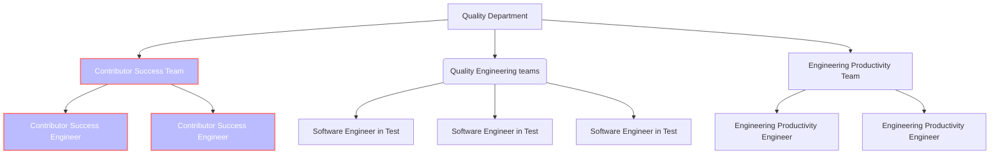

## On this page

{:.no_toc .hidden-md .hidden-lg}

- TOC
{:toc .toc-list-icons .hidden-md .hidden-lg}

{::options parse_block_html="true" /}

- - -

## Mission

The goal of the team is to increase the technical improvements and efficiency of our contribution process to sustain our ambition of [1000+ contributors with merged MRs per month to GitLab](/company/strategy/#2-build-on-our-open-core-strength).

## Strategy

- **Outstanding contributor experience** Smooth, effective and scalable contributor experience.
  - Improve Community Contributor Productivity
     - Streamlining the review and feedback process for contributions
     - Improve tooling efficiency
  - Improve Contributor Journey, making it easier and efficient to contribute
  - Gather feedback from Wider community contributors and product teams on the points of friction for the contribution process
- **Contributor inspiration, awareness and incentivization** Regular incentivization of content to inspire contributors. Testimonials from existing contributors
  - Contributor recognition. Harmonize, redesign, promote existing “Hall of Fame” pages (MVP, Heroes, Top annual contributors)
  - Active outreach to partners and customers. Partner with TAM team to launch certification and training resources
  - In collaboration with Marketing, awareness campaign around Open DevOps Platform and the GitLab stewardship model
  - Benefits program for contributors
    - GitLab Developer Certification 
    - GitLab Heroes 
- **Measure, optimize and iterate** 
  - Measure the Wider Community Contribution process to identify bottlenecks and optimize the process
  - Ensure accuracy of performance indicators and contributor tracking      
- **Partnerships**
  - Establish Engineering to Engineering liaisons and partnerships
  -  Engineering representative that can ride along with the evangelist and program manager. Full time presentation. 
  - Outreach to other OSS projects 
  - Work alongside Contributor Program Manager in outreach efforts
  - Cross coach Community Contribution teams on the technical aspects 

### Contribution Acceleration Timeline

We aim to increase the focus on our community contributions. Below is a timeline on how we will measure and track this goal.

- **[Unique Community Contributors per Month](/handbook/engineering/quality/performance-indicators/#unique-community-contributors-per-month)**
    - Target to increase to be greater than 150 per month by EOFY22
    - Activities:
        - Partnership with Community Relations and Technical Marketing team.
        - Hold community office hours
        - Hold hackathons
        - Allow running of QA tests from forks
        - Shorten the CI runtime for community contributions (in forks)
- **[Community Coaches per Month](/handbook/engineering/quality/performance-indicators/#community-mr-coaches-per-month)**
    - Target to increase to be greater than 50 per month by EOFY22
    - Activities:
    - Work with Development Department (Christopher L, VP of Development) for volunteers.
    - Work with UX Department (Christie L, VP of UX) Christie for volunteers.
    - Refresh MR coaches as “Community coaches” so non-code review work can be encouraged (design, etc)
    - Launch training materials for coaches
- **[Community Contribution MRs as Features per Month](/handbook/engineering/quality/performance-indicators/#community-contribution-mrs-added-as-features-per-month)**
    - Target to increase by 30% by EOFY22
    - Activities:
        - Encourage features at Community relations hackathons.
        - Published list of feature issues with Marketing team.
- **[Community Contribution MTTM](/handbook/engineering/quality/performance-indicators/#community-contribution-mean-time-to-merge)**
    - Target to decrease to be lower than 10 days by EOFY22
    - Activities:
        - Shorten CI time
        - Improve Community Contribution automation
        - Enable running QA tests on forks
        - Increase number of coaches
        - Partner with `~"group::ecosystem"` to provide feedback to improve contribution tooling (currently GDK).
- **[MRARR](/handbook/engineering/quality/performance-indicators/#mrarr)**
    - Target to increase to 1B MR$ by EOFY23
    - Activities:
        - Improve on measurement
        - Reach out to top tier enterprise customers
        - Partner with TAMs to enlist and facilitate contribution from paid customers
        - Launch contribution materials targeting large enterprises
        - Partner with Community relations team (David P)
        - Maintain a list of known contributors with a mapping to their accounts and the accounts ARR contribution as input to this KPI

## Team Responsibilities

* Carry out Engineering Open Source Outreach efforts.
* Improve GitLab's Contribution Efficiency and Merge Request Coaching process.
* Engineering representative that can ride along with the evangelist and program manager.
* Organize community contributors into Cohorts and ensure their success.
* Provide guidance to community contributors on technical and non-technical aspects.
* Track contribution delivery of the Community Contributors and Cohorts.
* Nominate community contributors and contribution for recognition & provide input into awards.
* Contribute as an MR Coach in one or more MR Coach speciality.
* Provide guidance and coaching to team members on technical contributions, product architecture, and other areas.
* Be a sounding board for our community contributors.
* Participate in GitLab's overall Open Source Outreach events and processes.
* Collaborate closely with our Marketing counterparts and Core team.

## Project Management

This team has the following immediate work items planned.

* [Contribution Efficiency Improvements Epic](https://gitlab.com/groups/gitlab-com/-/epics/1619)
* [Increasing MRARR through internal partnerships](https://gitlab.com/groups/gitlab-com/-/epics/1225)

## Active Quarter OKRs

## Team Structure

This new team resides under the Quality Department operating as a team of Full-stack engineers, led by an Engineering Manager reporting to the Quality Department Leader.

