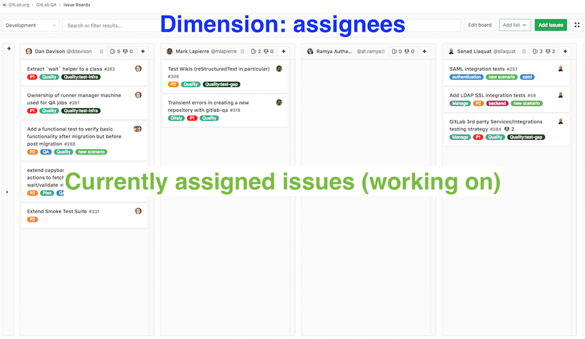
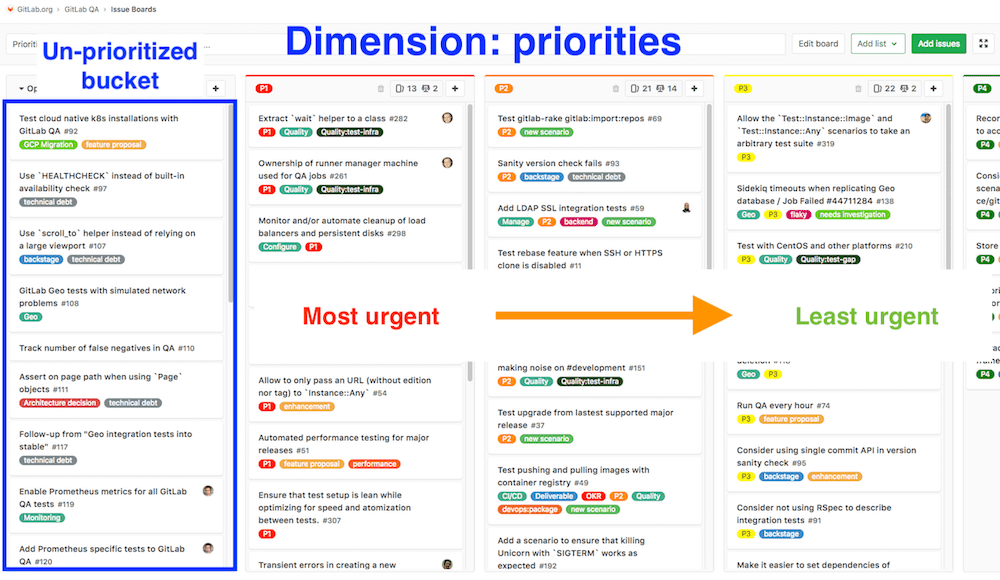
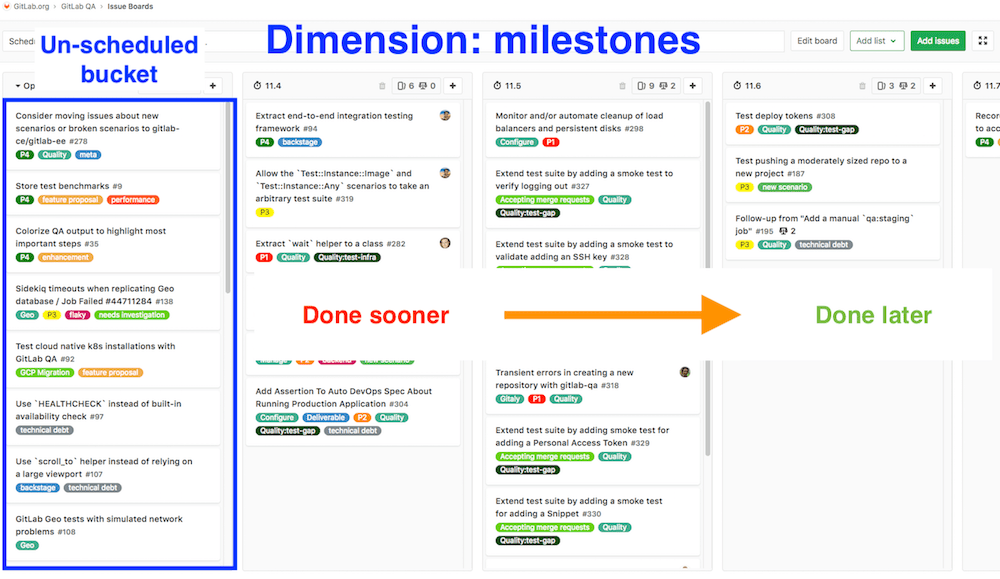

## On this page
{:.no_toc .hidden-md .hidden-lg}

- TOC
{:toc .hidden-md .hidden-lg}

## Projects

The Quality team currently works cross-functionally and our task ownership spans multiple projects.

* **GitLab.org**
  * [GitLab QA](https://gitlab.com/gitlab-org/gitlab-qa/)
  * [GitLab-Insights](https://gitlab.com/gitlab-org/gitlab-insights/)
  * [Insights configuration for the `gitlab-org` group](https://gitlab.com/gitlab-org/quality/insights-config/)
  * [GitLab-Triage](https://gitlab.com/gitlab-org/gitlab-triage)
  * [GitLab CE Tests](https://gitlab.com/gitlab-org/gitlab-ce/)
  * [GitLab EE Tests](https://gitlab.com/gitlab-org/gitlab-ee/)
  * [Known QA failures](https://gitlab.com/groups/gitlab-org/-/boards/1385578?scope=all&utf8=✓&state=opened&label_name[]=QA&label_name[]=Quality&label_name[]=bug)
  * **Quality Group**
    * [Quality team's task](https://gitlab.com/gitlab-org/quality/team-tasks/boards/)
    * [Triage-Ops](https://gitlab.com/gitlab-org/quality/triage-ops/)
    * [Nightly tests](https://gitlab.com/gitlab-org/quality/nightly)
    * [Staging tests](https://gitlab.com/gitlab-org/quality/staging)
    * Canary tests (future)
    * Production tests (future)

## Project Management

Our team's [Quality: Development board (top level board)](https://gitlab.com/groups/gitlab-org/-/boards/425899) can span 10k+ issues and it's not easy to work on that level.
As a result, it's only meant to capture the current workload of the team. The board shows who currently owns what in the entire GitLab.org space.

The board is meant to be read-only. We don't manage the project on that level.

We have sub-boards at the project level that are used for project management, triaging and scheduling issues.

Each project has 3 boards each for a given dimension of the project management component: `Development`, `Prioritization`, and `Scheduling`

### Development

This board shows the current ownership of workload / issues with assignees as the dimension.

### Prioritization

This board is for prioritization with priorities as the dimension (`~P1` `~P2` `~P3` `~P4`).

Most important is left most and gradually moves to least urgent.

### Scheduling

This board is for scheduling with milestones as the dimension.

Earliest milestone is left most and gradually moves into later milestones.

## How to use the boards

Each project planning, scheduling and triaging process will happen in the projects' boards.

The boards are using a consistent configuration and is the same across all of our projects. This means that anyone on the team can work using the same set of tools everywhere.

Think of all these projects as different class of objects with stable interface methods that is consistent and cross-compatible.

This also ensures that the data rolled up to the top level board is consistent.

### Board Overview

### Board Links

* **[GitLab.org top Level board](https://gitlab.com/groups/gitlab-org/-/boards/425899)**
   * [GitLab-QA](https://gitlab.com/gitlab-org/gitlab-qa/)
     * [`Development`](https://gitlab.com/gitlab-org/gitlab-qa/boards/2922)
     * [`Priorities`](https://gitlab.com/gitlab-org/gitlab-qa/boards/787592)
     * [`Scheduling`](https://gitlab.com/gitlab-org/gitlab-qa/boards/787593)
  * [GitLab-Insights](https://gitlab.com/gitlab-org/gitlab-insights/)
     * [`Development`](https://gitlab.com/gitlab-org/gitlab-insights/boards/443349)
     * [`Priorities`](https://gitlab.com/gitlab-org/gitlab-insights/boards/787583)
     * [`Scheduling`](https://gitlab.com/gitlab-org/gitlab-insights/boards/787576)
  * [GitLab-Triage](https://gitlab.com/gitlab-org/gitlab-triage/)
     * [`Development`](https://gitlab.com/gitlab-org/gitlab-triage/boards/316854)
     * [`Priorities`](https://gitlab.com/gitlab-org/gitlab-triage/boards/788523)
     * [`Scheduling`](https://gitlab.com/gitlab-org/gitlab-triage/boards/788524)
  * [GitLab CE](https://gitlab.com/gitlab-org/gitlab-ce/): GitLab CE issues with `~Quality`
    * [`Quality: Development`](https://gitlab.com/gitlab-org/gitlab-ce/boards/793776)
    * [`Quality: Priorities`](https://gitlab.com/gitlab-org/gitlab-ce/boards/793777)
    * [`Quality: Scheduling`](https://gitlab.com/gitlab-org/gitlab-ce/boards/793779)
  * [GitLab EE](https://gitlab.com/gitlab-org/gitlab-ee/): GitLab EE issues with `~Quality`
    * [`Quality: Development`](https://gitlab.com/gitlab-org/gitlab-ee/boards/793784)
    * [`Quality: Priorities`](https://gitlab.com/gitlab-org/gitlab-ee/boards/793788)
    * [`Quality: Scheduling`](https://gitlab.com/gitlab-org/gitlab-ee/boards/793791)
  * **[Quality group](https://gitlab.com/gitlab-org/quality)**
    * [Triage-Ops](https://gitlab.com/gitlab-org/quality/triage-ops/): GitLab-Triage setup for CE/EE and etc.
      * [`Development`](https://gitlab.com/gitlab-org/quality/triage-ops/boards/701857)
      * [`Priorities`](https://gitlab.com/gitlab-org/quality/triage-ops/boards/793763)
      * [`Scheduling`](https://gitlab.com/gitlab-org/quality/triage-ops/boards/793764)
    * [Quality Task](https://gitlab.com/gitlab-org/quality/team-tasks) Roadmap and initiative planning
      * [`Roadmaps`](https://gitlab.com/gitlab-org/quality/team-tasks/boards/548459)
      * [`Initiatives`](https://gitlab.com/gitlab-org/quality/team-tasks/boards/793708)
    * [Nightlies](https://gitlab.com/gitlab-org/quality/nightly)
      * Use the [default board](https://gitlab.com/gitlab-org/quality/nightly/boards)
    * [Staging](https://gitlab.com/gitlab-org/quality/staging)
      * Use the [default board](https://gitlab.com/gitlab-org/quality/staging/boards)
