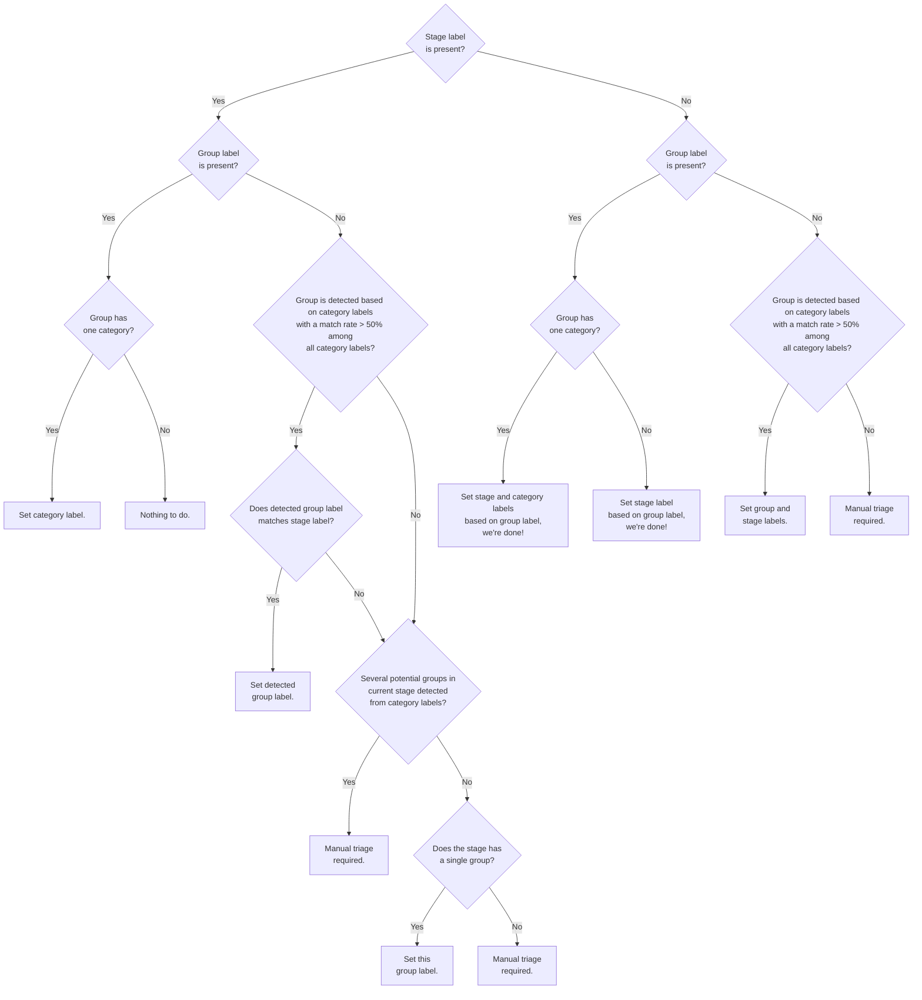

## On this page
{:.no_toc .hidden-md .hidden-lg}

- TOC
{:toc .hidden-md .hidden-lg}

Any GitLab team-member can triage issues. Keeping the number of un-triaged issues low is essential for maintainability, and is our collective responsibility.

We have implemented automation and tooling to handle this at scale and distribute the load to each team or group.

Video introduction to triage operations, triage report, priority and severity labels.

<iframe width="560" height="315" src="https://www.youtube.com/embed/qOlN2G1BDhk" frameborder="0" allow="accelerometer; autoplay; encrypted-media; gyroscope; picture-in-picture" allowfullscreen></iframe>

## Accountability

The Quality Engineering Department ensures that every Product and Engineering group is held accountable to deliver on the SLA set forth.

Our defect SLA can be viewed at:

* [Priority labels](/handbook/engineering/quality/issue-triage/#priority)
* [Severity labels](/handbook/engineering/quality/issue-triage/#severity)

The Quality Engineering department employs a number of tools and automation in addition to manual intervention to help us achieve this goal.
The work in this area can been seen in our department roadmap under [Triage](/handbook/engineering/quality/roadmap/#triage) and [Measure](/handbook/engineering/quality/roadmap/#measure) tracks of work.

## Communicate early and broadly about expected automation impact

Be sure to give a heads-up in the relevant Slack channels (e.g. `#development`,
`#product`) and the company call when an automation is expected to triage more
than 100 issues or merge requests at once.

That is usually the case when migrating labels (e.g. migrating team labels to
stage/group labels).

## Label renaming

There is a large amount of automation that uses stage, group, and category labels. We ask that Product Managers create an issue in triage-ops when any of the following changes occur. This issue helps ensure limited to no impact to automation and reports.

* [Stage creation or rename](https://gitlab.com/gitlab-org/quality/triage-ops/issues/new?issuable_template=stage-or-group-label-change)
* [Group creation or rename](https://gitlab.com/gitlab-org/quality/triage-ops/issues/new?issuable_template=stage-or-group-label-change)
* [Category label creation or rename](https://gitlab.com/gitlab-org/quality/triage-ops/issues/new?issuable_template=category-label-change)

## Auto-labelling of Issues

_Regarding legacy team labels, the mapping can be seen in [Automation to ensure that issues and MRs with legacy team labels have a 1:1 mapping to their devops stage or group label](https://gitlab.com/gitlab-org/quality/triage-ops/issues/201)._

Our triage bot will automatically infer stage and group labels based on the
category/feature and team labels already set on an issue. This is available for **open** issues.

The most important rules are:

* The bot does doesn't change a stage or group label if it's already set.
* A group label is chosen only if the highest group match from its category labels is > 50%.
* A group label is chosen only if it matches the already set stage label (if applicable).
* A stage label is set based on the chosen or already set group label.
* The bot leaves a message that explains its inference logic.

The following logic was initially implemented in
[this merge request](https://gitlab.com/gitlab-org/quality/triage-ops/merge_requests/155#workflow):



Check out the
[list of actual use-cases](https://gitlab.com/gitlab-org/quality/triage-ops/merge_requests/155#test-cases)
to better understand what this flow means in practice.

If your issue doesn't belong to a particular stage, you can remove the stage
label and add the `~"automation:devops-mapping-disable"` label to prevent this
automation from happening in the future.

## Auto-labelling of Merge Requests

We currently auto label **open** and **merged** merge requests based on the legacy team labels.
The mapping can be seen in [Automation to ensure that issues and MRs with legacy team labels have a 1:1 mapping to their devops stage or group label](https://gitlab.com/gitlab-org/quality/triage-ops/issues/201).

If your merge request doesn't belong to a particular stage, you can remove the stage
label and add the `~"automation:devops-mapping-disable"` label to prevent this
automation from happening in the future.

## Triage reports

A [triage report](https://gitlab.com/gitlab-org/quality/team-tasks/issues/35) is an issue containing a checklist of issues requiring attention.
Each task corresponds to an issue that needs labels, prioritization and/or scheduling.

### Who issues are assigned to

An issue created by a triage report is automatically assigned to team members.
Those team members are listed in
[group definition file](https://gitlab.com/gitlab-org/quality/triage-ops/tree/master/lib/group_definition.rb),
or the respective triage report
[policy YAML files](https://gitlab.com/gitlab-org/quality/triage-ops/tree/master/policies).

To change who an issue gets assigned to, open a merge request for the above
files.

### Newly created unlabelled issues requiring first-triage

This report contains the 66 most recent unlabelled issues requiring initial triage. The goal is to ensure we achieve [partial triage](/handbook/engineering/quality/issue-triage#partial-triage) before the issue is picked up by a Product Manager and Engineering Manager in that area.

* Triage owner: Quality Department Engineers.
* Triage action:
  1. Check for [duplicate issues](/handbook/engineering/quality/issue-triage/#duplicates) in this project and others (e.g. a new issue in EE may already exist in CE).
      * If identified as a duplicate bug, the new issue can be closed with a note similar to:

        ```
        Hey @author. Thanks for raising an issue. I've checked this for you and found this has already been reported in the following issue(s):
        * #issues

        Please add your thoughts and feedback on the original issue.

        Closing this issue in favour of the original.

        /duplicate #issues
        ```

      * If identified as a duplicate feature proposal, the new issue can be closed with a note similar to:

        ```
        Hey @author. Thanks for your request. I've checked this for you and found this has already been proposed in the following issue(s):
        * #issues

        Please add your thoughts and feedback on the original issue. Don't forget to upvote!

        Closing this in favour of the original issue.

        /duplicate #issues
        ```

  1. Add a [type label](https://gitlab.com/gitlab-org/gitlab/blob/master/doc/development/contributing/issue_workflow.md#type-labels).
    * If identified as a bug, add a [severity label](/handbook/engineering/quality/issue-triage/#severity).
  1. Add a [team label](https://gitlab.com/gitlab-org/gitlab/blob/master/doc/development/contributing/issue_workflow.md#team-labels)
  and [stage label](https://gitlab.com/gitlab-org/gitlab/blob/master/doc/development/contributing/issue_workflow.md#stage-labels).
  1. If it is unclear whether the issue is a bug or a support request:
    * @mention the PM/EM for the [relevant group](/handbook/product/product-categories/) and ask for their opinion.
  1. If the issue is a request for help:.
      * Use this template to provide resources and close the issue:

        ```
        Hey @author. Based on the information given, this request for support is out of the scope of the Issue tracker (which is for new Bug Reports and Feature Proposals). Unfortunately, I won't be able to help get it resolved. However, for support requests we have several resources that you can use to find help and support from the Community, including:
        * [Technical Support for Paid Tiers](https://about.gitlab.com/support/)
        * [Community Forum](https://forum.gitlab.com/)
        * [Reference Documents and Videos](https://about.gitlab.com/get-help/#references)

        Please refer to our [Support page](https://about.gitlab.com/support/) for more information.

        If you believe this was closed in error, please feel free to re-open the issue.

        /label ~"support request"
        /close
        ```

      * If the issue is re-opened, the person who did the initial triage should get an email notification.  They would then be responsible for re-evaluating the issue.
      * (Optional) Alternatively, instead of closing the issue when using the template above, you could take on the role of customer support and ask the reporter for more information so we can properly assist them. If you do this, add the `~"awaiting feedback"` label.
  1. If the issue is spam:
    * [Report the abuse](https://docs.gitlab.com/ee/user/abuse_reports.html) and make the issue confidential. Flag the report that is raised in the [#abuse](https://gitlab.slack.com/messages/C0HPYBJ3D) slack channel with a link to the issue and alert the `@abuse-team`.
  1. (Optional) Add relevant [subject labels](https://gitlab.com/gitlab-org/gitlab/blob/master/doc/development/contributing/issue_workflow.md#subject-labels).
  1. (Optional) Mention relevant PM/EMs from the relevant stage group from [product devstages categories](/handbook/product/product-categories/#devops-stage).
* Enlist help as needed by mentioning folks in the [#triage](https://gitlab.slack.com/messages/C39HX5TRV) slack channel.
* Example: [https://gitlab.com/gitlab-org/gitlab-ce/issues/57834](https://gitlab.com/gitlab-org/gitlab-ce/issues/57834)

### Group level bugs, features, and UX debt

This report contains the relevant bugs, feature requests, and UX debt issues that belong to a group in our [DevOps stages](/handbook/product/product-categories/#devops-stages).
The goal is to achieve [complete-triage](/handbook/engineering/quality/issue-triage#complete-triage) by the Product Manager, Engineering Manager, UX team member in that area.

The report itself is divided into 4 main parts.
* Feature proposals
* UX debt issues
* Frontend bugs
* Bugs (likely backend)
* `~P1` and `~P2` bugs past the target SLO.

The bug sections also contains a heatmap.


An example: [https://gitlab.com/gitlab-org/quality/triage-ops/issues/118](https://gitlab.com/gitlab-org/quality/triage-ops/issues/118)

Video overview of the triage report.

<iframe width="560" height="315" src="https://www.youtube.com/embed/JzHSUop9PSg" frameborder="0" allow="accelerometer; autoplay; encrypted-media; gyroscope; picture-in-picture" allowfullscreen></iframe>

There is also an optional stage policy for [missing categories](https://gitlab.com/gitlab-org/quality/triage-ops/-/blob/master/policies/missing-categories.yml).
If your team has enabled this, you will receive a list of up to 100 items that have the stage label but have zero appropriate category labels for that stage.

#### Feature proposals

This section contains issues with the `~"feature"` label without a milestone. It is divided further into issues with and without `~"customer"`

* Triage owner: Product Manager(s) for that group.
* Triage actions:
  1. If the issue is a duplicate or irrelevant, close the issue out.
  1. Assign a milestone either to a versioned milestone, `Backlog` or `Awaiting further demand` milestone.


#### Frontend bugs

This section contains issues with the `~"bug"` and `~"frontend"` labels without priority and severity. It is divided further into issues with and without `~"customer"`

* Triage owner: Frontend Engineering Manager(s) for that group.
* Triage actions:
  1. Close the issue if it is no longer relevant or a duplicate.
  1. Assign a [Priority Label](/handbook/engineering/quality/issue-triage/#priority).
  1. Assign a [Severity Label](/handbook/engineering/quality/issue-triage/#severity).
  1. Assign either a versioned milestone or to the `Backlog`.

#### Non-frontend bugs (likely backend)

This section contains issues with the `~"bug"` label without priority and severity. It is divided further into issues with and without `~"customer"`

* Triage owner: Backend Engineering Manager(s) for that group.
* Triage actions:
  1. Close the issue if it is no longer relevant or a duplicate.
  1. Assign a [Priority Label](/handbook/engineering/quality/issue-triage/#priority).
  1. Assign a [Severity Label](/handbook/engineering/quality/issue-triage/#severity).
  1. Assign either a versioned milestone or to the `Backlog`.

#### P1 & P2 bugs past SLO

This section contains bugs which has past our targeted SLO based on the priority set. This is based on our [missed SLO detection](/handbook/engineering/quality/triage-operations/index.html#missed-slo) triage policy.

### Group level idle merge requests

This report contains idle merge requests that belong to a group in our
[DevOps stages](/handbook/product/product-categories/#devops-stages).

Some merge requests are being idle with no activity on them and are merged
more than 30 days from the time when they are opened. This report attempts to
collect them for identifying the actions we need to take.

* Triage owner: Engineering Manager(s) for that group.
* Triage frequency: On 8th and 23rd every month.
* Listed merge requests: All which haven't been updated for
  more than 4 weeks.
* Triage actions:
  1. Review these merge requests to identify if there are any steps that can
     shorten the time to merge. Steps can be:
     1. Reminding the author about it.
     1. Changing the DRI.

An example: [Fill me](#)

### Community merge requests requiring attention

This report contains open merge requests which has been submitted by the wider
community. These merge requests would have the `~"Community contribution"` label.

The report itself is divided into 2 parts.
The first part contains the 20 newest merge requests from the wider community.
The second part contains 20 merge requests that weren't updated for 2 months or more.

* Triage owner: [@gitlab-org/coaches](https://gitlab.com/gitlab-org/coaches).
* Triage action:
  1. Determine if the merge request should be followed through or closed.
  1. Determine if the merge request is ready or further changes are required.
  1. Assign a reviewer as needed.
* Example: [https://gitlab.com/gitlab-org/gitlab-ce/issues/58131](https://gitlab.com/gitlab-org/gitlab-ce/issues/58131)

## Triage automation

General triage automation is run to label and update issues which help with reporting and milestone transition.

### Milestone reschedule

Open issues and merge requests that have missed the current release will be rescheduled to the next active milestone. This identifies pending work that was not completed within the planned milestone.

**Note:** Confidential issues will be skipped as part of the `missed` label application. Please see the [this issue](https://gitlab.com/gitlab-org/quality/triage-ops/-/issues/45) for more information

* Automation Condition: Open issues or merge requests that missed the current
  milestone, i.e. current date is
  * `>= 19th` if the 22nd is on a Monday
  * `>= 20th` if the 22nd is on a Sunday
  * `>= 21st` otherwise
* Automation Action:
  * The issues and merge requests are rescheduled to the next milestone
  * The label `~missed:x.y` is applied, where `x.y` is the current milestone
  * If the resource has the `~Deliverable` label, the `~missed-deliverable` label is applied
* Example: [Rescheduled Issue](https://gitlab.com/gitlab-org/gitlab-ce/issues/63145)
* Policy: <https://gitlab.com/gitlab-org/quality/triage-ops/-/blob/master/policies/stages/hygiene/missed-resources.yml>

### Missed deliverable

Open issues and merge requests planned as `~Deliverable` but have a `~missed:x.y`
label will have the `~missed-deliverable` label applied.

* Automation Condition: Open issues or merge requests with the `~Deliverable`
  label and a `~missed:x.y` label, and no `~missed-deliverable` label.
* Automation Action:
  * The labels `~missed-deliverable` is applied.
* Policy: <https://gitlab.com/gitlab-org/quality/triage-ops/-/blob/master/policies/stages/hygiene/missed-resources.yml>

### Deliverable with no milestone

Issues which have a label of `~Deliverable` without a milestone will have the milestone set to `%Backlog`.

* Automation Condition: Open issues or merge requests have label of `~Deliverable` without a milestone
* Automation Action:
  * `~Deliverable` label is removed
  * (Issues only) Milestone is set to `%Backlog`
* Policy: <https://gitlab.com/gitlab-org/quality/triage-ops/-/blob/master/policies/stages/hygiene/remove-far-deliverable.yml>

### Missed SLO

Issues which have a priority and missed the [SLO target](/handbook/engineering/quality/issue-triage/#priority) will be labeled with `~missed-SLO`. The calculation for elapsed time starts from the date of the priority label being applied. This enables reporting on SLO target adherence.

* Automation Condition: Issue with priority label present and is opened past SLO target.
* We currently only detect missed SLOs for `~P1` and `~P2` bugs.
* Automation Action:
  * The label `~missed-SLO` is applied.
* Example: <https://gitlab.com/gitlab-org/gitlab-ce/issues/61662>
* Policy: <https://gitlab.com/gitlab-org/quality/triage-ops/-/blob/master/policies/stages/hygiene/label-missed-slo.yml>

### Accepting merge requests

When milestone is present on an issue but there is not an assignee. The milestone being present indicates the product team has reviewed and scheduled the issue. This encourages open source contributions for planned features.
Issues with the `~workflow::blocked` label are excluded from this rule.

* Automation Condition: Issues with a milestone but no assignee.
* Automation Action:
  *  The `~"Accepting merge request"` label is applied.
*  Example: <https://gitlab.com/gitlab-org/gitlab-ce/issues/64705>
*  Policy: <https://gitlab.com/gitlab-org/quality/triage-ops/-/blob/master/policies/stages/hygiene/label-accepting-merge-requests.yml>

### Master broken categorization

Issues or merge requests that have a label of `~master:broken` will have labels of `~P1` and `~S1` applied. This ensures that requests which break master are sufficiently categorized for reporting.

* Automation Condition: Open issue or merge request with `~master:broken` label.
* Automation Action:
  * The `~P1` and `~S1` labels are applied.
* Example: <https://gitlab.com/gitlab-org/gitlab-ee/issues/12363>
* Policy: <https://gitlab.com/gitlab-org/quality/triage-ops/-/blob/master/policies/stages/hygiene/label-reminders.yml#L27-45>

### Identify interesting feature proposals

This automation identifies potential and popular proposals using upvotes. This helps identify feature proposals that people have indicated they would like.

* Automation Conditions:
  * Issues with 10 or more upvotes are identified as potential
  * Issues with 50 or more upvotes are identified as popular
* Automation Action:
  * The label `~"potential proposal"` or `~"popular proposal"` is applied depending on the condition.
* Examples:
  * Potential: <https://gitlab.com/gitlab-org/gitlab-ce/issues/62067#note_ca6949d26c3d121c421b4f8b20f7e5dc2028c0a6>
  * Popular: <https://gitlab.com/gitlab-org/gitlab-ce/issues/55638#note_b15ea9cbc76b8dea82963d7f14a4a65da52c2b09>
* Policy: <https://gitlab.com/gitlab-org/quality/triage-ops/-/blob/master/policies/stages/hygiene/discover.yml>

### Community contributions

Merge requests which have an author that is not a member of `gitlab-org` will have a label of `~"Community contribution"` applied. This informs the GitLab community team about new community contributions.

* Automation Condition: Merge request with author that is not in the `gitlab-org` group.
* Automation Action:
  *  The label `~"Community contribution"` is applied
*  Example: <https://gitlab.com/gitlab-org/gitlab-ce/merge_requests/30909/#note_0a1c0937d1b2851e9695fb89848d8425dcf28e00>
*  Policy: <https://gitlab.com/gitlab-org/quality/triage-ops/-/blob/master/policies/stages/hygiene/label-community-contributions.yml>

### Add milestone to community merge requests

Merged merge requests with the `~"Community contribution"` label and no milestone will automatically get the relevant milestone set. This helps keep the community contributions numbers accurate.

* Automation Condition: Merged merge request with the `~"Community contribution"` label, and no milestone.
* Automation Action:
  *  The relevant milestone is set based on the `merged_at` of the merge request and the `start_date` and `due_date` of the milestone
*  Example: <TBD>
*  Policy: <https://gitlab.com/gitlab-org/quality/triage-ops/-/blob/master/policies/stages/hygiene/add-milestone-to-community-merge-requests.yml>

## Resources

* [Issue Triage Policies](/handbook/engineering/quality/issue-triage/).
* Chat channels; we use our chat internally as a realtime communication tool:
  * [#triage](https://gitlab.slack.com/messages/triage): general triage team channel.
  * [#gitlab-issue-feed](https://gitlab.slack.com/messages/gitlab-issue-feed) - Feed of all GitLab-CE issues
  * [#support-tracker-feed](https://gitlab.slack.com/messages/support-tracker-feed) - Feed of the GitLab.com Support Tracker
  * [#mr-coaching](https://gitlab.slack.com/messages/mr-coaching): for general conversation about Merge Request coaching.
  * [#opensource](https://gitlab.slack.com/messages/opensource): for general conversation about Open Source.
