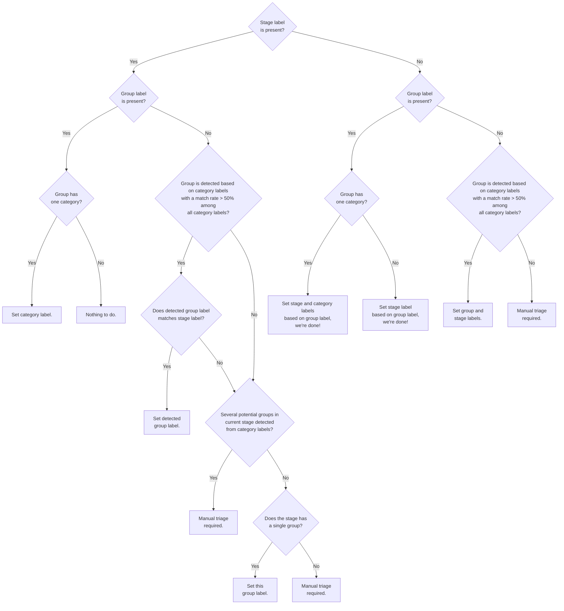

## On this page
{:.no_toc .hidden-md .hidden-lg}

- TOC
{:toc .hidden-md .hidden-lg}

Any GitLab team-member can triage issues. Keeping the number of [un-triaged issues](/handbook/engineering/quality/issue-triage/#triage-levels) low is essential for maintainability, and is our collective responsibility.

We have implemented automation and tooling to handle this at scale and distribute the load to each team or group.

Video introduction to triage operations, triage report, priority and severity labels.

<iframe width="560" height="315" src="https://www.youtube.com/embed/qOlN2G1BDhk" frameborder="0" allow="accelerometer; autoplay; encrypted-media; gyroscope; picture-in-picture" allowfullscreen></iframe>

## Accountability

The Quality Engineering Department ensures that every Product and Engineering group is held accountable to deliver on the SLA set forth.

Our defect SLA can be viewed at:

* [Priority labels](/handbook/engineering/quality/issue-triage/#priority)
* [Severity labels](/handbook/engineering/quality/issue-triage/#severity)

The Quality Engineering department employs a number of tools and automation in addition to manual intervention to help us achieve this goal.
The work in this area can been seen in our department roadmap under [Triage](/handbook/engineering/quality/roadmap/#triage-track-roadmap-view) and [Measure](/handbook/engineering/quality/roadmap/#measure-track-roadmap-view) tracks of work.

## Label renaming

There is a large amount of automation that uses stage, group, and category labels. We ask that Product Managers create an issue in triage-ops when any of the following changes occur. This issue helps ensure limited to no impact to automation and reports.

* [Stage creation or rename](https://gitlab.com/gitlab-org/quality/triage-ops/issues/new?issuable_template=stage-or-group-label-change)
* [Group creation or rename](https://gitlab.com/gitlab-org/quality/triage-ops/issues/new?issuable_template=stage-or-group-label-change)
* [Category label creation or rename](https://gitlab.com/gitlab-org/quality/triage-ops/issues/new?issuable_template=category-label-change)

## Auto-labelling of issues and merge requests

Our triage bot will automatically infer section, stage, and group labels based
on the category/feature already set on an issue or MR. This is available for **open** issues/MRs within the `gitlab-org` group.

The most important rules are:

* The bot doesn't change a stage or group label if the stage or group is listed in in `stages.yml` and the label is already set.
* A group label is chosen only if the highest group match from its category labels is > 50%.
* A group label is chosen only if it matches the already set stage label (if applicable).
* A stage label is set based on the chosen or already set group label.
* A section label is set based on the chosen or already set group or stage label.
* The bot leaves a message that explains its inference logic.

The following logic was initially implemented in
[this merge request](https://gitlab.com/gitlab-org/quality/triage-ops/merge_requests/155#workflow):



After the above inference is done, a section label will be added based on the
stage or group label. An explanation will not be added
in this step if the inferred labels contain only a section label.

Check out the
[list of actual use-cases](https://gitlab.com/gitlab-org/quality/triage-ops/merge_requests/155#test-cases)
to better understand what this flow means in practice.

If your issue/MR doesn't belong to a particular stage, you can remove the stage
label and add the `~"automation:devops-mapping-disable"` label to prevent this
automation from happening in the future.

## Triage reports

A [triage report](https://gitlab.com/gitlab-org/quality/team-tasks/issues/35) is an issue containing a checklist of issues requiring attention.
Each task corresponds to an issue that needs labels, prioritization and/or scheduling.

### Who issues are assigned to

An issue created by a triage report is automatically assigned to team members.
Those team members are listed in
[group definition file](https://gitlab.com/gitlab-org/quality/triage-ops/-/blob/master/group-definition.yml),
or the respective triage report
[policy YAML files](https://gitlab.com/gitlab-org/quality/triage-ops/tree/master/policies).

To change who an issue gets assigned to, open a merge request for the above
files. If the group definition file is changed, we'll need to
[run some scripts](https://gitlab.com/gitlab-org/quality/triage-ops#generating-policy-files-and-ci-jobs)
to update the generated files as well.

### Newly created unlabelled issues requiring first-triage

This report contains the 72 most recent unlabelled issues requiring initial triage. The goal is to ensure we achieve [partial triage](/handbook/engineering/quality/issue-triage#partial-triage) before the issue is picked up by a Product Manager and Engineering Manager in that area.

* Triage owner: Quality Department Engineers.
* Triage action: Follow the instructions in the triage report.
  * Enlist help as needed by mentioning folks in the [#triage](https://gitlab.slack.com/messages/C39HX5TRV) slack channel.
  * Example: [https://gitlab.com/gitlab-org/gitlab-ce/issues/57834](https://gitlab.com/gitlab-org/gitlab-ce/issues/57834)

#### Manual creation

Sometimes the unlabelled triage report creation fails due to spam detection. When the issue is not created, a notification for failure of the `verify-unlabelled` job will be raised to the `#triage-automations` channel.

The issue can be created manually using the following command:

```
bundle exec gitlab-triage --debug --r ./plugins/all.rb --token PERSONAL_API_TOKEN --source projects --source-id gitlab-org/gitlab -f ./policies/stages/report/unlabelled-issues.yml
```

### Newly created Community contribution merge requests requiring first-triage

This report contains recent wider community contribution merge requests requiring initial triage.
The goal is for coaches to add stage and group labels (as well as type and category labels, ideally),
so that the relevant Product Manager or Engineering Manager can be pinged later on based on these labels.

* Triage owner: [Merge Request Coaches](https://gitlab.com/gitlab-org/coaches) who are not out of the office by [gitlab roulette](https://gitlab.com/gitlab-org/gitlab-roulette#features)
* Listed merge requests: All which have been created in the last 24 hours.
* Triage action: Follow the instructions in the triage report.
  * Example: [https://gitlab.com/gitlab-org/quality/triage-reports/-/issues/364](https://gitlab.com/gitlab-org/quality/triage-reports/-/issues/364)

### Group level bugs, features, and UX debt

This report contains the relevant bugs, feature requests, and UX debt issues that belong to a group in our [DevOps stages](/handbook/product/categories/#devops-stages).
The goal is to achieve [complete-triage](/handbook/engineering/quality/issue-triage#complete-triage) by the Product Manager, Engineering Manager, UX team member in that area.

The report itself is divided into 4 main parts.
* Feature proposals
* UX debt issues
* Frontend bugs
* Bugs (likely backend)
* `~priority::1` and `~priority::2` bugs past the target SLO.

The bug sections also contains a heatmap.


An example: [https://gitlab.com/gitlab-org/quality/triage-ops/issues/118](https://gitlab.com/gitlab-org/quality/triage-ops/issues/118)

Video overview of the triage report.

<iframe width="560" height="315" src="https://www.youtube.com/embed/JzHSUop9PSg" frameborder="0" allow="accelerometer; autoplay; encrypted-media; gyroscope; picture-in-picture" allowfullscreen></iframe>

There is also an optional stage policy for [missing categories](https://gitlab.com/gitlab-org/quality/triage-ops/-/blob/master/policies/missing-categories.yml).
If your team has enabled this, you will receive a list of up to 100 items that have the stage label but have zero appropriate category labels for that stage.

#### Feature proposals

This section contains issues with the `~"feature"` label without a milestone. It is divided further into issues with and without `~"customer"`

* Triage owner: Product Manager(s) for that group.
* Triage actions:
  1. If the issue is a duplicate or irrelevant, close the issue out.
  1. Assign a milestone either to a versioned milestone, `Backlog` or `Awaiting further demand` milestone.


#### Frontend bugs

This section contains issues with the `~"bug"` and `~"frontend"` labels without priority and severity. It is divided further into issues with and without `~"customer"`

* Triage owner: Frontend Engineering Manager(s) for that group.
* Triage actions:
  1. Close the issue if it is no longer relevant or a duplicate.
  1. Assign a [Priority Label](/handbook/engineering/quality/issue-triage/#priority).
  1. Assign a [Severity Label](/handbook/engineering/quality/issue-triage/#severity).
  1. Assign either a versioned milestone or to the `Backlog`.

#### Non-frontend bugs (likely backend)

This section contains issues with the `~"bug"` label without priority and severity. It is divided further into issues with and without `~"customer"`

* Triage owner: Backend Engineering Manager(s) for that group.
* Triage actions:
  1. Close the issue if it is no longer relevant or a duplicate.
  1. Assign a [Priority Label](/handbook/engineering/quality/issue-triage/#priority).
  1. Assign a [Severity Label](/handbook/engineering/quality/issue-triage/#severity).
  1. Assign either a versioned milestone or to the `Backlog`.

#### severity::1 & severity::2 bugs past SLO

This section contains bugs which has past our targeted SLO based on the severity label set. This is based on our [missed SLO detection](/handbook/engineering/quality/triage-operations/index.html#missed-slo) triage policy.

### Group level merge requests that may need attention

This report contains merge requests that belong to a group in our
[DevOps stages](/handbook/product/categories/#devops-stages).
It's composed of three sections:

1. Idle merge requests authored by team members.
1. Unassigned merge requests written by a community contributor.
1. Idle merge requests authored by a community contributor.

Some merge requests are idle with no activity for them and are merged
more than 28 days from when they are opened. This report attempts to
collect them for identifying the actions we need to take, such as nudging the author, reviewer,
or maintainer.

* Triage owner: Engineering Manager(s) for that group.
* Triage frequency: On 8th and 23rd every month.
* Triage actions:
  1. Review these merge requests to identify if there are any steps that can
     shorten the time to merge. Steps can be:
     1. Reminding the author about it.
     1. Changing the DRI.

An example report: [Merge requests requiring attention for `group::access` - 2020-11-08](https://gitlab.com/gitlab-org/quality/triage-reports/-/issues/751). Current reports can be found in the [triage-reports project](https://gitlab.com/gitlab-org/quality/triage-reports/-/issues?scope=all&utf8=%E2%9C%93&state=all&search=%22Merge+Requests+requiring+attention%22)

#### Why references without an actual link

Using actual links to the merge requests will update the merge request
which will remove them from the future report.

### Group level feature flags that may need attention

This report contains feature flags that have enabled in the codebase for 2 or more releases for 
groups within our [DevOps stages](/handbook/product/categories/#devops-stages).

The DRI is responsible for reviewing these feature flags to determine if they are able to be removed 
entirely, or create separate issues to ensure the overdue feature flags are removed accordingly.

* Triage owner: Engineering Manager(s) for that group.
* Triage frequency: On 1st of every month.
* Triage actions:
  1. Review the feature flags to identify whether they can be:
     1. Removed by the Engineering DRI.
     1. Tracked with a separate issue for removal to be scheduled by the PM for the group.

An example report: [Feature Flags requiring attention for `group::continuous integration` - 2021-03-01](https://gitlab.com/gitlab-org/quality/triage-reports/-/issues/2161). Current reports can be found in the [triage-reports project](https://gitlab.com/gitlab-org/quality/triage-reports/-/issues?scope=all&utf8=%E2%9C%93&state=all&search=%22Feature+flags+requiring+attention%22)

The feature flag triage reports are generated by the [gitlab-feature-flag-alert](https://gitlab.com/gitlab-org/gitlab-feature-flag-alert) project.

### Community merge requests requiring attention

This report contains open merge requests which has been submitted by the wider
community. These merge requests would have the `~"Community contribution"` label.

The report itself is divided into 2 parts.
The first part contains the newest unassigned merge requests from the wider community.
The second part contains merge requests that weren't updated for 28 days or more.

* Triage owner: Engineering Manager(s) for that group.
* Triage action:
  1. Determine if the merge request should be followed through or closed.
  1. Determine if the merge request is ready or further changes are required.
  1. Assign a reviewer as needed.
* Example: [https://gitlab.com/gitlab-org/quality/triage-reports/-/issues/2440](https://gitlab.com/gitlab-org/quality/triage-reports/-/issues/2440)

### Auto closure of triage reports

Reports open for more than 2 weeks with the `~"triage report"` label will be closed automatically with the [close old triage reports](https://gitlab.com/gitlab-org/quality/triage-ops/-/blob/master/policies/stages/close-reports/close-old-triage-reports.yml) automation. 

## Triage automation

General triage automation is run to label and update issues which help with
reporting and milestone transition. This is handled by
[triage-ops](https://gitlab.com/gitlab-org/quality/triage-ops).

### Milestone reschedule

Open issues and merge requests that have missed the current release will be rescheduled to the next active milestone. This identifies pending work that was not completed within the planned milestone.

**Note:** Confidential issues will be skipped as part of the `missed` label application. Please see the [this issue](https://gitlab.com/gitlab-org/quality/triage-ops/-/issues/45) for more information

* Automation Condition: Open issues or merge requests that missed the current
  milestone, i.e. current date is
  * `>= 19th` if the 22nd is on a Monday
  * `>= 20th` if the 22nd is on a Sunday
  * `>= 21st` otherwise
* Automation Action:
  * The issues and merge requests are rescheduled to the next milestone
  * The label `~missed:x.y` is applied, where `x.y` is the current milestone
  * If the resource has the `~Deliverable` label, the `~missed-deliverable` label is applied
* Example: [Rescheduled Issue](https://gitlab.com/gitlab-org/gitlab-ce/issues/63145)
* Policy: <https://gitlab.com/gitlab-org/quality/triage-ops/-/blob/master/policies/stages/hygiene/missed-resources.yml>

### Missed deliverable

Open issues and merge requests planned as `~Deliverable` but have a `~missed:x.y`
label will have the `~missed-deliverable` label applied.

**Note:** Confidential issues will be skipped as part of the `missed` label application. Please see the [this issue](https://gitlab.com/gitlab-org/quality/triage-ops/-/issues/45) for more information

* Automation Condition: Open issues or merge requests with the `~Deliverable`
  label and a `~missed:x.y` label, and no `~missed-deliverable` label.
* Automation Action:
  * The labels `~missed-deliverable` is applied.
* Policy: <https://gitlab.com/gitlab-org/quality/triage-ops/-/blob/master/policies/stages/hygiene/missed-resources.yml>

### Deliverable with no milestone

Issues which have a label of `~Deliverable` without a milestone will have the milestone set to `%Backlog`.

* Automation Condition: Open issues or merge requests have label of `~Deliverable` without a milestone
* Automation Action:
  * `~Deliverable` label is removed
  * (Issues only) Milestone is set to `%Backlog`
* Policy: <https://gitlab.com/gitlab-org/quality/triage-ops/-/blob/master/policies/stages/hygiene/remove-far-deliverable.yml>

### Missed SLO

Issues which have a severity label and missed the [SLO target](/handbook/engineering/quality/issue-triage/#severity) will be labeled with `~missed-SLO`. The calculation for elapsed time starts from the date of the severity label was applied. This enables reporting on SLO target adherence.

* Automation Condition: Issue with severity label present and is remains in an open state past SLO target.
* We currently only detect missed SLOs for `~severity::1` and `~severity::2` bugs.
* Automation Action:
  * The label `~missed-SLO` is applied.
* Example: <https://gitlab.com/gitlab-org/gitlab-ce/issues/61662>
* Policy: <https://gitlab.com/gitlab-org/quality/triage-ops/-/blob/master/policies/stages/hygiene/label-missed-slo.yml>

### Bug priority label inference

Bugs which have a severity 1 or severity 2 label without a priority label will be labeled with the equal priority label. For example, a `~severity::1` `~bug` without a priority label will have `~priority::1` applied.

* Automation Condition: `~bug` issue with `~severity::1` or `~severity::2` without a `~priority::*` label.
* Automation Action:
  * Apply the `~priority::*` label of the same level
* Policy: <https://gitlab.com/gitlab-org/quality/triage-ops/-/blob/master/policies/stages/hygiene/set-priority-from-severity.yml>

### Accepting merge requests

When milestone is present on an issue but there is not an assignee. The milestone being present indicates the product team has reviewed and scheduled the issue. This encourages open source contributions for planned features.

Issues with the `~workflow::blocked`, `~workflow::design`, `~workflow::planning breakdown`, `~workflow::refinement` or `~workflow::verification` labels are excluded from this rule.

* Automation Condition: Issues with a milestone but no assignee.
* Automation Action:
  *  The `~"Accepting merge request"` label is applied.
*  Example: <https://gitlab.com/gitlab-org/gitlab-ce/issues/64705>
*  Policy: <https://gitlab.com/gitlab-org/quality/triage-ops/-/blob/master/policies/stages/hygiene/label-accepting-merge-requests.yml>

### Master broken categorization

Issues or merge requests that have a label of `~"master:broken"` will have labels of `~"priority::1"` and `~"severity::1"` applied. This ensures that requests which break master are sufficiently categorized for reporting.

* Automation Condition: Open issue or merge request with `~"master:broken"` label.
* Automation Action:
  * The `~"priority::1"` and `~"severity::1"` labels are applied.
* Example: <https://gitlab.com/gitlab-org/gitlab-ee/issues/12363>
* Policy: <https://gitlab.com/gitlab-org/quality/triage-ops/-/blob/master/policies/stages/hygiene/label-reminders.yml#L27-45>

### Identify interesting feature proposals

This automation identifies potential and popular proposals using upvotes. This helps identify feature proposals that people have indicated they would like.

* Automation Conditions:
  * Issues with 10 or more upvotes are identified as potential
  * Issues with 50 or more upvotes are identified as popular
* Automation Action:
  * The label `~"potential proposal"` or `~"popular proposal"` is applied depending on the condition.
* Examples:
  * Potential: <https://gitlab.com/gitlab-org/gitlab-ce/issues/62067#note_ca6949d26c3d121c421b4f8b20f7e5dc2028c0a6>
  * Popular: <https://gitlab.com/gitlab-org/gitlab-ce/issues/55638#note_b15ea9cbc76b8dea82963d7f14a4a65da52c2b09>
* Policy: <https://gitlab.com/gitlab-org/quality/triage-ops/-/blob/master/policies/stages/hygiene/discover.yml>

### Community contributions

Merge requests which have an author that is not a member of `gitlab-org` will have a label of `~"Community contribution"` applied. This informs the GitLab community team about new community contributions.

* Automation Condition:
  * Merge request under `gitlab-org` with author that is not in the `gitlab-org` group.
  * Merge request under `gitlab-com/www-gitlab-com` with author that is not in the `gitlab-com` group.
* Frequency: daily, and **a realtime welcome message with triage-serverless for applies ~"Community contribution"`**
* Automation Action:
  *  The label `~"Community contribution"` is applied
*  Example: <https://gitlab.com/gitlab-org/gitlab-ce/merge_requests/30909/#note_0a1c0937d1b2851e9695fb89848d8425dcf28e00>
*  Policy: <https://gitlab.com/gitlab-org/quality/triage-ops/-/blob/master/policies/stages/hygiene/label-community-contributions.yml>

### Add milestone to community merge requests

Merged merge requests with the `~"Community contribution"` label and no milestone will automatically get the relevant milestone set. This helps keep the community contributions numbers accurate.

* Automation Condition: Merged merge request with the `~"Community contribution"` label, and no milestone.
* Automation Action:
  *  The relevant milestone is set based on the `merged_at` of the merge request and the `start_date` and `due_date` of the milestone
*  Example: <TBD>
*  Policy: <https://gitlab.com/gitlab-org/quality/triage-ops/-/blob/master/policies/stages/hygiene/add-milestone-to-community-merge-requests.yml>

### Auto-close inactive bugs

GitLab values the time spent by contributors on reporting bugs. However, if a bug remains inactive for a very long period, it will qualify for auto-closure.
The following is the policy for identification and auto-closure of inactive bugs.

- If a `~"severity::3"` or `~"severity::4"` `~"bug"` issue is inactive for at least 12 months, it will be
identified as eligible for auto-closure. At this point, the following actions occur:
    - Application of `~"vintage"` to indicate the issue has been inactive for a year.
    - Application of `~"stale"` to indicate that it is currently being identified for auto-closure.
    - Comment by GitLab Bot to the author to check whether the reported bug still persists and to comment accordingly within the next 7 days.
- After 7 days, one of the below mentioned actions happen:
    - Issues which have not received a comment will be closed and the `~"auto-closed"` is applied.
    - Issues with a comment from anyone other than the gitlab-bot in the last 7 days are considered active and `~"stale"` is removed
- Policy: [https://gitlab.com/gitlab-org/quality/triage-ops/-/blob/master/policies/stages/hygiene/close-stale-bugs.yml](https://gitlab.com/gitlab-org/quality/triage-ops/-/blob/master/policies/stages/hygiene/close-stale-bugs.yml)

### Prompt for Tier labels on issues

Tier labels should be applied to issues to specify the license tier of feature. This policy prompts the Product Manager for the applied group label to add the license tier label to issues that are scheduled for the current milestone and labelled with `~direction`.

The possible tier labels to be applied are:
  - ~"GitLab Free"
  - ~"GitLab Premium"
  - ~"GitLab Ultimate"

* Automation condition: Open issue without tier labels, with group and `~direction` label, in current milestone
* Automation action:
  - Mention the relevant PM for the group asking to add appropriate label
* Policy: <https://gitlab.com/gitlab-org/quality/triage-ops/-/blob/master/policies/stages/hygiene/prompt-for-tier-labels.yml>

### Prompt for Type labels on issues

[Type labels](https://docs.gitlab.com/ee/development/contributing/issue_workflow.html#type-labels) are applied to issues to increase the visibility and discoverability during team issue refinement. This policy applies to `gitlab-org` team member created issues and prompts the author to apply a type label to the issue within the first week.

Type labels ensure that issues are present in the [group triage report]('handbook/engineering/quality/triage-operations/#group-level-bugs-features-and-ux-debt') and added to the correct section.

* Automation condition: Open issue with no type label applied, opened in the past 7 days, authored by `gitlab-org` member
* Automation action:
  - Mention the author asking to add appropriate type label
* Policy: <https://gitlab.com/gitlab-org/quality/triage-ops/-/blob/master/policies/stages/hygiene/prompt-team-member-type-label.yml>

#### Data

- [Chart displaying the number of open issues by type label](https://app.periscopedata.com/app/gitlab/621211/?widget=8100010&udv=973087)

### Bug SLO Warning

Bugs have a severity label that indicates the [SLO for a fix](https://about.gitlab.com/handbook/engineering/quality/issue-triage/#severity). This automated policy aims to prompt managers about bugs in their group that are approaching the SLO threshold

* Automation Condition:
  - Open issue labelled `~bug` and has a `~severity::1` or `~severity::2`
  - Time since current severity label was applied and today is over 75% towards the SLO threshold
* Automation Action:
  *  Mention EM and PM on the issue to make them aware of the impending SLO breach
*  Example: <TBD>
*  Policy: <https://gitlab.com/gitlab-org/quality/triage-ops/-/blob/master/policies/stages/hygiene/comment-slo-breaching-bugs.yml>

### Reminder on ~infradev issues to set severity label, priority label, and milestone

Issues with the ~infradev label should have a [severity label](https://about.gitlab.com/handbook/engineering/quality/issue-triage/#severity), a [priority label](https://about.gitlab.com/handbook/engineering/quality/issue-triage/#priority), and a milestone set. This automated policy aims to prompt managers about such issues missing one of these attributes.

* Automation Condition:
  - Open issue labelled `~infradev` and has no severity label, or no priority label, or no milestone set
  - Issue doesn't have the `~"automation:infradev-missing-labels"` set
* Automation Action:
  * The label `~"automation:infradev-missing-labels"` is applied
  * A message is posted to ask for a severity label, a priority label, and a milestone to be set on the issue
*  Example: <TBD>
*  Policy: <https://gitlab.com/gitlab-org/quality/triage-ops/-/blob/master/policies/stages/hygiene/ask-severity-priority-for-infradev-issues.yml>

Note:

1. The `~"automation:infradev-missing-labels"` is automatically removed when a severity label, a priority label, and a milestone are set on the issue.
1. The `~"automation:infradev-missing-labels"` is automatically removed after two weeks, leading to a new message being posted if the Automation Conditions above are still met.
   This effectively ensures that a reminder is posted on the issue every two weeks.

## Reactive triage automation

Reactive triage automation is complementary to general triage automation where
realtime feedback provides an improved developer experience. This is handled by
[triage-serverless](https://gitlab.com/gitlab-org/quality/triage-serverless).

### Ensure quick feedback for Community contributions

Merge requests which have an author that is not a member of `gitlab-org` will have a label of `~"Community contribution"` applied.
Additionally, a note will be posted to thank the contributor for their contribution, and to give some information about the review process, as well as some useful resource links.

* Automation condition: Open merge request which have an author that is not a member of `gitlab-org`
* Automation action:
  - Apply label `~"Community contribution"`
* Policy: <https://gitlab.com/gitlab-org/quality/triage-ops/-/blob/master/policies/stages/hygiene/label-community-contributions.yml>

### Ensure priorities for availability issues

For issues labelled `~"availability"`, the minimal are enforced with the
guidelines at
<https://about.gitlab.com/handbook/engineering/quality/issue-triage/#availability-prioritization>

### Ensure no deprecated backstage labels are added

Whenever `~"backstage [DEPRECATED]"` is added, it'll remove it and hint
about why it should not be added, and alternatives will be provided.

### Add customer label whenever a customer associated link is added

The `~"customer"` label is applied when a customer associated link is applied.

The following URLs are considered customer associated links:

* `gitlab.zendesk.com`
* `gitlab.my.salesforce.com`

### Add type label from subtype

Whenever a subtype label is added, the corresponding type label is added.
Current type labels with subtype labels are:

* `~"feature"`
* `~"tooling"`

## Resources

* [Issue Triage Policies](/handbook/engineering/quality/issue-triage/).
* [Wider Community Merge Request Triage Policies](/handbook/engineering/quality/merge-request-triage/)
* Chat channels; we use our chat internally as a realtime communication tool:
  * [#triage](https://gitlab.slack.com/messages/triage): general triage team channel.
  * [#gitlab-issue-feed](https://gitlab.slack.com/messages/gitlab-issue-feed) - Feed of all GitLab-CE issues
  * [#support-tracker-feed](https://gitlab.slack.com/messages/support-tracker-feed) - Feed of the GitLab.com Support Tracker
  * [#mr-coaching](https://gitlab.slack.com/messages/mr-coaching): for general conversation about Merge Request Coaching.
  * [#opensource](https://gitlab.slack.com/messages/opensource): for general conversation about Open Source.
