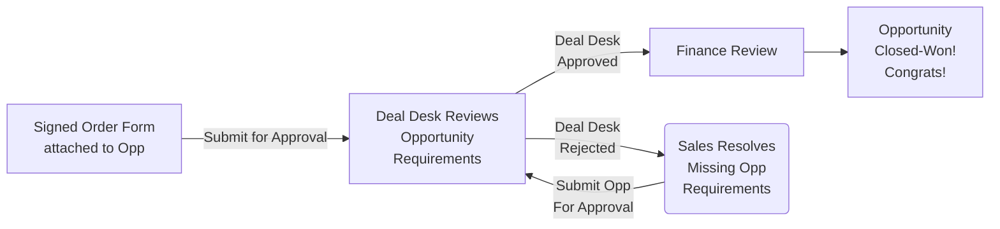

## On this page
{:.no_toc .hidden-md .hidden-lg}

- TOC
{:toc .hidden-md .hidden-lg}

{::options parse_block_html="true" /}

**Welcome to the Sales Order Processing page!** 
{:.gitlab-purple .no_toc} 

This page outlines the Quote to Cash process, starting from quote creation, to approvals and booking requirements, to the ultimate closure of a deal. This page will also cover common questions that may come up shortly after an opportunity has been closed. 

**Please note:** Some information that was previously hosted on this page has been moved to pages owned by the teams directly responsible for the applicable topics.

### Helpful Links

*   **Salesforce Reports and Dashboards**

    *   [Current Quarter WW Sales Dashboard](https://gitlab.my.salesforce.com/01Z4M0000007H7W)
    *   [Monthly Bookings Report](https://gitlab.my.salesforce.com/00O61000004Ik27)
    *   [Deal Desk Pending Opportunity Approvals Report](https://gitlab.my.salesforce.com/00O4M000004e0Dp)

*   **Frequently Used Handbook Pages**

    *   [Sales Order Processing](/handbook/business-ops/order-processing/)
    *   [How to Work with Legal](/handbook/legal/#5-other-legal-requests)
    *   [Deal Desk Opportunity Approval Process](/handbook/business-ops/order-processing/#submitting-an-opportunity-for-deal-desk-approval)
    *   [Useful Company Information](https://gitlab.com/gitlab-com/finance/wikis/company-information)
    *   [Account Ownership Rules of Engagement](/handbook/business-ops/resources/#account-ownership-rules-of-engagement)
    *   [IACV Calculation Guide](/handbook/sales/sales-term-glossary/acv-in-practice)
    *   [Vendor Setup Form Process](/handbook/business-ops/order-processing/#how-to-process-customer-requested-vendor-setup-forms)
    *   [Security Questionnaire Process](/handbook/engineering/security/#process)
    *   [Troubleshooting: True Ups, Licenses + EULAS](/handbook/business-ops/business_systems/portal/troubleshooting/)
    *   [Licensing FAQ](https://about.gitlab.com/pricing/licensing-faq/)
    *   [Legal Authorization Matrix](/handbook/finance/authorization-matrix/)
    *   [Trade Compliance (Export/Import)](/handbook/business-ops/order-processing/#trade-compliance-export--import-and-visual-compliance-tool-in-salesforce)

*   **Other Resources**

    *   [Sales Territory Spreadsheet](https://docs.google.com/spreadsheets/d/1PYU8oQJQEPpi8K-SHuqSgPeSpLcWeSQd9FuwKtgD048/edit?ts=5d6ea274#gid=0)
    *   [Quote Approval Matrix](https://docs.google.com/document/d/1-CH-uH_zr0qaVaV1QbmVZ1rF669DsaUeq9w-q1QiKPE/edit?ts=5d6ea430#heading=h.ag75fqu12pf0)
    *   [Billing FAQs and Useful Tips](https://gitlab.com/gitlab-com/finance/-/wikis/Billing-Team-FAQs-&-Useful-Tips)
    *   [Sample Order Form (Blank)](https://drive.google.com/open?id=1NB5KH7U4cucjiOjUdZrq94mYGzH6jG4f)

## **Creating Accounts and Contacts**

### Step 1 - Create an Account

1. Click on the Accounts tab in Salesforce.
2. Click the "New" button.
3. Select either "Standard" or "Channel" record type. Each record tgype will have a different account layout.
    * "Standard" = all non-reseller/distributor accounts
    * "Channel" - only reseller/distributor accounts (note: sales should not create channel accounts, see point 6)
    * Note: Partners who are also customers must have two separate accounts - one Channel type account, and one Standard type account.
4. On the Create Account screen, do the following:
    * Complete all mandatory fields.
    * Be sure to enter the correct URL under "Domain" as this impacts the identification of the customer and related sales segment.
    * Click Save.
5. Be sure to enter detailed information regarding the customer or partner, including full legal name, full billing address, and other pertinent details.
6. If the account is a `Channel` account, it should be created via the partner creating an account in Impartner or manually via Channel Operations. Sales should not create Channel accounts and should Slack [#channel-ops](https://gitlab.slack.com/archives/CTM4T5BPF).

### Step 2 - Create/Edit a Contact

1. Click the "New Contact" button.
2. Add the full first name, last name, title, phone number, email address, and full address for all contacts.
    * Note: Salesforce requires that all contacts entered on a quote as "Sold To," "Bill To," or "Invoice Owner Contact" have a full and complete address. A quote object containing contacts without full and complete addresses will not save.

## **Quote Configuration**

The following is a high level guide to quote types and important quote information to note before processing an order. Review the [**Go To Market Handbook**](/handbook/business-ops/resources/#how-to-create-an-opportunity) for opportunity creation instructions, and opportunity management guidelines. Review the [**Deal Desk Quote Configuration Guide**](/handbook/sales/field-operations/sales-operations/deal-desk/#zuora-quote-configuration-guide---standard-quotes) for written instructions and video tutorials specific to each quote type.

### What are the standard quote types? 

There are 4 different types of quotes - New Subscription, Amend Existing, Renew Existing, Cancel Existing. The correct quote type must be used for each opportunity. 

| **Quote Type** | **When to Use** |
|-----------------|:-------------|
| [New Subscription](/handbook/sales/field-operations/sales-operations/deal-desk/#new-subscription-quote) | Any New Subscription Term or Renewal where customer is changing term length |
| [Amend Subscription](/handbook/sales/field-operations/sales-operations/deal-desk/#amend-subscription-quote)     | Use this quote type to add users, true up, or change product tier **during the current subscription term** |
| [Renew Existing Subscription](/handbook/sales/field-operations/sales-operations/deal-desk/#renew-subscription-quote)      | Customer is at the end of their current term and wants to renew for the same term length      |
| [Cancel Existing Subcription](/handbook/sales/field-operations/sales-operations/deal-desk/#contract-reset)      | This is used for a Contract Reset - please chatter on the opportunity level for assistance with contract resets      |

### Assistance with Quotes

If your quote requires any special, non-standard edits, or if you have questions regarding standard quotes, you are encouraged to send a Chatter message to "@Sales-Support" on the SFDC Opportunity record for assistnace. 

Please provide as much detail as possible, including links to relevant records, dates, user counts, and other applicable information. **Note: It is the Opportunity Owner's responsibility to create quotes, unless they are complex custom deals or one of the scenarios listed below.** 

### What types of quotes can Deal Desk assist me with? 

Deal Desk will review any quote to ensure accuracy and completion. **However, sales teams are encouraged to follow the handbook and training guides for [Standard Quote Types](/handbook/business-ops/order-processing/#what-are-the-standard-quote-types) and should fully manage the quote creation process.**

Occasionally, you may encounter a complex deal that has **non-standard** elements. The Deal Desk team will assist the opportunity owner in creating the quote correctly. Some examples of these complex scenarios include: 

* **Contract resets:** If the customer wishes to reset their subscription term in the middle of their term (for example, they want to upgrade, but want to reset their term for 12 months starting on the date of upgrade), you will need create a new subscription. In this case, the Subscription Type will be 'New' while the Opportunity Type will be 'Renewal'. Deal Desk will assist you with the credit portion for the remainder of the existing subscription, which in this case would be cancelled.
* **Co-term of multiple subscriptions:** If the customer has multiple groups and wishes to consolidate their subscriptions, an "Amendment" may be created against a "Renewal Business" opportunity.
* **Splitting out a single subscription**. Conversely, there may be times when a customer needs to split their single subscription into multiple subscriptions. When this occurs, the Subscription Type and Opportunity Type will be 'Renewal'.
* **Ramped Pricing:** If the prospect or customer would like to employ a ramped pricing schedule where they may want to increase their user count over time. Two examples of ramped schedules include:
  * Year 1 will be for 100 users and year 2 will be for 200 users.
  * Year 1 will be $45 per user per year and year 2 will be $48 per user per year

Please review the [Deal Desk Quote Configuration Guide](/handbook/sales/field-operations/sales-operations/deal-desk/#zuora-quote-configuration-guide---standard-quotes) for more information. Note that the above list of non-standard quote elements is not exhaustive. If you encounter a non-standard need that is not listed on this page, please chatter @Sales-Support on the SFDC Opportunity in question for evaluation and assistance.


### Handling Open Source, Education, and Startup Applications

GitLab provides free licenses to qualifying entities through the [GitLab for Education Program](https://about.gitlab.com/solutions/education/), [GitLab for Open Source Program](https://about.gitlab.com/solutions/open-source/) and [GitLab for Startups Program](https://about.gitlab.com/solutions/startups/). All applications to these programs are routed through the [application workflow by the Community Advocates](https://about.gitlab.com/handbook/marketing/community-relations/community-advocacy/workflows/education-oss-startup/). **Only community advocates** should handle these applications and opportunities because community advocates verify program requirements before issuing/renewing licenses and these opportunities are handlded differently since the opportunities are not paid (unless support is purchased).

#### Inquiry and Application Process (Leads)
1. If an existing lead is interested in applying to one of the programs, direct them to the appropriate application form: [GitLab for Education Program](https://about.gitlab.com/solutions/education/), [GitLab for Open Source Program](https://about.gitlab.com/solutions/open-source/)and [GitLab for Startups Program](https://about.gitlab.com/solutions/startups/) or direct them to send an email to education@gitlab.com, startups@gitlab.com, or opensource@gitlab.com with questions. Then reassign the lead to the Community Advocates queue in Salesforce. When reassigning, be sure to notify the team by clicking the "Send Notification to New Owner" checkbox. Note that the Community Advocates do not work through the Lead Queue and will not take any action on this reassignment unless they are chattered.
1. In the situation that you need direct assistance with the lead, chatter the Community Advocates in Salesforce with a note about the requested action. Then reassign the lead to the Community Advocates.
1. When an applicant applies to one of the programs, the Community Advocates will receive a notification via the Zendesk-Marketo integration. All in-bound applicants will automatically be turned into a lead and assigned to the Community Advocates Lead Queue as part of this process.

#### Assigning Opportunities and Renewal Opportunities
1. Community Advocates cannot own opportunities or renewal opportunities. All Education opportunities should be owned by Christina Hupy and all open source or startup opportunities should be owned by Nuritzi Sanchez.
1. If you need to assign an opportunity or a renewal opportunity to Christina Hupy or Nuritzi Sanchez, please chatter CommunityAdvocates in Salesforce. The chatter will trigger a record in the Community Advocate Case Queue. Community Advocates will work through the Case Queue daily to reassign any opportunities as needed and handle any other requests. Please note that community advocates cannot change the ownership of accounts. Please chatter sales support if the owner of an account needs to be changed. 


### Quote Tax Information

If a customer requests Tax removed from the quote, they need to provide a Valid Tax Excemption Certificate. Please attach this to the opportunity. 

1. Tax Exempt - Need to check with client to make sure they are tax exempt and load tax exempt certificate into their account in SFDC.
1. Tax Exempt - If tax exempt click yes on drop down menu and add additional notes if needed.
1. Tax/VAT ID field - adding a valid VAT ID is required for tax compliance of cross-country transactions to European Union countries. These are when we bill from GitLab Inc to any EU country, from GitLab BV to any other EU country except the Netherlands, from GitLab Ltd to any other EU country except the UK, from GitLab GmbH to any other EU country except Germany. **Note there is an [automation rule](https://gitlab.my.salesforce.com/01Q4M000000oVDi) in Salesforce that automatically populates the contents of a Quotes `VAT ID` from a quotes `VAT/Tax ID` - If you attempt to update the VAT ID and it is overwritten please [chatter for support](/handbook/sales/field-operations/sales-operations/#how-to-communicate-with-us) on the related opportunity**
1. Special Terms and Notes - Enter any additional notes that is not specified by the above settings.

### Eval users SKU creation

If your customer will need Evaluation (Eval) users, a SKU will need to be created. 

In order to have the Eval users SKU created:
> All new SKUs must be evaluated by the Fulfillment team so that they don't appear as `unknown` when they display in the portal as a product. The Fulfillment team needs at least 30 days in advance notice.
> Make sure to allow time for the engineers to plan work around new SKU creation.

1. Submit your request via an issue in the Finance issue tracker.
1. Submit to CFO, CRO and CEO for approval.
1. Once approved, submit to Accounting to create SKU in Zuora (Eval users SKU should not be added to the portal).
1. Once SKU is created, inform Sales Ops team to have the SKU created in SFDC and added to the current SKUs.

Eval users SKUs are subject to the discount authorization policy.

Booking:

1. All orders with mixed SKUs must be reviewed by revenue accounting for a fair value analysis prior to being sent to Zuora. Seek approval via chatter.
1. If fair value must be allocated differently than what will be on the invoice that value will be assigned on an order form and used for the entry to be pushed to Zuora. The fair value will also be used for assigning booking value (i.e. IACV, PCV, etc).

### Known Quote Issues 

#### Additional Line Items Displaying on the Quote
* If you construct a quote and notice that there is an additional line item displaying on your quote know that this us the result of a [known Zuora bug](https://community.zuora.com/t5/Zuora-CPQ/known-Issue-Duplicate-Rate-Plan-created-for-Renewal-Quote-when/m-p/34564#!%23M3294). The only current workaround in place is to recreate the quote from scratch by clicking the `New Quote` button and follow the New Quote creation flow.

## **Working with Legal**

There are several scenarios where you might need Legal assistance on an opportunity. Thouroughly review the information below. You can also learn more about the team and their scope by [visiting their handbook page](/handbook/legal/) or by checking out these [best practices on how to Collaborate with Legal](/handbook/legal/customer-negotiations/). 

### Contact Legal 
For general questions related to the customer, please open a case with legal. 

On Customer Account, OR, Opportunity:
1. Click "Legal Request" (located at the top of Account and Opportunity SFDC layout)
1. Provide the question in the "NOTES" Section and hit "SAVE"
1. The information provided will open a "Case", which will automatically be assigned to a Contract Manager / Legal Member
1. The Contract Manager / Legal Member will review the question and provide an answer in the case comments and tag the requesting Sales Team Member via SFDC Chatter
1. Once the question is addressed, the Case will be closed by the Contract Manager.

<details>
<summary markdown="span"><b>Learn more about Customer Vendor Setup Forms and Obtaining Signatures, click here!</b></summary>

### How to process Customer requested "Vendor Setup Forms"
* From time to time a Customer may request that GitLab complete a Vendor Setup document. This is generally required for procurement groups to add a new vendor to their system(s).
* The Sales Team member is responsible for completing such forms by following the below steps:
1. Complete as much of the form as possible. Much of this information is publicly available in the GitLab handbook. Helpful information can be found on the [Company Information](https://gitlab.com/gitlab-com/finance/wikis/company-information) page and on the final page of any direct order form generated via a Zuora quote;
1. Engage deal desk (via chatter in SFDC) only for any information that is not available in the GitLab handbook. The Deal Desk team can help point you to the relevant handbook information or team who can assist with the question, but please note that it is the sales rep's responsibility to populate and manage these forms from end to end.
1. With respect to any legal terms or questions, [open a legal case](/handbook/business-ops/order-processing/#contact-legal) for review and approval;
Note: GitLab will not agree to any additional terms in a Vendor Setup Form. The parties will have all the applicable terms related to the products and services we offer in, (a) the Order Form agreed to between the parties, and/or (b) a definitive agreement that is executed by GitLab and the prospect/customer.
1. Vendor Setup Forms that require signature must follow the standard Signature Process (See [Obtain Signature](/handbook/business-ops/order-processing/#obtain-signatures) process below).
Note: Sales Team Members are **NOT** authorized to sign any document, contract and/or Agreement. 

### How to Obtain Signatures for any external Contract or Agreement (including Vendor Forms)

All contracts / Agreements that require GitLab countersignature will be digitally stamped by a GitLab Contract Manager or legal representative. This is done to ensure and signify that the document has been reviewed and vetted by GitLab legal, and may be signed. 

**Receiving a stamped contract / Agreement**
* Once GitLab and the customer / prospect reach executable terms, the Contract Manager or legal representative will provide a final "Clean" version. This will be in PDF format and include a digital stamp below the GitLab signature line/block which indicates, (i) the name of the GitLab legal member that approved, and (ii) the date of approval.
* If a final agreement has been reached, the Sales Team Member should ensure the contract / Agreement includes the stamp (mentioned above). If a stamp is not included, please contact the contract manger or legal representative involved on the negotiation. Upon being notified of the need for a digital stamp, the Contract Manager or legal representative will respond and attach promptly. 
* Contracts / Agreement without a digital stamp indicating approval by a GitLab Contract Manager or legal representative will be rejected and not signed.

NOTE: In very few circumstances, a Customer may refuse to use a PDF with GitLab Legal stamp for signature, due to their electronic signature tool(s). If this is the case, please supply the Agreement to be signed, and notify the individual(s) with signatory authority with the following information: (I) Overview that the Customer toolset prohibits the use of our GitLab Legal stamp, and (II) A link to the SFDC Case where the Contract / Agreement was negotiated. With this information, the GitLab individuals with signatory authority will be able to compare the requested version for execution, and the latest version approved by Legal in the case.

The signatory Authorization Matrix can be found here: /handbook/finance/authorization-matrix/  

**Process for Signature**
Once negotiations are completed, and the digital stamp has been affixed to the final version of the contract / Agreement: 
1. Change the status of the contract, in SFDC, to 'Approved to Sign'; and 
1. [stage the contract](https://faq.hellosign.com/hc/en-us/articles/205830938-How-do-I-request-a-signature-) in HelloSign for signatures; 
1. Send to the Customer and cc' our CFO (Paul Machle).

</details>


<details>
<summary markdown="span"><b>Learn more about Export Compliance, click here!</b></summary>

#### Trade Compliance (Export / Import) and Visual Compliance Tool in SalesForce

1.  Why is Trade (Export / Import) compliance important
    1. Not complying could be detrimental to the United States and other countries GitLab operates in
	1. IT’S THE LAW!
	1. Not complying could result in fines or penalties for GitLab and/or GitLabbers
	1. Non-compliance could result in the inability to sell to federal customers, lose the trust of our customers, partners and investors and result in fines or jail time for officers and offenders
1. For more information on Trade Compliance see [Trade Compliance (Export/Import Control)](/handbook/people-group/code-of-conduct/#trade-compliance-exportimport-control) on the [Code of Business Conduct & Ethics and GitLab People Policy Directory page](/handbook/people-group/code-of-conduct/).
1. GitLab uses a third party tool called “Visual Compliance” that is connected to our GitLab SalesForce account
1. This tool checks Account information against various databases to ensure no matches, Accounts are checked repeatedly to ensure GitLab's continued compliance

1. VISUAL COMPLIANCE STEPS
    1. The Account information is pulled into Visual Compliance when an Opportunity, or other action, is requested for that Account. 
    1. The information is automatically reviewed for non-compliance / issues with the Account
    1. If the Account information provides NO MATCHES, Visual Compliance will CLEAR the Account
        1. NOTE: Visual Compliance will update SFDC every 15 minutes
    1. If the Account information provides a ‘hit’, meaning it matches some element of information from a regulation or restriction, a GitLab legal member will manually review the Account
        *NOTE: GitLab legal reviews these accounts at 09:00, 12:00, 5:00 (CENTRAL TIME)
    1. If the Account is approved, the GitLab legal member will CLEAR the Account, and Visual Compliance will update (every 15 minutes)
        *NOTE: If GitLab legal finds an issue with the Account they will alert the Sales Team to the Account being ‘locked’ and will work to verify next steps. 

1. My Account has been flagged for Export Compliance Review! 
    1. Tag Legal in chatter on the associated account. Accounts are reviewed and validated periodically throughout the day. Only the Legal team can unlock accounts flagged for EC review!! 

1. WHAT SHOULD SALES DO?
    1. The more accurate information in the Account--THE BETTER! Meaning, provide the full company name, company address, and contact name(s). Partial information will result in ‘hits’ and delay the process
    1. If you receive the below error when attempting to update an Account: 
        *(i) Check if the Visual Compliance Section [of the Account] says “Pending”-- Wait 15-30 minutes for the system to run its initial check and update. However, if Visual Compliance finds a potential ‘hit’ it will be cleared per the below
        *(ii) If the Visual Compliance Section [of the Account] says  “Yellow” or“Red”-- The legal team is manually reviewing the Account to ensure compliance. This is done three (3) times a day and will automatically update the Account--check back in on the Account during the same day
        *(iii) If the Account requires immediate action (i.e., to close a deal), open a Chatter message in the Account and message “@legal”--upon receipt the Legal team will immediately review and update in Visual Compliance--change should update in 15-30 minutes
    1. Once the Visual Compliance Section is updated, all Account functionality will return and you may proceed

</details>


<details>
<summary markdown="span"><b>Learn more about Creating custom contracts or adding custom terms to quotes, click here!</b></summary>

#### Process for Agreement Terms Negotiations (when applicable) and Contacting Legal

If the Opportunity meets the dollar thresholds:
  * Greater than $25,000 (USD) Opportunity to review edits on GitLab Agreement template(s)
  * Greater than $100,000 (USD) Opportunity to review Customer template / agreement version(s)
The Sales Team Member will follow the below workflows to make requests for, (i) editable version(s) of GitLab Templates, (ii) engagement of contract negotiations, and (iii) assistance on general questions related to a Customer / Opportunity.

A presentation overview of the process to engage GitLab Legal can be found [**HERE**](https://docs.google.com/presentation/d/1lesWNvPAFd1B3RuCgKsqQlE85ZEwLuE01QpVAKPhQKw/edit#slide=id.g5d6196cc9d_2_0)

A video tutorial can be found [**HERE**](https://www.youtube.com/watch?v=CIWdsqRX7E0&amp=&feature=youtu.be)

You may contact Legal directly in Slack via #Legal

#### Request editable version of GitLab Template:  

At Customer Account, OR, Opportunity:
1. Click "Legal Request" (located at the top of Account and Opportunity SFDC layout)
1. For "**Type of Legal Request**" select "**Request for GitLab Agreement Template**"
1. For "**Type of Contract**" select the Template desired. For example, for a Non-Dislclosure Agreement request, select "NDA"
1. For "**Contract Source**" select "**GitLab Contract Template**"
1. Add any additional notes that may be helpful for GitLab Contract Manager / Legal and hit "SAVE"
1. The information provided will open a "Case", which will automatically be assigned to a Contract Manager / Legal Member
1. The Contract Manager / Legal Member will attach the requested template and tag the requesting Sales Team Member
1. The Sales Team Member will take the template version and provide to the Customer
  * NOTE: Sales Team Members are responsible for communication(s) with Customers. This includes providing back GitLab templates and negotiated terms.

**At this time, the Contract Request Case will be marked as "Closed". Follow the below steps to initiate "Contract Review" of the Customer edits.**

#### Request for GitLab review of Customer edits to GitLab Template, OR, Review of Customer Agreement Template

On Customer Account, OR, Opportunity:
1. Click "**Legal Request**" (located at the top of Account and Opportunity SFDC layout)
1. For "**Type of Legal Request**" select "Contract Review"
1. For "**Type of Contract**" select the type of Agreement / Template being negotiated. For example, for a Non-Dislclosure Agreement request, select "NDA"
1. For "**Contract Source**" select the applicable Agreement / Template Source
  * For edits to a GitLab Agreement / Template select "**GitLab Contract Template**". NOTE: Be sure the Opportunity size is above $25,000 (USD)
  * To request GitLab to edit a Customer Agreement / Template select "**Customer Contract Template**". NOTE: Be sure the Opportunity size is above $100,000 (USD)
1. Add any additional notes that may be helpful for GitLab Contract Manager / Legal and hit "SAVE"
1. The information provided will open a "Case", which will automatically be assigned to a Contract Manager / Legal Member
1. The Contract Manager / Legal Member will review the Agreement / Template and attach updated red-lines
  * The Sales Team member will be alerted (via SFDC Chatter) to the Agreement being updated and ready to be sent to customer
1. If another round of edits are necessary, the Sales Team member will attach the Customer provided red-lines and tag (via SFDC Chatter) the Contract Manager / Legal Member assigned
1. The same steps will repeat until an executable version is reached. At which point, the Contract Request Case will be closed.  
1. The Sales Team Member will follow the steps found at ["Obtain Signatures"](/handbook/business-ops/order-processing/#how-to-obtain-signatures-for-any-external-contract-or-agreement-including-vendor-forms) and attach the fully executed version to the Customer Account. 
NOTE: The above process may be used to also engage Contract Managers / Legal Members to add non-standard language to Order Forms

**All communications, and versions of Agreements, should be kept in the Contract Request Case**

#### Request GitLab Partner Agreement:  

At the Account, OR, Opportunity Page:
1. Click "Legal Request" (located at the top of Account and Opportunity SFDC layout)
2. For "**Type of Legal Request**" select "**Request for GitLab Agreement Template**"
3. For "**Type of Contract**" select "**Other Agreement**"
4. For "**Contract Source**" select "**GitLab Contract Template**"
5. Add into the Notes section the, (i) Partner Name, and (ii) Type of Partner (Referral, Reseller, or Distributor) and hit "SAVE"
6. The information provided will open a "Case", which will automatically be assigned to a Contract Manager / Legal Member
7. The Contract Manager / Legal Member will attach the requested template and tag the requesting Sales Team Member
8. The Sales Team Member will update the cover page of the Partner Agreement to include the Partner Information (i.e., Territory, Partner Address...etc)
9. The Sales Team Member should send (AS A PDF) the Agreement to the Partner. If they require an editable version, they may send the "WORD" form originally provided. 
  * NOTE: Sales Team Members are responsible for communication(s) with Partners. This includes providing back GitLab templates and negotiated terms.

**At this time, the Contract Request Case will be marked as "Closed". Follow the below steps to initiate "Contract Review" of the Partner edits. Please note, ANY DOCUMENT THAT REQUIRES GITLAB SIGNATURE MUST HAVE A GITLAB LEGAL STAMP (SEE OBTAIN SIGNATURE)**

</details>


<details>
<summary markdown="span"><b>Learn more about creating legal dashboards or filing executed contracts, click here!</b></summary>

#### Creating your own Legal Request Dashboard:
1. Creating your own Legal Request Dashboard will enable you to see all Open and Closed Legal Requests that have been created. 
1. The steps to do so are highlighted below, and also found in the recording located [here](https://gitlab.zoom.us/rec/share/--dWJbirp39Lf8_fyU7lY_E4D7zvX6a823IY8vtYyk4ReS25B7mI3HrdLUM8PXat)


* Step 1:	 Search Dashboards and open "Sales Rep_Legal Requests Data Template" and click on "Clone"
* Step 2:	 Click on "Dashboard Properties", title this Dashboard using "Your Name_Legal Request Dashboard, hit SAVE and CLOSE
* Step 3:	 While viewing the Dashboard, click on the "Open Legal Request" report 
* Step 4:	 Once Within the report, click "Customize"
* Step 5:	 Change the third filter to include ONLY your name
* Step 6:	 Click "Save As" and rename the Report to "Your Name_Open Legal Requests", Click SAVE AND CLOSE
* Step 7: 	 Click "Dashboards" to go back to the Dashboard
* Step 8:	 While viewing the Dashboard, click on the "Closed Legal Request" report
* Step 9:	 Once Within the report, click "Customize"
* Step 10:	 Change the third filter to include ONLY your name
* Step 11:	 Click "Save As" and rename the Report to "Your Name_Closed Legal Requests", Click SAVE AND CLOSE
* Step 12:	 Click "Dashboards" to go back to the Dashboard
* Step 13:	 Click on "Edit Dashboard" 
* Step 14:	 Click on Data Sources and search for "Your Name_Open Legal Requests"
* Step 15:	 Click and drag this report over to the "Open Legal Request" Component
* Step 16:	 Click on Data Sources and search for "Your Name_Closed Legal Requests"
* Step 17:	 Click and drag this report over to the "Closed Legal Request" Component
* Step 18:	 Click "Save" and Close. 
* Step 19:	 Refresh SFDC and your browser and you're done! 

#### Filing the Executed Contract

After both parties have signed the contract, complete these steps:

1. Upload the fully executed pdf to the contract page;
1. Edit the `Contract Status` field to show “Active”;
1. Input the ‘Contract Start Date` and fill in the `Contract Term (months)` field, if applicable. The End Date will auto-fill based on the number you enter. Do not put the end date in the Termination Date field.
1. Copy and paste the terms that have capture fields from the executed contract into the fields. Then, change the drop-down named "Term Capture" to "Complete". If you run into problems, you can change the field to "Started" and then request help by sending a chatter message at @Contracts.

</details>

<details>
<summary markdown="span"><b>Learn more about Custom Agreements and Negotiating GitLab's Standard Agreement, click here!</b></summary>

#### Using Customer Form Agreements and Negotiating GitLab's Standard Agreement

Our experience shows that using a prospect's form agreement is expensive and, more importantly, time consuming. Deals in which we use the customer agreement take on average 60 days longer to close than if completing using our standard subscription agreement with changes as requested by customer counsel.  The arguments in favor of using our agreement are as follows:

1. Our agreement is an annual subscription agreement with a true-up whereas customer form agreements typically are based on paid up licenses.
1. We are an open source company and our agreement provides licenses for both the CE version of the product and the EE version as well as dealing with contributions of code from our customer.
1. We have non-standard but customer favorable warranty and acceptance provisions.

Despite the overwhelming arguments in favor of using the GitLab form some prospects insist on using their form agreement. GitLab will accommodate such requests with the following assumptions:

1. GitLab must have been selected as the solution of choice by the customer.
1. The deal must be in excess of $100,000.
1. The primary decision maker must indicate their willingness to facilitate the internal process in a manner that brings issues to closure within 30 days of negotiations. The decision maker must also acknowledge that they understand that the form agreement may require significant revisions based on what is described in the above section.
Items 1 and 3 above must be acknowledged in writing prior to proceeding with the contract markup.

GitLab will not accommodate changes to our standard forms for deals under $25,000.

#### Referencing Customized Customer Agreements in Quote 
 
If GitLab agrees to customized subscription terms with a customer, all quotes, SOWs, POs, etc. must reference those customized terms and *not* the GitLab standard terms listed on our website. 
 
To update the terms of a quote, follow these steps:
1. Delete the reference in the quote to GitLab’s URL terms.  
1. Replace the reference with the following language - “By accepting this Quote, you and the Entity that you represent (collectively, “Customer”) unconditionally agree to be bound by and a party to the GitLab Subscription Terms executed between Customer and GitLab on mm/dd/yyyy.”
1. Insert the date that the customized agreement was signed.  

#### Adding Custom Terms to a Quote

If custom terms need to be added to a quote, notify the Deal Desk team. The team will review and determine if we can fulfill the request or if we will need to work with Legal. Please check out the [Legal handbook page](/handbook/legal/) for more information on how to open Legal cases, responding to Vendor Set Up forms, or questions on GitLab's Standard Agreement.

</details>

<details>
<summary markdown="span"><b>Subscription Transfer Agreements</b></summary>

For assistance with a Subscription Transfer Agreement please open a Legal Request. Please provide details as to the Account which purchased the Subscription--Including the original Opportunity--and the updated Account that is requesting to be assigned ownership.


</details>


## **How to Create a Draft Proposal** 

Follow the standard process for [quote creation](https://about.gitlab.com/handbook/sales/field-operations/sales-operations/deal-desk/#zuora-quote-configuration-guide---standard-quotes). The Quote Object **does not** need to be approved before generating a Draft proposal. 

1. Click Edit Quote. 
2. Select the Draft Quote Template. Save. 
3. Click Generate PDF. A Draft Proposal PDF will be attached to the opportunity in the Notes & Attachments section. 

**Important Notes** 
- A Draft Proposal PDF is not an Order Form. All quotes must go through the applicable approval process before you can generate an Order Form. Draft Proposals are not guaranteed approval.
- A Draft Proposal PDF will not be accepted in place of an Order Form under any circumstance. 


## **How to Submit a Quote for Discount and Payment Term Approval**

The following is intended as a guide for Opportunity Owners who need to submit a quote for approval for discount or payment terms. If the quote requires additional approvals before sending to a customer, there will be a <span style="color:red">**red stop sign**</span> flagged with "**Additional Approvals Required**".

### Standard Quote Approval 

Prior to generating a standard (non-draft) quote to deliver to a client or prospect in Word or PDF format, any non-standard elements (discounts, unique payment terms, and other items found in the matrix) must be approved. The following steps outline the process for how to correctly submit a quote for approval. This approval flow follows the criteria in [our approval matrix](https://docs.google.com/document/d/1-CH-uH_zr0qaVaV1QbmVZ1rF669DsaUeq9w-q1QiKPE/edit#heading=h.ag75fqu12pf0) for approvers. Please review this matrix so you are aware of all the scenarios as well as any potential fields that you may have to fill out on the quote. 

1.  Navigate to the quote that you would like to submit for approval. Ensure that all of the relvant information is filled out on the quote. 
1.  Make sure to include the `Submitter Comments` on the quote before you submit for discount and terms approval. Please provide as much detail as to why you are requesting discounts or other terms that require approval.
1.  You will be able to see who the required approvers are on the quote prior to submitting the quote and why they are required.
1.  Once you are sure that the quote has the correct info on it click the the `Submit for Approval` button on the quote screen. 
1.  Your quote has now been submitted for approval. If it needs any approvals you can monitor who needs to approve it on the quote in the section `Required Quote Approvals`

**Contractual Discounts**

In cases where a discount has been applied to a quote pursuant to a signed agreement between GitLab and the customer, additional approvals are not required. To bypass the approval module, please tag Sales-Support in chatter to request that the quote approvals be overridden. Please include a link to the signed agreement with your request. 

### Channel Quote Approval 

Under the [**GitLab Partner Program**](/handbook/resellers/#gitlab-partner-program-overview), signed Channel Partners are granted specific, contractual discounts depending on the Partner Deal Type, the Partner Engagement type, and the Partner's program track (Open vs. Select). This information is automatically captured at the opportunity level. For more information, review the [SFDC Field Definitions](https://about.gitlab.com/handbook/sales/field-operations/channel-operations/#sfdc-field-definitions) and the [Partner Program Discount Table](https://gitlab.my.salesforce.com/0694M000008xAk4QAE?so=pvt).

**Quote Approvals:** The Quote Approval module identifies channel deals (subscription deals only) and manages the necessary approvals automatically. **To request approval on a quote, follow the steps above: [Standard Quote Approval](/handbook/business-ops/order-processing/#standard-quote-approval)**

For a full overview of required channel quote approvals, select the appropriate scenario below:

<details>
<summary markdown="span"><b>Approvals for Partners signed to the Partner Program<b></summary>

**Scenario 1: The partner is under the new partner program, a discount has been applied, and there are no other non-standard terms.**
- If discount is correct:
  1.  Quote is automatically approved.
- If discount is incorrect: 
  1.  Quote is routed to VP Global Channels for discount approval.
  2.  If VP Global Channels approves, the quote will then go through the standard discount approval process, if applicable.

**Scenario 2: The partner is under the new partner program, a discount has been applied, and there are other non-standard terms.**
- If discount is correct:
  1.  Quote goes to Deal Desk for approval on non-standard terms.
- If discount is incorrect:
  1.  Quote is routed to VP Global Channels for discount approval.
  2.  If VP Global Channels approves, the quote will then go through the standard discount approval process, if applicable.
  3.  Quote goes to Deal Desk for approval on non-standard terms.

**Scenario 3: The partner is under the new partner program, no discount has been applied, and there are no other non-standard terms.**
1. Quote is routed to VP Global Channels for approval.

**Scenario 4: The partner is under the new partner program, no discount has been applied, and there are other non-standard terms.**
1. Quote is routed to VP Global Channels for approval.
2. If VP Global Channels approves, the quote then goes to Deal Desk for approval on non-standard terms.

</details>

<details>
<summary markdown="span"><b>Approvals for Partners signed to Legacy Partner Agreements<b></summary>

**Scenario 1: The partner is under a legacy contract, a discount has been applied, and there are no other non-standard terms.**
1. Quote goes to Deal Desk for approval. Deal Desk will review the legacy contract to ensure that the proper discount has been applied.

**Scenario 2: The partner is under a legacy contract, a discount has been applied, and there are other non-standard terms.**
1. Quote goes to Deal Desk for approval. Deal Desk will review the legacy contract to ensure that the proper discount has been applied, and to ensure that the non-standard terms have been approved separately where necessary.

**Scenario 3: The partner is under a legacy contract, no discount has been applied, and there are no other non-standard terms.**
1. Quote goes to Deal Desk for approval. Deal Desk will review the legacy contract to ensure that the proper discount has been applied.

**Scenario 4: The partner is under a legacy contract, no discount has been applied, and there are other non-standard terms.**
1. Quote goes to Deal Desk for approval. Deal Desk will review the legacy contract to ensure that the proper discount has been applied, and to ensure that the non-standard terms have been approved separately where necessary.

</details>

<details>
<summary markdown="span"><b>Approvals for Resellers Not Under Contract<b></summary>

**Scenario 1: The reseller is not under contract, a discount has been applied, and there are no other non-standard terms.**
1. Quote is routed to VP Global Channels for approval.
2. If VP Global Channels approves, the quote will then go through the standard discount approval process, if applicable.

**Scenario 2: The reseller is not under contract, no discount has been applied, and there are no other non-standard terms.**
1. Quote is routed to VP Global Channels for approval.

**Scenario 3: The reseller is not under contract, a discount has been applied, and there are other non-standard terms.**
1. Quote is routed to VP Global Channels for approval.
2. If VP Global Channels approves, the quote will then go through the standard discount approval process, if applicable.
3. Quote goes to Deal Desk for approval on non-standard terms.

**Scenario 4: The reseller is not under contract, no discount has been applied, and there are other non-standard terms.**
1. Quote is routed to VP Global Channels for approval.
2. Quote goes to Deal Desk for approval on non-standard terms.

</details>

Note: In the event that you require escalation for an approval request, please [reach out to Deal Desk](https://about.gitlab.com/handbook/sales/field-operations/sales-operations/#how-to-communicate-with-us). If possible, Deal Desk will override the approval. If Deal Desk cannot do so, Deal Desk will help to seek approvals from necessary parties.

The quote approval module and approval workflow outlined above **does not apply to Public Sector opportunities**. For more information on opportunity requirements for Public Sector, check out the [Public Sector Opportunity requirements](/handbook/business-ops/order-processing/#second-review-all-requirements-for-each-type-of-sale). 

### Where do I find the partner's contractual discount? 

First, go to the Partner's Account page in Salesforce. 

- **For partners on the new program**, review the "Partner Track" field. Then, reference the [Partner Program Discount Table](https://gitlab.my.salesforce.com/0694M000008xON4).
- **For partners under a previous contract**, review the "Reseller Discount" field. 


### How to Request Quote Approval via Chatter 

For any deals that require approval via chatter, please copy and paste the below, applicable template and complete each line item. You will need to tag the approvers outlined in the [Deal Approval Matrix](https://docs.google.com/document/d/1-CH-uH_zr0qaVaV1QbmVZ1rF669DsaUeq9w-q1QiKPE/edit#heading=h.ag75fqu12pf0). 

**If you are Requesting Approval for New Subscriptions:**

    Proposed Subscription Terms:
    
    Product Tier:
    Quantity:
    List Price/User/Year:
    Discount:
    Effective Price/User/Year:
    TCV:
    Contract Start Date:
    Contract End Date:
    Payment Terms:
    Non-Standard Contract Terms:
    Route to Market (Direct/Channel):

**If you are Requesting Approval for Add-Ons/Upgrades/Amendments/Renewals:**

    Existing Subscription Terms:
    
    Product Tier:
    Quantity:
    List Price/User/Year:
    Discount:
    Effective Price/User/Year:
    TCV:
    Contract Start Date:
    Contract End Date:
    Payment Terms:
    Non-Standard Contract Terms:
    Route to Market (Direct/Channel):
    
    Proposed Subscription Terms: 
    
    Product Tier:
    Quantity:
    List Price/User/Year:
    Discount:
    Effective Price/User/Year:
    TCV:
    Contract Start Date:
    Contract End Date:
    Payment Terms:
    Non-Standard Contract Terms:
    Route to Market (Direct/Channel):

## **How to Approve a Quote**

The following is intended as a guide for quote approvers.
  
### Quote Approvers

According to [our matrix](https://docs.google.com/document/d/1-CH-uH_zr0qaVaV1QbmVZ1rF669DsaUeq9w-q1QiKPE/edit#heading=h.ag75fqu12pf0) for approvers there are a number of reasons that you may be involved in approving an opportunity. Please make sure that you are familiar with the scenarios that you may be involved with.

*  To review how you can approve or reject quotes please watch this [training on youtube](https://youtu.be/T47h4VNTRWU) - Please see the bullet in [Training Videos](#training-videos) on how to access this training video
*  Once a user submits a quote for approval it follows the order of approvers as stated in our approvers matrix
*  When you are required to review a quote and are the current team member who should review a quote you will be notified by email. In the email you will find the details as to why your approval, who any previous approvers were as well as a link directly to the quote.
*  Once you have reviewed the quote you can either approve or reject any quote in one of two ways: 
   1.  You can reply directly in the email that you received by following the instruction in the email as to if you approve or reject the quote. You must follow this format when replying to an email: 
        * `APPROVE`, `APPROVED`, `YES`, `REJECT`, `REJECTED`, or `NO` must the first line of the email message. Any other terms in the first line of the reply will result in an error.
        * You can enter comments, but they must be on the second line of your response. 
        * If you combine the first and second lines into a single line in your response, this will result in an error.

   1.  You can approve or reject the quote directly within salesforce on the bottom of the quote page under `Approval History`
* If you are going to be unavailable to review and approve quotes (PTO, at a conference etc.) please coordinate with the appropriate team members to ensure that there will still be someone who can review quotes while you are unavailable. 

### Reassign Quote Approvals 

If you are a quote approver and will be out of office for any duration of time, you will need to notify Deal Desk and set up rerouting of any quote approvals. 

1. In Salesforce, navigate to your Profile feed. At the top right of your screen click Your Name > My Profile. 
1. Tag Sales-Support in chatter to notify the Deal Desk team that you will be out of office and need quote approvals to be rerouted during your absence. Please tag the individual to whom quotes should be rerouted, along with the dates that you will be out of office. 
1. Navigate to your personal settings in SFDC. At the top right corner of your screen, Click on your name. In the drop down, click "My Settings". 
1. Enter Approver Settings in the Quick Find box, then select Approver Settings. No results? Enter Personal Information in the Quick Find box, then select Personal Information. 
     1.  Assign your Delegated Approver (the individual to whom your quotes sould be rerouted). 
     1.  Verify with your Delegated Approver that they have set their [SFDC Approval Settings](https://help.salesforce.com/articleView?id=approvals_change_approval_user_pref.htm&type=5) to "If I am an approver" or "Delegated Approver". 

Note: If you are a Delegated Approver and are not recieving approval emails, contact sales-support for assitance.     


### Quote Metrics

The following quote metrics are available:

 * MRR (Monthly Recurring Revenue) - Monthly recurring revenue (MRR) calculates subscription recurring fees normalized to a monthly value.
 * Delta MRR - Delta of the total MRRs between the original subscription and the amendment.
 * TCV (Total Contract Value) - Total contract value (TCV) calculates the total recurring charges over the lifetime of a subscription.
 * Delta TCV - Delta of the TCVs between the original subscription and the amendment.
 * Sub-total - The quote subtotal for the specified billing periods, excluding discount charges and taxes.
 * Discount - The sum of all discount charges for the specified billing periods.
 * Tax - The tax calculated for the specified billing periods.
 * Total - The quote total for the specified billing periods, including discount charges and taxes.

### Approving Multiple Product Tiers on One Quote

If a quote has mutiple product tier skus (ex. Premium AND Ultimate), **this requires additional approvals prior to booking the opportunity**.  

1. All orders with mixed SKUs must be reviewed by revenue accounting for a fair value analysis prior to being sent to Zuora. Request approval via chatter. 
1. If fair value must be allocated differently than what will be on the invoice that value will be assigned on an order form and used for the entry to be pushed to Zuora. The fair value will also be used for assigning booking value (i.e. IACV, PCV, etc).

## **How to Send an Order Form to a Customer**

If a quote has a <span style="color:green">**green circle**</span> at the top of the page, flagged with "**Approved**", it's ready to send to the customer! Note, a PDF of a quote **cannot be generated** until the quote has been approved. 

### How to Generate an Order Form as a PDF

1. Once a [quote has been approved](/handbook/business-ops/order-processing/#how-to-submit-a-quote-for-discount-and-payment-term-approval), go back to the quote and click `Generate PDF Doc`. The document will be saved as an attachment in the Notes and Attachments section in the opportunity record. *Note that the ability to generate a Word Doc has been restricted to the Deal Desk team.*
1. All requests for custom language or Order Form edits must meet the standards listed in [our matrix](https://docs.google.com/document/d/1-CH-uH_zr0qaVaV1QbmVZ1rF669DsaUeq9w-q1QiKPE/edit#heading=h.ag75fqu12pf0). To request edits to an Order Form, tag @Sales-Support in chatter with the request and Deal Desk will evaluate the request and execute the edits via Word doc after necessary approvals are received.
1. The default template for all transaction types (new, amendment, or renewals) will be the direct (non-channel) quotes that do not show $0 line items. If you want to select a different template, click the search icon next to the Order Form Template field and select the desired template. A description of each template will be visible next to each template.

### How to Send an Order Form to the Customer for Signature via Sertifi

To send a digital copy of an Order Form to the customer via Sertifi: 

1. On the Approved quote, Click "Generate Quote PDF", near the top of the page
1. On the Approved quote, click Sertifi E-Sign button near the top of the page
1. The next page will allow you to update the name of the quote and add a short message for your customer. Populate these two fields as you see fit.
1. In the "**Expiration Date**" field, populate with the quote expiration date **OR** 30 days out 
1. 1st signer will be auto-populated with the Bill To contact on the quote. You can change if needed by clicking on the search icon next to the contact name field. If you don't see the contact you need, they need to be added to the Opportunity Contacts section on the opporutnity level. 
1. We only require one complete signature per orderform, however, if the customer requires multiple individuals to sign an order form click "Add Participant"
1. Update the dropdown on the new participant line from "1st Signer" to "2nd Signer" and populate the contact field. This information will pull from the Contacts associated with the account. 
1. Once all signers have been added, click Next. 
1. ON the next page, you will be prompted to add a document for customer signature. You can either add the document from your personal harddrive, or you can add one of the quote PDFs saved on the opportunity. 

**NOTE** If you add the document in both locations (hard drive and salesforce), you will send **2** copies of the Order Form to the customer for signature and they will receive multiple notifications. Only add the Order Fomr in one location.

1. Before clicking “Send for Signature”, **it is strongly encouraged to review the Order Form for accuracy**. Be sure that the contact information, addresses, and pricing are fully populated and accurate. To review the document, click "**Preview/Prefill Document**", to the right of the file name. 

#### How to add payment information to a Sertifi Order Form?

You can add a secure, encrypted credit card information block to the Order Form prior to sending to the customer for signature. This will allow them to securely enter their credit card information and sign the Order Form at the same time. Their information is encrypted, confidential, and will only be visible to the GitLab Finance team. 

1. To add the credit card payment block, click “Preview/Prefill Document”. 
1. Scroll to the Signature section of the document. 
1. On the left hand side, there will be a task bar - click “Payment Authorization - **With Address**” 
1. A blue credit card box will appear on the quote. Drag and drop this box to the right side of the signature block. 
1. Scroll to the top of the page. 
1. Click the Exit button - it’s a door with an arrow at the top right corner of the screen. 
1. Click “Send for Signature” - you will see a confirmation screen when the document has been sent successfully. 

#### How do I check if the customer has signed the Order Form via Sertifi? 

1. On the Opportunity page, navigate to the “Sertifi E-Contracts” section. 
1. Click the File Name.
1. The next page will show you the status of the Order Form. You can see when the document was sent, who it was sent to, if they opened the document or if it’s partially signed. If you have multiple contacts who need to sign the document, the page will highlight who is the next signer in the process. You will also be able to see a copy of the quote that was sent. 

When the customer signs the Order Form, you will receive an email notification with the completed document. Attach this to the "Notes and Attachments" section of the opportunity. 

## **My customer signed the Order Form. Now what?**

You've created the quote, recieved all necessary approvals, and the customer has signed the Order Form. Awesome! Time to submit the opportunity for booking. Hold up! Be sure to review all required fields listed below **before** submitting the opportunity for approval. 

All opportunities must meet *all* requirements outlined below to be processed. **Exceptions are rare and not made lightly** and often require several approvals. 

### First, make sure these required Salesforce fields are correctly populated:

1. On the Account record:
  * Industry
  * Complete Billing and Shipping Address
  * In the Special Terms field, add any non-standard terms related to the subscription (ramps, special pricing), support (non-standard SLAs), finance (special billing/payment terms), or legal.

1. On the Opportunity record:
  * Go to the Contact Roles related list and add a Primary Contact. Ideally, you'll add Contact Roles much earlier in the sales cycle.
  * If the opportunity involved a partner, meaning partner will get credit for the opportunity, please click new in the partner section and add partner. There should only be one partner selected for each opportunity.
  * Add the Competitor(s). Note that this is only required for New Business; it is not required for Renewals or Add On Business.
  * Make sure your Close Date is for the date you are submitting the opportunity for approval.
  * Provide the Closed Won Details- a few sentences on highlighting why we won the deal (pricing, packages, feature set, etc.) should do.
  * Once these steps are completed, save the record and submit the opportunity for approval.

### Second, review all requirements for each type of sale

There are unique requirements for different methods of selling GitLab. Review the drop down related to your order type.

<details>
<summary markdown="span"><b>Specific Requirements for Opportunities sold Directly<b></summary>

A Direct Deal is a deal between GitLab and the Customer. There are no Distributors/Partners/Resellers involved at any stage of the process. **IMPORTANT NOTE**: At this time, we cannot accept Direct Deals through India. All opportunities with customers based in India must go through a reseller or partner. 

For all Direct Deals (Sales Assisted Opportunities) the customer must sign the Approved Order Form. Order Forms without a full customer signature (Name, Title, Company, Date) will be rejected by Deal Desk. 

<details>
<summary markdown="span"><b>GITLAB FIRMLY REQUIRES ORDER FORMS TO BE FULLY EXECUTED. CLICK HERE IF CUSTOMER REFUSES TO SIGN ORDER FORM</b></summary>

    1. Prospect/Client paid via Credit Card through the web portal- In this scenario the applicbale GitLab terms are agreed upon at the time of the purchase.

    1. An Order Form (which includes a Quote No.) is required in order to confirm products purchased, # of seats, term, and pricing. An Order Form is also needed to confirm the Prospect/Client agrees to the terms and conditions referenced in the Order Form.

    * Discuss with customers / prospects, from on the onset, that signature will be required.

    * If the parties agreed to non-standard, negotiated terms, the URL to our standard terms and privacy policy should be deleted and replaced with the following: "This Order Form is governed by the terms and conditions of the [NAME OF AGREEMENT] dated [MM/DD/YYYY] between the parties ("Agreement"). Customer has been deemed to have "Accepted" the terms of this Agreement upon the earlier of, (i)                executing this Order Form, (ii) reference of this Order Form Quote No within a purchase order or similar document, or (iii) the use of any GitLab software.

    * If an Order Form is executed by the Customer, GitLab review of a submitted purchase order will be minimal, the purchase order must include: a) the correct GitLab entity, b) the Quote No. found within the applicable Order Form, c) payment terms matching the Order Form, and d) line item descriptions that match the Order Form. 

    1. In rare circumstances, where a Prospect/Client is unwilling to sign the Order Form, the Sales Team Member must attach to the Opportunity: 
        - Reason(s) why the Customer is refusing to execute the Order Form; and
        - Documentation (i.e., email thread) of the customer refusal

    1. If the Customer's purchase order **DOES NOT** include any legal or finance terms, as determined and approved by GitLab finance and legal, and includes a) the correct GitLab entity, b) the Quote No. found within the applicable Order Form, c) payment terms matching the Order Form, and d) line item descriptions that match the Order Form (without signature block), GitLab may accept the Order Form and      purchase order without changes.   

    1. If the Customer's purchase order **DOES** include any legal or finance terms, as determined and approved by GitLab finance and legal, the Sales Team Member will be guided to direct the customer to either:

    * Remove all references to such terms found within the purchase order; and/or

    * Insert the following language into the supplied PO: "Notwithstanding any of purchaser's standard terms and conditions set forth or referenced herein, this PO is governed by the GitLab Subscription Agreement, GitLab Professional Services Terms (as applicable) or other such software license and/or services agreement negotiated by the parties"

    * The purchase order in either instance (3&4) must also include: a) the correct GitLab entity, b) the Quote No. found within the applicable Order Form, c) payment terms matching the Order Form, d) line item descriptions that match the Order Form (without signature block)

    1. Direct Deals without an executed Order Form that do not meet the standards listed above (Sections 2-4) will be rejected. 

</details>
</details>

<details>
<summary markdown="span"><b>Specific Requirements for Authorized Reseller, Authorized Distributor, and Managed Service Provider (MSP) opportunities</b></summary>

An Authorized Reseller, Distributor, or MSP is an approved partner with an active contract with GitLab in place. For opportunities where an any of these partners will purchase and resell to an End User:

1. Authorized Reseller or Distributor must issue a PO that references the GitLab Order Form Quote No. The Authorized Reseller Order Form template OR the Distributor Order Form template must be attached to the opportunity and DOES NOT require Signature from the reseller.  The template includes reference to the executed Agreement between the parties, and in the event there is no executed Agreement, then the Fulfillment Reseller Agreement (located here:https://about.gitlab.com/terms/#reseller) will govern. 
1. GitLab will accept the Authorized Reseller or Distributor Order Form without signature, and the Reseller PO, PROVIDED THAT: 
   * The Order Form includes the correct reference to the Master Partner Agreement or Authorized Reseller Agreement and other terms; and 
   * The PO received is issued to the correct GitLab entity and references the applicable Order Form Quote No. which includes, Quote ID, products, # of users, term, and pricing of the subscription(s). 
1. Clickthrough EULA must be delivered and accepted by the End User. Please attach a Note to the Notes and Attachments section with a confirmation link or email.
1. If the End User has previously accepted a EULA, then we can use it as the governing terms with respect to the End User for this purchase.  In such a case go to our [EULA Request Server](https://customers.gitlab.com/admin/eula_request) and find the ```Token``` and ```Accepted At``` from the customer's previous EULA. Then insert the following into the quote: *"By accepting this quote, you, and the entity that you represent (collectively, “Customer”) unconditionally agree to be bound by the terms agreed to in EULA ```Token``` previously accepted on ```Accepted At```."*

</details>

<details>
<summary markdown="span"><b>Specific Requirements for opportunities sold via Fulfillment/Unauthorized Reseller</b></summary>

For opportunities where a Fulfillment (Unauthorized) Reseller will purchase and resell to an End User:

1. The Sales Team member must create (and provide to the Reseller) a Fulfillment Reseller Order Form, that DOES NOT include a signature block. This Order Form template will include reference to the Fulfillment Reseller Agreement (located here:https://about.gitlab.com/terms/#reseller)
1. GitLab will accept the Fulfillment Order Form without signature, and the Reseller PO, PROVIDED THAT: 
   * The Order Form includes the correct reference to the Fulfillment Reseller Agreement and other terms; and 
   * The PO received is issued to the correct GitLab entity and references the applicable Order Form Quote No. which includes, Quote ID, products, # of users, term, and pricing of the subscription(s).  
1. Clickthrough EULA must be delivered and accepted by the End User. Please attach a Note to the Notes and Attachments section with a confirmation link or email.
1. If the End User has previously accepted a EULA, then we can use it as the governing terms with respect to the End User for this purchase.  In such a case go to our [EULA Request Server](https://customers.gitlab.com/admin/eula_request) and find the ```Token``` and ```Accepted At``` from the customer's previous EULA. Then insert the following into the quote: *"By accepting this quote, you, and the entity that you represent (collectively, “Customer”) unconditionally agree to be bound by the terms agreed to in EULA ```Token``` previously accepted on ```Accepted At```."*

</details>

<details>
<summary markdown="span"><b>Specific Requirements for opportunities sold via Amazon Web Services (AWS) Private Offer</b></summary>


AWS Private Offer Transactions have a unique process flow, from quoting to opportunity approval. If your customer has chosen to transact via AWS, please note the following:

Quoting:

1. Create an Order Form per standard practice, and enter Amazon Web Services as the Invoice Owner. The Invoice Owner Contact field should remain blank. The Sold To contact must be the individual who will receive the license.
1. Any additional discounts, non-standard payment terms, or other devitation from standard terms will require approval per the approval matrix. Such approvals must be obtained BEFORE applicable terms are relayed to the customer.
1. Deliver PDF of Order Form to Peter Goldberg (GitLab Alliances team) to create Private Offer. Work with Alliances to provide Private Offer to customer for acceptance.
1. Note that IACV will reflect the net price on the opportunity, after the margin to AWS is taken into account upon booking. Compensation for AWS deals will be channel neutral specifically for the margin to AWS.

Requirements to Close Deal:

1. A Private Offer must have been created within the AWS Private Offer Portal, accepted by the customer, and must match the deal elements as approved on the SFDC quote object / Order Form. The Private Offer will include the AWS Private Offer Order Form and the standard GitLab Subscription Agreement (as provided by Legal). Note that the Order Form's purpose is to highlight what is being sold, and will not be signed by the end customer.
1. Once the Private Offer has been accepted by the customer in the AWS Portal, the sales rep should work with Pete Goldberg to attach evidence of the transaction, and then submit the opportunity for approval in SFDC. Transaction evidence must include the name of the end customer, the name of the customer contact, the product purchased (including quantity), the price, the start date, and the term length.
1. Deal Desk will confirm the purchase with Pete Goldberg before booking.

Closing the Deal:

1. At the time of deal closure, Deal Desk will adjust the Start Date on the Quote and Opportunity to match the transaction date, as reflected in the Transaction Detail spreadsheet attached to the opportunity. **Deal Desk will also update your price to reflect the margin taken by AWS. This WILL reduce final IACV. More information regarding this margin can be found [here](https://docs.google.com/document/d/1-CH-uH_zr0qaVaV1QbmVZ1rF669DsaUeq9w-q1QiKPE/edit?ts=5d6ea430#heading=h.f8920bj8v6l9).**
1. Note that the AWS account is permanently set to silent, and no invoices created will go to AWS.
1. License keys will be sent to the Sold To Contact automatically upon deal closure, per standard practice.
1. Billing will create the invoice in Zuora and apply cash once received.

</details>

<details>
<summary markdown="span"><b>Specific Requirements for opportunities sold via Google Cloud Marketplace (GCP) Private Offer</b></summary>


GCP Private Offer Transactions have a unique process flow, from quoting to opportunity approval. If your customer has chosen to transact via GCP, please note the following:

Quoting:

1. Create an Order Form per standard practice, and enter Google Cloud Marketplace as the Invoice Owner, and Cloud Marketplace Payments as the Invoice Owner Contact. The Sold To contact must be the individual who will receive the license.
1. Any additional discounts, non-standard payment terms, or other devitation from standard terms will require approval per the approval matrix. Such approvals must be obtained BEFORE applicable terms are relayed to the customer.
1. Deliver PDF of Order Form to Mayank Tahilramani (GitLab Alliances team) to create the Private Offer. Be sure to select the GCP Quote Template before generating a PDF. Note that the Order Form's purpose is to highlight what is being sold, and will not be signed by the end customer. The Private Offer must reference the GitLab Quote Number, and must match the deal elements as approved on the SFDC quote object / Order Form. Work with Alliances to provide Private Offer to customer for acceptance. Note that the Private Offer references GitLab's subscription terms, and that the customer's acceptance of the Private Offer signifies their acceptance of GitLab's subscription terms.
1. Note that IACV will reflect the net price on the opportunity, after the margin to GCP is taken into account upon booking. Compensation for GCP deals will be channel neutral specifically for the margin to GCP.

Requirements to Close Deal:

1. After the Private Offer has been accepted by the customer in the GCP platform, Alliances and Deal Desk will receive an email noting completion of the transaction. Alliances will then access the Private Offer in GCP to take a screenshot of the Private Offer, showing the name of the end customer, the name of the customer contact, the product purchased (including quantity), the price, the term length, and the GitLab quote number. Alliances will attach this screenshot to chatter on the SFDC opportunity and tag the GitLab sales rep for next steps.
1. When Alliances tags the GitLab sales rep, the sales rep should review the attached screenshot against the quote to confirm that they match. If so, the sales rep should submit the opportunity for approval.

Closing the Deal:

1. At the time of deal closure, Deal Desk will adjust the Start Date on the Quote and Opportunity to match the transaction date (date of transaction email receipt). **Deal Desk will also update your price to reflect the margin taken by GCP. This WILL reduce final IACV. More information regarding this margin can be found [here](https://docs.google.com/document/d/1-CH-uH_zr0qaVaV1QbmVZ1rF669DsaUeq9w-q1QiKPE/edit?ts=5d6ea430#heading=h.f8920bj8v6l9).**
1. Note that the GCP account is permanently set to silent, and no invoices created will go to GCP.
1. License keys will be sent to the Sold To Contact automatically upon deal closure, per standard practice.
1. Billing will create the invoice in Zuora and apply cash once received.

</details>

<details>
<summary markdown="span"><b>Specific Requirements for Public Sector opportunities</b></summary>

Public Sector opportunities have specific requirements that fall outside of the standard opportunity booking process. 

A copy of the Distributor PO to GitLab and a copy of the Distributor Quote to the Reseller must be attached to the opportunity. The Account Manager or ISR will confirm that all details on the PO and Reseller Quote are correct before creating the quote. 
1. The Distributor PO should be signed.
2. Period of Performance (POP) dates should align with the existing subscription (if applicable).
3. The Distributor PO should reference the Quote Number of the Reseller Quote. 
4. The Reseller Quote End User must match the Account entity on the opportunity.
5. The Distributor Sold To contact must match the contact used on the Quote Object of the opportunity. 
6. POs from Distributors are not required to reference GitLab's quote number on the PO.
7. Distributor's have pre approved Payement terms and do not require additional approval provided the PO does not deviate from standard contract terms. 
 
After the ISR or Account manager confirms the Distributor PO is correct, a quote object will be created on the opportunity to match the Distributor PO to GitLab. 

1. A quote object will be created to match the Distributor PO to GitLab. Most public sector quotes will follow the [standard quote creation process](/handbook/sales/field-operations/sales-operations/deal-desk/#zuora-quote-configuration-guide---standard-quotes).
2. The Distibutor PO Number must be entered on the Quote Object Prior to submitting for approval. 
3. The Sold To and Bill To Contact on the quote object must have a complete address that matches the address used on the Distributor PO to GitLab. 
4. The Distributor PO to GitLab must be within $1.00 (USD) of the Quote object in order to be accepted.

</details>

<details>
<summary markdown="span"><b>Specific Requirements for Professional Services opportunities</b></summary>

Review the [Professional Services handbook page](/handbook/customer-success/professional-services-engineering/#professional-services-handbook) for in-depth information on Professional Services. 

1. If a Professional Services Opportunity only includes any of these off-the-shelf SKUs
    * Note: Professional Services must be sold on standalone opportunity with the ***Opportunity Record Type*** set to ***Professional Services Only***. They must not be sold on the same opportunity as subscription products.
    * A signed copy of the standard SOW is not required, but we can accept it if the customer insists (we love autographs!). The customer will only need to sign the Order Form. 
    * Ensure that you have reviewed the standard SOW with your customer **PRIOR** to booking the opportunity. Everything listed in the SOW is what will be provided, no more, no less, no customizations. 


1. If a Professional Services Opportunity will include a custom SOW with unique deliverables
    * Note: Professional Services must be sold on standalone opportunity with the ***Opportunity Record Type*** set to ***Professional Services Only***. They must not be sold on the same opportunity as subscription products.
    * A fully signed copy of the SOW is **required**. Please review the process on obtaining signatures, as the SOW will also need to be counter-signed by an authorized signer at GitLab. 
    * Account owners are not approved signers! **ALL** signatures must go through Legal and/or Finance. 
    * A Custom SOW **does not** require a signed order form 

</details>

#### Purchase Order Policy

Certain customers require that invoices submitted to them include a Purchase Order (PO) number. For these customers, a PO is required for opportunity closure, with limited exceptions.

Note: This policy is supplemental to the other booking requirements listed on this page. It does not replace any other booking requirements.

**How can I determine whether a customer requires POs?**

1. Review the Billing Account object in Salesforce. First, navigate to the customer's Salesforce Account. Next, click on Billing Accounts. Click on the appropriate Billing Account Name, and then review the "PO Required" field. If the field is marked "YES," the customer requires a PO.
2. *PLACEHOLDER FOR ADDITIONAL SALESFORCE FIELD ON OPPORTUNITY OR QUOTE OBJECT - CURRENTLY BEING IMPLEMENTED*

**How does GitLab know that a customer requires POs?**

If a PO is not provided during the booking process, customers who require POs will typically notify the Billing team of their requirement once an invoice has been issued. In many of these cases, the invoice is rejected and Billing works with the customer to obtain their PO and manually reissue the invoice with the PO number included. The Billing team then updates Zuora to denote the customer's PO requirement.

**Why does the customer PO requirement matter?**

If a customer requires POs, they will typically reject any invoice sent to them that does not include a PO number. Additional billing and collection efforts become required to engage with the customer, to obtain the PO, and to manually issue a new invoice once the PO has ultimately been received. In addition, this scenario often produces significant delays to cash collection. 

**What if "PO Required" = "YES," but the customer states that they do not require a PO?**

1. If the customer does not require a PO for a *specific transaction*, attach the customer's written confirmation to the opportunity. If all other booking requirements are met, the opportunity will be closed without a PO attached.

2. If the customer does not require a PO for *any transaction*, attach the customer's written confirmation to the opportunity. If all other booking requirements are met, the opportunity will be closed without a PO attached. In addition, the Billing team will update "PO Required" to "NO."

**What if "PO Required" = "YES," and the customer has provided a PO number but not a PO document?**

1. If the customer provides a PO number, not not a PO document, please attach the email (containing the PO number) to the opportunity. If all other booking requirements are met, the opportunity will be closed.

**What if the customer requires a PO and the PO is delayed, but all other booking requirements are met?**

If "PO Required" = "YES" and the customer's PO will be provided to GitLab at a future date, the opportunity will be held for booking until the PO is provided by the customer. Exceptions will only be made at quarter end (see below).

**What if the customer requires a PO and the PO is delayed, but all other booking requirements are met and the customer's license grace period is about to end?**

If the customer's license has expired, and the customer's grace period is nearing its end, please open an [Issue to request a grace period extension](https://about.gitlab.com/handbook/support/internal-support/#trial-extensions-and-plans) for the related license. A grace period extension will prevent the customer from losing functionality while the opportunity is pending approval due to a delayed PO.

**End of Quarter Exceptions**

If "PO Required" = "YES" and the customer's PO will be provided to GitLab at a future date, exceptions will be considered at quarter end if the following requirements are met:

1. The opportunity is submitted for approval no more than 5 days before the last day of the quarter, and all other booking requirements have been met.
2. The customer provides written confirmation that the PO will be issued to GitLab within 10 days. This written confirmation is attached to the opportunity.
3. Approval is obtained in chatter from both the Deal Desk Manager and Senior Billing Manager.

Note: If an exception is granted and the PO is not received within 10 days, on the 11th day the opportunity will be decommissioned, reversing all credit given for the booking. 


### Finally, submit the opportunity for approval (booking)

When you have reviewed [all opportunity requirements](/handbook/business-ops/order-processing/#my-customer-signed-the-order-form-now-what) and have a **signed order form from** the customer, you are ready to submit the opportunity for approval. 

1.  **To submit the opportunity for approval and closure, the Sales Rep should click on the “Submit for Approval” button on the opportunity level.** 
    *  The opportunity page will then display “edit” mode. Click Save. 
1. At this time, no further action is required from the Account Team. You will be notified by the Deal Desk team if further information is needed or if the opp is missing required information. 

**NOTE** - Orders will be processed as long as the Start Date is within 60 calendar days from date of submission. If the Start Date is more than 60 days out, Deal Desk will hold the opportunity until the 60 day window. If the opportunity must be booked due to customer budget constraints, chatter Sales-support on the opportunity. 

### What happens when you Submit an Opportunity for approval? 



#### Common errors when submitting an opportunity for approval:

* Be sure to submit an opportunity for approval *on the opportunity* level, not the quote level.
* The **Approval Status** should not already say “Approved.” If the opportunity was already approved, the opportunity should not be submitted for approval.
* Once submitted, the opportunity’s stage will update to “7- Closing,"" the opportunity record will become locked, and the Approval Status will read "In Progress." No further edits can be made to the opportunity by the field at this time.
* Recalling Approval:  To unlock the opportunity to make changes, recall the approval submission by scrolling down to Approval History and clicking “Recall Approval Request.” Once you’ve made your changes, resubmit the opportunity for approval. You will receive a confirmation email once the opportunity has been submitted for approval.

#### Deal Desk + Finance Approval Workflow

*  **Deal Desk Review** is initiated. It is unnecessary to chatter Sales Ops after you submit an opportunity. A Deal Desk Analyst will assign themselves to review the deal via the “Deal Desk Analyst” opportunity field.
*  **Deal Desk Approval:** If Deal Desk approves the opportunity based on the criteria above, the “Approval Status” field will update to “Deal Desk Approved.” The opportunity will remain in stage “7- Closing,” but will route to the Billing team for Finance approval. 
*  **Deal Desk Rejection:** If Deal Desk rejects the opportunity based on the criteria above, the “Approval Status” field will update to “Rejected” and the opportunity will unlock. The opportunity will revert to stage “6- Awaiting Signature.” A rejection email will be sent to the Sales Rep with rejection comments and/or instructions. After taking the appropriate action(s) outlined in the rejection comments, the Sales Rep should re-submit the opportunity for approval. 
* **Finance Approval**: Once Deal Desk has reviewed and approved the transaction, Finance will review. If the opportunity is approved by Finance, the stage will update to “Closed Won” and the deal is officially booked. An approval email will be sent to the opportunity owner and Slack message will appear in the “wins” channel and the "wins-key-deals" channel where applicable.
*  **Finance Rejection:** Once Deal Desk has reviewed and approved the transaction, Finance may reject the opportunity. If Finance rejects the opportunity, the stage will remain in “7- Closing” and both the Sales Rep and Deal Desk Analyst will receive an alert email containing the rejection reason. The Sales Rep should work with the Deal Desk Analyst to rectify the issues that led to Finance rejection. Once the issues are resolved, the Deal Desk Analyst will approve the deal once more to submit it to Finance for final approval.       

<details>
<summary markdown="span"><b>Learn More about the Deal Desk Approval Proces</b></summary>

The Deal Desk will review the following data points once an opportunity has been submitted for approval:

1. There is a signed Order Form or a PO attached to the opportunity Notes and Attachments section.
1. If an SLA or MSA has been issued, it must be attached to the opportunity, approved, and countersigned.
1. Complete and accurate Bill To and Sold To Information on the order form. Any blank values will be rejected.
1. Start Date confirmation- start dates may be in the past because quote was never updated or took time to sign.
1. Correct template is used for direct vs. authorized vs. unauthorized resellers. This is especially important if a EULA must be delivered.
1. If a PO is issued:
    * The Amount on the PO and the Order Form must match.
    * The entity on the PO should match the correct entity of the quote.
    * The correct Quote ID must appear on the PO for reseller deals only. If the client/prospect is not going to sign the order form and if the PO contains terms and conditions (or a link to terms and conditions), you must also include the effective date of the governing MSA or EULA onto the PO.
    * The PO must appear in the `Purchase Order` field on the Quote object.
    * All PO terms must be approved by Legal or CFO for each opportunity.
1. For reseller quotes, the opportunity and quote should be created under the end-customer account, NOT the reseller account. The reseller should be listed as the Invoice Owner and the reseller's billing contact should be listed as the Invoice Owner Contact.
1. Discounts:
    * Check discount level as per the [Discount Approval Matrix](https://docs.google.com/document/d/1-8TG8YLAQB-465mFLYnX3wkB6C6-0aI1A4CzdfjpacU/edit#heading=h.gajbwmoww16e).
    * Were the discount approvals documented via Chatter?
    * Future discounts greater than initial discount. This should be checked upon quote creation, but should be pre-approved by CRO or RD.
1. Correct GitLab Entity
    * For customers subject to switch to new entity, Add Ons should be on the original entity.
    * Upon renewal, customer will then be migrated to new entity.
    * Contract Resets:
        *  For opportunities that require an entity switch at the time of renewal (i.e. if a customer in the UK initially transacts via web and later renews via GitLab Sales, their entity will switch from Inc. to Ltd. at time of renewal), the credit information must not be included on the Order Form. Instead, Sales should inform the customer of the credit via email, and note that it will be applied to the invoice for the renewal/reset.
1. Review for any revenue recognition terms.
1. Ensure that the quote does not list any future products as this impacts revenue recognition.
1. Any exceptions to standard start/end dates.
1. If the opportunity is for training or professional services a detailed cost estimate must be included as an object in the opportunity record. 
    * Professional services that are associated with a SKU do not require a cost estimate. Any discounted services (including zero values) require specific approval according to the discount authority matrix.
    * Note: Professional Services must be sold on standalone Professional Services-type a opportunity. They must not be sold on the same opportunity as subscription products.

In addition to the above, Deal Desk will also review: 

**SalesForce Data Points**

    *   Account Ownership
    *   Opportunity Ownership
    *   Financial Fields [Amount, Renewal Amount, Renewal ACV, iACV]
    *   Compensation Fields [User Segment (O), Account Owner Team (O), Owner Team (O), SA Team - Xactly]

**Professional Services Opportunities**

    *   In scenarios where an SOW contains multiple billable events, payable at the time the event takes place (i.e. invoice schedule based on completion of services at different times), multiple opportunities will be created based on the dates of the services. This ensures that invoicing can be done correctly.
    *   A Professional Services SKU may not be used in conjunction with a subscription product SKU in any case.
    *   A Professional Services quote reflecting a signed SOW will be created using the GitLab Service Package SKU.
  
**New Business Opportunities for Existing Billing Accounts**

    *   Deal Desk will check if the Sold To Contact on the quote matches the current Sold To Contact on the Zuora Billing Account. 
    *   If the contact does match, Deal Desk will paste the Billing Account ID into the Billing Account ID field on the quote object.
    *   If the contact does not match, Deal Desk will ensure that the Billing Account ID is blank on the quote to drive creation of a new Billing Account.

**Revenue Recognition Issues**

Deal Desk must tag the Revenue Recognition team to review opportunities in the following scenarios:

    *   Where there are multiple line items for the same product (i.e. 100 Starter licenses at 0% discount and 50 Starter licenses at 10% discount)
    *   Any discounted Professional Services SKU
    *   Tiered Pricing
    *   Guest or Reporter Access SKU(s) in addition to a standard subscription product SKU on the same quote
    *   The usage of any free SKU 

</details>


## **Post Sale Information**

The opportunity closed! Congrats! Wait... my customer still has questions! Here are some of the most common questions that come up after an opportunity has closed... and how to resolve them.

### How do I know if a License Key was sent to the Customer?

Licensing emails sent to customers are captured and stored in Salesforce as an Activity against the Contact record. This activity will also be related to the Opportunity record, and can be found under "Acitivity History" releated list on the Opportunity.

Task title: `Email: Your GitLab License File`

### My customer didn't recieve the EULA/License File! Help! 

Check out our [EULA/License Troubleshooting page](/handbook/business-ops/business_systems/portal/troubleshooting) 

On this page you can find answers to some of the most common questions/errors: 

* Customer has not accepted the EULA. They must accept the EULA before gaining access to .com
* The License file was sent to the wrong contact - you'll need to open an issue for this, listed on the troubleshooting page above
* The license file does cover the right number of users 
* How to resend a License File
* How to resend a EULA

### Where in the world is the Invoice?

As soon as an invoice is generated, the sales rep can view and download it as a PDF in Salesforce. Scroll to the bottom of the Account page within the Salesforce and click on the correlating invoice number under "Invoices". Then on the bottom of the invoice view, click "Invoice PDF". 
 
 You can also view the "Invoices" tab at the top of the account page, under the chatter feed. A paid invoice will have a zeroed Balance and positive Payment Amount.

 Note: If an opportunity was sold through channel, the Invoice will be located on the Reseller Account page, not the Customer Account page. 

 You can send a copy of this invoice PDF if the customer requests. 

### How to Handle Duplicate Accounts and Opportunities from Web Direct Purchases

In some cases, a prospect or customer that is currently engaged with an AE on an opportunity might be proactive and sign up online via the web portal. If this occurs, then a duplicate Account, Opportunity, and Contact could be created. In the event that a duplicate record is created, please do the following to resolve as we want to keep the original lead source, activity history, and other information from the original opportunity:

1. Go to the original opportunity owned by the sales rep.
1. In Chatter, send a note to the SDR Manager and @sales-ops that this opportunity should be updated to Closed Won. Also, provide a link to the web direct opportunity.
1. Sales Ops or the SDR Manager will do the following on the web direct opportunity:
   * Remove the `Sales Accepted Date` and `Sales Qualified Date`, but only if these dates are for the current month. **Please do not update if this is in the past since this opportunity was already counted as an SAO or SQO for a previous period.** If either the Close Date, Sales Accepted Date or Sales Qualified Date are from a previous month, we must create a refund opportunity, which is described below.
   * Change the Stage from `Closed Won` to `10-Duplicate` (if you do not perform the first step, you will run into a validation rule).
1. Now go to the original opportunity worked by the Sales Rep.
   * Change the Stage to `Closed Won`.
   * Change the `Start Date`, `End Date`, and `Opportunity Term` to match the values from the web direct opportunity.
   * Make sure the `IACV`, `ACV`, and `Amount` values are the same.
   * Save the record.
1. If the web direct opportunity resulted in a duplicate accounts, please do the following:
   * Open both accounts in multiple tabs. 
   * Make sure the account name is the same for both opps.
   * Go to the Account Home tab in Salesforce and merge the accounts.
   * When selecting the values on the final account, make sure to select the values for MRR, count of active subscriptions, support level, and other subscription related values from the account associated to the web direct opportunity. This information is being pulled from the Subscriptions, which only exist on the account from the web direct opp.
   * Merge the accounts.
   * Chatter @deal-desk to update the CRM ID in Zuora so that the connection between these systems remains in tact.

If the prospect is still a Lead record that has not converted into an Account, please complete the following steps:

1. Go to the Lead record and convert it into an account, contact, and opportunity as you normally would any qualified opportunity.

1. Then follow Steps 1-4 in the previous section.

### Who can help me resolve this issue? 

The deal has closed, but the customer has questions, or worse, *problems*. You don't know who to go to, your palms are sweating. Reading this probably isn't helping. 

Go to the right team who can support you with your request. **NOTE** It is so important to go directly to the correct team, they are often the only ones who can resolve the issue! 

#### When to contact Sales-Support:

Be sure to review the (common questions after a deal has closed)[## Post Sale Information] section. If you still have questions, tag Sales-Support on the relevant Closed-Won opportunity. 

##### Out of Scope for Sales-Support

We love to help, but even our powers are limited. 

Sales-support does not have the ability to: 
    * Resolve Zendesk tickets or open Support issues
    * Access the LicenseApp - **we can't send trials, new licenses, or resend EULAs**

#### When to contact Customer Support: 

The customer support team is here to resolve technical errors related to the customers subscription. [**DO NOT GO TO CUSTOMER SUPPORT** for License/EULA issues until you have read this page](/handbook/business-ops/business_systems/portal/troubleshooting)

Please check out the support page[/handbook/support/#gitlab-support-service-levels] for indepth information on how to contact the team. Spoiler alert, you will need to open an issue or the customer needs to open a Support ticket. 

##### Out of Scope for Customer Support

The support team cannot assist you with: 

    * Salesforce updates/Account/Opportunity Management
    * Quoting - Whether it's a new quote or fixing a true up error, they cannot build quotes
    * Questions regarding the LicenseApp 
