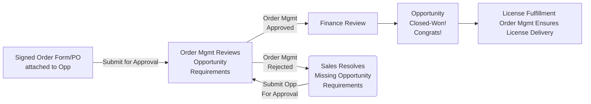

## On this page
{:.no_toc .hidden-md .hidden-lg}

- TOC
{:toc .hidden-md .hidden-lg}

{::options parse_block_html="true" /}

## Welcome!

The Order Management page outlines the goals, tasks, and standard operating guidelines for each regional team. Here you will find more information about our KPIs, SLAs, and best practices for working with our team. 

For an in depth overview of Opportunity Approval Booking Requirements, please review the [Sales Order Processing page](https://about.gitlab.com/handbook/sales/field-operations/order-processing/).

### What We Do

The GitLab Order Managment team owns the Opportunity Approval and Booking Process, oversees Intial License Delivery, and handles order and subscription reconciliations. Thus team is the DR for all questions related to Opportunity Booking requirements, questions regarding our bookings policies, and processes related to fulfilling an order. 

The team owns the following processes & documentation sources:

- FY23 Booking Policy
- Opportunity Approval Booking Requirments
- Initial License Fulfillment & Delivery
- Subscription Management
- Opportunity Reconciliation 
- Sales Order Processing Handbook 

### Out of Scope

Order Management is focused on Opportunity Approvals, License Fulfillment and Subscription Mangement. The following tasks are outside the role and responsiblity of our team. Please reach out to Deal Desk for assistance with the following:

- Quote Creation
- RFPs / Vendor Forms 
- Discount / Payment Term Approval Guidance
- Quote Approval Guidance
- Opportunities below Stage-5 

Please review our [Job Family](https://about.gitlab.com/job-families/sales/order-management/) for more information regarding the scope of this team. 

### Opportunity Approval Process

Order Management reviews every Sales Assisted opportunity prior to booking. All opportunities must meet our standard opportunity booking requirements. An opportunity will be rejected if it is missing components necessary to booking. 

#### Opportunity Prioritization 

All opportunities in the approval queue are prioritized based on the following: 

1. Start Date 
2. Revenue Generation
3. Order of Submission 

The Order Management team will make every effort to ensure all opportunities submitted at Month End and Quarter End are reviewed and approved in the same month. Please do not tag for urgent review during End of Month or End of Quarter. 

#### Escalation Path for Opportunity Review

Approvals that are urgent, customer impacting, or critical to buisness may be prioritized upon request. If the opportunity has been submitted after Standard Support hours, you may escalated the opp for a different regional team to review in the #sales-support Slack channel. You may also tag regional Deal Desk Managers for review and assist in delegating the case. 

Opportunities raised for urgent review must be business critical. Opportunities that are routinely escalated out of indiviudal convienience instead of legitimate urgency will be addressed with Sales Management. 

#### Opportunity Approval Workflow

### Meet the Team 

The Order Management team is located around the world and will be available during standard business hours within most regions. We operate under a Regional Support Model, meaning, each region (EMEA/APAC/AMER) will recieve support from a dedicated regional team of Order Management Specialists. 

During holidays, or when team members are on PTO, individuals located in a different region may step in to support and ensure appropriate coverage. This is reserved for EoM / EoQ or times when we are understaffed. 

You can expect support based on the following business hours in your region. However, complex/non-standard opportunities that are submitted after 4:30PM local time may be reserved for the following business day. 

|     Region    | Standard Support Hours |
|:-------------:|------------------------|
| APAC          | 8:00AM to 5:00PM (IST)   |
| EMEA          | 8:00AM to 5:00PM (GMT)   |
| AMER / LATAM  | 7:00AM to 5:00PM (PT)    |

Our regional teams do not operate on a 24/7 support model. If your opportunity or case is submitted after 4:30PM local time, or outside of standard support hours, it will be reviewed the following business day. The only exceptions for this are EoM / EoQ / EoY. Support hours and availability will be shared in advance of high volume periods through #field-fyi. 

### Key Performance Indicators

#### Standard Approval SLA 

Opportunities will be reviewed for all booking requirements within 12 business hours of being Submitted for Approval (Stage 7 - Closing). Your opportunity will be Approved or Rejected by Order Management within 12 business hours of submission. Please note, ultimate closure of a deal depends is facilitated by the Billing team. 

If there are missing booking requirements, or further confirmation is required from the Sales team, the Order Management specialist will tag you directly in Chatter to resolve any outstanding issues.

Please review our Sales Order Processing page for Opportunity Booking Requirements. 

#### Regional Support Satisfaction 

All regions will receive a Quarterly Customer Satisfaction survey at the beginning of each new quarter. Our team aims for a 92% satisfaction rating for their supported region. This survey is a value tool to provide feedback on areas of improvement related to the Opportunity Approval Process. 

#### Opportunity Approval Accuracy and Efficiency 

Our team aims for an Approval Accuracy of 95% or greater. Meaning, of all opportunites that we submit to Billing for final review / approval, 5% or less will be rejected for missing booking requirements. 

Order Management Specialists will be responsible for taking action on feedback received in Quarterly CSAT surveys, as well as improving process related to common opportuntiy rejections, whether it be through documentation, training, or system improvements. The goal is to reduce time to approval, improve efficiency and maintain a high level of accuracy for all approvals. 

### Approval Escalation Path 

Occasionally, an opportunity will require escalation to fast track the approval process. You may escalate the need for approval by: 

1. Submitting the opportunity for Approval, and 
2. Chattering Sales-Support requesting prompt review of the opportunity. 
3. You must provide a legitimate reason for escalation. Please do not escalate an opportunity for approval if it is not urgent. 

Opportunity Approvals should not be escalated during EoM/EoQ/EoY. All efforts will be made to book opportunities that are submitted during these periods. 

### How to Contact Us 

Our team actively monitors @Sales-Support in chatter. Your case will be responded to within 6 hours of opening. This is subject to our standard support hours outlined above.
