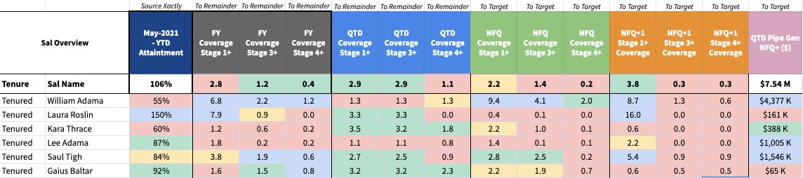

## On this page
{:.no_toc .hidden-md .hidden-lg}

- TOC
{:toc .hidden-md .hidden-lg}

## SAL Heatmap dashboard

### Goal

The SAL Heatmap provides a high level view of current achivement, coverage and pipe generation for each SAL within a region.

Its purpose is to allow leadership to drive a focused conversation regarding each SAL priorities, based on their specific strengths and weaknesses. The clear overview also allows SALs to self-assess against their peers, empowering them to share best practices where going strong, or ask for support where facing challenges.

**Example screenshot of the SAL Heatmap:**

### Access

Please reach out to [@nfiguera](https://gitlab.com/nfiguera) or another member of the SS&A team.

### Metrics

- Achievement (Monthly reconciled from Xactly)
- Open Pipe by Stage 1+, 3+, 4+
- Coverage by Stage 1+, 3+, 4+
- Pipeline Generation in Quarter (Net ARR & deal count)
    - NFQ+: Pipeline generated, expected to land in future quarters.

Most of these metrics are available for current quarter, next quarter and next quarter + 1.

### OKRs

Each RD is able to set up a set of OKRs for their region, specially for future quarters. For current quarters and FY, the OKR is set as the median of all the team members. The colors of the heatmap are based on those OKRs.

### Coverage calculation

Coverage is calculated per SAL as `Open Pipe Stage X+ / Remainder to Quota`.

**Remainder to Target** is calculated as  `Quota - Booked Net ARR` for current quarter

### Refresh rates

The dashboard is refreshed once a day between 8:00 and 9:00 AM PST time for Salesforce data. Achievement data is only refreshed after month's end. 

### Best practices

To the take the best of this tool, the following best practices are recommended:
- Identify SALs with low Pipeline Generation within the quarter
    - If SAL is low on pipeline, this is a sign that corrective action needs to be taken ASAP

