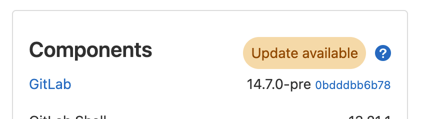

## On this page
{:.no_toc .hidden-md .hidden-lg}

- TOC
{:toc .hidden-md .hidden-lg}

[Blog post about version check](/blog/2015/05/07/version-check/)

## What is the functionality of the GitLab Version Check?

GitLab Version Check is a suite of UI elements focused on communicating to instance
admins the status of their current instance's version. The status is communicated
through various elements depending on how critical the version they are behind is.

## Gitlab Version Check UI Suite

### GitLab Version Badge

**Description**

This badge element is always visible and communicates the GitLab instance version in
relation to the upgrades available.

- Up to date: GitLab instance is fully up to date with the current version of GitLab.
- Update available: GitLab instance is outdated behind a non-security related version of GitLab.
- Update ASAP: GitLab instance is outdated behind a security related version of GitLab.

**UI Representation**

| Up to date | Update available | Update ASAP
| ------ | ------ | ------ |
|  |  |  |

**UI Location(s)**

- Admin Dashboard (Components Section)
- Help Page
- Help Dropdown (? icon in top navigation)

**When to appear**

- **Always**

### GitLab Critical Security Upgrade Banner Alert

**Description**

_note: this element is currently being reviewed and may be [removed in an upcoming milestone](https://gitlab.com/gitlab-org/gitlab/-/issues/387719)._

This UI element is currently behind a feature flag: `Feature.enable(:critical_security_alert)`

This Banner Alert element is only visible when a GitLab instance is behind a security
upgrade that could make the instance vulnerable. The banner is shown only to admins,
it's not dismissible, and appears on every page until the instance is upgraded.

**UI Representation**

**UI Location(s)**

- Everywhere

**When to appear**

- If behind a `danger` level upgrade, **always and non-dismissible**

### GitLab Critical Security Upgrade Modal

**Description**

This UI element is currently behind a feature flag: `Feature.enable(:critical_security_alert)`

This Modal element is only visible when a GitLab instance is behind a security
upgrade that could make the instance vulnerable. This modal appears and forces
a interaction before going away. Depending on how verbose the upgrade notes are,
the modal can appear with various levels of details. Additionally, when it appears,
the admin is faced with a choice. Regardless of the choice made, the modal will be
hidden and set to reappear in 3 days.

- Upgrade now: Admin is navigated to the upgrade documentation
- Remind me in 3 days: Modal is hidden

**UI Representation**

| No Stable Versions or Details | Stable Versions but no Details | Both Stable Versions and Details |
| ------ | ------ | ------ |
|  |  |  |

**UI Location(s)**

- Everywhere

**When to appear**

- If behind a `danger` level upgrade, **always and dismissible for 3 day periods**

## How does the GitLab Version Check work?

[Documentation WIP](https://gitlab.com/gitlab-org/gitlab/-/issues/387879)

## Which information does the browser request contain?

The request contains information about the browser, the
GitLab version and the HTTP referrer. The HTTP referrer is the URL from
which the request was sent. So it is the URL of the help page or the admin
area page of the admin's GitLab instance. E.g. if you visit the help page on
gitlab.com the HTTP referrer is https://gitlab.com/help. Furthermore the
browser has to send the IP address of the instance combined with the request to
receive a response. The IP address won't be saved.

## What is version.gitlab.com?

Version.gitlab.com collects all browser requests mentioned above and adds
them to a database. It saves the HTTP referrer URL, the current GitLab version,
the timestamp of the request and information about the browser. As mentioned
above it does not save IP addresses.

## Why does GitLab save this information?

This information provides better insights into where and how GitLab is
used and helps us to improve GitLab for everyone, for example by seeing which
versions are popular and require a backport of a security fix.

## Who has access to this database?

Only the GitLab team has access to version.gitlab.com.

## Which information can be derived from the HTTP referrer?

The HTTP referrer can contain the local or public hostname or IP address of a
GitLab instance. It depends on how the admin accessed the GitLab web interface.
Local hostnames and local IP addresses are only relevant and reachable within
the local network in which the instance is running. Therefore local hostnames
can be named anything, for example 'myownGitLab'. Public hostnames or
IP addresses can contain information about the owner of the host network.
For example if the HTTP referrer contains 'dev.gitlab.org' it is assumable that
this instance is owned by GitLab.

## Limitations

Because an HTTP referrer can be easily spoofed and because a local hostname can
be named anything, it is impossible to be completely sure if any derived
information is actually valid.

## How do I disable GitLab Version Check

GitLab Version Check can be disabled via the Metrics and Profiling tab of the GitLab Admin Settings.

You can find the checkbox labeled "Enable version check" at "/admin/application_settings/metrics_and_profiling" in the Usage Statistics section.