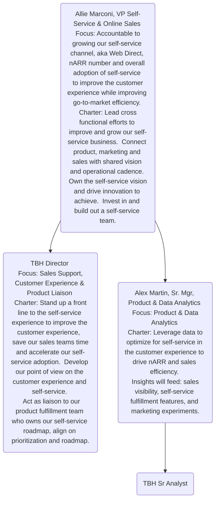

## On this page
{:.no_toc .hidden-md .hidden-lg}

- TOC
{:toc .hidden-md .hidden-lg}

<link rel="stylesheet" type="text/css" href="/stylesheets/biztech.css" />

## Welcome to the Self-Service Handbook

**The Self-Service Team is responsible for delivering a cohesive go-to-market (GTM) that enables customers and prospects to self-serve: from discovery and adoption, purchasing, expanding, and managing their GitLab subscription.** 
{: .alert .alert-success}

## Self-Service Vision

GitLab engages with customers on their terms, offering seamless self-service options.  We deliver a best in class self-service experience for discovering & adopting GitLab, purchasing, expanding and managing your GitLab subscription.

We are easy to do business with. Our customers get time back to do what matters most - use GitLab to build the best software possible. And our customer-facing teams get time back to focus on higher value customer interactions, allowing us to accelerate and scale our growth.  

We are a showcase of GitLab’s culture. Interacting with us is flexible, asynchronous enabled and transparent.

## Navigating the Self-Service Handbook

  <a href="#our-strategy" class="btn btn-purple" style="white-space: initial;min-width: 0;width: auto;margin:5px;display:grid;align-items:center;height:100%;">Our Strategy</a>
  <a href="#the-self-service-team" class="btn btn-purple" style="white-space: initial;min-width: 0;width: auto;margin:5px;display:grid;align-items:center;height:100%;">The Self-Service Team</a>
  <a href="#self-service-in-the-customer-journey" class="btn btn-purple" style="white-space: initial;min-width: 0;width: auto;margin:5px;display:grid;align-items:center;height:100%;">Customer Journey</a>
  <a href="#our-partners" class="btn btn-purple" style="white-space: initial;min-width: 0;width: auto;margin:5px;display:grid;align-items:center;height:100%;">Our Partners</a>
  <a href="#success-metrics" class="btn btn-purple" style="white-space: initial;min-width: 0;width: auto;margin:5px;display:grid;align-items:center;height:100%;">Success Metrics</a>
  <a href="#success-metrics" class="btn btn-purple" style="white-space: initial;min-width: 0;width: auto;margin:5px;display:grid;align-items:center;height:100%;">WIP Dashboards</a>
  <a href="#resources--communications" class="btn btn-purple" style="white-space: initial;min-width: 0;width: auto;margin:5px;display:grid;align-items:center;height:100%;">Resources</a>

## Our Strategy

__This section contains forward-looking content and may not accurately reflect current-state or planned feature sets or capabilities.__

1. Accelerate ARR
- **Align AEs to highest ARR uplift**: Adjust go-to-market and incentives to focus AEs on highest value interactions for the customer.  Enhance self-service options for simple, fast interactions and build customer awareness.
- **Discover new customer insights**: Buying cycles are changing, a large majority start before an AE engages.  Allow self discovery and monitor through product analytics to create (very) qualified leads.
- **Become a tool for direct sales**: GitLab operates in a self-service hybrid model.  Provide customer visibility to AEs to enhance their selling conversations.
- **Align our self-service GTM motion**: Work jointly across Sales, Product, Marketing, Customer Success & Channels to create definition of success, leverage best technology, build a joint roadmap and deliver best experience.
2. Deliver a best-in-class Self-Service experience
- **Understand our customers**: Use product analytics and customer conversations to understand personas & buying journeys by segment.  Define ideal seamless omnichannel experience for our customers.
- **“Always on” customer feedback**:  Collect and summarize customer feedback into a single view.  Quantify feedback to prioritize product & go-to-market changes. (e.g., Top 5 requested self-service feature based on customer survey)
- **Flexible self-service engagement models**: Introduce chat for on-demand support that customers can access in-context.  While also creating rich feedback for our product and go-to-market teams.
- **Product & Data Analytics**: Without human interaction, product analytics will be our window into customer interactions.  It is foundational to self-service.  It will influence the product roadmap, drive interactions and identify issues.
3. Improve go-to-market efficiency, accelerate growth
- **Self-Service go-to-market models**: Introduce a self-service segment.  Leverage an inbound ‘on-demand’ account team to help customers and feed our backlog.  Grow the self-service channel full stack.
- **Self-Service marketing campaigns**: Leverage self-service product analytics to drive high performing marketing campaigns based on specific customer insights. (e.g., abandoned cart campaigns, personalized marketing automation, featured products)
- **Increase Rep productivity**: Increase self-service adoption in territory.  Minimizing time spent on account management, operational tasks and simple transactions. Introduce new customer engagement models to connect with sales. (e.g., hand raise for sales conversation, schedule a time with a sales rep)

## The Self-Service Team

## Self-Service in the Customer Journey

This section is to give you a sense of how the Self-Service team interacts with the differents parts of the customer journey.

|  **Customer Journey** | **Self-Service Team Role** |
| :--------------- | :----------------- |
| Discovery, Trial, & Free | Partner with owners (Marketing, Growth, and Fulfillment) in cross-functional working group. Potential partnerships: chat offering, transactional emails, commerce experience.
| Paid, Upgrade, Growth, & Renewal | Provide continuous feedback to inform product roadmap and experience changes. Automate as much as possible through the self-service experience. Partner with sales to provide visibility and engagement opportunities with customers.  Create buying intent through self-service and in product experiences. Provide self-service on demand & in context support for customers.
| Support | Partner with owners (Customer Success) in cross-functional working group. Potential partnerships: chat offering, customer success planning |

## Our Partners

## Success Metrics

- **Accelerate nARR**: nARR vs. plan > 1
    - This is our north star metric
- **Efficiency**: growth efficiency >= 1.5 by FY’23
- **Customer Experience**: self-service utilization `coming soon`
    - What is self-service utilization? % of self-service functionality used by customers 

Illustrative example of self-service utilization. 
X = indicates the customer conducted the action via self-service.

|  **Customers** | **Trail** | **Purchase** | **Growth** | **Upgrade** | **Renew** | **Outreach** | **Utilization** |
| :--------------- | :----------------- | :----------------- | :----------------- | :----------------- | :----------------- | :----------------- | :----------------- |
| **Customer A** | X | X |  |  | X |  | **50%**
| **Customer B** |  |  | X |  |  | X | **33%**
| **Customer C** | X |  |  | X | X | X | **66%**
| **Total** | **2** | **1** | **1** | **1** | **2** | **2** | **50%**

## `Coming Soon` Dashboards

## Resources & Communications
- **Slack Channel**: `self-service_and_friends`
- Create an issue in the [Self-Service project](https://gitlab.com/gitlab-com/sales-team/self-service) and use the `Self-Service` label

