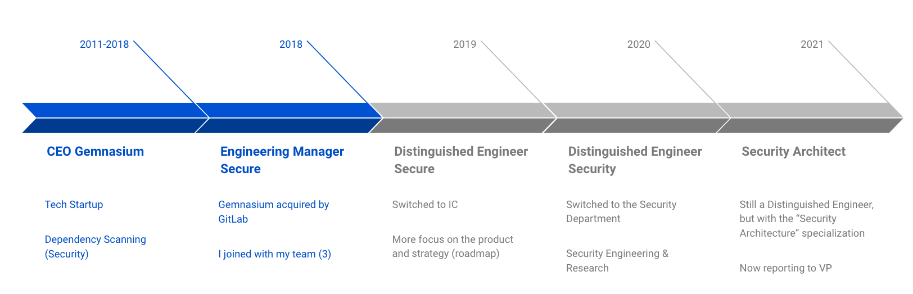

## On this page
{:.no_toc}

- TOC
{:toc}

## Philippe Lafoucrière's README

### About me

Hi! I'm currently a [Security
Architect](/job-families/security/security-engineer/#security-architect) at
GitLab, which is a specialty on top of my [Security Distinguished
Engineer](/job-families/security/security-engineer/#distinguished-security-engineer)
role.

I have an Engineering background, having graduated from the [Université de Technologie de
Compiègne](https://www.utc.fr/en/) (France) with a Master's Degree in Computer Science.
Nevertheless, my career almost involved an Entrepreneur aspect. This makes me a "Jack of all
trades", and a "Master of none".

I have worked in the various industries, ranging from telecoms to online betting.

A few facts about me:

- I live in Quebec City, Quebec, Canada.
- I have dual citizenships: French & Canadian
- I have 2 mostly wonderful kids and a fantastic wife
- I have lived, studied and worked in France and other European countries, but also South East Asia, and now Canada
- I have spent quite some time in Pacific Islands near Australia 
- I love all things outdoors

### Background story at GitLab

I joined GitLab after the [acquisition of
Gemnasium](/press/releases/2018-01-30-gemnasium-acquisition.html) in 2018, when I become the first
manager of the [Secure Stage](/direction/secure/). After designing and developing security products,
I decided to switch to the other side of the mirror, and joined the [Security
Department](/handbook/security/) in 2020. 

### Typical workday

I wake up at 6 am, train until 8 am, breakfast until 8:30 am. I usually don’t work before this time,
but always check my emails and slack messages when I wake up (old CEO habit).

I take a 1-hour break for lunch, usually between 11:30-12:30.

I end the day around 6pm to cook dinner for the family. 

I get back to the computer between 7 and 8pm. After that, Slack and emails are still in “monitor
mode”, but it’s usually family time.

### Communicating with me

I'm pretty informal, message me on Slack, send an email, or tag me on a thread, and I'll respond as
soon as I can.  

I tend to ignore LinkedIn invitations to connect if I haven't talked at least one to the person,
even if that person is a GitLab team member.

My English is not perfect. The best way for me to improve is to correct me when I’m using the wrong
word or expression.

Also, you can tell I’m tired when my English is worse than usual! 

### Roadmap and Vision

My roadmap and vision can be found [here](https://gitlab.com/groups/gitlab-com/gl-security/-/epics/174).
