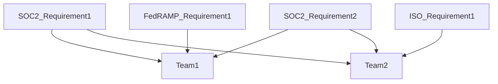
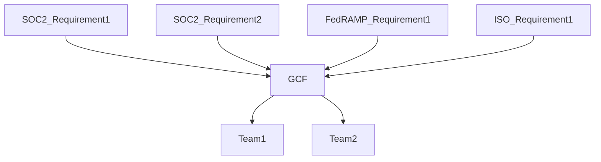

## On this page
{:.no_toc .hidden-md .hidden-lg}

- TOC
{:toc .hidden-md .hidden-lg}

# GitLab's Security Controls

Security controls are a way to state our company's position on a variety of security topics. It's not enough to simply say "We encrypt data" since our customers and teams will naturally want to know "what data do we encrypt?" and "how do we encrypt that data?". When all of our established security controls are operating effectively this creates a security program greater than the sum of its parts. It demonstrates to our stakeholders that GitLab has a mature and comprehensive security program that will provide assurance that data within GitLab is reasonably protected.

## GitLab Control Framework (GCF)

We have tried to take a comprehensive approach to our immediate and future security compliance needs. Older and larger companies tend to treat each security compliance requirement individually which results in independent security compliance teams going out to internal teams with multiple overlapping requests. For example, at such a company you might have one database engineer that is asked to provide evidence of how a particular database is encrypted based on SOC2 requirements, then again for ISO requirements, then again for FedRAMP requirements. This approach can be visualized as follows:

Given our [efficiency value](/handbook/values/#efficiency) here at GitLab we wanted to create a set of security controls that would address multiple underlying requirements with a single security control which would allow us to make fewer requests of our internal teams and efficiently collect all evidence we would need for a variety of audits at once. This approach can be visualized as follows:

As our security compliance goals and requirements have evolved so have our requirements and constraints related to our security control framework. Our GCF is currently based on NIST SP 800-53.
## Security Control Lifecycle

The lifecycle of our security controls can be found at [this handbook page](/handbook/security/security-assurance/security-compliance/security-control-lifecycle.html). As part of the security control lifecycle, all GCF security controls are reviewed and tested at a minimum on an annual basis or as required by regulation.

GCF security controls are assessed at the entity level or the system level depending upon the nature of the control. 

GCF security controls assessed at system level are based upon the system's [critical system tiering](https://about.gitlab.com/handbook/security/security-assurance/security-risk/storm-program/critical-systems.html). Dependent upon the system's tier, a subset of GCF controls are evaluated based upon overall risk and impact to the organization. This is broken out as follows:
 

|Tier |	GCF Control Scope |	ZenGRC Link|
|--|--|--|
|Tier 1 Mission Critical|All "In-Scope" Controls| [Link](https://gitlab.zengrc.com/sor/listing/controls?p=eyJzb3IiOnsicGFnZVNpemUiOjIwMCwiY29sdW1ucyI6WyJ0aXRsZSIsInNsdWciLCJvd25lcnNHcm91cCIsImtleUNvbnRyb2wiLCJjYV9fMTE2IiwiY3JlYXRlZEF0IiwiZGVzY3JpcHRpb24iLCJzdGF0dXMiLCJjYV9fMTEyIiwibWFwcGluZ3MucHJvZ3JhbXMiLCJhc3Nlc3NtZW50cyJdLCJjb2x1bW5TaXplcyI6W3sibmFtZSI6InRlc3RQbGFuIiwic2l6ZSI6Mzc0fSx7Im5hbWUiOiJtYXBwaW5ncy5wcm9ncmFtcyIsInNpemUiOjM4MX1dLCJmaWx0ZXJzIjp7IkFORCI6W3siZiI6InN0YXR1cyIsIm8iOiI9IiwidiI6IkZpbmFsIn0seyJmIjoiY2FfXzExNiIsIm8iOiI9IiwidiI6IlN5c3RlbSJ9LHsiZiI6ImtleUNvbnRyb2wiLCJvIjoiPSIsInYiOiJLZXkifV19fX0%3D&page=1)|	
|Tier 2 Business Critical|System-Level Controls| [Link](https://gitlab.zengrc.com/sor/info/Program/15/mapped/Control?listing.relevant_to=Program%3A15&listing.context=MAPPED&listing.fields=slug%2Ctitle%2Cdescription&listing.page_size=100)|	
|Tier 3 Business Operational|System-Level Controls| [Link](https://gitlab.zengrc.com/sor/info/Program/15/mapped/Control?listing.relevant_to=Program%3A15&listing.context=MAPPED&listing.fields=slug%2Ctitle%2Cdescription&listing.page_size=100)|	
|Tier 4 Administrative|	Not Evaluated| N/A |	

## Control Ownership

Control Owner - Ensures that the design of the control and the control activities operate effectively and is responsible for remediation of any control activities that are required to bring that control into a state of audit-readiness.

Process Owner - Supports the operation of the control and carries out the process designed by the control owner. The process owner is most likely to be interviewed by an auditor to determine whether or not the process is operating as intended.

## Security Control Changes

The GitLab Security Compliance team is responsible for ensuring the consistency of the documentation of the security controls listed below. While normally we welcome any GitLab team member to make edits to handbook pages, please be aware that even small changes to the wording of any of these controls impacts how they satisfy the requirements for the security frameworks they map to. Because of this, we ask any changes that need to be made to this page and the underlying guidance pages to start with a message in the [#sec-assurance](https://slack.com/app_redirect?channel=sec-assurance) slack channel. The compliance team will then engage with you and make any appropriate changes to these handbook pages.

## GitLab IT General Controls (ITGCs) 

ITGCs are a subset of the GCF controls. Please refer to [GitLab SOX ITGC Compliance](https://internal-handbook.gitlab.io/handbook/finance/sox-internal-controls/) (internal only) for details. 

# List of NIST 800-53 controls by family (Used by Commercial and Dedicated teams beginning FY24 Q1):
_Detailed sub-controls are included in the various control family pages_

<a href="https://about.gitlab.com/handbook/security/security-assurance/security-compliance/" target="_blank">Access Control (AC) </a>
 This control family contains controls that cover access to systems, networks, and devices. Controls provide guidance on the implementation of access policies, account management, and topics like user privileges; aiming to lower the risk of unapproved access to a range of systems, devices, or networks. 
 
| Control | Title | Description |
|---------|-------------|---------------|
| AC-1 | Policy and Procedures | Develop, document, and disseminate an access control policy and procedures that address the controls in the Access Control (AC) family implemented within GitLab Inc. and its associcated in-scope systems. |
| AC-2 | Account Management | Develop and document processes for defining, authorizing, monitoring, and modifying user access to GitLab's systems. |
| AC-3 | Access Enforcement | Enforce approved authorizations for logical access to information and system resources in accordance with applicable access control policies. |
| AC-4 | Information Flow Enforcement | Enforce approved authorizations for controlling the flow of information within and between GitLab's systems. |
| AC-5 | Separation of Duties | Identify and document defined roles and associated system access authorizations to support separation of duties. |
| AC-6 | Least Privilege | Employ the principle of least privilege, allowing only authorized accesses for users (or processes acting on behalf of users) that are necessary to accomplish assigned tasks. |
| AC-7 | Unsuccessful Logon Attempts | Enforce a limit of consecutive invalid logon attempts by a user and respond when the maximum number of unsuccessful attempts is exceeded. |
| AC-17 | Remote Access | Establish requirements and authorization controls before allowing remote access connections to GitLab's systems. |
| AC-18 | Wireless Access | Establish requirements and authorization controls before allowing wireless network  connections to GitLab's systems. |
| AC-19 | Access Control for Mobile Devices | Establish requirements and authorization controls before allowing mobile device connections to GitLab's systems. |
| AC-21 | Information Sharing | Develop, document, and disseminate information classification and sharing guidance for users. |
| AC-22 | Publicly Accessible Content | Implement a process to remove nonpublic information and to review and approve content prior to opening such content to the public. |
 

<a href="https://about.gitlab.com/handbook/security/security-assurance/security-compliance/" target="_blank">Awareness & Training (AT) </a>
 This control family helps to ensure users of information systems are adequately trained to identify threats. A particular focus is improving awareness of different operational risks and threats to privacy or system security. Requirements around the creation of training policy, records, and feedback helps to fine-tune the organization’s approach to cybersecurity training.

| Control | Title | Description |
|---------|-------------|---------------|
| AT-1 | Policy and Procedures | Develop, document, and disseminate a training policy and procedures that address the controls in the Awareness and Training (AT) family implemented within GitLab Inc. |
| AT-2 | Literacy Training and Awareness | Provide security and privacy literacy training to team members and incorporate lessons learned from internal or external security incidents or breaches. |
| AT-3 | Role-based Training | Provide role-based security and privacy training to appropriate team members and incorporate lessons learned from internal or external security incidents or breaches where appropriate. |
| AT-4 | Training Records | Document and monitor security and privacy training activities and retain associated training records. |

<a href="https://about.gitlab.com/handbook/security/security-assurance/security-compliance/" target="_blank">Audit and Accountability (AU) </a>
 This control family provides guidance on procedures for event logging and auditing. Controls cover the baseline content of audit records, the capacity of log storage, and the process for monitoring and reviewing logs. Log audits are an important part of identifying the cause of breaches or system issues, and are a tool for accountability.
 
| Control | Title | Description |
|---------|-------------|---------------|
| AU-1 | Policy and Procedures | Establishment of audit and accountability policy and procedures that address the controls in the AU family implemented within systems and organizations. |
| AU-2 | Event Logging | Identify events for logging that are relevant to the security of systems and the privacy of individuals and implement a program to support GitLab's event logging requirements. | 
| AU-3 | Content of Audit Records | Audit record content that may be necessary to support the auditing function of event outcomes including indicators of event success or failure and event-specific results, such as system security and privacy posture after the even occurred. |
| AU-6 | Audit Record Review, Analysis, and Reporting | Review and analysis system audit records for indications of organization-defined inappropriate or unusual activity and the potential impact. |
| AU-11 | Audit Record Retention | Retaining audit records for organization-defined time period consistent with records retention policy to provide support for after-the-fact investigations of incidents and to meet regulatory and organizational information retention requirements. |

<a href="https://about.gitlab.com/handbook/security/security-assurance/security-compliance/" target="_blank">Assessment, Authorization, and Monitoring (CA) </a>
 This control family focuses on the continuous monitoring and improvement of security and privacy controls. It covers the creation of an assessment plan and the delegation of the team to carry out control assessment. Controls also cover the creation of a plan of action and milestones (POAM), an integral document for identifying and fixing vulnerabilities or weaknesses.
 
| Control | Title | Description |
|---------|-------------|---------------|
| CA-1 | Policy and Procedures | Establishment of assessment, authorization, and monitoring policy and procedures that address the controls in the CA family implemented within systems and organizations. | 
| CA-2 | Control Assessments | Selection of assessors with the required skills and technical expertise to develop effective assessment plans to determine the accuracy and completeness of whether the controls are implemented correctly, operating as intended, and producing the desired outcome with respect to meeting requirements. | 
| CA-3 | Information Exchange | System information exchange requirements between two or more systems. | 
| CA-5 | Plan of Action and Milestones | Plano f action and milestones to track planned remedial actions. |  
| CA-7 | Continuous Monitoring | Continuous monitoring facilitating ongoing awareness of the system security and privacy posture to support organizational risk management decisions. | 
| CA-8 | Penetration Testing | Specialized testing to identify vulnerabilities that could be exploited by adversaries. | 
| CA-9 | Internal System Connections | Connections between organizational systems and separate constituent system components. | 

<a href="https://about.gitlab.com/handbook/security/security-assurance/security-compliance/" target="_blank">Configuration Management (CM) </a>
 This control family focuses on the configuration of software and devices on the network. Controls cover the creation of a configuration policy, the creation of a baseline configuration of the system, and the management of unauthorized configuration or devices. Configuration controls lower the risk of unauthorized hardware or software being installed on the system, or vulnerabilities caused by changes to settings.
 
| Control | Title | Description |
|---------|-------------|---------------|
| CM-1 | Policy and Procedures | Establishment of configuration management policy and procedures that address the controls in the CM family implemented within systems and organizations. | 
| CM-2 | Baseline Configuration | Documented, formally reviewed, and agreed-upon specifications for systems or configuration items within those systems. | 
| CM-3 | Configuration Change Control | Systematic proposal, justification, implementation, testing, review, and disposition of system changes, including system upgrades and modifications. | 
| CM-4 | Impact Analyses | Analysis of changes to determine potential security and privacy impacts prior to change implementation. | 
| CM-5 | Access Restrictions for Change | Physical and logical access restrictions associated with changes to the system only by qualified and authorized individuals for purposes of initiating changes. | 
| CM-6 | Configuration Settings | Parameters that can be changed in the hardware, software, or firmware components that affect the security and privacy posture or functionality of the system. | 
| CM-7 | Least Functionality | To identify and prevent the use of prohibited functions, protocols, ports, and services. | 
| CM-8 | System Component Inventory | Inventory for effective accountability of system components. | 
| CM-9 | Configuration Management Plan | Established to satisfy the requirements in configuration management policies while being tailored to individual systems defining processes and procedures for how configuration management is used to support system development life cycle activities. | 
| CM-10 | Software Usage Restrictions | Software license tracking in accordance with contract agreements and copyright laws. | 
| CM-11 | User-installed Software | Established policies governing the permitted and prohibited actions regarding software installation by users. | 

<a href="https://about.gitlab.com/handbook/security/security-assurance/security-compliance/" target="_blank">Contingency Planning (CP) </a>
 This control family prepares organizations for system failures and breaches. Controls cover the planning for alternative processing or storage sites and the creation of system backups to help mitigate system downtime. Other controls focus on contingency planning, including training and plan testing. This family of controls is important for mitigating the damage from a system outage or network breach, establishing clear plans to restore normal operation.
 
| Control | Title | Description |
|---------|-------------|---------------|
| CP-1 | Policy and Procedures | Establishment of contingency planning policy and procedures that address the controls in the CP family implemented within systems and organizations. | 
| CP-2 | Contingency Plan | Achieving continuity of operations for organizational mission and business functions to address system restoration and implementation of alternative mission or business processes when systems are compromised or breached. | 
| CP-3 | Contingency Training | Assignment of roles and responsibilities of organizational personnel to ensure that the appropriate content and level of detail is included in such training. | 
| CP-4 | Contingency Plan Testing | To determine the effectiveness of the plans and identify potential weaknesses. | 
| CP-6 | Alternate Storage Site | The maintainence of duplicate copies of information and data and processing capability if the primary storage site is not available. | 
| CP-7 | Alternate Processing Site | Geographically distinct processing sites providing processing capability if the primary processing site is not available. | 
| CP-9 | System Backup | Mechanisms employeed to protect the integrity of system-level and user-level information. | 
| CP-10 | System Recovery and Reconstitution | The execution of contingency plan activities for recovery and reconstitution of the system to a known state within an organziation-defined time period consist with recovery time and recovery point objectives after a disruption, compromise, or failure. | 
| CP-11 | Alternate Communications Protocols | Establishing alternate communication protocols resilience in organizational systems. | 

<a href="https://about.gitlab.com/handbook/security/security-assurance/security-compliance/" target="_blank">Identification and Authentication (IA) </a>
 This control family controls the reliable identification of users and devices. Different controls focus on different elements of safe user or device authentication. Controls strengthen user management policies, lowering the risk of unauthorized access to the system.
 
| Control | Title | Description |
|---------|-------------|---------------|
| IA-1 | Policy and Procedures | Establishment of identification and authentication policy and procedures that address the controls in the IA family implemented within systems and organizations. | 
| IA-2 | Identification and Authentication (organizational Users) | To uniquely identify and authenticate organizational users and associate that unique identification with processes acting on behalf of those users. | 
| IA-3 | Device Identification and Authentication | To uniquely identify and authenticate organization-defined devices and/or types of devices before establishing a local, remote and/or network connection. | 
| IA-4 | Identifier Management | Receiving authorization from organization-defined personnel or roles to assign an identifier preventing reuse of identifiers for an organization-defined time period. | 
| IA-5 | Authenticator Management | To manage system authenticators. |  

<a href="https://about.gitlab.com/handbook/security/security-assurance/security-compliance/" target="_blank">Incident Response (IR) </a>
 This control family controls all aspects of responding to a serious incident. This includes training and planning for potential incidents, as well as plans for actively monitoring and responding to incidents as they occur. Enhanced controls cover specific types of incidents that distinct organizations might face. Incidents may include data breaches, breakdowns in the supply chain, public relations damage, or malicious code in the system.
 
| Control | Title | Description |
|---------|-------------|---------------|
| IR-1 | Policy and Procedures | Establishment of incident response policy and procedures that address the controls in the IR family implemented within systems and organizations. | 
| IR-2 | Incident Response Training | Training associated with the assigned roles and responsibilities of organizational personnel to ensure that the appropriate content and level of detail are included in such training. | 
| IR-3 | Incident Response Testing | The testing of incident response capabilities to determine their effectiveness and identify potential weaknesses or deficiencies. | 
| IR-4 | Incident Handling | To implement incident handling capability for incidents that is consistent with the incident response plan and includes preparation, detection and analysis, containment, eradication, and recovery. | 
| IR-5 | Incident Monitoring | To track and document incidents. | 
| IR-6 | Incident Reporting | The requirement for personnel to report suspected incidents. | 
| IR-8 | Incident Response Plan | To develop and implement a coordinated approach for incident response capability. | 
 

<a href="https://about.gitlab.com/handbook/security/security-assurance/security-compliance/" target="_blank">Maintenance (MA) </a>
 This control family deals with all elements of system maintenance, including software updates, logging, and inspection tools. It covers the need for timely maintenance to lower the risk of operational outages, and outlines policy and the management of maintenance personnel.
 
| Control | Title | Description |
|---------|-------------|---------------|
| MA-1 | Policy and Procedures | Establishment of maintenance policy and procedures that address the controls in the MA family implemented within systems and organizations. | 
| MA-2 | Controlled Maintenance | To schedule, document, and review records of maintenance, repair, and replacement on system components in accordance with manufacturer or vendor specifications and/or organizational requirements. |
| MA-4 | Nonlocal Maintenance | To approve and monitor nonlocal maintenance and diagnostic activities. |
| MA-6 | Timely Maintenance | To obtain maintenance support and/or spare parts for organization-defined system components within an organization-defined time period of failure. |
 

<a href="https://about.gitlab.com/handbook/security/security-assurance/security-compliance/" target="_blank">Media Protection (MP) </a>
 This control family covers the use, storage and safe destruction of media and files helping to lower the risk of information breaches and leaks.
 
| Control | Title | Description |
|---------|-------------|---------------|
| MP-1 | Policy and Procedures | Establishment of media protection policy and procedures that address the controls in the MP family implemented within systems and organizations. | 
| MP-2 | Media Access | Restrict access to organization-defined types of digital and/or non-digital media to an organization-defined personnel or roles. | 
| MP-3 | Media Marking | To mark system media indicating the distribution limitations, handling caveats, and applicable security markings (if any) of the information; and exempt organization-defined types of system media from marking if the media remain within organization-defined controlled areas. | 
| MP-4 | Media Storage | To physically control and securely store organization-defined types of digital and/or non-digital media within organization-defined controlled areas; and protect system media types until the media are destroyed or sanitized using approved equipment, techniques, and procedures. | 
| MP-5 | Media Transport | To protect and control organization-defined types of system media during transport outside of controlled areas using organization-defined controls. | 
| MP-6 | Media Sanitization | To sanitize all digital and non-digital system media subject to disposal or reuse, whether or not the media is considered removable. | 
| MP-7 | Media Use | To restrict or prohibit the use of organization-defined types of system media on organization-defined systems or system components and prohibit the use of portable storage devices in organizational systems when such devices have no identifiable owner. | 

<a href="https://about.gitlab.com/handbook/security/security-assurance/security-compliance/" target="_blank">Physical and Environmental Protection (PE) </a>
 This control family covers physical access to devices and facilities, and the mitigation of threats to facilities. Controls cover policies for physical access to system controls, including monitoring access and visitors, as well as the monitoring of devices and assets. Other controls cover responses to physical threats, such as emergency lighting or power and the relocation to alternative facilities.
 
| Control | Title | Description |
|---------|-------------|---------------|
| PE-1 | Policy and Procedures | Establishment of physical and environmental protection policy and procedures that address the controls in the PE family implemented within systems and organizations. | 
| PE-2 | Physical Access Authorizations | Authorizing physical access to employees and visitors. | 
| PE-3 | Physical Access Control | Enforcing physical access authorizations at organization-defined entry and exit points to the facility where the system resides by for employees and visitors. | 
| PE-4 | Access Control for Transmission | Security control applied to system distribution and transmission lines to prevent accidental damage, disruption, and physical tampering. |
| PE-5 | Access Control for Output Devices | Controlling physical access to output devices allowing access to authorized individuals only. | 
| PE-9 | Power Equipment and Cabling | To protect power equipment and power cabling for the system from damage and destruction. | 
| PE-10 | Emergency Shutoff | The capability of shutting off power to organization-defined system or individual system components in emergency situations. |
| PE-11 | Emergency Power | To provide an uninterruptible power supply in the event of a primary power source loss. | 
| PE-12 | Emergency Lighting | To employ and maintain automatic emergency lighting for the system that activates in the event of a power outage or disruption and that covers emergency exits and evacuation routes within the facility. | 
| PE-13 | Fire Protection | To employ and maintain fire detection and suppression systems that are supported by an independent energy source. | 
| PE-14 | Environmental Controls | To maintain and monitor environmental control levels within the facility where the system resides. | 
| PE-15 | Water Damage Protection | To protect the system from damage resulting from water leakage by providing master shutoff or isolation valves that are accessible, working properly, and known to key personnel. | 
| PE-16 | Delivery and Removal | To enforce authorizations for entry and exit of system components that may require restricting access to delivery areas and isolating the areas from the system and media libraries. | 
| PE-18 | Location of System Components | To position system components within the facility to minimize potential damage and to minimize the opportunity for unauthorized access. | 
| PE-20 | Asset Monitoring and Tracking | To track and monitor the location and movement of organization-defined assets. | 
| PE-22 | Component Marking | To mark organization-defined system hardware components indicating the impact level or classification level of the information permitted to be processed, stored, or transmitted by the hardware component. | 
| PE-23 | Facility Location | To plan the location or site of the facility where the system resides considering physical and environmental hazards. | 
 

<a href="https://about.gitlab.com/handbook/security/security-assurance/security-compliance/" target="_blank">Planning (PL) </a>
 This control family covers privacy and system security plans (SSPs), including system architecture, management processes, and the setting of baseline system settings.
 
| Control | Title | Description |
|---------|-------------|---------------|
| PL-1 | Policy and Procedures | Establishment of planning policy and procedures that address the controls in the PL family implemented within systems and organizations. | 
| PL-2 | System Security and Privacy Plans | Scoped to the system and system components within the defined authorization boundary and contain an overview of the security and privacy requirements for the system and the controls selected to satisfy the requirements. | 
| PL-4 | Rules of Behavior | To establish and provide to individuals requiring access to the system, the rules that describe their responsibilities and expected behavior for information and system usage, security, and privacy. | 
| PL-7 | Concept of Operations | Describes how the organization intends to operate the system from the perspective of information security and privacy. | 
| PL-8 | Security and Privacy Architectures | To be consistent with the organization-wide security and privacy architectures, which are integral to and developed as part of the enterprise architecture. | 
| PL-10 | Baseline Selection | Predefined sets of controls specifically assembled to address the protection needs of a group, organization, or community of interest. | 
 

<a href="https://about.gitlab.com/handbook/security/security-assurance/security-compliance/" target="_blank">Program Management (PM) </a>
 This control family covers all elements of the management of an information system, including a variety of processes, programs, and plans. This includes an information security program plan, risk management strategy, and critical infrastructure plan.
 
| Control | Title | Description |
|---------|-------------|---------------|
| PM-1 | Information Security Program Plan | Establishment of a formal document that provides an overview of the security requirements for an organization-wide information security program and describes the program management controls and common controls in place or planned for meeting those requirements. | 
| PM-2 | Information Security Program Leadership Role | To appoint a senior agency information security officer with the mission and resources to coordinate, develop, implement, and maintain an organization-wide information security program. | 
| PM-3 | Information Security and Privacy Resources | To include the resources needed to implement the information security and privacy programs in capital planning and investment requests and document all exceptions to this requirement. | 
| PM-4 | Plan of Action and Milestones Process | Developed with an organization-wide perspective, prioritizing risk response actions and ensuring consistency with the goals and objectives of the organizations. | 
| PM-5 | System Inventory | To develop and update organization-defined frequency an inventory of organizational systems. | 
| PM-6 | Measures of Performance | To develop, monitor, and report on the results of information security and privacy measures of performance. | 
| PM-8 | Critical Infrastructure Plan | To address information security and privacy issues in the development, documentation, and updating of a critical infrastructure and key resources protection plan. | 
| PM-9 | Risk Management Strategy | To establish an expression of the security and privacy risk tolerance for the organization, security and privacy risk mitigation strategies, acceptable risk assessment methodologies, a process for evaluating security and privacy risk across the organization with respect to the organization’s risk tolerance, and approaches for monitoring risk over time. | 
| PM-10 | Authorization Process | To manage the security and privacy state of organizational systems and the environments in which those systems operate through authorization processes. | 
| PM-11 | Mission and Business Process Definition | To define organizational mission and business processes with consideration for information security and privacy and the resulting risk to organizational operations, organizational assets, individuals, other organizations, and the Nation. | 
| PM-13 | Security and Privacy Workforce | Establishment of a security and privacy workforce development and improvement program. | 
| PM-14 | Testing, Training, and Monitoring | A process for organization-wide security and privacy testing, training, and monitoring helps ensure that organizations provide oversight for testing, training, and monitoring activities and that those activities are coordinated. | 
| PM-15 | Security and Privacy Groups and Associations | To establish ongoing contact with security and privacy groups and associations in an environment of rapidly changing technologies and threats. | 
| PM-18 | Privacy Program Plan | To develop and disseminate a formal document that provides an overview of an organization’s privacy program. | 
| PM-20 | Dissemination of Privacy Program Information | To maintain a central resource webpage on the organization’s principal public website that serves as a central source of information about the organization’s privacy program. | 
| PM-21 | Accounting of Disclosures | To develop and maintain an accurate accounting of disclosures of personally identifiable information. | 
| PM-22 | Personally Identifiable Information Quality Management | Steps that organizations take to confirm the accuracy and relevance of personally identifiable information throughout the information life cycle. | 
| PM-25 | Minimization of Personally Identifiable Information Used in Testing, Training, and Research | Develop, document and implement policies and procedures to address the use of personally identifiable information for internal testing, training, and research. | 
| PM-26 | Complaint Management | To implement a process for receiving and responding to complaints, concerns, or questions from individuals about the organizational security and privacy practices. | 
| PM-28 | Risk Framing | To identify the assumptions, constraints, risk tolerance, priorities, and trade-offs when conducted at the organization level and in consultation with stakeholders throughout the organization including mission, business, and system owners. | 
| PM-29 | Risk Management Program Leadership Roles | Senior accountable official for risk management leads the risk executive (function) in organization-wide risk management activities. | 
| PM-30 | Supply Chain Risk Management Strategy | To develop an organization-wide strategy for managing supply chain risks associated with the development, acquisition, maintenance, and disposal of systems, system components, and system services. | 
| PM-31 | Continuous Monitoring Strategy | To facilitate ongoing awareness of the security and privacy posture across the organization to support organizational risk management decisions. | 
 

<a href="https://about.gitlab.com/handbook/security/security-assurance/security-compliance/" target="_blank">Personnel Security (PS) </a>
 This control family covers different policies and procedures around the management of personnel. This includes the process for terminating personnel contracts and the relative risk of each position to information security. 
 
| Control | Title | Description |
|---------|-------------|---------------|
| PS-1 | Policy and Procedures | Establishment of personnel security policy and procedures that address the controls in the PS family implemented within systems and organizations. | 
| PS-2 | Position Risk Designation | To establish the foundation of an effective and consistent suitability and personnel security program. | 
| PS-3 | Personnel Screening | To screen individuals prior to authorizing access to the systems. | 
| PS-4 | Personnel Termination | Termination of individual employment. | 
| PS-5 | Personnel Transfer | Permanent reassignments or transfers of individuals or of such extended duration as to make the actions warranted. | 
| PS-6 | Access Agreements | Signed access agreements with acknowledgement that individuals have read, understand, and agree to abide by the constraints associated with organizational systems to which access is authorized. | 
| PS-7 | External Personnel Security | To establish personnel security requirements, including security roles and responsibilities for external providers. | 
| PS-8 | Personnel Sanctions | To employ a formal sanctions process for individuals failing to comply with established information security and privacy policies and procedures. | 
| PS-9 | Position Descriptions | To establish specification of security and privacy roles in individual organizational position descriptions to facilitate clarity in understanding the security or privacy responsibilities associated with the roles and the role-based security and privacy training requirements for the roles. | 

<a href="https://about.gitlab.com/handbook/security/security-assurance/security-compliance/" target="_blank">Personally Identifiable Information (PII) Processing and Transparency (PT) </a>
 This control family helps to safeguard sensitive data, focusing on consent and privacy. Organizations can lower the risk of data breaches by properly managing personally identifiable information. 
 
| Control | Title | Description |
|---------|-------------|---------------|
| PT-1 | Policy and Procedures | Establishment of personally identifiable information processing and transparency policy and procedures that address the controls in the PT family implemented within systems and organizations. | 
| PT-3 | Personally Identifiable Information Processing Purposes | To identify and document the purpose for processing providing organizations with a basis for understanding why personally identifiable information may be processed. | 
| PT-9 | Physical Copies | To restrict, control, and track the creation and destruction of physical documents containing personally identifiable information. | 
 

<a href="https://about.gitlab.com/handbook/security/security-assurance/security-compliance/" target="_blank">Risk Assessment (RA) </a>
 This control family focuses on the assessment of system vulnerabilities and relevant risk. Controls cover the development of risk response procedures, and the use of vulnerability monitoring tools and processes.
 
| Control | Title | Description |
|---------|-------------|---------------|
| RA-1 | Policy and Procedures | Establishment of risk assessment policy and procedures that address the controls in the RA family implemented within systems and organizations. | 
| RA-2 | Security Categorization | To describe the potential adverse impacts or negative consequences to organizational operations, organizational assets, and individuals if organizational information and systems are compromised through a loss of confidentiality, integrity, or availability. | 
| RA-3 | Risk Assessment | To consider threats, vulnerabilities, likelihood, and impact to organizational operations and assets, individuals, other organizations, and the Nation. | 
| RA-5 | Vulnerability Monitoring and Scanning | To mnitor and scan for vulnerabilities in the system and hosted applications when new vulnerabilities potentially affecting the system are identified and reported. | 
| RA-7 | Risk Response | To respond to findings from security and privacy assessments, monitoring, and audits in accordance with organizational risk tolerance. | 
| RA-8 | Privacy Impact Assessments | An analysis of how personally identifiable information is handled to ensure that handling conforms to applicable privacy requirements, determine the privacy risks associated with an information system or activity, and evaluate ways to mitigate privacy risks. | 
| RA-9 | Criticality Analysis | To identify critical system components and functions by performing a criticality analysis. | 
 

<a href="https://about.gitlab.com/handbook/security/security-assurance/security-compliance/" target="_blank">System and Services Acquisition (SA) </a>
 This control family includes the allocation of resources and the creation of system development life cycles. Controls help organizations create a safe acquisition process for new systems and devices, safeguarding the integrity of the wider system and data. Controls also cover the development and testing process for new systems, including developer training and security processes.
 
| Control | Title | Description |
|---------|-------------|---------------|
| SA-1 | Policy and Procedures | Develop, document, and disseminate system and services acquisition policy and procedures that address the controls in the Service Acquisition (SA) control family implemented within GitLab Inc. and it's associated in-scope systems and services. | 
| SA-2 | Allocation of Resources | Allocate required resources to protect information security and privacy requirements related to system and services acquisition and sustainment as part of the business planning and capital planning and investment process. |
| SA-3 | System Development Life Cycle | Establish a system development life cycle to support the successful development, implementation, and operation of GitLab's systems. |
| SA-4 | Acquisition Process | Establish an acquisition process covering security and privacy requirements to support system, system component and system service acquisitions and implementations. |
| SA-8 | Security and Privacy Engineering Principles | Develop and implement systems security and privacy engineering principles in the specification, design, development, implementation, and modification of system and system components. |
| SA-9 | External System Services | Define required security and privacy requirements for external system services and monitor for ongoing control compliance. |
| SA-10 | Developer Configuration Management | Establish a change management program for developers of a system, system component, or system service. |
| SA-11 | Developer Testing and Evaluation | Establish a developer testing and evaluation plan for all post-design stages of the system development life cycle including a plan for flaw identification and remediation. |
| SA-15 | Development Process, Standards, and Tools | Establish a development process that supports GitLab's change management program and addresses GitLab's security and privacy requirements. |
| SA-17 | Developer Security and Privacy Architecture and Design | Acquire security and privacy design and architecture documentation for acquired systems and services and validate such documentation supports GitLab's security and privacy requirements. |
| SA-21 | Developer Screening | Establish and implement access controls and screening criteria for external developers performing work on acquired systems and services. |
 

<a href="https://about.gitlab.com/handbook/security/security-assurance/security-compliance/" target="_blank">System and Communications Protection (SC) </a>
 This control family covers the protection of system boundaries and the safe management of collaborative devices. Controls provide in-depth guidance on set-up and ongoing management of systems, including access, partitions, and usage restrictions.
 
| Control | Title | Description |
|---------|-------------|---------------|
| SC-1 | Policy and Procedures | Establishment of system and communications protection policy and procedures that address the controls in the SC family implemented within systems and organizations. | 
| SC-5 | Denial-of-service Protection | To protect against or limit the effects of denial-of-service events. | 
| SC-7 | Boundary Protection | To monitor and control communications at the external managed interfaces to the system and at key internal managed interfaces within the system. | 
| SC-8 | Transmission Confidentiality and Integrity | To protect the confidentiality and integrity of transmitted information. | 
| SC-10 | Network Disconnect | To terminate the network connection associated with a communications session at the end of the session or after the organization-defined time period of inactivity. | 
| SC-11 | Trusted Path | To provide an isolated trusted communications path for communications between the user and the trusted components of the system. | 
| SC-12 | Cryptographic Key Establishment and Management | To establish and manage cryptographic keys when cryptography is employed within the system. | 
| SC-13 | Cryptographic Protection | To determine the  cryptographic uses and implement the cryptography required for each specified cryptographic use. | 
| SC-17 | Public Key Infrastructure Certificates | To issue public key certificates with visibility external to organizational systems and certificates related to the internal operations of systems for which trust is assumed and not derived. | 
| SC-28 | Protection of Information at Rest | To protect the confidentiality and/or integrity of information at rest. | 
| SC-38 | Operations Security | To employ a systematic process of operations security controls to protect key organizational information throughout the system development life cycle. | 
| SC-39 | Process Isolation | To maintain a separate execution domain for each executing system process. | 
| SC-42 | Sensor Capability and Data | To prohibit the use of devices possessing environmental sensing capabilities in organization-defined facilities, areas, or systems. | 
| SC-45 | System Time Synchronization | To synchronize system clocks within and between systems and system components. | 

<a href="https://about.gitlab.com/handbook/security/security-assurance/security-compliance/" target="_blank">System and Information Integrity (SI) </a>
 This control family focuses on maintaining the integrity of the information system. Controls cover topics like protection from malicious code and spam, and procedures for ongoing system-wide monitoring.
 
| Control | Title | Description |
|---------|-------------|---------------|
| SI-1 | Policy and Procedures | Establishment of system and information integrity policy and procedures that address the controls in the SI family implemented within systems and organizations. | 
| SI-2 | Flaw Remediation | To identify, report, and correct system flaws. | 
| SI-3 | Malicious Code Protection | To implement malicious code protection mechanisms at system entry and exit points to detect and eradicate malicious code. | 
| SI-4 | System Monitoring | Internal and external monitoring of systems to detect attacks and indicators of potential attacks. | 
| SI-5 | Security Alerts, Advisories, and Directives | To receive system security alerts, advisories, and directives from organization-defined external organizations] on an ongoing basis. | 
| SI-8 | Spam Protection | To employ spam protection mechanisms at system entry and exit points to detect and act on unsolicited messages. |
| SI-12 | Information Management and Retention | To manage and retain information within the system and information output from the system to cover the full life cycle of information, in some cases extending beyond system disposal in accordance with applicable laws, executive orders, directives, regulations, policies, standards, guidelines and operational requirements. | 
| SI-13 | Predictable Failure Prevention | To determine mean time to failure (MTTF) to address potential failures of system components that provide security capabilities. | 
| SI-18 | Personally Identifiable Information Quality Operations | To confirm the accuracy and relevance of personally identifiable information throughout the information life cycle. | 
 

<a href="https://about.gitlab.com/handbook/security/security-assurance/security-compliance/" target="_blank">Supply Chain Risk Management (SR) </a>
 This control family covers policies and procedures to counter risks in the supply chain. This includes processes to assess and manage suppliers, and the inspection of supply chain systems and components.
 
| Control | Title | Description |
|---------|-------------|---------------|
| SR-1 | Policy and Procedures | Establishment of supply chain risk management policy and procedures that address the controls in the SR family implemented within systems and organizations. | 
| SR-2 | Supply Chain Risk Management Plan | To develop a plan for managing supply chain risks associated with the dependence on products, systems, and services from external providers, as well as the nature of the relationships with those providers that present an increasing level of risk to an organization. | 
| SR-3 | Supply Chain Controls and Processes | To establish a process or processes to identify and address weaknesses or deficiencies in the supply chain elements and processes of organization-defined system or system component in coordination with organization-defined supply chain personnel. | 
| SR-4 | Provenance | To document, monitor, and maintain valid provenance of the systems, system components, and associated data. | 
| SR-5 | Acquisition Strategies, Tools, and Methods | To employ acquisition strategies, contract tools, and procurement methods to protect against, identify, and mitigate supply chain risks of organization-defined acquisition strategies, contract tools, and procurement methods. | 
| SR-6 | Supplier Assessments and Reviews | To assess and review the supply chain-related risks associated with suppliers or contractors and the system, system component, or system service they provide. | 
| SR-7 | Supply Chain Operations Security | To employ Operations Security (OPSEC) controls to protect supply chain-related information for the system, system component, or system service. | 
| SR-8 | Notification Agreements | To establish agreements and procedures with entities involved in the supply chain for the system, system component, or system service. | 
| SR-9 | Tamper Resistance and Detection | To implement a tamper protection program for the system, system component, or system service. | 
| SR-12 | Component Disposal | To dispose of organization-defined data, documentation, tools, or system components. | 
 

## References

    <a href="https://about.gitlab.com/handbook/security/security-assurance/security-compliance/" class="btn btn-purple-inv" style="width:100%;height:100%;margin:1px;display:flex;justify-content:center;align-items:center;">Return to the Security Compliance Team Homepage</a>

 
