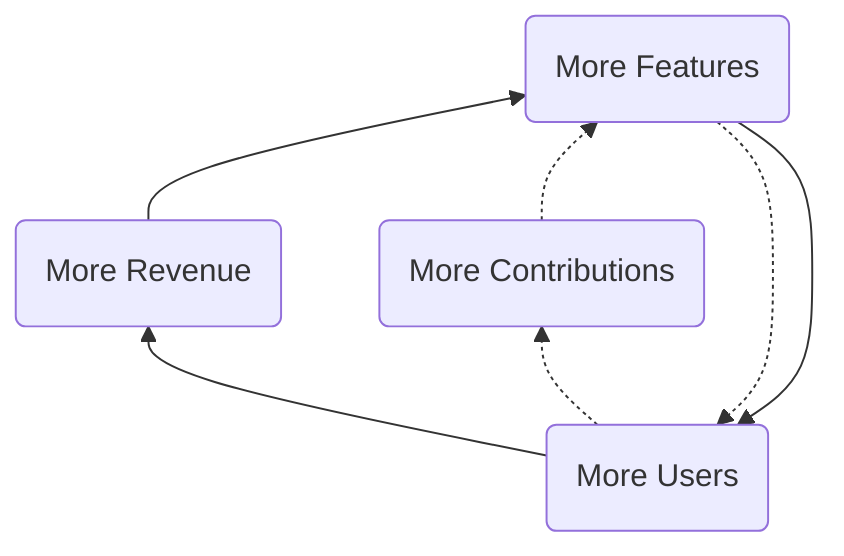
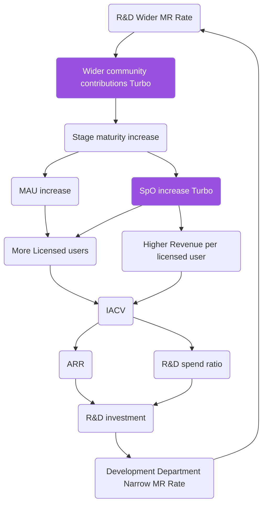

## On this page
{:.no_toc}

- TOC
{:toc}

## Three Year Strategy

Our strategy is looking 3 years out and [fits into our cadences](/company/cadence/#strategy). It also maps to and reflects GitLab's [mission](/company/mission), [vision](/company/vision) and [values](/handbook/values/). It is a living strategy, so we will revisit on a regular basis and [iterate](/handbook/values/#iteration) when there is reason to do so.

Along the road to realizing our mission of **everyone can contribute**, our
strategic goal is to become the leading complete DevOps
platform (or, what Gartner calls the DevOps Value Stream Delivery platform) delivered as a [single application](/handbook/product/single-application/).  We will help our customers build better software faster including developing cloud native applications, building mobile applications, and incorporating machine learning and artificial intelligence into their products and solutions. We believe that our [dual flywheels](#dual-flywheels) (single application + open-core model) will propel us to efficiently be the default choice  in the Enterprise market.

To achieve this, we will endeavor to:

### 1) Accelerate market maturity around the DevOps Platform
Ensure that when customers buy DevOps software the single application approach is the default.

1. **Deliver products** that are mature and enterprise ready across a broad range of categories ([50%](/company/strategy/2023/) of our [categories](/handbook/product/categories/) are at [lovable maturity](/direction/maturity/)).
1. **Drive product adoption** by focusing on usability for new customers and cross promoting stages, we hope to achieve 25m estimated [Combined Monthly Active Users](/handbook/product/performance-indicators/#estimated-combined-monthly-active-users)
1. **Be a thought leader:** We aspire to become the trusted voice about the future of the DevOps industry by being the number one IT vendor ranking in Google searches for DevOps and [DevOps Platform](/solutions/devops-platform/)
1. **Create a strong partner ecosystem:**  Do our best to develop alliances, systems integrator and channel partners to service specific markets to drive [partner initiatied opportunities](/handbook/sales/field-operations/channel-operations/#partner-initiated-opportunity---pio) to contribute 30% of incremental ARR and 20% of new logos.

More detail on our product strategy can be found on our [direction page](/direction/#vision).

### 2) Build on our Open Core strength

We will strive to increase the contributions of the wider community.

1. **Community contributions:** Build out a community engagement program to drive community contributions per month from our open source community to 50% of the wider community by EOFY23.
1. **Customer contributions:** We will seek to encourage existing customers to make GitLab work for them with a [MRARR](/handbook/engineering/quality/performance-indicators/#mrarr) above $1b MR per year.
1. **Enterprise leading usability:** We will aim to enable contributions that improve the user experience of our application through purpose driven user research and product development, leading to a [SUS](/handbook/engineering/ux/performance-indicators/system-usability-scale/#sus-and-gitlab) score > 77.
1. **Connect with core users:** Know the organization and be in contact with at least one person in organizations that collectively host more than 10m active users of our open source product. Do this via SaaS services for self-managed and proprietary features that can be used for free.

### 3) Customer centricity
The customer will be the center of our operations including how we develop, market, and support our products. While we ship fast every month, we are committed to a seamless change management experience for our customers so they can get the best of GitLab in a predictable way.  We have a goal that over one thousand of our customers become references.

1. **Land and expand:** Acquire high-potential new customers for an initial purchase sized to land quickly. We will help the customer realize value and ROI from GitLab through product experience, customer success and channel services.  Through guided realization of value, we believe customers will choose to expand paid usage of additional users, higher tiers, and adopt additional features and DevOps lifecycle stages. Y% of GitLab customers consume strategy, management, implementation, and training services. Maintain a net retention rate of over 130%.
1. **Use case driven conversion:** Use the product and our customer-facing teams to be empathetic and drive conversion through the customer journey to achieve a growth efficiency above 1.0: 
Focus efforts toward increasing free to paid conversion for SaaS to 1.2% and free to paid conversion for self-managed to 1.5%. Have 1,800 product qualified leads per month. Add the next whole complete product capability in the customer journey each year to prompt customers to upgrade from Premium to Ultimate at a rate of 6% per year.
1. **Strong data insights:** Invest in our data infrastructure to understand how 100% of our paid customers utilize GitLab so we can best prioritize and improve our products and enhance the customer experience.
1. **Best in class commerce experience:** Ensure that it is easy for customers to try GitLab and do business with us whether they buy through our website, sales team or channel ecosystem with an industry-leading commercial systems capability. Today we sell GitLab by the seat and we aim to expand our product offering into providing SaaS services for self-managed customers. 100% of our customers transact through this system with less than 5% customer support rate.

### 4) Inclusive growth & development for team members
Developing our team members is a core operating principle at GitLab.  We offer a competitive, performance-based total rewards package, in addition to robust learning & career advancement opportunities. GitLab is considered a best place to work for our high performing team members as measured by its talent brand and internal team member satisfaction ( >90%).

1. **High performance culture:** Build on our strength of living our CREDIT values everyday and drive intentional career advancement of underrepresented groups through focused talent development programs. Have top talent team-member satisfaction above 90% with 90% of top talent answering, "My team is a highly performing team," in the affirmative.
1. **Build a diverse team** to drive extraordinary outcomes with 40%+ of team members identifying as non-male and 50% of all Senior Leadership and Executive hires to identify as non-male
1. **All remote:** Hire, retain, and develop the best talent across the world to build a diverse company, while continuing to innovate as thought leaders in talent acquisition and operating as an efficient, scalable all-remote company.
90% of the candidates added to our outbound funnel have indicators that suggest they will add to our diversity in some way.
Host the deepest catalog of remote work content of any company in the world.
1. **Best in class learning experience:** Remote L&D influencer through applying GitLab best practices to enable asynchronous/personalized learning and development programs for our team members and the wider community. Invest in learning programs for managers with 90% of team members rate their managers as effective.

As we execute on our strategy, it is important to use our [financial targets](/handbook/being-a-public-company/#long-term-targets-underpin-efficient-durable-growth) as guide rails and mature our internal processes for building a durable business for the long-term.

## Principles

1. Fast follower: we don't have to be first to market and we don't suffer from Not Invented Here (NIH)
1. Values: make decisions based on [our values](/handbook/values/), even if it is inconvenient.
1. Reach: go for a broad reach, no focus on business verticals or certain programming languages.
1. Seed then nurture: [plant seeds and nurture the product to build out depth](#seed-then-nurture).
1. Speed: ship every change in the next release to maximize responsiveness and learning.
1. Life balance: we want people to stay with us for a long time, so it is important to [take time off](/handbook/paid-time-off/) and work on life balance; being [all-remote](/company/culture/#all-remote-work) is a large part of the solution.
1. Open Source Stewardship: be a good [steward of GitLab](/company/stewardship) and [collaborate with the wider community](/community/contribute/) to [improve the product together](/handbook/engineering/development/performance-indicators/#mr-rate).

### Seed then nurture

Our GitLab product [vision](/direction/#vision) is to deliver a single application for the entire DevOps lifecycle.  This is a very expansive product vision that requires us to build an enormous amount of product surface area.  Because we are capital constrained, we need to build GitLab as a community. When we are early in a particular area of the product, we will plant seeds by shipping a small [MVC](/handbook/values/#minimal-viable-change-mvc). Shipping functionality that is incomplete to expand the scope sometimes goes against our instincts. However, planting those seeds even in an incomplete state allows others to see our path and contribute. With others contributing, we'll iterate faster and will accelerate the [maturity](/direction/maturity/) of our offering faster than GitLab could on its own.  We can have a **long tail** of categories that are at a minimal [maturity](/direction/maturity/) that don't get investment until they show traction. While these come with a [low level of shame](/handbook/values/#low-level-of-shame) they allow the wider community to contribute and people to express interest. It is much more common for people to contribute to categories that already exist and express interest in categories already shipping in the product. A minimal category is the placeholder to channel energy, and it is our responsibility to till the earth with minimal iterations.

GitLab the product should eventually have depth in every category it offers.  To build out real depth requires a shift in focus, from planting seeds to nurturing the product area to maturity. We should concentrate our nurture investments in the categories that have demonstrated [monthly active usage](/handbook/product/performance-indicators/#structure), revenue contribution, and demonstrated customer demand.  As a product team, we'll be particularly focused on driving monthly active usage at the stage and group level.  This should lead to more [Stages per User](/handbook/product/performance-indicators/#stages-per-user-spu), which is important as each stage added [triples paid conversion](/direction/#product-strategy)!  We'll also be heavily focused on driving usability, by measuring our [system usability score](/handbook/engineering/ux/ux-resources/#system-usability-score), which is a measure of the user perception of GitLab's usability.

If we effectively seed and then nurture, we can fully activate GitLab's [two growth turbos](/company/strategy/#flywheel-with-two-turbos), by creating wider community contributions and driving more stages per user.

## Assumptions

1. [Open source user benefits](http://buytaert.net/acquia-retrospective-2015): significant advantages over proprietary software because of its faster innovation, higher quality, freedom from vendor lock-in, greater security, and lower total cost of ownership.
2. [Open Source stewardship](/company/stewardship/): the wider community comes first, we [play well with others](/handbook/product/gitlab-the-product/#plays-well-with-others) and share the pie with other organizations commercializing GitLab.
3. [Innersourcing](/blog/2014/09/05/innersourcing-using-the-open-source-workflow-to-improve-collaboration-within-an-organization/) is needed and companies will choose one solution top-down.
4. Git will be the prevailing technology in the version control market in CY2020.
5. A single application where [interdependence creates exceptional value](https://medium.com/@gerstenzang/developer-tools-why-it-s-hard-to-build-a-big-business-423436993f1c#.ie38a0cls) is superior to a collection of tools or a network of tools. Even so, good integrations are important for network effects and making it possible to integrate GitLab into an organization.
6. To be sustainable we need an open core model that includes a proprietary GitLab EE.

## Pricing

Please see our [pricing model](/company/pricing/) for details

## Dual flywheels

GitLab has two flywheel strategies that reinforce each other: our open core flywheel and our development spend flywheel.
A flywheel strategy is [defined as](https://medium.com/evergreen-business-weekly/flywheel-effect-why-positive-feedback-loops-are-a-meta-competitive-advantage-6d0ed55b67c5) one that has positive feedback loops that build momentum, increasing the payoff of incremental effort.
You can visualize how the flywheels work in congruence via the diagram below. The KPI and responsibilities table lists the relevant indicator and department for every part of the flywheel.

In the open core flywheel, more features drive more users which in turn drive more revenue and more contributions which lead to more users.

The driving force behind the flywheel is that by using a DevOps platform to replace multiple point solutions, GitLab customers can achieve cost saving and efficiency gain. Therefore, when GitLab develops more features to improve the product maturity, it becomes easier to replace point solutions and GitLab will attract more users.

### KPIs and Responsible departments

| Part of flywheel | Key Performance Indicator (KPI) | Department |
|-------------- ---|---------------------------------|------------|
| More Users | [Stage Monthly Active Users](/handbook/product/metrics/#stage-monthly-active-user) | Product |
| More Contributions | [Wider community contributions per release](/handbook/marketing/community-relations/code-contributor-program/#wider-community-contributions-per-milestone) | Community Relations and Engineering |
| More Features | [Merge Requests per release per engineer in product development](/handbook/engineering/development/performance-indicators/#average-mrs-development-engineers-month) | Engineering and Product Management |
| More Revenue | [IACV](/handbook/sales/#incremental-annual-contract-value-iacv) vs. plan | Sales and Marketing |

### Flywheel with two turbos

GitLab is a [complete DevOps platform](/solutions/devops-platform/), delivered as a [single application](/handbook/product/single-application/), with [contributions from the wider community](/community/contribute/).

Compared to other DevOps platforms, GitLab leverages one or two unique turbos that boost the company:

1. [Advantages of a single application](/handbook/product/single-application/), leading to more [Stages per Organization](/handbook/product/performance-indicators/#stages-per-organization-spo)
1. [Open Source stewardship](/company/stewardship/), leading to [Wider community contributions](/community/contribute/)

The advantage of a single application manifests itself if people start using more stages of the application.
In the graph below this is visualized with [Stages per Organization (SpO), knowing that an organization using an extra stage triples conversion](/direction/#product-strategy).
Increasing SpO drives both more seats and higher revenue per seat.

In the development spend flywheel, we capture the relationship between merge requests (MRs), changes in ARR from one period to the next (Delta ARR), hyper growth R&D spend and the resulting impact on MRs. We see that more MRs increase stage maturity which drives more monthly active users and stages per user which in turn drives more seats and more revenue which funds R&D spend and leads to more MRs.

Legend with links to the relevant metrics:

1. [Wider community contributions Turbo](/handbook/marketing/community-relations/code-contributor-program/#wider-community-contributions-per-milestone)
1. [R&D Overall MR Rate](/handbook/engineering/performance-indicators/#rd-overall-mr-rate)
1. [Stage maturity](/direction/maturity/) increase
1. [MAU](/handbook/product/metrics/#monthly-active-users-mau) increase
1. [SpO](/handbook/product/performance-indicators/#stages-per-organization-spo) increase Turbo which is only possible in a [single application with multiple stages](/handbook/product/single-application/)
1. More [Licensed users](/handbook/sales/#licensed-users) is due to an increase in unlicensed users (MAU) and the increase in [SpO](/handbook/product/performance-indicators/#stages-per-organization-spo) leading to a higher conversion from free to paid and a higher gross retention.
1. Higher [Revenue per licensed user](/handbook/sales/#revenue-per-licensed-user-also-known-as-arpu) due to the [Advantages of a single application](/handbook/product/single-application/)
1. [IACV](/handbook/sales/#incremental-annual-contract-value-iacv) is our [most important KPI](/handbook/ceo/kpis/#gitlab-kpis)
1. [ARR](/handbook/sales/#annual-recurring-revenue-arr) stands for Annual Recurring Revenue and IACV increases it.
1. R&D spend ratio becomes higher if the growth rate is higher due to the [Hypergrowth Rule](/handbook/finance/financial-planning-and-analysis/hypergrowth-rule/)
1. R&D investment is the amount of money spend on Product Management and Engineering excluding Support
1. [Development Department Narrow MR Rate](/handbook/engineering/development/performance-indicators/#development-department-narrow-mr-rate)

## Publicly viewable OKRs and KPIs

To make sure our goals are clearly defined and aligned throughout the organization, we make use of [Objectives and Key Results (OKRs)](/company/okrs/) and [Key Performance Indicators (KPIs)](/handbook/ceo/kpis/) which are both publicly viewable.

## Plan

Our yearly plans are linked from the [relevant cadence section](/company/cadence/#year).

## Why is this page public?

Our strategy is completely public because transparency is one of our [values](/handbook/values/).
We're not afraid of sharing our strategy because, as Peter Drucker said,
"Strategy is a commodity, execution is an art."
