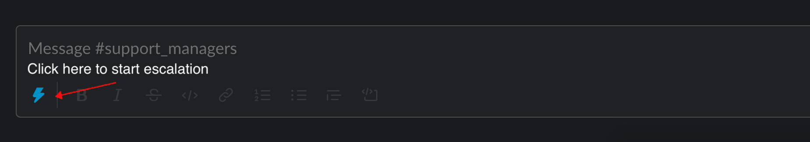

## Overview

The purpose of this page is to direct GitLab team members outside of Support on what GitLab Support does, how to get in contact with us, and where to direct common requests that require our involvement. **Are you a customer looking for technical support? If so, please visit the [Support Page](/support/) instead.**

- TOC
{:toc .hidden-md .hidden-lg}

## GitLab Support's Purpose

GitLab Support provides technical support GitLab.com and Self-Managed GitLab customers. We do **not** provide support for GitLab team members who are experiencing IT (1Password, Slack, Mac, etc.) issues. If you require assistance with issues of that nature, please contact [Team Member Enablement](/handbook/business-ops/team-member-enablement/self-help-troubleshooting/).

## Should I Contact GitLab Support?

For general questions regarding GitLab ("Can GitLab do x?", "How do I do y with GitLab?") please ask in [#questions](https://gitlab.slack.com/messages/questions), or if you think you've encountered a bug or something isn't behaving right while using GitLab try asking in [#is-this-known](https://gitlab.slack.com/archives/CETG54GQ0). Doing so ensures that [everyone can contribute](https://about.gitlab.com/company/strategy/#mission) to an answer. If you're not getting one and believe that Support is the best team to ask, try cross-posting your question in the [relevant GitLab Support channel](#on-slack).

However, keep in mind that those channels are specifically for questions *about* the various GitLab Support teams, not for questions about GitLab, the product. If you're working with a customer that requires technical support, please advise them to [contact GitLab Support](#requesting-support-for-customers).

### Support Team Meta Project

If you'd like to ask a longer term or larger scope question, propose an idea to GitLab Support, discuss something with us, or suggest an improvement or change to any of our workflows, please visit the [issue tracker](https://gitlab.com/gitlab-com/support/support-team-meta/issues) of the **[Support Team Meta](https://gitlab.com/gitlab-com/support/support-team-meta)** project and create an issue there. Please keep in mind that it is open to the community and as such **should not contain any sensitive information**, so links to Zendesk or other references are encouraged.

### On Slack

The following channels are where GitLab Support can be found on Slack and are the best places to reach us, depending on what you need.

- [#support_gitlab-com](https://gitlab.slack.com/messages/C4XFU81LG/) - This channel is specifically for the GitLab.com support team. They handle GitLab.com related tickets. It should be used if you have a quick question about the GitLab.com Support Team specifically.
- [#support_self-managed](https://gitlab.slack.com/messages/support_self-managed/) - This channel is specifically for the self-managed support team. They handle self-managed production issues, triage bugs, and self-managed emergencies, among other things.
- [#support_licensing-subscription](https://gitlab.slack.com/messages/support_licensing-subscription/) - This channel handles license and subscription issues.
- [#support_managers](https://gitlab.slack.com/messages/CBVAE1L48/) - This channel is for support managers including escalations.
- [#feed_zd-gitlab-com](https://gitlab.slack.com/messages/CADGU8CG1/) - Feed of all GitLab.com Zendesk ticket activities.
- [#feed_zd-self-managed](https://gitlab.slack.com/messages/C1CKSUTL5/) - Feed of all self-managed Zendesk ticket activities.

In order to attract GitLab Support's attention on Slack, you can use the team handles, mentioning multiple team members in a message or a thread where our [**urgent** attention](/handbook/communication/#be-respectful-of-others-time) is needed. Support team handles are:

- `@support-selfmanaged` - Self-managed support team members.
- `@support-dotcom` - GitLab.com support team members.
- `@supportmanagers` - Support director and managers.

## Support Tickets & Customer Information

### Requesting Support for Customers

If your customer contacts you requiring technical support, please immediately direct them to open a ticket through the [Support Portal](https://support.gitlab.com). It is Support's primary function to provide technical support for our customers and as paid users they are entitled access to us. If, for some reason they cannot access the Support Portal, please direct them to email `support@gitlab.com`.

**Please do not open a support ticket on behalf of a customer.** Doing so will cause the ticket to not be tied to the customer's organization and the appropriate SLA that they are entitled to will not be applied to it.

### Requesting support for GitLab.com users that have account or login issues

GitLab.com users that have account or login issues should [open a new ticket](https://support.gitlab.com/hc/en-us/requests/new).
They should select "GitLab.com (SaaS) User Accounts and Login Issues" as the reason for the request.

### Requesting Customer Information

According to our [privacy policies](/privacy/), Support will not provide any information regarding customers, groups, projects, etc,  to you that are not available publicly. This includes situations where a customer is requesting information about their own projects, groups, etc. If they are unable to authenticate, we cannot assume they are who they say they are. If they are locked out, please have them submit a support ticket.

### Viewing Support Tickets

All GitLab Team Members can request a 'Light Agent' account so that you can see customer tickets in Zendesk and leave notes for the Support team. These accounts are free.

To request a Light Agent Zendesk account, please send an email to `gitlablightagent.5zjj2@zapiermail.com` - you'll receive an automated reply with the result of your request. **You must send your request from your GitLab Google / Gmail account. No other addresses will work.** The Subject and Body fields of the email can be empty. Once set up, you'll need to wait 24 hours for your account to be assigned Zendesk in Okta. Once Zendesk is assigned, you should be able to [log in](https://gitlab.zendesk.com/agent). If you don't get your account assigned within this period, please reach out to #support-operations in Slack. In most cases, people who don't get access within the 24 hours already had an end-user account which prevents the automation from working as expected.

You cannot send public replies to customers with a Light Agent account - if you need to do this, please submit a [new Access Request issue](https://gitlab.com/gitlab-com/team-member-epics/access-requests/-/issues/new?issuable_template=Individual_Bulk_Access_Request) for a paid full agent account. If needed, you can [read more information](https://www.zendesk.com/company/collaboration-add-on-additional-features/) on Light Agent accounts from Zendesk.

## Common Requests

### Regarding GitLab Support, Plans, and Namespaces

| Request    | What To Do                                                   |
| ---------- | ------------------------------------------------------------ |
| Schedule Upgrade Assistance Call | Open an issue using the [`Upgrade Assistance`](https://gitlab.com/gitlab-com/support/support-team-meta/issues/new?issuable_template=Upgrade%20Assistance%20Request) or [`U.S. Federal Upgrade Assistance Request`](https://gitlab.com/gitlab-com/support/support-team-meta/issues/new?issuable_template=U.S.%20Federal%20Upgrade%20Assistance%20Request) template. |
| Who is on-call for Self-Managed Support? | Run `/chatops run oncall support` in [#support_self-managed](https://gitlab.slack.com/messages/support_self-managed/) to find out. This will **not** page the on-call person. You can also run that command in a direct message to `GitLab Chatops`. |
| Who is on-call for GitLab.com CMOC? | Run `/chatops run oncall cmoc` in [#support_gitlab-com](https://gitlab.slack.com/archives/C4XFU81LG) to find out. This will **not** page the on-call person. You can also run that command in a direct message to `GitLab Chatops`. |
| Contact a GitLab.com User | [Open an issue](https://gitlab.com/gitlab-com/support/internal-requests/issues/new?issuable_template=Contact%20Request) using the `Contact Request` template.  |
| Excessive reCaptcha on GitLab.com | While it's happening, post in [#support_gitlab-com](https://gitlab.slack.com/messages/C4XFU81LG/) and link to the issue/MR in question to be added to the allowlist. |
| Report complaints about support that you received from a client or prospect | Open an issue using the [`Indirect Feedback`](https://gitlab.com/gitlab-com/support/feedback/-/issues/new?issuable_template=Indirect%20Feedback) template |

### GitLab.com Namespaces

| Request    | What To Do                                                   |
| ---------- | ------------------------------------------------------------ |
| Claim Inactive GitLab.com Namespace | [Open an issue](https://gitlab.com/gitlab-com/support/internal-requests/issues/new?issuable_template=Dormant%20Namespace%20Request) using the `Inactive Namespace Request` template.

### Trial Extensions and Plans

> **NOTE**: Support will not start a trial. If one is needed, *have the user initiate a normal trial first*.

| Request    | What To Do                                                   |
| ---------- | ------------------------------------------------------------ |
| Extend GitLab.com Trial | [Open an issue](https://gitlab.com/gitlab-com/support/internal-requests/issues/new?issuable_template=GitLab.com%20Trial%20Extension) using the `GitLab.com Trial Extension` template.
| Extend Self-Managed Trial | [Open an issue](https://gitlab.com/gitlab-com/support/internal-requests/issues/new?issuable_template=Self%20Managed%20Trial%20Extension) using the `Self Managed Trial Extension` template.
| Change GitLab.com Trial to Bronze or Silver | [Open an issue](https://gitlab.com/gitlab-com/support/internal-requests/issues/new?issuable_template=Plan%20Change%20Request) using the `Plan Change Request` template.

Grace period extensions are also treated similarly to trial extensions for self-managed. For GitLab.com, the customer should start a trial once their subscription has expired. To request these for either self-managed or GitLab.com, create a trial extension issue and update the title accordingly to indicate that it is an existing customer.

Please consider the following:

1. A previous trial needs to exist for the customer. If no trial was created at any point a trial can be created by the customer the following day as the plan expires.
1. We can provide grace period extensions as long as the current plan is not ongoing, in other words, if the plan expires on the 15th, we can increase the grace period starting the next day. please plan accordingly.

### Regarding Licensing and Subscriptions

| Request    | What To Do                                                 |
| ---------- | ------------------------------------------------------------ |
| Send/Resend EULA | [Open an issue](https://gitlab.com/gitlab-com/support/internal-requests/issues/new?issuable_template=EULA) using the `EULA` template.
| GitLab.com Billable Members List | Until [#27074](https://gitlab.com/gitlab-org/gitlab/-/issues/27074) or [#35454](https://gitlab.com/gitlab-org/gitlab/-/issues/35454) is implemented, [open an issue](https://gitlab.com/gitlab-com/support/internal-requests/issues/new?issuable_template=billable%20members) using the `Billable Members` template. |
| Assistance With License Issue (not covered above) | [Open an issue](https://gitlab.com/gitlab-com/support/internal-requests/issues/new?issuable_template=License%20Issue) using the `License Issue` template.
| Assistance With a SaaS Subscription Issue (not covered above) | [Open an issue](https://gitlab.com/gitlab-com/support/internal-requests/-/issues/new?issuable_template=SaaS%20Subscription%20Issue) using the `SaaS Subscription Issue` template |

#### GitLab.com Billable Members List

As Product has implemented the minimal viable versions of [#27074](https://gitlab.com/gitlab-org/gitlab/-/issues/27074) and [#35454](https://gitlab.com/gitlab-org/gitlab/-/issues/35454), Support is beginning to deprecate this process. You can also see [epic 4547](https://gitlab.com/groups/gitlab-org/-/epics/4547) for improvements that product is working on and their progress.

##### Self-serve options for GitLab team members

Here are some options to get basic seat count information:

1. *Plan* and *Seats Currently in Use*:
    - [chatops](https://docs.gitlab.com/ee/development/chatops_on_gitlabcom.html#chatops-on-gitlabcom) (requires dev.gitlab.org account) with the command: `/chatops run namespace find group-path`
2. Info from 1 plus Subscription (or trial) *End Date*
    - [Sisense dashboard](https://app.periscopedata.com/app/gitlab/576469/Namespace-Overview) (changing the namespace ID filter)
3. Info from 2 plus *Seats in Subscription*, *Max Seats Used*, and *Start Date*
    - [Customers portal admin](https://customers.gitlab.com/admin/customer) (requires access via Okta)

##### Options for customer

> **Note:** The public facing version of this information is on the [Licensing and subscription FAQ page](https://about.gitlab.com/pricing/licensing-faq/#how-can-i-get-a-list-of-billable-users-for-my-plan).

Customers can get their subscription information and a list of users using a seat on their group's **Billing** page (under the group **Settings**) .

Alternative methods:

1. [Billable members API endpoint](https://docs.gitlab.com/ee/api/members.html#list-all-billable-members-of-a-group)
1. [glgl tool's rollcall script](https://gitlab.com/gitlab-com/support/toolbox/glgl) which will provide the subgroup or project where a user has been added.
*Note:* This project has been archived and will no longer be updated.

If none of those options work and a report detailing which users are a part of the group is required, the request **MUST** be made directly by the customer through the [Support Portal](https://support.gitlab.com).

The Support Engineer working the ticket will:

1. Authenticate their identity by asking them to perform an action (such as create a Snippet with specific text).
1. Generate the report.
1. Password protect the report and send it along in the ticket.
1. Send the password in a separate email.

##### Billable members internal request

If *none* of these above are options for your case, open a [billable members internal request issue](https://gitlab.com/gitlab-com/support/internal-requests/issues/new?issuable_template=billable%20members) with the `Billable members` template.

> **Note:** Support will only provide you with a screenshot of the billing page's subscription info. This includes:

- Plan, and if it is a trial
- Seats in subscription, currently in use, max used, owed
- Subscription Start and End dates

### Other

#### I want to escalate a ticket

GitLab Support targets a 95% SLA acheievement KPI. This means that some tickets breaching is expected. Our SLA is for a _First Reply_ but we also internally track next reply. Asking for eyes on or the escalation of a ticket in [#support_gitlab-com](https://gitlab.slack.com/archives/C4XFU81LG) or [#support_self-managed](https://gitlab.slack.com/archives/C4Y5DRKLK) creates unnecessary stress on Support Engineers who may be in the midst of working on higher priority tickets. Depending on whether you want to draw attention to either a Zendesk ticket or an issue created in `internal-requests`, follow the steps below.

##### Zendesk Tickets
{: .no_toc}

1. Review the SLA associated with the account and the amount of time left until a breach by logging into [Zendesk](https://gitlab.zendesk.com) using Okta. It's not typically necessary to escalate an issue that is hours away from a breach. If the ticket has had a first reply, then you are looking at an "internal breach".

1. From the `#support_managers` channel the Slack ticket escalation workflow can be initiated by following the steps below:

    * While on the `#support_managers`, click on the small `lightning` icon as shown in the image.
        

    * Click on `Ticket Escalation`

        

     * Complete the information requested on the form and click on `Submit`
        

     * After clicking `submit` the workflow will be sent and automatically tag the support managers. You will also receive a private message with a confirmation.

     * All fields are required.

1. Understand that we'll do our best to prioritize appropriately taking into account all of the tickets in the queues - there may be more pressing items.

##### Issues in `internal-requests`
{: .no_toc}

1. Post in [#support_managers](https://gitlab.slack.com/archives/CBVAE1L48) with a link to the issue and a short explanation of why it requires urgent attention. Please also keep in mind that issues in `internal-requests` have no SLA.

##### Redirecting Escalations (For GitLab Support Use Only)
{: .no_toc}

If a ticket or issue escalation is posted in the wrong channel, simply add the `:escalation:` emoji as a reaction to the post and the user will be directed to re-post the escalation in [#support_managers](https://gitlab.slack.com/archives/CBVAE1L48) via a [Slack Workflow](https://gitlab.com/gitlab-com/support/toolbox/slack-workflows).

#### Trials and Prospect Support

By default, [trial licenses do not include support](https://about.gitlab.com/support/#trials-support).

If you've been contacted by a prospect whose evaluation of GitLab includes evaluating support expertise or SLA performance, as a member of the Sales team **you can grant temporary support for their trial license**. You can do this via Salesforce in a few simple steps:

1. Browse to the organization's Salesforce record, locate the field titled `Manual Support Upgrade` and add a check mark.
1. Add a contact record in Salesforce for each person in the organization who you want to be able to submit and work support tickets.
1. Instruct your prospect to select `Sales assisted trial` as their subscription level when [submitting a support ticket](https://support.gitlab.com).

**Important Additional Notes**

1. There is no need to contact the Support team - selecting `Manual Support Upgrade` will mean your prospect's tickets automatically get the correct SLA.
1. Please wait for at least two hours after enabling the support upgrade before submitting a ticket to allow Salesforce and Zendesk to synchronize.
1. Prospects who have been granted a temporary support upgrade receive [Priority Support SLAs](/support/#priority-support).
1. Although the Support and Sales teams regularly review the list of prospects who have been granted a temporary support upgrade to ensure only active prospects are selected, **please uncheck the `Manual Support Upgrade` field when the trial ends.**.
1. We are working with Sales Operations to put a limit on the maximum number of `Manual Support Upgrades`. This page will be updated when that work is completed.

#### My customer is having trouble applying their GitLab.com subscription

The customer has more than likely run into an issue during the purchase process or is unaware of how to apply their subscription to their group. The following documentation outlines how to subscribe to GitLab.com, link your GitLab.com account to the [CustomersDot](https://customers.gitlab.com), and apply that subscription to their group.

- [Obtain a GitLab Subscription](https://docs.gitlab.com/ee/subscriptions/#obtain-a-gitlab-subscription)
- [Manage Your GitLab Account](https://docs.gitlab.com/ee/subscriptions/#manage-your-gitlab-account)

#### Users in an account I own would like more visibility into their organization's support tickets

In some cases, certain organizations want all members of their organization to be able to see all of the support tickets that have been logged.
In other cases, a particular user from the account would like to be able to see and respond to all tickets from their organization.
If you'd like to enable this, please:

1. Ask the customer to [open a Support ticket](https://support.gitlab.com/hc/en-us/requests/new) confirming that they want members of their org to be able to see all their Support tickets
1. A Support Engineer will then [Open an issue](https://gitlab.com/gitlab-com/support/support-ops/support-ops-project/issues/new?issuable_template=Shared%20Organization%20Request) using the `Shared Organization Request` template. The issue will be used to review the request and track the history of changes.
1. When the issue is created the Support Ops Engineer will @mention the TAM / Account owner for awareness on the issue.

#### My customer needs a report of all the users within their group(s) structure

To view the group's number of billable members, a member of the group with `Owner` permissions may visit the **Settings -> Billing** section of it to see a breakdown. The number of billable members is the amount listed under `Seats currently in use` and this is the amount that will come up whenever they link their group to a paid subscription. Billable members [consist of every user](https://about.gitlab.com/pricing/licensing-faq/#who-gets-counted-in-the-subscription) who is added to a group, subgroup, or project within a paid namespace with the only exception being Guest users within a namespace on a Gold subscription.

We have a [billable members API endpoint](https://docs.gitlab.com/ee/api/members.html#list-all-billable-members-of-a-group) that will produce a list of all the billable members for the group. This must be run with your own PAT.

All the billable members are also currently displayed on the group billing page in an unsorted list. This is a first iteration; if interested, you can view the [epic](https://gitlab.com/groups/gitlab-org/-/epics/4547) to see the planned work. If you have any feedback on the billable members list or want to request functionality or UI changes that are not planned in the epic, please feel free to leave a comment on the epic.

