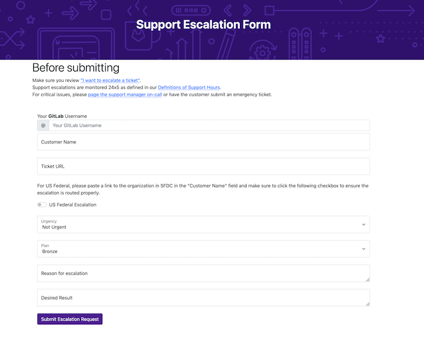

## Overview

This documents outlines the process for managing existing support tickets or [internal requests](https://gitlab.com/gitlab-com/support/internal-requests) which, due to business-critial situations, require a resolution faster than what is defined by [standard support](https://gitlab.com/gitlab-com/support/internal-requests).

## Scope

Our current support escalation covers two ticket types.

1. Support tickets from customer with a plan 
1. [internal requests](https://gitlab.com/gitlab-com/support/internal-requests)  

Those tickets can be escalated if the current course of action is unlikely to provide a positive outcome and meet critical business objectives.

## Escalation process

GitLab Support targets a 95% SLA acheievement KPI. This means that some tickets breaching is expected. Our SLA is for a _First Reply_ but we also internally track next reply. Asking for eyes on or escalating a ticket in the [#support_gitlab-com](https://gitlab.slack.com/archives/C4XFU81LG) or [#support_self-managed](https://gitlab.slack.com/archives/C4Y5DRKLK) Slack channels creates unnecessary stress on Support Engineers who may be in the midst of working on other priority tickets. Depending on whether you want to draw attention to either a Zendesk ticket or an issue created in `internal-requests`, follow the steps below.

### Zendesk Tickets
{: .no_toc}

1. Review the SLA associated with the account and the amount of time left until a breach by logging into [Zendesk](https://gitlab.zendesk.com) using Okta. It's not typically necessary to escalate an issue that is hours away from a breach. If the ticket has had a first reply, then you are looking at an "internal breach".
1. Before escalating a ticket please ensure the latest response is from the customer.

Note: If you do not have ZenDesk access, please [follow the instructions here](/handbook/support/internal-support/#viewing-support-tickets) to get yourself a light agent account as all GitLab team members are eligible for one.

### Out of scope

1. Add email to org 
1. Escalating tickets for which there is an acceptable business use case provided requiring the acceleration of a resolution.

### De-escalating a ticket when it does not need to be escalated

Sometimes the Support manager on-call may feel that an escalation request is without merit. In these cases, it's important to set expectations with the requester by documenting the following in the escalation issue.

1. Reasons why the ticket doesn't qualify for an escalation
1. Agreement with requester on alternative acceptable path 

Every ticket which is `de-escalated` must include the `De-escalation`

## Definition of Urgency 

| Urgency Level | Definition |
|---------------|------------|
| Not Urgent    | We need increased visibility on the ticket/issue and a response from Support within the next 2 hours. This escalation is not urgent and the overall impact is `low`.|
| Timely        | We need to address potential or existing customer dissatisfaction on the ticket/issue with a response from Support within the next 1 hour. This escalation has a certain level of urgency and the overall impact is `medium`.|
| Urgent        | The ticket/issue may become an [emergency](https://about.gitlab.com/support/#definitions-of-support-impact) if no follow up is provided within the next 30 minutes and may lead to customer dissatisfaction. This escalation is urgent and the overall impact is `high`.|

#### The Following instructions apply for both Zendesk tickets and Internal Support issues
{: .no_toc}

1. Go to the [support escalation form](https://gitlab-com.gitlab.io/support/toolbox/forms_processor//support_escalation/)

     * Complete the information requested on the form and click on `Submit`
        
     * All fields are required.

     * When you click `submit` an issue is created in the [support escalation issue tracker](https://gitlab.com/gitlab-com/support/escalations/-/issues). This issue is automatically assigned to the support manager on-call and will be used to keep a log of the escalation.
     Additionally a thread will be created in` #support_managers` slack channel.

1. Please expect that we will take into consideration the entirety of the ticket queues and existing escalation issues as we determine an appropriate prioritization for your issue.

##### Redirecting Escalations (For GitLab Support Use Only)
{: .no_toc}

If a ticket or issue escalation is posted in the wrong channel, simply add the `:escalation:` emoji as a reaction to the post and the user will be directed to re-post the escalation in [#support_managers](https://gitlab.slack.com/archives/CBVAE1L48) via a [Slack Workflow](https://gitlab.com/gitlab-com/support/toolbox/slack-workflows).

#### Trials and Prospect Support

By default, [trial licenses do not include support](https://about.gitlab.com/support/#trials-support).

If you've been contacted by a prospect whose evaluation of GitLab includes evaluating support expertise or SLA performance, as a member of the Sales team **you can grant temporary support for their trial license**. You can do this via Salesforce in a few simple steps:

1. Browse to the organization's Salesforce record, locate the field titled `Manual Support Upgrade` and add a check mark.
1. Add a contact record in Salesforce for each person in the organization who you want to be able to submit and work support tickets.
1. Instruct your prospect to select `Sales assisted trial` as their subscription level when [submitting a support ticket](https://support.gitlab.com).

**Important Additional Notes**

1. There is no need to contact the Support team - selecting `Manual Support Upgrade` will mean your prospect's tickets automatically get the correct SLA.
1. Please wait for at least two hours after enabling the support upgrade before submitting a ticket to allow Salesforce and Zendesk to synchronize.
1. Prospects who have been granted a temporary support upgrade receive [Priority Support SLAs](/support/#priority-support).
1. Although the Support and Sales teams regularly review the list of prospects who have been granted a temporary support upgrade to ensure only active prospects are selected, **please uncheck the `Manual Support Upgrade` field when the trial ends.**.
1. We are working with Sales Operations to put a limit on the maximum number of `Manual Support Upgrades`. This page will be updated when that work is completed.

